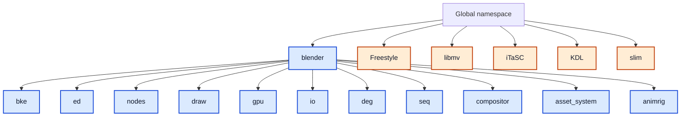

# Blender App Namespaces Map<!-- omit from toc -->

> - Explains Blender namespace topology using canonical namespace names.
> - Distinguishes canonical namespaces from declaration style tokens.
> - Treats `blender::xyz` and nested `namespace blender { namespace xyz { ... } }` as the same namespace.
> - Keeps source-scan numbers reproducible while avoiding duplicate semantic categories.

## Table of Contents<!-- omit from toc -->

- [1) Source-file map](#1-source-file-map)
- [2) Canonical namespace model](#2-canonical-namespace-model)
- [3) High-level results](#3-high-level-results)
- [4) Canonical namespaces under blender](#4-canonical-namespaces-under-blender)
- [5) External root namespaces](#5-external-root-namespaces)
  - [Diagram 1: Canonical namespace hierarchy](#diagram-1-canonical-namespace-hierarchy)
- [6) Complete namespace inventories](#6-complete-namespace-inventories)
  - [6.1 Canonical root namespaces (6)](#61-canonical-root-namespaces-6)
  - [6.2 Canonical namespace list (586)](#62-canonical-namespace-list-586)
- [7) Source-level conclusion](#7-source-level-conclusion)

---

## 1) Source-file map

| File / Tree                    | Primary canonical namespaces      | Role                                               |
| ------------------------------ | --------------------------------- | -------------------------------------------------- |
| `source/blender/blenkernel/`   | `blender::bke`                    | Core kernel/runtime services                       |
| `source/blender/editors/`      | `blender::ed`, `blender::ui`      | Editors, operators, and UI behavior                |
| `source/blender/nodes/`        | `blender::nodes`                  | Node systems (geometry/shader/compositor/function) |
| `source/blender/draw/`         | `blender::draw`, `blender::eevee` | Viewport draw manager and realtime engine          |
| `source/blender/gpu/`          | `blender::gpu`                    | GPU abstraction and backend implementations        |
| `source/blender/io/`           | `blender::io`                     | Import/export and format adapters                  |
| `source/blender/depsgraph/`    | `blender::deg`                    | Dependency graph                                   |
| `source/blender/compositor/`   | `blender::compositor`             | Compositor runtime                                 |
| `source/blender/sequencer/`    | `blender::seq`                    | Sequencer/VSE processing                           |
| `source/blender/render/hydra/` | `blender::render::hydra`          | Hydra bridge                                       |
| `source/blender/asset_system/` | `blender::asset_system`           | Asset catalog/index/runtime                        |
| `source/blender/animrig/`      | `blender::animrig`                | Animation rig/action/keying runtime                |
| `source/blender/freestyle/`    | `Freestyle`                       | NPR stroke rendering                               |
| `intern/libmv/`                | `libmv`                           | Tracking and multiview library                     |
| `intern/itasc/`                | `iTaSC`, `KDL`                    | IK task-space and kinematic solvers                |
| `intern/slim/`                 | `slim`                            | UV parameterization library                        |

---

## 2) Canonical namespace model

1. Canonical namespace names are fully qualified names (for example `blender::bke`).
2. Declaration tokens like `bke`, `ed`, `io`, `draw`, `gpu`, and `nodes` are often just nested declarations inside `namespace blender`.
3. Therefore these two forms refer to the same canonical namespace:
   - `namespace blender::bke { ... }`
   - `namespace blender { namespace bke { ... } }`
4. This document does not treat those two declaration styles as different namespaces.
5. Confirmed independent non-blender roots in this scope are `Freestyle`, `libmv`, `iTaSC`, `KDL`, and `slim`.

---

## 3) High-level results

Raw parser totals:

- Total namespace declarations: **7691** (every namespace declaration match, including repeats across files)
- Unique declared names: **1058** (distinct full namespace names after deduplication)
- Unique raw root tokens: **203** (distinct leading namespace tokens before `::`)
- Reviewed canonical namespace names (rule-applied): **586** (keeps `blender`/`blender::*` and approved external roots only)

Canonical documentation interpretation:

- Canonical root namespaces (deduplicated): **6** (one Blender root plus five confirmed external roots)
- Main application root namespace: **`blender`**
- Confirmed external root namespaces used in this scope: **`Freestyle`, `libmv`, `iTaSC`, `KDL`, `slim`**

---

## 4) Canonical namespaces under blender

| Canonical namespace      | Subsystem meaning                        | Typical directories                                                    |
| ------------------------ | ---------------------------------------- | ---------------------------------------------------------------------- |
| `blender::bke`           | Kernel/domain logic                      | `source/blender/blenkernel/`, `source/blender/blenkernel/intern/`      |
| `blender::ed`            | Editor tool layer                        | `source/blender/editors/**`                                            |
| `blender::nodes`         | Node system runtime/declarations         | `source/blender/nodes/**`                                              |
| `blender::draw`          | Viewport draw manager                    | `source/blender/draw/**`                                               |
| `blender::gpu`           | GPU abstraction and backends             | `source/blender/gpu/**`                                                |
| `blender::io`            | Interchange/import/export                | `source/blender/io/**`                                                 |
| `blender::deg`           | Dependency graph                         | `source/blender/depsgraph/**`                                          |
| `blender::seq`           | Sequencer internals                      | `source/blender/sequencer/**`                                          |
| `blender::compositor`    | Compositor runtime                       | `source/blender/compositor/**`                                         |
| `blender::asset_system`  | Asset indexing/catalog/runtime           | `source/blender/asset_system/**`, `source/blender/editors/asset/**`    |
| `blender::animrig`       | Animation/rigging runtime                | `source/blender/animrig/**`                                            |
| `blender::ui`            | C++ UI models/helpers                    | `source/blender/editors/include/`, `source/blender/editors/interface/` |
| `blender::fn`            | Function and multi-function abstractions | `source/blender/functions/**`, `source/blender/nodes/**`               |
| `blender::eevee`         | Realtime render engine                   | `source/blender/draw/engines/eevee/**`                                 |
| `blender::render::hydra` | Hydra integration                        | `source/blender/render/hydra/**`                                       |

---

## 5) External root namespaces

| Root namespace | Role                                   | Primary directory           |
| -------------- | -------------------------------------- | --------------------------- |
| `Freestyle`    | NPR line rendering subsystem           | `source/blender/freestyle/` |
| `libmv`        | Tracking and multiview library         | `intern/libmv/`             |
| `iTaSC`        | IK controller stack                    | `intern/itasc/`             |
| `KDL`          | Kinematic and dynamic utilities for IK | `intern/itasc/kdl/`         |
| `slim`         | UV optimization and parameterization   | `intern/slim/`              |

### Diagram 1: Canonical namespace hierarchy



---

## 6) Complete namespace inventories

### 6.1 Canonical root namespaces (6)

```text
blender
Freestyle
iTaSC
KDL
libmv
slim
```

### 6.2 Canonical namespace list (586)

```text
blender
blender::animrig
blender::animrig::internal
blender::animrig::legacy
blender::animrig::nla
blender::animrig::nla::tests
blender::animrig::tests
blender::animrig::versioning
blender::animrig::versioning::tests
blender::array_utils
blender::asset_system
blender::asset_system::tests
blender::asset_system::utils
blender::binary_search
blender::binary_search::tests
blender::bits
blender::bits::tests
blender::bke
blender::bke::attribute_math
blender::bke::bake
blender::bke::compare_geometry
blender::bke::compositor
blender::bke::cryptomatte::tests
blender::bke::curves
blender::bke::curves::bezier
blender::bke::curves::catmull_rom
blender::bke::curves::nurbs
blender::bke::curves::poly
blender::bke::greasepencil
blender::bke::greasepencil::convert
blender::bke::id
blender::bke::id_hash
blender::bke::idprop
blender::bke::idprop::tests
blender::bke::image
blender::bke::image::partial_update
blender::bke::mesh
blender::bke::mesh_surface_sample
blender::bke::node_field_inferencing
blender::bke::node_structure_type_inferencing
blender::bke::node_tree_reference_lifetimes
blender::bke::outliner::treehash
blender::bke::pbvh
blender::bke::pbvh::pixels
blender::bke::pbvh::uv_islands
blender::bke::subdiv
blender::bke::tests
blender::bke::volume_grid
blender::bke::volume_grid::file_cache
blender::color
blender::compositor
blender::csv_parse
blender::csv_parse::tests
blender::deg
blender::deg::sync_writeback
blender::deg::tests
blender::dna
blender::dna::array
blender::dna::pointers
blender::dot_export
blender::draw
blender::draw::color_management
blender::draw::command
blender::draw::compositor_engine
blender::draw::edit_select_debug
blender::draw::gpencil
blender::draw::overlay
blender::draw::select
blender::ed::animrig
blender::ed::asset
blender::ed::asset::index
blender::ed::asset::list
blender::ed::asset::shelf
blender::ed::curves
blender::ed::curves::tests
blender::ed::geometry
blender::ed::graph
blender::ed::greasepencil
blender::ed::greasepencil::image_render
blender::ed::greasepencil::tests
blender::ed::greasepencil::trim
blender::ed::image_trace
blender::ed::io
blender::ed::mesh
blender::ed::object
blender::ed::object::shapekey
blender::ed::outliner
blender::ed::outliner::tree_iterator
blender::ed::pointcloud
blender::ed::sculpt_paint
blender::ed::sculpt_paint::auto_mask
blender::ed::sculpt_paint::boundary
blender::ed::sculpt_paint::brushes
blender::ed::sculpt_paint::cloth
blender::ed::sculpt_paint::color
blender::ed::sculpt_paint::dyntopo
blender::ed::sculpt_paint::dyntopo::detail_size::test
blender::ed::sculpt_paint::face_set
blender::ed::sculpt_paint::filter
blender::ed::sculpt_paint::flood_fill
blender::ed::sculpt_paint::geodesic
blender::ed::sculpt_paint::gesture
blender::ed::sculpt_paint::greasepencil
blender::ed::sculpt_paint::hide
blender::ed::sculpt_paint::mask
blender::ed::sculpt_paint::pose
blender::ed::sculpt_paint::project
blender::ed::sculpt_paint::smooth
blender::ed::sculpt_paint::tests
blender::ed::sculpt_paint::trim
blender::ed::sculpt_paint::undo::tests
blender::ed::space_node
blender::ed::spreadsheet
blender::ed::transform
blender::ed::transform::curves
blender::ed::transform::greasepencil
blender::ed::transform::pointcloud
blender::ed::viewer_path
blender::ed::vse
blender::editor::animation::tests
blender::eevee
blender::eevee::lut
blender::Eigen
blender::fftw
blender::fixed_width_int
blender::fixed_width_int::tests
blender::fn
blender::fn::lazy_function
blender::fn::lazy_function::tests
blender::fn::multi_function
blender::fn::multi_function::procedure_optimization
blender::fn::multi_function::tests
blender::fn::tests
blender::geometry
blender::geometry::boolean
blender::geometry::curve_constraints
blender::gpu
blender::gpu::debug
blender::gpu::GLVertArray
blender::gpu::render_graph
blender::gpu::shader
blender::gpu::shader::metadata
blender::gpu::shader::parser
blender::gpu::tests
blender::image_engine
blender::imbuf::tests
blender::implicit_sharing
blender::index_mask
blender::index_mask::tests
blender::io
blender::io::alembic
blender::io::csv
blender::io::fbx
blender::io::grease_pencil
blender::io::hydra
blender::io::obj
blender::io::ply
blender::io::serialize
blender::io::serialize::json::testing
blender::io::stl
blender::io::usd
blender::iterator
blender::iterator::tests
blender::lazy_threading
blender::length_parameterize
blender::length_parameterize::tests
blender::linear_allocator
blender::linear_allocator::tests
blender::locale
blender::math
blender::memory_cache
blender::memory_cache::tests
blender::memory_counter
blender::meshintersect
blender::meshintersect::tests
blender::modifier::greasepencil
blender::nodes
blender::nodes::decl
blender::nodes::geo_eval_log
blender::nodes::gizmos
blender::nodes::inverse_eval
blender::nodes::materialx
blender::nodes::node_composite_alpha_convert_cc
blender::nodes::node_composite_alpha_over_cc
blender::nodes::node_composite_anti_aliasing_cc
blender::nodes::node_composite_bilateral_blur_cc
blender::nodes::node_composite_blur_cc
blender::nodes::node_composite_bokeh_blur_cc
blender::nodes::node_composite_bokeh_image_cc
blender::nodes::node_composite_box_mask_cc
blender::nodes::node_composite_brightness_contrast_cc
blender::nodes::node_composite_channel_key_cc
blender::nodes::node_composite_chroma_key_cc
blender::nodes::node_composite_color_balance_cc
blender::nodes::node_composite_color_cc
blender::nodes::node_composite_color_correction_cc
blender::nodes::node_composite_color_key_cc
blender::nodes::node_composite_color_spill_cc
blender::nodes::node_composite_combine_color_cc
blender::nodes::node_composite_convert_color_space_cc
blender::nodes::node_composite_convert_to_display_cc
blender::nodes::node_composite_convolve_cc
blender::nodes::node_composite_corner_pin_cc
blender::nodes::node_composite_crop_cc
blender::nodes::node_composite_defocus_cc
blender::nodes::node_composite_denoise_cc
blender::nodes::node_composite_depth_combin_cc
blender::nodes::node_composite_despeckle_cc
blender::nodes::node_composite_difference_key_cc
blender::nodes::node_composite_dilate_erode_cc
blender::nodes::node_composite_directional_blur_cc
blender::nodes::node_composite_displace_cc
blender::nodes::node_composite_distance_key_cc
blender::nodes::node_composite_double_edge_mask_cc
blender::nodes::node_composite_ellipse_mask_cc
blender::nodes::node_composite_exposure_cc
blender::nodes::node_composite_file_output_cc
blender::nodes::node_composite_filter_cc
blender::nodes::node_composite_flip_cc
blender::nodes::node_composite_glare_cc
blender::nodes::node_composite_group_cc
blender::nodes::node_composite_hue_correct_cc
blender::nodes::node_composite_hue_saturation_value_cc
blender::nodes::node_composite_id_mask_cc
blender::nodes::node_composite_image_cc
blender::nodes::node_composite_image_coordinates_cc
blender::nodes::node_composite_image_info_cc
blender::nodes::node_composite_inpaint_cc
blender::nodes::node_composite_invert_cc
blender::nodes::node_composite_keying_cc
blender::nodes::node_composite_keying_screen_cc
blender::nodes::node_composite_kuwahara_cc
blender::nodes::node_composite_lens_distortion_cc
blender::nodes::node_composite_levels_cc
blender::nodes::node_composite_luminance_key_cc
blender::nodes::node_composite_map_uv_cc
blender::nodes::node_composite_mask_cc
blender::nodes::node_composite_mask_to_sdf_cc
blender::nodes::node_composite_movie_clip_cc
blender::nodes::node_composite_movie_distortion_cc
blender::nodes::node_composite_normal_cc
blender::nodes::node_composite_normalize_cc
blender::nodes::node_composite_pixelate_cc
blender::nodes::node_composite_plane_track_deform_cc
blender::nodes::node_composite_posterize_cc
blender::nodes::node_composite_relative_to_pixel_cc
blender::nodes::node_composite_render_layer_cc
blender::nodes::node_composite_rgb_curves_cc
blender::nodes::node_composite_rgb_to_bw_cc
blender::nodes::node_composite_rotate_cc
blender::nodes::node_composite_scale_cc
blender::nodes::node_composite_scene_time_cc
blender::nodes::node_composite_separate_color_cc
blender::nodes::node_composite_set_alpha_cc
blender::nodes::node_composite_split_cc
blender::nodes::node_composite_stabilize_2d_cc
blender::nodes::node_composite_strip_info_cc
blender::nodes::node_composite_switch_cc
blender::nodes::node_composite_switch_view_cc
blender::nodes::node_composite_time_curves_cc
blender::nodes::node_composite_tone_map_cc
blender::nodes::node_composite_track_position_cc
blender::nodes::node_composite_transform_cc
blender::nodes::node_composite_translate_cc
blender::nodes::node_composite_vector_blur_cc
blender::nodes::node_composite_viewer_cc
blender::nodes::node_fn_align_euler_to_vector_cc
blender::nodes::node_fn_align_rotation_to_vector_cc
blender::nodes::node_fn_axes_to_rotation_cc
blender::nodes::node_fn_axis_angle_to_rotation_cc
blender::nodes::node_fn_boolean_math_cc
blender::nodes::node_fn_combine_color_cc
blender::nodes::node_fn_combine_matrix_cc
blender::nodes::node_fn_combine_transform_cc
blender::nodes::node_fn_compare_cc
blender::nodes::node_fn_euler_to_rotation_cc
blender::nodes::node_fn_find_in_string_cc
blender::nodes::node_fn_float_to_int_cc
blender::nodes::node_fn_hash_value_cc
blender::nodes::node_fn_input_bool_cc
blender::nodes::node_fn_input_color_cc
blender::nodes::node_fn_input_int_cc
blender::nodes::node_fn_input_rotation_cc
blender::nodes::node_fn_input_special_characters_cc
blender::nodes::node_fn_input_string_cc
blender::nodes::node_fn_input_vector_cc
blender::nodes::node_fn_integer_math_cc
blender::nodes::node_fn_invert_matrix_cc
blender::nodes::node_fn_invert_rotation_cc
blender::nodes::node_fn_match_string_cc
blender::nodes::node_fn_matrix_determinant_cc
blender::nodes::node_fn_matrix_multiply_cc
blender::nodes::node_fn_matrix_svd_cc
blender::nodes::node_fn_project_point_cc
blender::nodes::node_fn_quaternion_to_rotation_cc
blender::nodes::node_fn_random_value_cc
blender::nodes::node_fn_replace_string_cc
blender::nodes::node_fn_rotate_euler_cc
blender::nodes::node_fn_rotate_rotation_cc
blender::nodes::node_fn_rotate_vector_cc
blender::nodes::node_fn_rotation_to_axis_angle_cc
blender::nodes::node_fn_rotation_to_euler_cc
blender::nodes::node_fn_rotation_to_quaternion_cc
blender::nodes::node_fn_separate_color_cc
blender::nodes::node_fn_separate_matrix_cc
blender::nodes::node_fn_separate_transform_cc
blender::nodes::node_fn_slice_string_cc
blender::nodes::node_fn_string_length_cc
blender::nodes::node_fn_string_to_value_cc
blender::nodes::node_fn_transform_direction_cc
blender::nodes::node_fn_transform_point_cc
blender::nodes::node_fn_transpose_matrix_cc
blender::nodes::node_fn_value_to_string_cc
blender::nodes::node_geo_accumulate_field_cc
blender::nodes::node_geo_attribute_domain_size_cc
blender::nodes::node_geo_attribute_statistic_cc
blender::nodes::node_geo_blur_attribute_cc
blender::nodes::node_geo_bone_info_cc
blender::nodes::node_geo_boolean_cc
blender::nodes::node_geo_bounding_box_cc
blender::nodes::node_geo_camera_info_cc
blender::nodes::node_geo_collection_info_cc
blender::nodes::node_geo_convex_hull_cc
blender::nodes::node_geo_cube_grid_topology_cc
blender::nodes::node_geo_curve_endpoint_selection_cc
blender::nodes::node_geo_curve_fill_cc
blender::nodes::node_geo_curve_fillet_cc
blender::nodes::node_geo_curve_handle_type_selection_cc
blender::nodes::node_geo_curve_length_cc
blender::nodes::node_geo_curve_primitive_arc_cc
blender::nodes::node_geo_curve_primitive_bezier_segment_cc
blender::nodes::node_geo_curve_primitive_circle_cc
blender::nodes::node_geo_curve_primitive_line_cc
blender::nodes::node_geo_curve_primitive_quadratic_bezier_cc
blender::nodes::node_geo_curve_primitive_quadrilateral_cc
blender::nodes::node_geo_curve_primitive_spiral_cc
blender::nodes::node_geo_curve_primitive_star_cc
blender::nodes::node_geo_curve_resample_cc
blender::nodes::node_geo_curve_reverse_cc
blender::nodes::node_geo_curve_sample_cc
blender::nodes::node_geo_curve_set_handle_type_cc
blender::nodes::node_geo_curve_spline_parameter_cc
blender::nodes::node_geo_curve_spline_type_cc
blender::nodes::node_geo_curve_subdivide_cc
blender::nodes::node_geo_curve_to_mesh_cc
blender::nodes::node_geo_curve_to_points_cc
blender::nodes::node_geo_curve_topology_curve_of_point_cc
blender::nodes::node_geo_curve_topology_points_of_curve_cc
blender::nodes::node_geo_curve_trim_cc
blender::nodes::node_geo_curves_to_grease_pencil_cc
blender::nodes::node_geo_deform_curves_on_surface_cc
blender::nodes::node_geo_delete_geometry_cc
blender::nodes::node_geo_distribute_points_in_grid_cc
blender::nodes::node_geo_distribute_points_in_volume_cc
blender::nodes::node_geo_distribute_points_on_faces_cc
blender::nodes::node_geo_dual_mesh_cc
blender::nodes::node_geo_duplicate_elements_cc
blender::nodes::node_geo_edge_paths_to_curves_cc
blender::nodes::node_geo_edge_paths_to_selection_cc
blender::nodes::node_geo_edge_split_cc
blender::nodes::node_geo_edges_to_face_groups_cc
blender::nodes::node_geo_evaluate_at_index_cc
blender::nodes::node_geo_evaluate_on_domain_cc
blender::nodes::node_geo_extrude_mesh_cc
blender::nodes::node_geo_field_average_cc
blender::nodes::node_geo_field_min_and_max_cc
blender::nodes::node_geo_field_to_list_cc
blender::nodes::node_geo_field_variance_cc
blender::nodes::node_geo_flip_faces_cc
blender::nodes::node_geo_geometry_to_instance_cc
blender::nodes::node_geo_get_bundle_item_cc
blender::nodes::node_geo_get_geometry_bundle
blender::nodes::node_geo_get_named_grid_cc
blender::nodes::node_geo_gizmo_dial_cc
blender::nodes::node_geo_gizmo_linear_cc
blender::nodes::node_geo_gizmo_transform_cc
blender::nodes::node_geo_grease_pencil_set_depth_mode
blender::nodes::node_geo_grease_pencil_to_curves_cc
blender::nodes::node_geo_grid_advect_cc
blender::nodes::node_geo_grid_clip_cc
blender::nodes::node_geo_grid_curl_cc
blender::nodes::node_geo_grid_dilate_erode_cc
blender::nodes::node_geo_grid_divergence_cc
blender::nodes::node_geo_grid_gradient_cc
blender::nodes::node_geo_grid_info_cc
blender::nodes::node_geo_grid_laplacian_cc
blender::nodes::node_geo_grid_mean_cc
blender::nodes::node_geo_grid_median_cc
blender::nodes::node_geo_grid_prune_cc
blender::nodes::node_geo_grid_to_mesh_cc
blender::nodes::node_geo_grid_to_points_cc
blender::nodes::node_geo_grid_voxelize_cc
blender::nodes::node_geo_image_cc
blender::nodes::node_geo_image_info_cc
blender::nodes::node_geo_image_texture_cc
blender::nodes::node_geo_import_csv
blender::nodes::node_geo_import_obj
blender::nodes::node_geo_import_stl
blender::nodes::node_geo_import_text
blender::nodes::node_geo_import_vdb
blender::nodes::node_geo_index_of_nearest_cc
blender::nodes::node_geo_input_active_camera_cc
blender::nodes::node_geo_input_collection_cc
blender::nodes::node_geo_input_curve_handles_cc
blender::nodes::node_geo_input_curve_tilt_cc
blender::nodes::node_geo_input_edge_smooth_cc
blender::nodes::node_geo_input_face_smooth_cc
blender::nodes::node_geo_input_id_cc
blender::nodes::node_geo_input_index_cc
blender::nodes::node_geo_input_instance_bounds_cc
blender::nodes::node_geo_input_instance_rotation_cc
blender::nodes::node_geo_input_instance_scale_cc
blender::nodes::node_geo_input_instance_transform_cc
blender::nodes::node_geo_input_material_cc
blender::nodes::node_geo_input_material_index_cc
blender::nodes::node_geo_input_mesh_edge_angle_cc
blender::nodes::node_geo_input_mesh_edge_neighbors_cc
blender::nodes::node_geo_input_mesh_edge_vertices_cc
blender::nodes::node_geo_input_mesh_face_area_cc
blender::nodes::node_geo_input_mesh_face_is_planar_cc
blender::nodes::node_geo_input_mesh_face_neighbors_cc
blender::nodes::node_geo_input_mesh_island_cc
blender::nodes::node_geo_input_mesh_vertex_neighbors_cc
blender::nodes::node_geo_input_named_attribute_cc
blender::nodes::node_geo_input_named_layer_selection__cc
blender::nodes::node_geo_input_normal_cc
blender::nodes::node_geo_input_object_cc
blender::nodes::node_geo_input_position_cc
blender::nodes::node_geo_input_radius_cc
blender::nodes::node_geo_input_scene_time_cc
blender::nodes::node_geo_input_shortest_edge_paths_cc
blender::nodes::node_geo_input_spline_cyclic_cc
blender::nodes::node_geo_input_spline_length_cc
blender::nodes::node_geo_input_spline_resolution_cc
blender::nodes::node_geo_input_tangent_cc
blender::nodes::node_geo_input_voxel_index_cc
blender::nodes::node_geo_instance_on_points_cc
blender::nodes::node_geo_instances_to_points_cc
blender::nodes::node_geo_interpolate_curves_cc
blender::nodes::node_geo_is_viewport_cc
blender::nodes::node_geo_join_bundle
blender::nodes::node_geo_join_geometry_cc
blender::nodes::node_geo_list_get_item_cc
blender::nodes::node_geo_list_length_cc
blender::nodes::node_geo_material_replace_cc
blender::nodes::node_geo_material_selection_cc
blender::nodes::node_geo_merge_by_distance_cc
blender::nodes::node_geo_merge_layers_cc
blender::nodes::node_geo_mesh_face_group_boundaries_cc
blender::nodes::node_geo_mesh_primitive_circle_cc
blender::nodes::node_geo_mesh_primitive_cone_cc
blender::nodes::node_geo_mesh_primitive_cube_cc
blender::nodes::node_geo_mesh_primitive_cylinder_cc
blender::nodes::node_geo_mesh_primitive_grid_cc
blender::nodes::node_geo_mesh_primitive_ico_sphere_cc
blender::nodes::node_geo_mesh_primitive_line_cc
blender::nodes::node_geo_mesh_primitive_uv_sphere_cc
blender::nodes::node_geo_mesh_subdivide_cc
blender::nodes::node_geo_mesh_to_curve_cc
blender::nodes::node_geo_mesh_to_density_grid_cc
blender::nodes::node_geo_mesh_to_points_cc
blender::nodes::node_geo_mesh_to_sdf_grid_cc
blender::nodes::node_geo_mesh_to_volume_cc
blender::nodes::node_geo_mesh_topology_corners_of_edge_cc
blender::nodes::node_geo_mesh_topology_corners_of_face_cc
blender::nodes::node_geo_mesh_topology_corners_of_vertex_cc
blender::nodes::node_geo_mesh_topology_edges_of_corner_cc
blender::nodes::node_geo_mesh_topology_edges_of_vertex_cc
blender::nodes::node_geo_mesh_topology_face_of_corner_cc
blender::nodes::node_geo_mesh_topology_offset_corner_in_face_cc
blender::nodes::node_geo_mesh_topology_vertex_of_corner_cc
blender::nodes::node_geo_mouse_position_cc
blender::nodes::node_geo_object_info_cc
blender::nodes::node_geo_offset_point_in_curve_cc
blender::nodes::node_geo_points_cc
blender::nodes::node_geo_points_to_curves_cc
blender::nodes::node_geo_points_to_sdf_grid_cc
blender::nodes::node_geo_points_to_vertices_cc
blender::nodes::node_geo_points_to_volume_cc
blender::nodes::node_geo_proximity_cc
blender::nodes::node_geo_raycast_cc
blender::nodes::node_geo_realize_instances_cc
blender::nodes::node_geo_remove_attribute_cc
blender::nodes::node_geo_rotate_instances_cc
blender::nodes::node_geo_sample_grid_cc
blender::nodes::node_geo_sample_grid_index_cc
blender::nodes::node_geo_sample_index_cc
blender::nodes::node_geo_sample_nearest_surface_cc
blender::nodes::node_geo_sample_uv_surface_cc
blender::nodes::node_geo_scale_elements_cc
blender::nodes::node_geo_scale_instances_cc
blender::nodes::node_geo_sdf_grid_boolean_cc
blender::nodes::node_geo_sdf_grid_fillet_cc
blender::nodes::node_geo_sdf_grid_laplacian_cc
blender::nodes::node_geo_sdf_grid_mean_cc
blender::nodes::node_geo_sdf_grid_mean_curvature_cc
blender::nodes::node_geo_sdf_grid_median_cc
blender::nodes::node_geo_sdf_grid_offset_cc
blender::nodes::node_geo_self_object_cc
blender::nodes::node_geo_separate_components_cc
blender::nodes::node_geo_separate_geometry_cc
blender::nodes::node_geo_set_curve_handles_cc
blender::nodes::node_geo_set_curve_normal_cc
blender::nodes::node_geo_set_curve_radius_cc
blender::nodes::node_geo_set_curve_tilt_cc
blender::nodes::node_geo_set_geometry_bundle
blender::nodes::node_geo_set_geometry_name
blender::nodes::node_geo_set_grease_pencil_color_cc
blender::nodes::node_geo_set_grease_pencil_softness_cc
blender::nodes::node_geo_set_grid_background
blender::nodes::node_geo_set_grid_transform
blender::nodes::node_geo_set_id_cc
blender::nodes::node_geo_set_instance_transform_cc
blender::nodes::node_geo_set_material_cc
blender::nodes::node_geo_set_material_index_cc
blender::nodes::node_geo_set_mesh_normal_cc
blender::nodes::node_geo_set_point_radius_cc
blender::nodes::node_geo_set_position_cc
blender::nodes::node_geo_set_shade_smooth_cc
blender::nodes::node_geo_set_spline_cyclic_cc
blender::nodes::node_geo_set_spline_resolution_cc
blender::nodes::node_geo_sort_elements_cc
blender::nodes::node_geo_split_to_instances_cc
blender::nodes::node_geo_store_bundle_item_cc
blender::nodes::node_geo_store_named_attribute_cc
blender::nodes::node_geo_store_named_grid_cc
blender::nodes::node_geo_string_join_cc
blender::nodes::node_geo_string_to_curves_cc
blender::nodes::node_geo_subdivision_surface_cc
blender::nodes::node_geo_tool_3d_cursor_cc
blender::nodes::node_geo_tool_active_element_cc
blender::nodes::node_geo_tool_face_set_cc
blender::nodes::node_geo_tool_selection_cc
blender::nodes::node_geo_tool_set_face_set_cc
blender::nodes::node_geo_tool_set_selection_cc
blender::nodes::node_geo_transform_geometry_cc
blender::nodes::node_geo_translate_instances_cc
blender::nodes::node_geo_triangulate_cc
blender::nodes::node_geo_uv_pack_islands_cc
blender::nodes::node_geo_uv_tangent_cc
blender::nodes::node_geo_uv_unwrap_cc
blender::nodes::node_geo_viewport_transform_cc
blender::nodes::node_geo_volume_cube_cc
blender::nodes::node_geo_volume_to_mesh_cc
blender::nodes::nodes_geo_import_ply
blender::nodes::partial_eval
blender::nodes::socket_items
blender::nodes::socket_items::ops
blender::nodes::socket_items::ui
blender::nodes::socket_usage_inference
blender::nodes::tests
blender::nodes::value_elem
blender::noise
blender::ocio
blender::offset_indices
blender::offset_indices::tests
blender::opensubdiv
blender::render
blender::render::hydra
blender::rna::tests
blender::seq
blender::string_search
blender::string_search::tests
blender::tests
blender::threading
blender::timeit
blender::ui
blender::ui::string_search
blender::ui::tests
blender::unique_sorted_indices
blender::unique_sorted_indices::tests
blender::workbench
Freestyle
Freestyle::Config
Freestyle::ContextFunctions
Freestyle::Functions0D
Freestyle::Functions1D
Freestyle::GeomUtils
Freestyle::OGF
Freestyle::OGF::MatrixUtil
Freestyle::StringUtils
Freestyle::StrokeShaders
iTaSC
KDL
libmv
slim
```

## 7) Source-level conclusion

This document uses canonical namespace semantics instead of declaration-token grouping. In this model, `blender::xyz` and nested `namespace blender { namespace xyz { ... } }` are one namespace, not two. The primary application root is `blender`, with a small set of confirmed external roots (`Freestyle`, `libmv`, `iTaSC`, `KDL`, `slim`) in the scanned scope.
