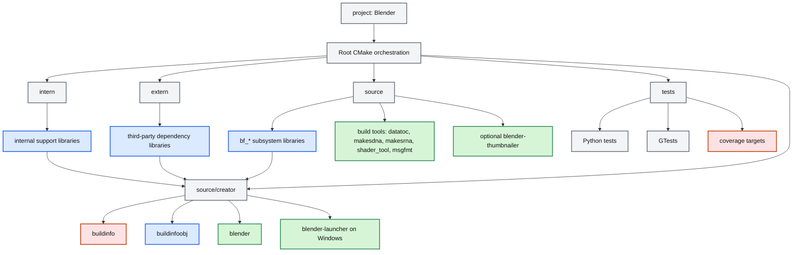
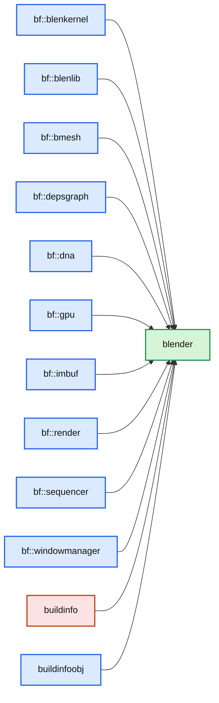

# Blender App Project / Top-Level CMake Review<!-- omit from toc -->

> - Explains how Blender's root `CMakeLists.txt` defines the main `Blender` CMake project and mostly acts as a build orchestrator.
> - Shows the default top-level path from `project(Blender)` into `intern/`, `extern/`, `source/`, `tests/`, and `source/creator/`.
> - Identifies the main deliverable targets such as `blender`, `blender-launcher`, `blender-thumbnailer`, and the helper/code-generation tools.
> - Includes Mermaid flowcharts showing the main project graph and the direct inputs of the `blender` target.

## Table of Contents<!-- omit from toc -->

- [1) What the main `CMakeLists.txt` is doing](#1-what-the-main-cmakeliststxt-is-doing)
- [2) Top-level build graph in the root project](#2-top-level-build-graph-in-the-root-project)
- [3) Where the final application target comes from](#3-where-the-final-application-target-comes-from)
- [4) Main targets produced by the project](#4-main-targets-produced-by-the-project)
- [5) Mermaid flowcharts](#5-mermaid-flowcharts)
  - [5.1 Top-level project and target flow](#51-top-level-project-and-target-flow)
  - [5.2 Direct inputs of the `blender` target](#52-direct-inputs-of-the-blender-target)
  - [5.3 Executable, library, and custom targets by kind](#53-executable-library-and-custom-targets-by-kind)
- [6) Source-level conclusion](#6-source-level-conclusion)

---

## 1) What the main `CMakeLists.txt` is doing

The root file `{Root Blender Directory Name}/CMakeLists.txt` does **not** directly build most of Blender's code itself. Its main job is to:

1. perform early setup and policy selection,
2. define the main CMake project,
3. declare feature options,
4. add the major build subdirectories in the right order,
5. and only then hand off final application creation to `source/creator`.

The main project declaration is straightforward.

**File:** `CMakeLists.txt`

```cmake
project(Blender)
enable_testing()
```

So the whole workspace is configured under one top-level CMake project named **`Blender`**.

---

## 2) Top-level build graph in the root project

The most important orchestration logic appears near the bottom of the root file.

**File:** `CMakeLists.txt`

```cmake
if(WITH_BLENDER)
  add_subdirectory(intern)
  add_subdirectory(extern)

  # source after intern and extern to gather all
  # internal and external library information first, for test linking
  add_subdirectory(source)
endif()

add_subdirectory(tests)

if(WITH_BLENDER)
  add_subdirectory(source/creator)
endif()
```

This tells us the standard build order is:

1. **`intern/`** - Blender-owned infrastructure libraries,
2. **`extern/`** - bundled third-party dependencies,
3. **`source/`** - the main Blender subsystem libraries and helper tools,
4. **`tests/`** - Python tests, GTests, and coverage targets,
5. **`source/creator/`** - the final application target and app packaging glue.

That ordering matters because `source/creator` links against libraries created earlier in the graph.

---

## 3) Where the final application target comes from

The actual desktop application target is created in `source/creator/CMakeLists.txt`, not in the root file.

A representative excerpt is:

**File:** `source/creator/CMakeLists.txt`

```cmake
set(LIB
  PRIVATE bf::blenkernel
  PRIVATE bf::blenlib
  PRIVATE bf::bmesh
  PRIVATE bf::depsgraph
  PRIVATE bf::dna
  PRIVATE bf::gpu
  PRIVATE bf::imbuf
  PRIVATE bf::render
  PRIVATE bf::sequencer
  PRIVATE bf::windowmanager
)
```

And later:

```cmake
add_executable(blender ${EXETYPE} ${SRC})
```

So the final app target named **`blender`** is essentially the last step that links together the major internal subsystem libraries already created elsewhere.

There are also important conditional variants in the same file:

- if `WITH_PYTHON_MODULE` is enabled, `blender` is built as a **Python module** instead of the normal desktop executable,
- on Windows, an additional **`blender-launcher`** target is created,
- and if `WITH_BUILDINFO` is enabled, the `buildinfo` custom target and `buildinfoobj` object library are created and attached.

---

## 4) Main targets produced by the project

At a high level, the main project produces these important targets.

| Target                           | Defined in                                             | Role                                                                                       |
| -------------------------------- | ------------------------------------------------------ | ------------------------------------------------------------------------------------------ |
| `blender`                        | `source/creator/CMakeLists.txt`                        | Main Blender application executable, or Python module when `WITH_PYTHON_MODULE` is enabled |
| `blender-launcher`               | `source/creator/CMakeLists.txt`                        | Windows launcher target                                                                    |
| `blender-thumbnailer`            | `source/blender/blendthumb/CMakeLists.txt`             | Optional thumbnail helper for file managers / Finder / QuickLook                           |
| `buildinfo`                      | `source/creator/CMakeLists.txt`                        | Custom target that generates build information headers                                     |
| `buildinfoobj`                   | `source/creator/CMakeLists.txt`                        | Object library built from `buildinfo.c`                                                    |
| `datatoc`                        | `source/blender/datatoc/CMakeLists.txt`                | Tool used during the build to convert data into C sources                                  |
| `makesdna`                       | `source/blender/makesdna/intern/CMakeLists.txt`        | Code-generation tool for Blender DNA metadata                                              |
| `makesrna`                       | `source/blender/makesrna/intern/CMakeLists.txt`        | Code-generation tool for Blender RNA metadata                                              |
| `shader_tool`                    | `source/blender/gpu/shader_tool/CMakeLists.txt`        | GPU shader helper tool                                                                     |
| `msgfmt`                         | `source/blender/blentranslation/msgfmt/CMakeLists.txt` | Localization helper tool                                                                   |
| `gtests` and Python test targets | `tests/CMakeLists.txt` and child CMake files           | Validation and regression testing                                                          |

The `source/` tree also creates a large number of internal `bf_*` libraries. Those are not end-user apps, but they are the **main internal link targets** that feed into `blender`.

Representative examples from `source/blender/CMakeLists.txt` and child files include:

- `bf::blenkernel`
- `bf::blenlib`
- `bf::depsgraph`
- `bf::windowmanager`
- `bf::gpu`
- `bf::render`
- `bf::imbuf`
- `bf::sequencer`
- many `bf_editor_*`, `bf_io_*`, `bf_nodes_*`, and other subsystem libraries.

---

## 5) Mermaid flowcharts

### 5.1 Top-level project and target flow



This is the clearest high-level reading of the root project: the main `Blender` project coordinates library creation first, and the final application target comes at the end through `source/creator`.

### 5.2 Direct inputs of the `blender` target



This second diagram is a simplified view of the main executable link target as declared in `source/creator/CMakeLists.txt`.

### 5.3 Executable, library, and custom targets by kind

The root project contains many more targets than the final app alone, so the diagram below groups them by **CMake target kind**.

```mermaid
flowchart TD
    P[project: Blender]

    subgraph EXEC[Executable targets]
        E1[blender]
        E2[blender-launcher]
        E3[blender-thumbnailer]
        E4[datatoc]
        E5[makesdna]
        E6[makesrna]
        E7[shader_tool]
        E8[msgfmt]
    end

    subgraph LIBS[Library targets]
        L1[bf::blenkernel]
        L2[bf::blenlib]
        L3[bf::windowmanager]
        L4[bf::gpu]
        L5[bf::render]
        L6[bf::imbuf]
        L7[bf::sequencer]
        L8[bf::depsgraph]
        L9[bf::dna]
        L10[buildinfoobj]
        L11[BlendThumb or blender_cpu_check optional]
    end

    subgraph CUSTOM[Custom targets]
        C1[buildinfo]
        C2[coverage-report]
        C3[coverage-show]
        C4[coverage-reset]
        C5[coverage-merge]
    end

    P --> E1
    P --> L1
    P --> C1

    L1 --> E1
    L2 --> E1
    L3 --> E1
    L4 --> E1
    L5 --> E1
    L6 --> E1
    L7 --> E1
    L8 --> E1
    L9 --> E1
    L10 --> E1

    C1 -. generated build metadata .-> E1
    L11 -. optional platform or feature support .-> E1

    classDef executable fill:#d6f5d6,stroke:#2e8b57,stroke-width:2px,color:#111;
    classDef library fill:#dbeafe,stroke:#2563eb,stroke-width:2px,color:#111;
    classDef custom fill:#fde2e4,stroke:#c2410c,stroke-width:2px,color:#111;
    classDef root fill:#f3f4f6,stroke:#6b7280,stroke-width:2px,color:#111;

    class P root;
    class E1,E2,E3,E4,E5,E6,E7,E8 executable;
    class L1,L2,L3,L4,L5,L6,L7,L8,L9,L10,L11 library;
    class C1,C2,C3,C4,C5 custom;
```



This grouped view matches the source layout:

- **Executable targets** come from `source/creator/`, `source/blender/datatoc/`, `source/blender/makesdna/intern/`, `source/blender/makesrna/intern/`, `source/blender/gpu/shader_tool/`, and `source/blender/blentranslation/msgfmt/`.
- **Library targets** are mostly the `bf::*` subsystem libraries plus a few special libraries such as `buildinfoobj` and optional platform helpers.
- **Custom targets** come from build orchestration and test/report generation, especially `buildinfo` in `source/creator/CMakeLists.txt` and coverage targets in `tests/CMakeLists.txt`.

---

## 6) Source-level conclusion

The root `CMakeLists.txt` defines **one top-level project**:

- **`project(Blender)`**

From there, the main build graph is orchestrated through these top-level subdirectories:

1. `intern/`
2. `extern/`
3. `source/`
4. `tests/`
5. `source/creator/`

The **main final target** is:

- `blender`

and the most important related targets are:

- `blender-launcher` on Windows,
- `blender-thumbnailer` when thumbnail support is enabled,
- `buildinfo` and `buildinfoobj`,
- and the helper/code-generation tools such as `datatoc`, `makesdna`, and `makesrna`.

So the best mental model is:

> the root `CMakeLists.txt` is the **project orchestrator**, while `source/creator/CMakeLists.txt` is where the **main Blender application target** is finally assembled.

**Best files to open next:**

1. `CMakeLists.txt`
2. `source/CMakeLists.txt`
3. `source/blender/CMakeLists.txt`
4. `source/creator/CMakeLists.txt`
5. `tests/CMakeLists.txt`
