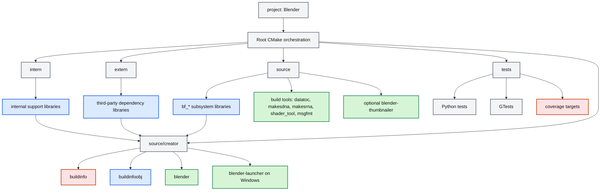
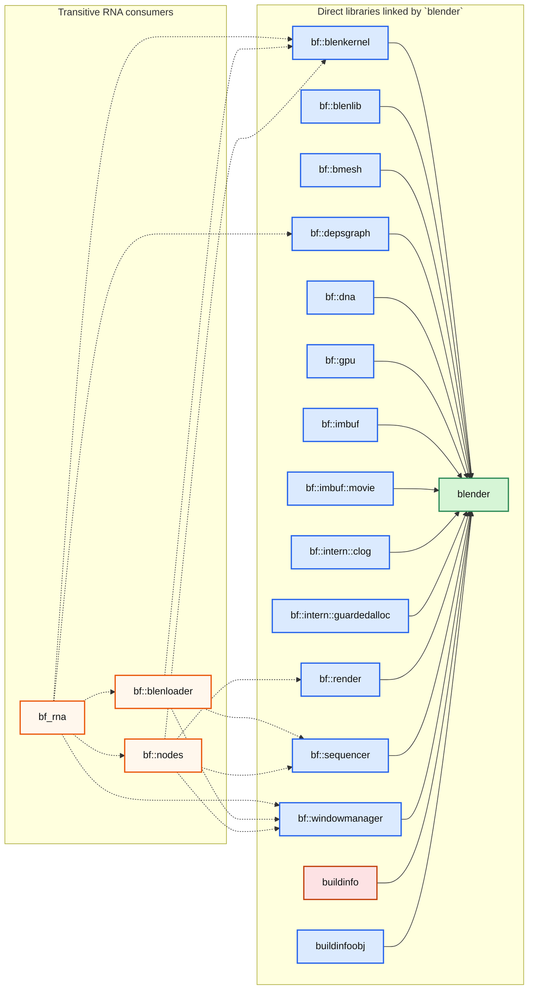

# Blender App Project / Top-Level CMake Review<!-- omit from toc -->

> - Explains how Blender's root `CMakeLists.txt` defines the main `Blender` CMake project and mostly acts as a build orchestrator.
> - Shows the default top-level path from `project(Blender)` into `intern/`, `extern/`, `source/`, `tests/`, and `source/creator/`.
> - Identifies the main deliverable targets such as `blender`, `blender-launcher`, `blender-thumbnailer`, and the helper/code-generation tools.
> - Includes Mermaid flowcharts showing the main project graph, the direct inputs of the `blender` target, and target inventory tables.

## Table of Contents<!-- omit from toc -->

- [1) What the main `CMakeLists.txt` is doing](#1-what-the-main-cmakeliststxt-is-doing)
- [2) Top-level build graph in the root project](#2-top-level-build-graph-in-the-root-project)
  - [Diagram 1: Top-level project and target flow](#diagram-1-top-level-project-and-target-flow)
- [3) Where the final application target comes from](#3-where-the-final-application-target-comes-from)
  - [Diagram 2: Direct inputs of the `blender` target](#diagram-2-direct-inputs-of-the-blender-target)
- [4) Main targets produced by the project](#4-main-targets-produced-by-the-project)
  - [Diagram 3: Executable, library, and custom targets by kind](#diagram-3-executable-library-and-custom-targets-by-kind)
- [5) Targets Lists](#5-targets-lists)
  - [Executable Targets](#executable-targets)
  - [Library Targets](#library-targets)
  - [Custom Targets](#custom-targets)
- [6) Source-level conclusion](#6-source-level-conclusion)

---

## 1) What the main `CMakeLists.txt` is doing

The root file `{Root Blender Directory Name}/CMakeLists.txt` does **not** directly build most of Blender's code itself. Its main job is to:

1. perform early setup and policy selection,
2. define the main CMake project,
3. declare feature options,
4. add the major build subdirectories in the right order,
5. and only then hand off final application creation to `source/creator`.

The main project declaration is straightforward.

**File:** `CMakeLists.txt` (lines 112-116)

```cmake
blender_project_hack_pre()

project(Blender)

blender_project_hack_post()
```

So the whole workspace is configured under one top-level CMake project named **`Blender`**.

---

## 2) Top-level build graph in the root project

The most important orchestration logic appears near the bottom of the root file.

**File:** `CMakeLists.txt` (lines 2744-2777)

```cmake
# -----------------------------------------------------------------------------
# Add Sub-Directories

if(WITH_BLENDER)
  add_subdirectory(intern)
  add_subdirectory(extern)

  # source after intern and extern to gather all
  # internal and external library information first, for test linking
  add_subdirectory(source)
elseif(WITH_CYCLES_STANDALONE OR WITH_CYCLES_HYDRA_RENDER_DELEGATE)
  add_subdirectory(intern/atomic)
  add_subdirectory(intern/guardedalloc)
  add_subdirectory(intern/libc_compat)
  add_subdirectory(intern/sky)

  add_subdirectory(intern/cycles)
  if(WITH_CUDA_DYNLOAD)
    add_subdirectory(extern/cuew)
  endif()
  if(WITH_HIP_DYNLOAD)
    add_subdirectory(extern/hipew)
  endif()
endif()


# -----------------------------------------------------------------------------
# Add Testing Directory

add_subdirectory(tests)


# -----------------------------------------------------------------------------
# Add Blender Application

if(WITH_BLENDER)
  add_subdirectory(source/creator)
endif()
```

This tells us the standard build order is:

1. **`intern/`** - Blender-owned infrastructure libraries,
2. **`extern/`** - bundled third-party dependencies,
3. **`source/`** - the main Blender subsystem libraries and helper tools,
4. **`tests/`** - Python tests, GTests, and coverage targets,
5. **`source/creator/`** - the final application target and app packaging glue.

That ordering matters because `source/creator` links against libraries created earlier in the graph.

### Diagram 1: Top-level project and target flow

This diagram shows how the root `Blender` project fans out into top-level subdirectories and converges again at `source/creator` for final app assembly.



This is the clearest high-level reading of the root project: the main `Blender` project coordinates library creation first, and the final application target comes at the end through `source/creator`.

---

## 3) Where the final application target comes from

The actual desktop application target is created in `source/creator/CMakeLists.txt`, not in the root file.

A representative excerpt is:

**File:** `source/creator/CMakeLists.txt` (lines 11-24)

```cmake
set(LIB
  PRIVATE bf::blenkernel
  PRIVATE bf::blenlib
  PRIVATE bf::bmesh
  PRIVATE bf::depsgraph
  PRIVATE bf::dna
  PRIVATE bf::gpu
  PRIVATE bf::imbuf
  PRIVATE bf::imbuf::movie
  PRIVATE bf::intern::clog
  PRIVATE bf::intern::guardedalloc
  PRIVATE bf::render
  PRIVATE bf::sequencer
  PRIVATE bf::windowmanager
)
```

The actual target creation call appears later in the same file at line 342:

```cmake
add_executable(blender ${EXETYPE} ${SRC})
```

So the final app target named **`blender`** is essentially the last step that links together the major internal subsystem libraries already created elsewhere.

The executable link step itself is `target_link_libraries(blender PRIVATE ${LIB})`, so `bf_rna` does not appear on the `blender` link line directly. It is consumed transitively through libraries in `${LIB}` that declare `add_dependencies(... bf_rna)` and use RNA-generated headers and metadata during their own build.

There are also important conditional variants in the same file:

- if `WITH_PYTHON_MODULE` is enabled, `blender` is built as a **Python module** instead of the normal desktop executable,
- on Windows, an additional **`blender-launcher`** target is created,
- and if `WITH_BUILDINFO` is enabled, the `buildinfo` custom target and `buildinfoobj` object library are created and attached.

### Diagram 2: Dependency inputs of the `blender` target

This diagram isolates the dependency inputs that feed the final `blender` target, and it also shows one representative transitive library path for `bf_rna`.



This is a simplified view of the main executable link target as declared in `source/creator/CMakeLists.txt`.

`bf_rna` sits one layer below `blender`: it is not linked directly by the executable, but it is required by libraries such as `bf::blenkernel`, `bf::depsgraph`, `bf::windowmanager`, `bf::blenloader`, and `bf::nodes`. In the direct `blender` link set, `bf::blenloader` feeds `bf::blenkernel`, `bf::sequencer`, and `bf::windowmanager`, while `bf::nodes` feeds `bf::blenkernel`, `bf::render`, `bf::sequencer`, and `bf::windowmanager`. Those libraries are part of the dependency graph around `${LIB}`, so they bring the RNA layer into the build graph before `blender` links the final library bundle.

---

## 4) Main targets produced by the project

At a high level, the main project produces these important targets.

| Target                           | Defined in                                             | Role                                                                                       |
| -------------------------------- | ------------------------------------------------------ | ------------------------------------------------------------------------------------------ |
| `blender`                        | `source/creator/CMakeLists.txt`                        | Main Blender application executable, or Python module when `WITH_PYTHON_MODULE` is enabled |
| `blender-launcher`               | `source/creator/CMakeLists.txt`                        | Windows launcher target                                                                    |
| `blender-thumbnailer`            | `source/blender/blendthumb/CMakeLists.txt`             | Optional thumbnail helper for file managers / Finder / QuickLook                           |
| `buildinfo`                      | `source/creator/CMakeLists.txt`                        | Custom target that generates build information headers                                     |
| `buildinfoobj`                   | `source/creator/CMakeLists.txt`                        | Object library built from `buildinfo.c`                                                    |
| `datatoc`                        | `source/blender/datatoc/CMakeLists.txt`                | Tool used during the build to convert data into C sources                                  |
| `makesdna`                       | `source/blender/makesdna/intern/CMakeLists.txt`        | Code-generation tool for Blender DNA metadata                                              |
| `makesrna`                       | `source/blender/makesrna/intern/CMakeLists.txt`        | Code-generation tool for Blender RNA metadata                                              |
| `shader_tool`                    | `source/blender/gpu/shader_tool/CMakeLists.txt`        | GPU shader helper tool                                                                     |
| `msgfmt`                         | `source/blender/blentranslation/msgfmt/CMakeLists.txt` | Localization helper tool                                                                   |
| `gtests` and Python test targets | `tests/CMakeLists.txt` and child CMake files           | Validation and regression testing                                                          |

The `source/` tree also creates a large number of internal `bf_*` libraries. Those are not end-user apps, but they are the **main internal link targets** that feed into `blender`.

Important `bf_*` library targets are summarized below.

| Library Target     | Alias               | Defined In                                      | Role                                                 |
| ------------------ | ------------------- | ----------------------------------------------- | ---------------------------------------------------- |
| `bf_blenkernel`    | `bf::blenkernel`    | `source/blender/blenkernel/CMakeLists.txt`      | Core kernel/runtime subsystem library                |
| `bf_blenlib`       | `bf::blenlib`       | `source/blender/blenlib/CMakeLists.txt`         | Core utility/foundation library                      |
| `bf_bmesh`         | `bf::bmesh`         | `source/blender/bmesh/CMakeLists.txt`           | BMesh modeling/edit data library                     |
| `bf_depsgraph`     | `bf::depsgraph`     | `source/blender/depsgraph/CMakeLists.txt`       | Dependency graph evaluation library                  |
| `bf_dna`           | `bf::dna`           | `source/blender/makesdna/intern/CMakeLists.txt` | DNA schema/SDNA compatibility library                |
| `bf_dna_defaults`  | none                | `source/blender/makesdna/intern/CMakeLists.txt` | Generated DNA defaults data library                  |
| `bf_rna`           | none                | `source/blender/makesrna/intern/CMakeLists.txt` | RNA reflection and property access library           |
| `bf_draw`          | `bf::draw`          | `source/blender/draw/CMakeLists.txt`            | Viewport draw manager library                        |
| `bf_gpu`           | `bf::gpu`           | `source/blender/gpu/CMakeLists.txt`             | GPU abstraction and rendering support library        |
| `bf_imbuf`         | `bf::imbuf`         | `source/blender/imbuf/CMakeLists.txt`           | Image buffer and image I/O library                   |
| `bf_nodes`         | `bf::nodes`         | `source/blender/nodes/CMakeLists.txt`           | Node system core library                             |
| `bf_render`        | `bf::render`        | `source/blender/render/CMakeLists.txt`          | Render pipeline library                              |
| `bf_sequencer`     | `bf::sequencer`     | `source/blender/sequencer/CMakeLists.txt`       | Video sequence editor library                        |
| `bf_windowmanager` | `bf::windowmanager` | `source/blender/windowmanager/CMakeLists.txt`   | Event loop, operators, and UI window manager library |

### Diagram 3: Executable, library, and custom targets by kind

This diagram groups representative targets by CMake target kind so the overall project shape is easier to scan.

```mermaid
flowchart TD
  P[project: Blender]

  subgraph EXEC[Executable targets]
    E1[blender]
    E2[blender-launcher]
    E3[blender-thumbnailer]
    E4[datatoc]
    E5[makesdna]
    E6[makesrna]
    E7[shader_tool]
    E8[msgfmt]
  end

  subgraph LIBS[Library targets]
    L1[bf::blenkernel]
    L2[bf::blenlib]
    L3[bf::windowmanager]
    L4[bf::gpu]
    L5[bf::render]
    L6[bf::imbuf]
    L7[bf::sequencer]
    L8[bf::depsgraph]
    L9[bf::dna]
    L10[bf_rna]
    L11[buildinfoobj]
    L12[BlendThumb or blender_cpu_check optional]
  end

  subgraph CUSTOM[Custom targets]
    C1[buildinfo]
    C2[coverage-report]
    C3[coverage-show]
    C4[coverage-reset]
    C5[coverage-merge]
  end

  P --> E1
  P --> L1
  P --> C1

  L1 --> E1
  L2 --> E1
  L3 --> E1
  L4 --> E1
  L5 --> E1
  L6 --> E1
  L7 --> E1
  L8 --> E1
  L9 --> E1
  L10 --> E1
  L11 --> E1

  C1 -. generated build metadata .-> E1
  L12 -. optional platform or feature support .-> E1

  style EXEC fill:#334155,stroke:#1e293b,stroke-width:2px,color:#ffffff
  style LIBS fill:#0f766e,stroke:#0f5f59,stroke-width:2px,color:#ffffff
  style CUSTOM fill:#b45309,stroke:#92400e,stroke-width:2px,color:#ffffff

  classDef executable fill:#d6f5d6,stroke:#2e8b57,stroke-width:2px,color:#111;
  classDef library fill:#dbeafe,stroke:#2563eb,stroke-width:2px,color:#111;
  classDef custom fill:#fde2e4,stroke:#c2410c,stroke-width:2px,color:#111;
  classDef root fill:#f3f4f6,stroke:#6b7280,stroke-width:2px,color:#111;

  class P root;
  class E1,E2,E3,E4,E5,E6,E7,E8 executable;
  class L1,L2,L3,L4,L5,L6,L7,L8,L9,L10,L11,L12 library;
  class C1,C2,C3,C4,C5 custom;
```



This grouped view matches the source layout.

- **Executable targets** come from `source/creator/`, `source/blender/datatoc/`, `source/blender/makesdna/intern/`, `source/blender/makesrna/intern/`, `source/blender/gpu/shader_tool/`, and `source/blender/blentranslation/msgfmt/`.
- **Library targets** are mostly the `bf::*` subsystem libraries plus a few special libraries such as `buildinfoobj` and optional platform helpers.
- **Custom targets** come from build orchestration and test/report generation, especially `buildinfo` in `source/creator/CMakeLists.txt` and coverage targets in `tests/CMakeLists.txt`.

---

## 5) Targets Lists

This section collects the target list inventories.

### Executable Targets

Executable targets are listed in alphabetical order.

| Target                | Defined In                                                | Role                                                             |
| --------------------- | --------------------------------------------------------- | ---------------------------------------------------------------- |
| `blender`             | `source/creator/CMakeLists.txt:342`                       | Main Blender application executable                              |
| `blender-launcher`    | `source/creator/CMakeLists.txt:350`                       | Windows launcher target                                          |
| `blender-thumbnailer` | `source/blender/blendthumb/CMakeLists.txt:67`             | Optional thumbnail helper for file managers and quick look tools |
| `datatoc`             | `source/blender/datatoc/CMakeLists.txt:13`                | Tool that converts data into C sources                           |
| `makesdna`            | `source/blender/makesdna/intern/CMakeLists.txt:86`        | Code-generation tool for Blender DNA metadata                    |
| `makesrna`            | `source/blender/makesrna/intern/CMakeLists.txt:404`       | Code-generation tool for Blender RNA metadata                    |
| `msgfmt`              | `source/blender/blentranslation/msgfmt/CMakeLists.txt:33` | Localization helper tool                                         |
| `shader_tool`         | `source/blender/gpu/shader_tool/CMakeLists.txt:38`        | GPU shader helper tool                                           |

### Library Targets

Library targets are listed in alphabetical order.

| Library Target                 | Alias                  | Defined In                                                   | Role                                                 |
| ------------------------------ | ---------------------- | ------------------------------------------------------------ | ---------------------------------------------------- |
| `bf_animrig`                   | bf::animrig            | `source/blender/animrig/CMakeLists.txt:76`                   | Animation rigging library                            |
| `bf_asset_system`              | bf::asset_system       | `source/blender/asset_system/CMakeLists.txt:65`              | Asset metadata/indexing library                      |
| `bf_blenfont`                  | bf::blenfont           | `source/blender/blenfont/CMakeLists.txt:63`                  | Font and text rendering library                      |
| `bf_blenkernel`                | bf::blenkernel         | `source/blender/blenkernel/CMakeLists.txt:735`               | Core kernel/runtime subsystem library                |
| `bf_blenlib`                   | bf::blenlib            | `source/blender/blenlib/CMakeLists.txt:495`                  | Core utility/foundation library                      |
| `bf_blenloader`                | bf::blenloader         | `source/blender/blenloader/CMakeLists.txt:100`               | Blend file loading library                           |
| `bf_blenloader_core`           | bf::blenloader_core    | `source/blender/blenloader_core/CMakeLists.txt:30`           | Minimal blend file loading core library              |
| `bf_blenloader_test_util`      | none                   | `source/blender/blenloader/CMakeLists.txt:128`               | Internal subsystem library                           |
| `bf_blentranslation`           | bf::blentranslation    | `source/blender/blentranslation/CMakeLists.txt:58`           | Translation and localization runtime library         |
| `bf_bmesh`                     | bf::bmesh              | `source/blender/bmesh/CMakeLists.txt:199`                    | BMesh modeling/edit data library                     |
| `bf_compositor`                | none                   | `source/blender/compositor/CMakeLists.txt:450`               | Compositor execution library                         |
| `bf_compositor_shaders`        | none                   | `source/blender/compositor/CMakeLists.txt:411`               | Generated shader sources library                     |
| `bf_depsgraph`                 | bf::depsgraph          | `source/blender/depsgraph/CMakeLists.txt:171`                | Dependency graph evaluation library                  |
| `bf_dna`                       | bf::dna                | `source/blender/makesdna/intern/CMakeLists.txt:138`          | DNA schema/SDNA compatibility library                |
| `bf_dna_blenlib`               | none                   | `source/blender/makesdna/intern/CMakeLists.txt:180`          | DNA to BLI conversion helper library                 |
| `bf_dna_defaults`              | none                   | `source/blender/makesdna/intern/CMakeLists.txt:156`          | Generated DNA defaults data library                  |
| `bf_draw`                      | bf::draw               | `source/blender/draw/CMakeLists.txt:977`                     | Viewport draw manager library                        |
| `bf_draw_shaders`              | none                   | `source/blender/draw/CMakeLists.txt:897`                     | Internal subsystem library                           |
| `bf_editor_animation`          | none                   | `source/blender/editors/animation/CMakeLists.txt:62`         | Editor subsystem library                             |
| `bf_editor_armature`           | none                   | `source/blender/editors/armature/CMakeLists.txt:56`          | Editor subsystem library                             |
| `bf_editor_asset`              | none                   | `source/blender/editors/asset/CMakeLists.txt:67`             | Editor subsystem library                             |
| `bf_editor_curve`              | none                   | `source/blender/editors/curve/CMakeLists.txt:44`             | Editor subsystem library                             |
| `bf_editor_curves`             | none                   | `source/blender/editors/curves/CMakeLists.txt:58`            | Editor subsystem library                             |
| `bf_editor_datafiles`          | bf::editor::datafiles  | `source/blender/editors/datafiles/CMakeLists.txt:1073`       | Editor subsystem library                             |
| `bf_editor_geometry`           | none                   | `source/blender/editors/geometry/CMakeLists.txt:41`          | Editor subsystem library                             |
| `bf_editor_gizmo_library`      | none                   | `source/blender/editors/gizmo_library/CMakeLists.txt:51`     | Editor subsystem library                             |
| `bf_editor_gpencil_legacy`     | none                   | `source/blender/editors/gpencil_legacy/CMakeLists.txt:43`    | Editor subsystem library                             |
| `bf_editor_grease_pencil`      | none                   | `source/blender/editors/grease_pencil/CMakeLists.txt:63`     | Editor subsystem library                             |
| `bf_editor_id_management`      | none                   | `source/blender/editors/id_management/CMakeLists.txt:26`     | Editor subsystem library                             |
| `bf_editor_interface`          | none                   | `source/blender/editors/interface/CMakeLists.txt:158`        | Editor subsystem library                             |
| `bf_editor_io`                 | none                   | `source/blender/editors/io/CMakeLists.txt:118`               | Editor subsystem library                             |
| `bf_editor_lattice`            | none                   | `source/blender/editors/lattice/CMakeLists.txt:33`           | Editor subsystem library                             |
| `bf_editor_mask`               | none                   | `source/blender/editors/mask/CMakeLists.txt:40`              | Editor subsystem library                             |
| `bf_editor_mesh`               | none                   | `source/blender/editors/mesh/CMakeLists.txt:85`              | Editor subsystem library                             |
| `bf_editor_metaball`           | none                   | `source/blender/editors/metaball/CMakeLists.txt:34`          | Editor subsystem library                             |
| `bf_editor_object`             | none                   | `source/blender/editors/object/CMakeLists.txt:88`            | Editor subsystem library                             |
| `bf_editor_physics`            | none                   | `source/blender/editors/physics/CMakeLists.txt:60`           | Editor subsystem library                             |
| `bf_editor_pointcloud`         | none                   | `source/blender/editors/pointcloud/CMakeLists.txt:39`        | Editor subsystem library                             |
| `bf_editor_render`             | none                   | `source/blender/editors/render/CMakeLists.txt:72`            | Editor subsystem library                             |
| `bf_editor_scene`              | none                   | `source/blender/editors/scene/CMakeLists.txt:30`             | Editor subsystem library                             |
| `bf_editor_screen`             | none                   | `source/blender/editors/screen/CMakeLists.txt:61`            | Editor subsystem library                             |
| `bf_editor_sculpt_paint`       | none                   | `source/blender/editors/sculpt_paint/CMakeLists.txt:229`     | Editor subsystem library                             |
| `bf_editor_sound`              | none                   | `source/blender/editors/sound/CMakeLists.txt:40`             | Editor subsystem library                             |
| `bf_editor_space_action`       | none                   | `source/blender/editors/space_action/CMakeLists.txt:44`      | Editor subsystem library                             |
| `bf_editor_space_api`          | none                   | `source/blender/editors/space_api/CMakeLists.txt:49`         | Editor subsystem library                             |
| `bf_editor_space_buttons`      | none                   | `source/blender/editors/space_buttons/CMakeLists.txt:48`     | Editor subsystem library                             |
| `bf_editor_space_clip`         | none                   | `source/blender/editors/space_clip/CMakeLists.txt:56`        | Editor subsystem library                             |
| `bf_editor_space_console`      | none                   | `source/blender/editors/space_console/CMakeLists.txt:38`     | Editor subsystem library                             |
| `bf_editor_space_file`         | none                   | `source/blender/editors/space_file/CMakeLists.txt:107`       | Editor subsystem library                             |
| `bf_editor_space_graph`        | none                   | `source/blender/editors/space_graph/CMakeLists.txt:46`       | Editor subsystem library                             |
| `bf_editor_space_image`        | none                   | `source/blender/editors/space_image/CMakeLists.txt:67`       | Editor subsystem library                             |
| `bf_editor_space_info`         | none                   | `source/blender/editors/space_info/CMakeLists.txt:44`        | Editor subsystem library                             |
| `bf_editor_space_nla`          | none                   | `source/blender/editors/space_nla/CMakeLists.txt:41`         | Editor subsystem library                             |
| `bf_editor_space_node`         | none                   | `source/blender/editors/space_node/CMakeLists.txt:94`        | Editor subsystem library                             |
| `bf_editor_space_outliner`     | none                   | `source/blender/editors/space_outliner/CMakeLists.txt:150`   | Editor subsystem library                             |
| `bf_editor_space_script`       | none                   | `source/blender/editors/space_script/CMakeLists.txt:41`      | Editor subsystem library                             |
| `bf_editor_space_sequencer`    | none                   | `source/blender/editors/space_sequencer/CMakeLists.txt:71`   | Editor subsystem library                             |
| `bf_editor_space_spreadsheet`  | none                   | `source/blender/editors/space_spreadsheet/CMakeLists.txt:59` | Editor subsystem library                             |
| `bf_editor_space_statusbar`    | none                   | `source/blender/editors/space_statusbar/CMakeLists.txt:32`   | Editor subsystem library                             |
| `bf_editor_space_text`         | none                   | `source/blender/editors/space_text/CMakeLists.txt:55`        | Editor subsystem library                             |
| `bf_editor_space_topbar`       | none                   | `source/blender/editors/space_topbar/CMakeLists.txt:32`      | Editor subsystem library                             |
| `bf_editor_space_userpref`     | none                   | `source/blender/editors/space_userpref/CMakeLists.txt:34`    | Editor subsystem library                             |
| `bf_editor_space_view3d`       | none                   | `source/blender/editors/space_view3d/CMakeLists.txt:110`     | Editor subsystem library                             |
| `bf_editor_transform`          | none                   | `source/blender/editors/transform/CMakeLists.txt:126`        | Editor subsystem library                             |
| `bf_editor_undo`               | none                   | `source/blender/editors/undo/CMakeLists.txt:34`              | Editor subsystem library                             |
| `bf_editor_util`               | none                   | `source/blender/editors/util/CMakeLists.txt:133`             | Editor subsystem library                             |
| `bf_editor_uvedit`             | none                   | `source/blender/editors/uvedit/CMakeLists.txt:55`            | Editor subsystem library                             |
| `bf_freestyle`                 | none                   | `source/blender/freestyle/CMakeLists.txt:577`                | Freestyle NPR rendering library                      |
| `bf_functions`                 | bf::functions          | `source/blender/functions/CMakeLists.txt:60`                 | Function graph utility library                       |
| `bf_geometry`                  | bf::geometry           | `source/blender/geometry/CMakeLists.txt:133`                 | Geometry processing library                          |
| `bf_gpu`                       | bf::gpu                | `source/blender/gpu/CMakeLists.txt:882`                      | GPU abstraction and rendering support library        |
| `bf_gpu_shaders`               | none                   | `source/blender/gpu/CMakeLists.txt:837`                      | Generated shader sources library                     |
| `bf_ikplugin`                  | none                   | `source/blender/ikplugin/CMakeLists.txt:56`                  | Inverse kinematics plugin library                    |
| `bf_imbuf`                     | bf::imbuf              | `source/blender/imbuf/CMakeLists.txt:146`                    | Image buffer and image I/O library                   |
| `bf_imbuf_cineon`              | none                   | `source/blender/imbuf/intern/cineon/CMakeLists.txt:38`       | Image buffer submodule library                       |
| `bf_imbuf_movie`               | bf::imbuf::movie       | `source/blender/imbuf/movie/CMakeLists.txt:47`               | Image buffer submodule library                       |
| `bf_imbuf_opencolorio`         | bf::imbuf::opencolorio | `source/blender/imbuf/opencolorio/CMakeLists.txt:88`         | Image buffer submodule library                       |
| `bf_imbuf_opencolorio_shaders` | none                   | `source/blender/imbuf/opencolorio/CMakeLists.txt:116`        | Image buffer submodule library                       |
| `bf_imbuf_openexr`             | none                   | `source/blender/imbuf/intern/openexr/CMakeLists.txt:40`      | Image buffer submodule library                       |
| `bf_imbuf_openimageio`         | none                   | `source/blender/imbuf/intern/oiio/CMakeLists.txt:34`         | Image buffer submodule library                       |
| `bf_io_alembic`                | none                   | `source/blender/io/alembic/CMakeLists.txt:90`                | Import/export subsystem library                      |
| `bf_io_common`                 | none                   | `source/blender/io/common/CMakeLists.txt:44`                 | Import/export subsystem library                      |
| `bf_io_csv`                    | none                   | `source/blender/io/csv/CMakeLists.txt:31`                    | Import/export subsystem library                      |
| `bf_io_fbx`                    | none                   | `source/blender/io/fbx/CMakeLists.txt:50`                    | Import/export subsystem library                      |
| `bf_io_grease_pencil`          | none                   | `source/blender/io/grease_pencil/CMakeLists.txt:56`          | Import/export subsystem library                      |
| `bf_io_ply`                    | none                   | `source/blender/io/ply/CMakeLists.txt:61`                    | Import/export subsystem library                      |
| `bf_io_stl`                    | none                   | `source/blender/io/stl/CMakeLists.txt:51`                    | Import/export subsystem library                      |
| `bf_io_usd`                    | none                   | `source/blender/io/usd/CMakeLists.txt:222`                   | Import/export subsystem library                      |
| `bf_io_wavefront_obj`          | none                   | `source/blender/io/wavefront_obj/CMakeLists.txt:62`          | Import/export subsystem library                      |
| `bf_modifiers`                 | none                   | `source/blender/modifiers/CMakeLists.txt:211`                | Modifier stack library                               |
| `bf_nodes`                     | bf::nodes              | `source/blender/nodes/CMakeLists.txt:215`                    | Node system core library                             |
| `bf_nodes_composite`           | none                   | `source/blender/nodes/composite/CMakeLists.txt:156`          | Nodes subsystem library                              |
| `bf_nodes_function`            | none                   | `source/blender/nodes/function/CMakeLists.txt:102`           | Nodes subsystem library                              |
| `bf_nodes_geometry`            | none                   | `source/blender/nodes/geometry/CMakeLists.txt:391`           | Nodes subsystem library                              |
| `bf_nodes_shader`              | none                   | `source/blender/nodes/shader/CMakeLists.txt:181`             | Nodes subsystem library                              |
| `bf_nodes_texture`             | none                   | `source/blender/nodes/texture/CMakeLists.txt:65`             | Nodes subsystem library                              |
| `bf_python`                    | none                   | `source/blender/python/intern/CMakeLists.txt:356`            | Python integration library                           |
| `bf_python_bmesh`              | none                   | `source/blender/python/bmesh/CMakeLists.txt:54`              | Python integration library                           |
| `bf_python_ext`                | none                   | `source/blender/python/generic/CMakeLists.txt:52`            | Python integration library                           |
| `bf_python_gpu`                | none                   | `source/blender/python/gpu/CMakeLists.txt:72`                | Python integration library                           |
| `bf_python_mathutils`          | none                   | `source/blender/python/mathutils/CMakeLists.txt:52`          | Python integration library                           |
| `bf_render_hydra`              | none                   | `source/blender/render/hydra/CMakeLists.txt:101`             | Internal subsystem library                           |
| `bf_rna`                       | none                   | `source/blender/makesrna/intern/CMakeLists.txt:477`          | RNA reflection and property access library           |
| `bf_sequencer`                 | bf::sequencer          | `source/blender/sequencer/CMakeLists.txt:141`                | Video sequence editor library                        |
| `bf_shader_fx`                 | none                   | `source/blender/shader_fx/CMakeLists.txt:52`                 | Shader effects library                               |
| `bf_simulation`                | none                   | `source/blender/simulation/CMakeLists.txt:40`                | Simulation systems library                           |
| `buildinfoobj`                 | none                   | `source/creator/CMakeLists.txt:292`                          | Object library containing build metadata object code |

### Custom Targets

Custom targets are listed in alphabetical order.

| Target            | Defined In                          | Role                                                   |
| ----------------- | ----------------------------------- | ------------------------------------------------------ |
| `buildinfo`       | `source/creator/CMakeLists.txt:256` | Custom target that generates build information headers |
| `coverage-merge`  | `tests/CMakeLists.txt:110`          | Coverage reporting and maintenance target              |
| `coverage-report` | `tests/CMakeLists.txt:90`           | Coverage reporting and maintenance target              |
| `coverage-reset`  | `tests/CMakeLists.txt:100`          | Coverage reporting and maintenance target              |
| `coverage-show`   | `tests/CMakeLists.txt:95`           | Coverage reporting and maintenance target              |
| `locales`         | `source/creator/CMakeLists.txt:521` | Custom target that compiles translation files          |

---

## 6) Source-level conclusion

The root `CMakeLists.txt` defines **one top-level project**:

- **`project(Blender)`**

From there, the main build graph is orchestrated through these top-level subdirectories:

1. `intern/`
2. `extern/`
3. `source/`
4. `tests/`
5. `source/creator/`

The **main final target** is:

- `blender`

and the most important related targets are:

- `blender-launcher` on Windows,
- `blender-thumbnailer` when thumbnail support is enabled,
- `buildinfo` and `buildinfoobj`,
- and the helper/code-generation tools such as `datatoc`, `makesdna`, and `makesrna`.

So the best mental model is:

> the root `CMakeLists.txt` is the **project orchestrator**, while `source/creator/CMakeLists.txt` is where the **main Blender application target** is finally assembled.

**Best files to open next:**

1. `CMakeLists.txt`
2. `source/CMakeLists.txt`
3. `source/blender/CMakeLists.txt`
4. `source/creator/CMakeLists.txt`
5. `tests/CMakeLists.txt`


