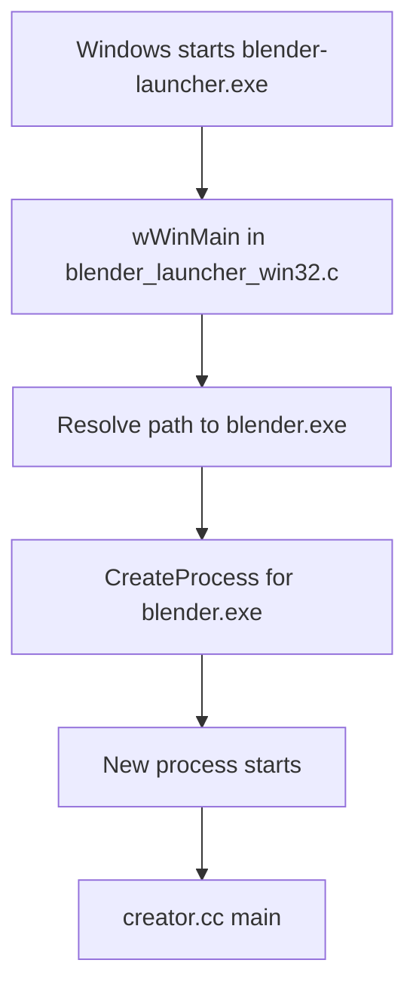
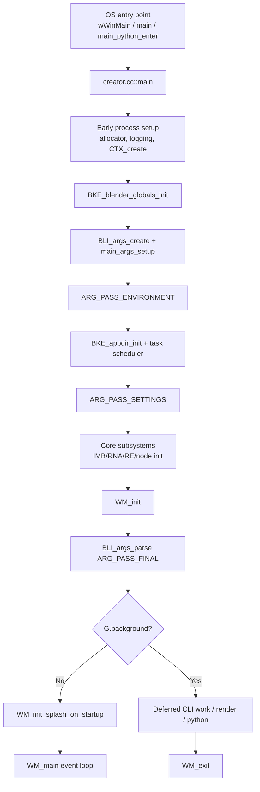

# Blender Application Bootstrapping – Source Code Review<!-- omit from toc -->

> - Explains Blender application startup from the source-file viewpoint.
> - Shows the main entry points, bootstrap path, and the hand-off into `WM_init()` and `WM_main()`.
> - Highlights global startup state, signal handling, and the staged command-line parsing flow.
> - Points to the key source files responsible for initialization and background/GUI execution.

## Table of Contents<!-- omit from toc -->

- [1) Startup source-file map](#1-startup-source-file-map)
- [2) Entry points](#2-entry-points)
  - [2.1 Primary application entry: `source/creator/creator.cc`](#21-primary-application-entry-sourcecreatorcreatorcc)
  - [2.2 Alternative entry point for Windows launcher: `source/creator/blender_launcher_win32.c`](#22-alternative-entry-point-for-windows-launcher-sourcecreatorblender_launcher_win32c)
    - [Relation between `wWinMain()` and `creator.cc::main()` on Windows](#relation-between-wwinmain-and-creatorccmain-on-windows)
  - [2.3 Alternate entry when Blender is built as a Python module](#23-alternate-entry-when-blender-is-built-as-a-python-module)
- [3) High-level startup flow](#3-high-level-startup-flow)
- [4) Detailed bootstrap path inside `creator.cc::main()`](#4-detailed-bootstrap-path-inside-creatorccmain)
  - [4.1 Early exit safety and platform argument handling](#41-early-exit-safety-and-platform-argument-handling)
  - [4.2 Very early debug-memory switch](#42-very-early-debug-memory-switch)
  - [4.3 Logging, context, executable path, and runtime-global setup](#43-logging-context-executable-path-and-runtime-global-setup)
  - [4.4 Core type and subsystem registration](#44-core-type-and-subsystem-registration)
  - [4.5 Argument system setup and multi-pass parsing](#45-argument-system-setup-and-multi-pass-parsing)
  - [4.6 Core runtime libraries and the hand-off to the window manager](#46-core-runtime-libraries-and-the-hand-off-to-the-window-manager)
  - [4.7 Final parse and execution branch](#47-final-parse-and-execution-branch)
  - [4.8 Background mode overview](#48-background-mode-overview)
  - [What it is used for](#what-it-is-used-for)
  - [How to run it from the CLI](#how-to-run-it-from-the-cli)
  - [Source files to deep dive further](#source-files-to-deep-dive-further)
- [5) What `WM_init()` actually initializes](#5-what-wm_init-actually-initializes)
  - [Verified startup excerpt](#verified-startup-excerpt)
  - [What happens here](#what-happens-here)
  - [Factory-startup link](#factory-startup-link)
- [6) Runtime-global state used during bootstrapping](#6-runtime-global-state-used-during-bootstrapping)
  - [6.1 `Global G` and `UserDef U`](#61-global-g-and-userdef-u)
  - [6.2 Important fields in `struct Global`](#62-important-fields-in-struct-global)
  - [6.3 `ApplicationState app_state`](#63-applicationstate-app_state)
- [7) Command-line option architecture and processing](#7-command-line-option-architecture-and-processing)
  - [7.1 Generic CLI parser used by Blender](#71-generic-cli-parser-used-by-blender)
  - [7.2 Pass order is explicitly defined](#72-pass-order-is-explicitly-defined)
  - [7.3 `main_args_setup()` registers the options](#73-main_args_setup-registers-the-options)
  - [7.4 Order of arguments is semantically important](#74-order-of-arguments-is-semantically-important)
- [8) Important command-line switches, handlers, and effects](#8-important-command-line-switches-handlers-and-effects)
  - [Example supporting excerpts](#example-supporting-excerpts)
- [9) How file loading and deferred background work are handled](#9-how-file-loading-and-deferred-background-work-are-handled)
  - [9.1 Unknown / trailing non-option arguments become blend files](#91-unknown--trailing-non-option-arguments-become-blend-files)
  - [9.2 Some CLI actions are explicitly deferred until the runtime is fully initialized](#92-some-cli-actions-are-explicitly-deferred-until-the-runtime-is-fully-initialized)
- [10) Signal and crash handler bootstrapping](#10-signal-and-crash-handler-bootstrapping)
- [11) Short Answers](#11-short-answers)
- [12) Source-level conclusion](#12-source-level-conclusion)

---

## 1) Startup source-file map

| File                                                  | Important symbols                                         | Bootstrapping role                                    |
| ----------------------------------------------------- | --------------------------------------------------------- | ----------------------------------------------------- |
| `source/creator/creator.cc`                           | `main()`, `main_python_enter()`, `callback_main_atexit()` | Top-level application bootstrap and main control flow |
| `source/creator/blender_launcher_win32.c`             | `wWinMain()`                                              | Windows launcher that forwards to `blender.exe`       |
| `source/creator/creator_args.cc`                      | `main_args_setup()`, `arg_handle_*()`                     | Command-line registration and processing              |
| `source/creator/creator_intern.h`                     | `ARG_PASS_*` enum, `ApplicationState`                     | Shared startup declarations and pass ordering         |
| `source/creator/creator_signals.cc`                   | `main_signal_setup()`, `main_signal_setup_background()`   | Crash/abort/Ctrl-C startup handlers                   |
| `source/blender/blenkernel/intern/blender.cc`         | `Global G`, `UserDef U`, `BKE_blender_globals_init()`     | Runtime-global initialization                         |
| `source/blender/blenkernel/BKE_global.hh`             | `struct Global`                                           | Definition of startup/global runtime state            |
| `source/blender/windowmanager/intern/wm_init_exit.cc` | `WM_init()`                                               | Window-manager / UI / home-file startup               |
| `source/blender/windowmanager/intern/wm.cc`           | `WM_main()`                                               | Main GUI event loop                                   |

---

## 2) Entry points

### 2.1 Primary application entry: `source/creator/creator.cc`

```cpp
/**
 * Blender's main function responsibilities are:
 * - setup subsystems.
 * - handle arguments.
 * - run #WM_main() event loop,
 *   or exit immediately when running in background-mode.
 */
int main(int argc, ...)
```

This is the **real startup root** for the Blender executable.

### 2.2 Alternative entry point for Windows launcher: `source/creator/blender_launcher_win32.c`

```c
int WINAPI wWinMain(HINSTANCE hInstance, HINSTANCE hPrevInstance, PWSTR pCmdLine, int nCmdShow)
{
  ...
  if (PathCchCombine(path, MAX_PATH, path, L"blender.exe") != S_OK) {
    return -1;
  }
```

On Windows, `blender-launcher.exe` is a small wrapper that resolves and starts `blender.exe`.

#### Relation between `wWinMain()` and `creator.cc::main()` on Windows

The important point is that these are **not two functions inside one executable calling each other directly**. Instead, the Windows build creates **two separate executable targets**.

**File:** `source/creator/CMakeLists.txt`

```cmake
add_executable(blender ${EXETYPE} ${SRC})

if(WIN32)
  add_executable(blender-launcher WIN32
    blender_launcher_win32.c
    ${CMAKE_SOURCE_DIR}/release/windows/icons/winblender.rc
  )
endif()
```

This means:

- `blender.exe` uses `creator.cc::main()` as the real Blender startup entry point,
- `blender-launcher.exe` uses `blender_launcher_win32.c::wWinMain()` as a Windows wrapper entry point.

The launcher does **not** call `main()` as a normal C/C++ function. Instead, it builds the full path to `blender.exe` and starts it as a **new process** using `CreateProcess(...)`.

**File:** `source/creator/blender_launcher_win32.c`

```c
/* Add blender.exe to path, resulting in the full path to the blender executable. */
if (PathCchCombine(path, MAX_PATH, path, L"blender.exe") != S_OK) {
  return -1;
}

BOOL success = CreateProcess(
    path, buffer, NULL, NULL, TRUE, CREATE_NEW_CONSOLE, NULL, NULL, &siStartInfo, &procInfo);
```

So on Windows the control flow is conceptually:

1. Windows may launch `blender-launcher.exe`,
2. that enters `wWinMain()`,
3. `wWinMain()` locates `blender.exe` and forwards the command line,
4. Windows then starts a **new `blender.exe` process**,
5. that new process enters `creator.cc::main()`.

In other words, this is **process forwarding**, not **direct function forwarding**.

A simplified view is:



If Windows launches `blender.exe` directly, then `creator.cc::main()` runs immediately and `wWinMain()` is not involved.

The launcher also has one extra responsibility: in background mode or when launched from Steam, it can wait for the child process and return Blender's exit code.

### 2.3 Alternate entry when Blender is built as a Python module

When WITH_PYTHON_MODULE is enabled, main_python_enter() is effectively the same startup body as creator.cc::main(), just renamed by the preprocessor.

In creator.cc

```cpp
#ifdef WITH_PYTHON_MODULE
int main_python_enter(int argc, const char **argv);

/* Rename the `main(..)` function, allowing Python initialization to call it. */
#  define main blender::main_python_enter
#endif
```

Then later the file defines:

```cpp
int main(int argc, ...)
```

Because of the macro, that function is compiled as blender::main_python_enter(int argc, ...)

So Blender can also be entered through the `bpy` / Python-module path, not only as a standalone GUI executable.

**Where is it actually called?**

The call site is in:

/source/blender/python/intern/bpy_interface.cc

Inside bpy_module_delay_init():

```cpp
/* Defined in 'creator.c' when building as a Python module. */extern int main_python_enter(int argc, const char **argv);...main_python_enter(argc, argv);
```

So the runtime path is:

```text
import bpy  
  -> bpy_interfacecc  
  -> bpy_module_delay_init()
  -> main_python_enter(argc, argv)
  -> executes the renamed startup code from creator.cc
```

**What this alternative entry is for**

This mode exists so Blender can be built as an **importable Python module** instead of a normal desktop application. In practice, this is used when developers want to:

- `import bpy` from Python,
- run Blender functionality inside studio pipelines or automation scripts,
- use Blender in web services, data processing, or scientific workflows,
- access the Blender API without launching the normal interactive UI.

The source tree describes that intent directly.

**File:** `source/creator/creator.cc`

```cpp
/* Called in `bpy_interface.cc` when building as a Python module. */
int main_python_enter(int argc, const char **argv);
```

And Blender's wheel-packaging helper states the broader use case:

**File:** `build_files/utils/make_bpy_wheel.py`

```python
This package provides Blender as a Python module for use in studio pipelines, web services,
scientific research, and more.
```

The runtime behavior is also intentionally different from the normal GUI executable. In `creator.cc`:

```cpp
/* Using preferences or user startup makes no sense for #WITH_PYTHON_MODULE. */
G.factory_startup = true;
...
/* Python module mode ALWAYS runs in background-mode (for now). */
G.background = true;
```

So this path is mainly for **headless / scripted / embedded use**, not for the usual windowed Blender session.

**How it is compiled**

The CMake build switches from creating the normal executable to creating a Python-loadable module.

**File:** `source/creator/CMakeLists.txt`

```cmake
if(WITH_PYTHON_MODULE)
  add_definitions(-DWITH_PYTHON_MODULE)

  # Creates `./bpy/__init__.so` which can be imported as a Python module.
  add_library(blender MODULE ${SRC})

  set_target_properties(
    blender
    PROPERTIES
      PREFIX ""
      OUTPUT_NAME __init__
      LIBRARY_OUTPUT_DIRECTORY ${BPY_OUTPUT_DIRECTORY}
      RUNTIME_OUTPUT_DIRECTORY ${BPY_OUTPUT_DIRECTORY}
  )
endif()
```

This means:

- the target is no longer a normal `blender` executable,
- it is built as a **module library**,
- the output is renamed to `__init__`, so it becomes importable as the `bpy` package,
- on Windows the suffix becomes `.pyd`, while on Unix-like systems it is a shared-object module such as `.so`.

A source-backed configuration shortcut already exists for this build mode.

**File:** `build_files/cmake/config/bpy_module.cmake`

```cmake
# Example usage:
#   cmake -C../blender/build_files/cmake/config/bpy_module.cmake  ../blender

set(WITH_PYTHON_MODULE ON CACHE BOOL "" FORCE)
```

So a typical out-of-source build flow is:

```bash
mkdir build-bpy
cd build-bpy
cmake -C ../blender_fork/build_files/cmake/config/bpy_module.cmake ../blender_fork
cmake --build . --config Release --target blender
```

After building, the resulting module is placed under a `bpy` output directory, for example:

- `bin/bpy/__init__.so` on Linux,
- `bin/Release/bpy/__init__.pyd` on Windows multi-config generators.

Then the intended usage is from Python itself:

```python
import bpy
```

So, conceptually, section `2.3` is the **embedded-Python / importable-Blender entry path**, whereas section `2.1` is the normal application startup path for the standalone executable.

---

## 3) High-level startup flow



---

## 4) Detailed bootstrap path inside `creator.cc::main()`

### 4.1 Early exit safety and platform argument handling

At the beginning of `main()`, Blender registers cleanup logic before heavy initialization:

```cpp
CreatorAtExitData app_init_data = {nullptr};
BKE_blender_atexit_register(callback_main_atexit, &app_init_data);
...
C = CTX_create();
```

On Windows, it also converts UTF-16 command-line arguments to UTF-8 before normal processing:

```cpp
wchar_t **argv_16 = CommandLineToArgvW(GetCommandLineW(), &argc);
app_init_data.argv = static_cast<char **>(malloc(argc * sizeof(char *)));
...
const char **argv = const_cast<const char **>(app_init_data.argv);
```

### 4.2 Very early debug-memory switch

Before most other initialization, Blender scans `argv` for debug flags:

```cpp
for (i = 0; i < argc; i++) {
  if (STR_ELEM(argv[i], "-d", "--debug", "--debug-memory", "--debug-all")) {
    printf("Switching to fully guarded memory allocator.\n");
    MEM_use_guarded_allocator();
    break;
  }
  if (STR_ELEM(argv[i], "--", "-c", "--command")) {
    break;
  }
}
MEM_init_memleak_detection();
```

This is important: some CLI flags affect startup **before** the normal argument parser is fully active.

### 4.3 Logging, context, executable path, and runtime-global setup

The next major initialization block is:

```cpp
CLG_init();
...
C = CTX_create();
...
BKE_appdir_program_path_init(argv[0]);

BLI_threadapi_init();
DNA_sdna_current_init();

BKE_blender_globals_init(); /* `blender.cc` */
```

Key meaning:

- `CLG_init()` starts the logging system.
- `CTX_create()` allocates the central `bContext`.
- `BKE_appdir_program_path_init(argv[0])` records the executable location.
- `BKE_blender_globals_init()` creates/reset the global runtime state (`G`, `G_MAIN`, etc.).

### 4.4 Core type and subsystem registration

Still in `main()`:

```cpp
BKE_cpp_types_init();
BKE_idtype_init();
BKE_modifier_init();
seq::modifiers_init();
BKE_shaderfx_init();
BKE_volumes_init();
DEG_register_node_types();
```

At this stage Blender registers core C++/ID/modifier/depsgraph infrastructure before loading files or starting the UI.

### 4.5 Argument system setup and multi-pass parsing

The CLI system is created and connected here:

```cpp
ba = BLI_args_create(argc, argv);
main_args_setup(C, ba, false);

/* Parse environment handling arguments. */
BLI_args_parse(ba, ARG_PASS_ENVIRONMENT, nullptr, nullptr);
```

Then, after environment-affecting options are processed:

```cpp
BKE_appdir_init();
BLI_task_scheduler_init();
fftw::initialize_float();
BLI_args_parse(ba, ARG_PASS_SETTINGS, nullptr, nullptr);
```

This order matters because some arguments change paths, threads, or global behavior before later subsystems start.

### 4.6 Core runtime libraries and the hand-off to the window manager

After the settings pass:

```cpp
IMB_init();
MOV_init();
RNA_init();

RE_texture_rng_init();
RE_engines_init();
bke::node_system_init();

BKE_brush_system_init();
BKE_particle_init_rng();
```

Then Blender switches to the main runtime/UI initialization stage:

```cpp
WM_init(C, argc, argv);
```

### 4.7 Final parse and execution branch

Once `WM_init()` has prepared the runtime, Blender runs the **final** CLI pass:

```cpp
/* Handles #ARG_PASS_FINAL. */
BLI_args_parse(ba, ARG_PASS_FINAL, main_args_handle_load_file, C);
```

Execution then splits into GUI or background mode:

```cpp
if (G.background) {
  ...
  exit_code = main_arg_deferred_handle();
  ...
  WM_exit(C, exit_code);
}
else {
  WM_init_splash_on_startup(C);
  WM_main(C);
}
```

So the bootstrapping boundary is:

- **GUI path** → `WM_main(C)` infinite event loop.
- **Background / automation path** → deferred command/render/script execution, then `WM_exit()`.

### 4.8 Background mode overview

**Background mode** means Blender runs **without the normal interactive windowed UI/event-loop workflow**. It is mainly intended for **automation**, **batch rendering**, **CLI scripting**, **asset conversion**, and **headless execution on build servers or render nodes**.

A source-level hint for its meaning appears in `source/blender/blenkernel/BKE_global.hh`:

```cpp
/**
 * Blender is running without any Windows or OpenGLES context.
 * Typically set by the `--background` command-line argument.
 */
bool background;
```

And in `source/creator/creator_args.cc`, the CLI handler enables it directly:

```cpp
static void background_mode_set()
{
  G.background = true;
  BKE_sound_force_device("None");
}
```

### What it is used for

Common use-cases include:

- rendering a single frame or full animation from the command line,
- running a Python script without opening the Blender UI,
- importing/exporting or converting data in automated pipelines,
- CI, testing, and server-side processing.

### How to run it from the CLI

Use either `-b` or `--background`:

```bash
blender --background file.blend --render-frame 1
blender -b file.blend -a
blender --background --python my_script.py
blender --background --factory-startup file.blend --python my_script.py
```

### Source files to deep dive further

- `source/creator/creator_args.cc` — registers and handles `-b` / `--background`
- `source/creator/creator.cc` — branches between GUI execution and background execution
- `source/blender/blenkernel/BKE_global.hh` — defines `Global.background`
- `source/creator/creator_signals.cc` — special signal handling for background mode
- `source/blender/windowmanager/intern/wm_init_exit.cc` — shows what still initializes even when no normal UI loop is used

---

## 5) What `WM_init()` actually initializes

`source/blender/windowmanager/intern/wm_init_exit.cc` is where Blender turns the low-level process into a usable runtime/UI session.

### Verified startup excerpt

```cpp
void WM_init(bContext *C, int argc, const char **argv)
{
  if (!G.background) {
    wm_ghost_init(C); /* NOTE: it assigns C to ghost! */
    wm_init_cursor_data();
    BKE_sound_jack_sync_callback_set(sound_jack_sync_callback);
  }

  BKE_addon_pref_type_init();
  BKE_keyconfig_pref_type_init();
  wm_operatortypes_register();
  ...
  ED_spacetypes_init();
  ...
  BLF_init();
  BLT_lang_init();
  ...
  wm_homefile_read_ex(C, &read_homefile_params, nullptr, &params_file_read_post);
  ...
  WM_init_gpu();
  ...
  BPY_python_start(C, argc, argv);
  BPY_python_reset(C);
```

### What happens here

From the code above, `WM_init()` is responsible for:

1. starting the platform/windowing layer (`GHOST`) in GUI mode,
2. registering operators, panels, menus, UI lists, gizmos, editor space types,
3. initializing fonts, translations, icons, preview images, and studio lights,
4. reading the home/startup file with `wm_homefile_read_ex(...)`,
5. initializing GPU/UI runtime in GUI mode,
6. starting and resetting Blender's Python runtime.

This is the real **transition from startup shell to full Blender runtime**.

### Factory-startup link

`WM_init()` uses the CLI-controlled flag `G.factory_startup` while reading the home file:

```cpp
read_homefile_params.use_factory_settings = G.factory_startup;
wm_homefile_read_ex(C, &read_homefile_params, nullptr, &params_file_read_post);
```

So `--factory-startup` directly changes how the initial home file/preferences are loaded.

---

## 6) Runtime-global state used during bootstrapping

### 6.1 `Global G` and `UserDef U`

In `source/blender/blenkernel/intern/blender.cc`:

```cpp
Global G;
UserDef U;

void BKE_blender_globals_init()
{
  blender_version_init();

  memset(&G, 0, sizeof(Global));

  U.savetime = 1;

  BKE_blender_globals_main_replace(BKE_main_new());

  STRNCPY(G.filepath_last_image, "//");
  G.filepath_last_blend[0] = '\0';

#ifndef WITH_PYTHON_SECURITY
  G.f |= G_FLAG_SCRIPT_AUTOEXEC;
#endif

  G.log.level = CLG_LEVEL_WARN;
  G.profile_gpu = false;
}
```

This shows that bootstrapping creates and resets the top-level runtime state very early.

### 6.2 Important fields in `struct Global`

From `source/blender/blenkernel/BKE_global.hh`:

```cpp
Main *main;
...
bool background;
bool factory_startup;
...
int f;
...
int debug;
...
int fileflags;
```

The comments in the same file explicitly tie these fields to startup behavior:

```cpp
/**
 * Blender is running without any Windows or OpenGLES context.
 * Typically set by the `--background` command-line argument.
 */
bool background;

/**
 * Skip reading the startup file and user preferences.
 * see via the command line argument: `--factory-startup`.
 */
bool factory_startup;

/**
 * Debug flag ... set via:
 * - Command line arguments: `--debug`, `--debug-memory` ... etc.
 */
int debug;
```

### 6.3 `ApplicationState app_state`

`source/creator/creator.cc` also defines a smaller startup-global state:

```cpp
ApplicationState app_state = []() {
  ApplicationState app_state{};
  app_state.signal.use_crash_handler = true;
  app_state.signal.use_abort_handler = true;
  app_state.exit_code_on_error.python = 0;
  app_state.main_arg_deferred = nullptr;
  return app_state;
}();
```

This object stores:

- crash/abort handler enablement,
- Python exit-code behavior,
- deferred CLI actions for background mode.

---

## 7) Command-line option architecture and processing

### 7.1 Generic CLI parser used by Blender

Blender does not hard-code all parsing inside `main()`. It uses the reusable `BLI_args` API from `source/blender/blenlib/BLI_args.h`:

```cpp
using BA_ArgCallback = int (*)(int argc, const char **argv, void *data);

struct bArgs *BLI_args_create(int argc, const char **argv);
void BLI_args_add(...);
void BLI_args_parse(struct bArgs *ba, int pass, BA_ArgCallback default_cb, void *default_data);
```

So each option is registered with a callback and then executed by pass.

### 7.2 Pass order is explicitly defined

In `source/creator/creator_intern.h`:

```cpp
enum {
  ARG_PASS_ENVIRONMENT = 1,
  ARG_PASS_SETTINGS = 2,
  ARG_PASS_SETTINGS_GUI = 3,
  ARG_PASS_SETTINGS_FORCE = 4,
  ARG_PASS_FINAL = 5,
};
```

This gives Blender a **staged startup parser**, not a single one-shot parse.

### 7.3 `main_args_setup()` registers the options

In `source/creator/creator_args.cc`:

```cpp
void main_args_setup(bContext *C, bArgs *ba, bool all)
{
  ...
  BLI_args_pass_set(ba, ARG_PASS_ENVIRONMENT);
  BLI_args_add(ba, nullptr, "--python-use-system-env", ...);
  BLI_args_add(ba, nullptr, "--env-system-datafiles", ...);
  BLI_args_add(ba, "-t", "--threads", ...);

  BLI_args_pass_set(ba, ARG_PASS_SETTINGS);
  BLI_args_add(ba, "-h", "--help", ...);
  BLI_args_add(ba, "-b", "--background", ...);
  BLI_args_add(ba, "-c", "--command", ...);
  BLI_args_add(ba, nullptr, "--factory-startup", ...);

  BLI_args_pass_set(ba, ARG_PASS_FINAL);
  BLI_args_add(ba, "-f", "--render-frame", ...);
  BLI_args_add(ba, "-a", "--render-anim", ...);
  BLI_args_add(ba, "-P", "--python", ...);
  BLI_args_add(ba, nullptr, "--python-expr", ...);
  BLI_args_add(ba, "-o", "--render-output", ...);
  BLI_args_add(ba, "-E", "--engine", ...);
}
```

This is the main registration table for Blender's startup CLI behavior.

### 7.4 Order of arguments is semantically important

Blender's own help text says:

```cpp
PRINT("Argument Order:\n");
PRINT("\tArguments are executed in the order they are given. eg:\n");
PRINT("\t# blender --background test.blend --render-frame 1 --render-output \"/tmp\"\n");
...
PRINT("\t# blender --background test.blend --render-output /tmp --render-frame 1\n");
PRINT("\t...works as expected.\n");
```

So some arguments **do work immediately** and can be overwritten by later file loading or render execution.

---

## 8) Important command-line switches, handlers, and effects

| Switch                                                                                             | Handler / Source                                           | Pass                   | Verified effect in code                                                                                         |
| -------------------------------------------------------------------------------------------------- | ---------------------------------------------------------- | ---------------------- | --------------------------------------------------------------------------------------------------------------- |
| `-b`, `--background`                                                                               | `arg_handle_background_mode_set()` in `creator_args.cc`    | `ARG_PASS_SETTINGS`    | Calls `background_mode_set();`, sets `G.background = true;`, and forces `BKE_sound_force_device("None");`       |
| `-c`, `--command`                                                                                  | `arg_handle_command_set()`                                 | `ARG_PASS_SETTINGS`    | Implies background mode, suppresses info output, and uses `main_arg_deferred_setup(...)` for deferred execution |
| `--factory-startup`                                                                                | `arg_handle_factory_startup_set()`                         | `ARG_PASS_SETTINGS`    | `G.factory_startup = true;` and `G.f \|= G_FLAG_USERPREF_NO_SAVE_ON_EXIT;`                                      |
| `-d`, `--debug`                                                                                    | `arg_handle_debug_mode_set()`                              | `ARG_PASS_SETTINGS`    | Sets `G.debug \|= G_DEBUG;`, enables memory debug, prints build info and argument state                         |
| `--debug-*`                                                                                        | `arg_handle_debug_mode_generic_set()` and related handlers | `ARG_PASS_SETTINGS`    | ORs specific debug bit flags into `G.debug`                                                                     |
| `--offline-mode` / `--online-mode`                                                                 | `arg_handle_internet_allow_set()`                          | `ARG_PASS_SETTINGS`    | Sets/clears `G_FLAG_INTERNET_ALLOW` and override flags in `G.f`                                                 |
| `-t`, `--threads`                                                                                  | `arg_handle_threads_set()`                                 | `ARG_PASS_ENVIRONMENT` | Calls `BLI_system_num_threads_override_set(threads);`                                                           |
| `--env-system-datafiles`, `--env-system-scripts`, `--env-system-python`, `--env-system-extensions` | `arg_handle_env_system_set()`                              | `ARG_PASS_ENVIRONMENT` | Sets Blender path-related environment variables before appdir initialization                                    |
| `-f`, `--render-frame`                                                                             | `arg_handle_render_frame()`                                | `ARG_PASS_FINAL`       | Parses frame/range arguments and calls `RE_RenderAnim(...)`                                                     |
| `-a`, `--render-anim`                                                                              | `arg_handle_render_animation()`                            | `ARG_PASS_FINAL`       | Renders from `scene->r.sfra` to `scene->r.efra`                                                                 |
| `-P`, `--python`                                                                                   | `arg_handle_python_file_run()`                             | `ARG_PASS_FINAL`       | Canonicalizes the path and runs `BPY_run_filepath(C, filepath, nullptr)`                                        |
| `--python-expr`                                                                                    | `arg_handle_python_expr_run()`                             | `ARG_PASS_FINAL`       | Executes `BPY_run_string_exec(C, nullptr, argv[1])`                                                             |
| `--python-exit-code`                                                                               | `arg_handle_python_exit_code_set()`                        | `ARG_PASS_FINAL`       | Sets `app_state.exit_code_on_error.python` for CLI Python failures                                              |
| `-o`, `--render-output`                                                                            | `arg_handle_output_set()`                                  | `ARG_PASS_FINAL`       | Writes into `scene->r.pic`                                                                                      |
| `-E`, `--engine`                                                                                   | `arg_handle_engine_set()`                                  | `ARG_PASS_FINAL`       | Updates `scene->r.engine` if the engine exists                                                                  |
| `-F`, `--render-format`                                                                            | `arg_handle_image_type_set()`                              | `ARG_PASS_FINAL`       | Converts the requested output format and updates `scene->r.im_format`                                           |

### Example supporting excerpts

**Background mode**

```cpp
static void background_mode_set()
{
  G.background = true;
  BKE_sound_force_device("None");
}
```

**Factory startup**

```cpp
static int arg_handle_factory_startup_set(...)
{
  G.factory_startup = true;
  G.f |= G_FLAG_USERPREF_NO_SAVE_ON_EXIT;
  return 0;
}
```

**Python file execution**

```cpp
BPY_CTX_SETUP(ok = BPY_run_filepath(C, filepath, nullptr));
```

**Render-frame execution**

```cpp
RE_RenderAnim(re, bmain, scene, nullptr, nullptr, frame, frame, scene->r.frame_step);
```

---

## 9) How file loading and deferred background work are handled

### 9.1 Unknown / trailing non-option arguments become blend files

`main_args_handle_load_file()` in `creator_args.cc` is used as the default callback in the final parse pass:

```cpp
int main_args_handle_load_file(int /*argc*/, const char **argv, void *data)
{
  bContext *C = static_cast<bContext *>(data);
  const char *filepath = argv[0];

  if (argv[0][0] == '-') {
    fprintf(stderr, "unknown argument, loading as file: %s\n", filepath);
  }

  if (!handle_load_file(C, filepath, true)) {
    return -1;
  }
  return 0;
}
```

So, after registered options are handled, remaining arguments are assumed to be files to open.

### 9.2 Some CLI actions are explicitly deferred until the runtime is fully initialized

Blender stores deferred callbacks in `main_arg_deferred_setup()`:

```cpp
static void main_arg_deferred_setup(BA_ArgCallback func, int argc, const char **argv, void *data)
{
  ...
  d->func = func;
  d->argc = argc;
  d->argv = argv;
  d->data = data;
  ...
  app_state.main_arg_deferred = d;
}
```

And later executes them with:

```cpp
int main_arg_deferred_handle()
{
  BA_ArgCallback_Deferred *d = app_state.main_arg_deferred;
  d->func(d->argc, d->argv, d->data);
  return d->exit_code;
}
```

This is how `--command` and similar background operations wait until Python/UI/runtime pieces are ready.

---

## 10) Signal and crash handler bootstrapping

`source/creator/creator_signals.cc` installs signal handlers after the settings pass:

```cpp
void main_signal_setup()
{
  if (app_state.signal.use_crash_handler) {
#  ifdef WIN32
    SetUnhandledExceptionFilter(windows_exception_handler);
#  else
    signal(SIGSEGV, sig_handle_crash_fn);
#  endif
  }
  ...
}
```

In background mode Blender also wires `Ctrl-C` / `SIGINT` to the global break flag:

```cpp
static void sig_handle_blender_esc(int sig)
{
  G.is_break = true;
  ...
}

void main_signal_setup_background()
{
  BLI_assert(G.background);
  signal(SIGINT, sig_handle_blender_esc);
}
```

This is part of bootstrapping because it changes how the process reacts to failures and console interruption very early in the runtime.

---

## 11) Short Answers

From the source code, Blender bootstrapping is organized like this:

1. **Entry** arrives in `source/creator/creator.cc::main()` (or `wWinMain()` / Python-module alias).
2. `main()` performs **very early platform, allocator, logging, and context setup**.
3. `BKE_blender_globals_init()` creates the runtime-global state (`G`, `G_MAIN`, default flags).
4. `main_args_setup()` + `BLI_args_parse()` implement a **multi-pass CLI startup pipeline**.
5. `WM_init()` performs the **real runtime hand-off**: home file, operators, UI/editor types, GPU, Python, preferences.
6. Startup ends in either:
   - `WM_main(C)` for the interactive GUI loop, or
   - deferred background execution + `WM_exit(C)` for headless automation.

## 12) Source-level conclusion

If you want to understand Blender startup from the source tree, start with these files in order:

1. `source/creator/creator.cc`
2. `source/creator/creator_args.cc`
3. `source/creator/creator_intern.h`
4. `source/blender/blenkernel/intern/blender.cc`
5. `source/blender/blenkernel/BKE_global.hh`
6. `source/blender/windowmanager/intern/wm_init_exit.cc`
7. `source/blender/windowmanager/intern/wm.cc`
8. `source/creator/creator_signals.cc`
