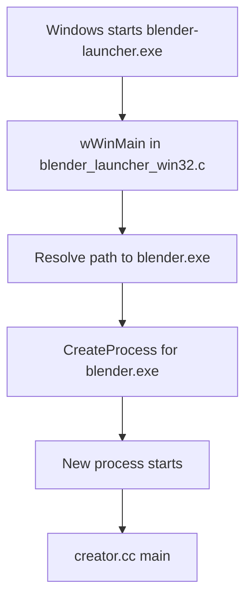
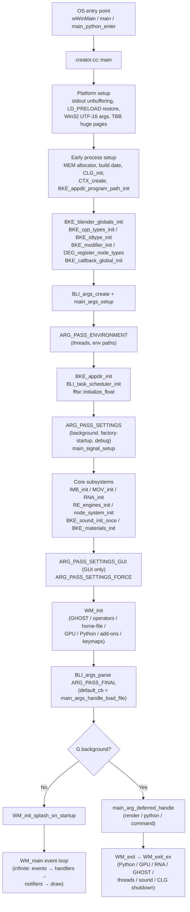

# Blender Application Bootstrapping – Source Code Review<!-- omit from toc -->

> - Explains Blender application startup from the source-file viewpoint.
> - Shows the main entry points, bootstrap path, and the hand-off into `WM_init()` and `WM_main()`.
> - Highlights global startup state, signal handling, and the staged command-line parsing flow.
> - Points to the key source files responsible for initialization and background/GUI execution.

## Table of Contents<!-- omit from toc -->

- [1) Startup source-file map](#1-startup-source-file-map)
- [2) Entry points](#2-entry-points)
  - [2.1 Primary application entry: `source/creator/creator.cc`](#21-primary-application-entry-sourcecreatorcreatorcc)
  - [2.2 Alternative entry point for Windows launcher: `source/creator/blender_launcher_win32.c`](#22-alternative-entry-point-for-windows-launcher-sourcecreatorblender_launcher_win32c)
    - [Relation between `wWinMain()` and `creator.cc::main()` on Windows](#relation-between-wwinmain-and-creatorccmain-on-windows)
  - [2.3 Alternate entry when Blender is built as a Python module](#23-alternate-entry-when-blender-is-built-as-a-python-module)
- [3) High-level startup flow](#3-high-level-startup-flow)
- [4) Detailed bootstrap path inside `creator.cc::main()`](#4-detailed-bootstrap-path-inside-creatorccmain)
  - [4.1 Early exit safety and platform argument handling](#41-early-exit-safety-and-platform-argument-handling)
  - [4.2 Platform-specific and compiler-specific early setup](#42-platform-specific-and-compiler-specific-early-setup)
  - [4.3 Very early debug-memory switch](#43-very-early-debug-memory-switch)
  - [4.4 Logging, context, executable path, and runtime-global setup](#44-logging-context-executable-path-and-runtime-global-setup)
  - [4.5 Core type and subsystem registration](#45-core-type-and-subsystem-registration)
  - [4.6 Argument system setup and multi-pass parsing](#46-argument-system-setup-and-multi-pass-parsing)
  - [4.7 Core runtime libraries and the hand-off to the window manager](#47-core-runtime-libraries-and-the-hand-off-to-the-window-manager)
  - [4.8 Final parse and execution branch](#48-final-parse-and-execution-branch)
  - [4.9 Background mode overview](#49-background-mode-overview)
  - [What it is used for](#what-it-is-used-for)
  - [How to run it from the CLI](#how-to-run-it-from-the-cli)
  - [Source files to deep dive further](#source-files-to-deep-dive-further)
- [5) What `WM_init()` actually initializes](#5-what-wm_init-actually-initializes)
  - [Complete ordered initialization sequence](#complete-ordered-initialization-sequence)
  - [Key design note on startup inter-dependencies](#key-design-note-on-startup-inter-dependencies)
  - [Factory-startup link](#factory-startup-link)
- [6) `WM_main()` – the GUI event loop](#6-wm_main--the-gui-event-loop)
- [7) `WM_exit()` – the shutdown sequence](#7-wm_exit--the-shutdown-sequence)
- [8) Runtime-global state used during bootstrapping](#8-runtime-global-state-used-during-bootstrapping)
  - [8.1 `Global G` and `UserDef U`](#81-global-g-and-userdef-u)
  - [8.2 Important fields in `struct Global`](#82-important-fields-in-struct-global)
  - [8.3 `ApplicationState app_state`](#83-applicationstate-app_state)
- [9) Command-line option architecture and processing](#9-command-line-option-architecture-and-processing)
  - [9.1 Generic CLI parser used by Blender](#91-generic-cli-parser-used-by-blender)
  - [9.2 Pass order is explicitly defined](#92-pass-order-is-explicitly-defined)
  - [9.3 `main_args_setup()` registers the options](#93-main_args_setup-registers-the-options)
  - [9.4 Order of arguments is semantically important](#94-order-of-arguments-is-semantically-important)
- [10) Important command-line switches, handlers, and effects](#10-important-command-line-switches-handlers-and-effects)
  - [Example supporting excerpts](#example-supporting-excerpts)
- [11) How file loading and deferred background work are handled](#11-how-file-loading-and-deferred-background-work-are-handled)
  - [11.1 Unknown / trailing non-option arguments become blend files](#111-unknown--trailing-non-option-arguments-become-blend-files)
  - [11.2 Some CLI actions are explicitly deferred until the runtime is fully initialized](#112-some-cli-actions-are-explicitly-deferred-until-the-runtime-is-fully-initialized)
- [12) Signal and crash handler bootstrapping](#12-signal-and-crash-handler-bootstrapping)
- [13) Short Answers](#13-short-answers)
- [14) Source-level conclusion](#14-source-level-conclusion)

---

## 1) Startup source-file map

| File                                                     | Important symbols                                                   | Bootstrapping role                                    |
| -------------------------------------------------------- | ------------------------------------------------------------------- | ----------------------------------------------------- |
| `source/creator/creator.cc`                              | `main()`, `main_python_enter()`, `callback_main_atexit()`           | Top-level application bootstrap and main control flow |
| `source/creator/blender_launcher_win32.c`                | `wWinMain()`                                                        | Windows launcher that forwards to `blender.exe`       |
| `source/creator/creator_args.cc`                         | `main_args_setup()`, `arg_handle_*()`, `main_args_handle_load_file` | Command-line registration and processing              |
| `source/creator/creator_intern.h`                        | `ARG_PASS_*` enum, `ApplicationState`                               | Shared startup declarations and pass ordering         |
| `source/creator/creator_signals.cc`                      | `main_signal_setup()`, `main_signal_setup_background()`             | Crash/abort/Ctrl-C startup handlers                   |
| `source/blender/blenkernel/intern/blender.cc`            | `Global G`, `UserDef U`, `BKE_blender_globals_init()`               | Runtime-global initialization                         |
| `source/blender/blenkernel/BKE_global.hh`                | `struct Global`                                                     | Definition of startup/global runtime state            |
| `source/blender/windowmanager/intern/wm_init_exit.cc`    | `WM_init()`, `WM_init_gpu()`, `WM_exit_ex()`                        | Window-manager / UI / home-file startup and shutdown  |
| `source/blender/windowmanager/intern/wm.cc`              | `WM_main()`                                                         | Main GUI event loop                                   |
| `source/blender/windowmanager/intern/wm_event_system.cc` | `wm_event_do_handlers()`, `wm_event_do_notifiers()`                 | Event dispatch and notifier processing                |
| `source/blender/windowmanager/intern/wm_draw.cc`         | `wm_draw_update()`                                                  | Per-frame draw update from event loop                 |
| `source/blender/python/intern/bpy_interface.cc`          | `bpy_module_delay_init()`, `main_python_enter()`                    | Python module entry path                              |

---

## 2) Entry points

### 2.1 Primary application entry: `source/creator/creator.cc`

```cpp
/**
 * Blender's main function responsibilities are:
 * - setup subsystems.
 * - handle arguments.
 * - run #WM_main() event loop,
 *   or exit immediately when running in background-mode.
 */
int main(int argc, ...)
```

This is the **real startup root** for the Blender executable.

### 2.2 Alternative entry point for Windows launcher: `source/creator/blender_launcher_win32.c`

```c
int WINAPI wWinMain(HINSTANCE hInstance, HINSTANCE hPrevInstance, PWSTR pCmdLine, int nCmdShow)
{
  ...
  if (PathCchCombine(path, MAX_PATH, path, L"blender.exe") != S_OK) {
    return -1;
  }
```

On Windows, `blender-launcher.exe` is a small wrapper that resolves and starts `blender.exe`.

#### Relation between `wWinMain()` and `creator.cc::main()` on Windows

The important point is that these are **not two functions inside one executable calling each other directly**. Instead, the Windows build creates **two separate executable targets**.

**File:** `source/creator/CMakeLists.txt`

```cmake
add_executable(blender ${EXETYPE} ${SRC})

if(WIN32)
  add_executable(blender-launcher WIN32
    blender_launcher_win32.c
    ${CMAKE_SOURCE_DIR}/release/windows/icons/winblender.rc
  )
endif()
```

This means:

- `blender.exe` uses `creator.cc::main()` as the real Blender startup entry point,
- `blender-launcher.exe` uses `blender_launcher_win32.c::wWinMain()` as a Windows wrapper entry point.

The launcher does **not** call `main()` as a normal C/C++ function. Instead, it builds the full path to `blender.exe` and starts it as a **new process** using `CreateProcess(...)`.

**File:** `source/creator/blender_launcher_win32.c`

```c
/* Add blender.exe to path, resulting in the full path to the blender executable. */
if (PathCchCombine(path, MAX_PATH, path, L"blender.exe") != S_OK) {
  return -1;
}

BOOL success = CreateProcess(
    path, buffer, NULL, NULL, TRUE, CREATE_NEW_CONSOLE, NULL, NULL, &siStartInfo, &procInfo);
```

So on Windows the control flow is conceptually:

1. Windows may launch `blender-launcher.exe`,
2. that enters `wWinMain()`,
3. `wWinMain()` locates `blender.exe` and forwards the command line,
4. Windows then starts a **new `blender.exe` process**,
5. that new process enters `creator.cc::main()`.

In other words, this is **process forwarding**, not **direct function forwarding**.

A simplified view is:



If Windows launches `blender.exe` directly, then `creator.cc::main()` runs immediately and `wWinMain()` is not involved.

The launcher also has one extra responsibility: in background mode or when launched from Steam, it can wait for the child process and return Blender's exit code.

### 2.3 Alternate entry when Blender is built as a Python module

When WITH_PYTHON_MODULE is enabled, main_python_enter() is effectively the same startup body as creator.cc::main(), just renamed by the preprocessor.

In creator.cc

```cpp
#ifdef WITH_PYTHON_MODULE
int main_python_enter(int argc, const char **argv);

/* Rename the `main(..)` function, allowing Python initialization to call it. */
#  define main blender::main_python_enter
#endif
```

> **5.1.1 note:** The `WITH_HEADLESS` build configuration (headless builds without any display server) also enters this same path. See section 4.9.

Then later the file defines:

```cpp
int main(int argc, ...)
```

Because of the macro, that function is compiled as blender::main_python_enter(int argc, ...)

So Blender can also be entered through the `bpy` / Python-module path, not only as a standalone GUI executable.

**Where is it actually called?**

The call site is in:

/source/blender/python/intern/bpy_interface.cc

Inside bpy_module_delay_init():

```cpp
/* Defined in 'creator.c' when building as a Python module. */
extern int main_python_enter(int argc, const char **argv);
...
main_python_enter(argc, argv);
```

So the runtime path is:

```text
import bpy
  -> bpy_interface.cc
  -> bpy_module_delay_init()
  -> main_python_enter(argc, argv)
  -> executes the renamed startup code from creator.cc
```

**What this alternative entry is for**

This mode exists so Blender can be built as an **importable Python module** instead of a normal desktop application. In practice, this is used when developers want to:

- `import bpy` from Python,
- run Blender functionality inside studio pipelines or automation scripts,
- use Blender in web services, data processing, or scientific workflows,
- access the Blender API without launching the normal interactive UI.

The source tree describes that intent directly.

**File:** `source/creator/creator.cc`

```cpp
/* Called in `bpy_interface.cc` when building as a Python module. */
int main_python_enter(int argc, const char **argv);
```

And Blender's wheel-packaging helper states the broader use case:

**File:** `build_files/utils/make_bpy_wheel.py`

```python
This package provides Blender as a Python module for use in studio pipelines, web services,
scientific research, and more.
```

The runtime behavior is also intentionally different from the normal GUI executable. In `creator.cc`:

```cpp
/* Using preferences or user startup makes no sense for #WITH_PYTHON_MODULE. */
G.factory_startup = true;
...
/* Python module mode ALWAYS runs in background-mode (for now). */
G.background = true;
```

> **5.1.1 update:** `G.background = true` (and `BKE_sound_force_device("None")`) is now guarded by `#if defined(WITH_PYTHON_MODULE) || defined(WITH_HEADLESS)`. Builds compiled with `WITH_HEADLESS` also always run in background-mode. However, `G.factory_startup = true` is only set for `WITH_PYTHON_MODULE`, not `WITH_HEADLESS`.

So this path is mainly for **headless / scripted / embedded use**, not for the usual windowed Blender session.

**How it is compiled**

The CMake build switches from creating the normal executable to creating a Python-loadable module.

**File:** `source/creator/CMakeLists.txt`

```cmake
if(WITH_PYTHON_MODULE)
  add_definitions(-DWITH_PYTHON_MODULE)

  # Creates `./bpy/__init__.so` which can be imported as a Python module.
  add_library(blender MODULE ${SRC})

  set_target_properties(
    blender
    PROPERTIES
      PREFIX ""
      OUTPUT_NAME __init__
      LIBRARY_OUTPUT_DIRECTORY ${BPY_OUTPUT_DIRECTORY}
      RUNTIME_OUTPUT_DIRECTORY ${BPY_OUTPUT_DIRECTORY}
  )
endif()
```

> **5.1.1 note:** A separate `WITH_HEADLESS` CMake option also produces a background-only build (no display server, no GHOST window). The macOS `psn_` argument-patch guard in `creator.cc` now reads `!defined(WITH_PYTHON_MODULE) && !defined(WITH_HEADLESS)`.

This means:

- the target is no longer a normal `blender` executable,
- it is built as a **module library**,
- the output is renamed to `__init__`, so it becomes importable as the `bpy` package,
- on Windows the suffix becomes `.pyd`, while on Unix-like systems it is a shared-object module such as `.so`.

A source-backed configuration shortcut already exists for this build mode.

**File:** `build_files/cmake/config/bpy_module.cmake`

```cmake
# Example usage:
#   cmake -C../blender/build_files/cmake/config/bpy_module.cmake  ../blender

set(WITH_PYTHON_MODULE ON CACHE BOOL "" FORCE)
```

So a typical out-of-source build flow is:

```bash
mkdir build-bpy
cd build-bpy
cmake -C ../blender_fork/build_files/cmake/config/bpy_module.cmake ../blender_fork
cmake --build . --config Release --target blender
```

After building, the resulting module is placed under a `bpy` output directory, for example:

- `bin/bpy/__init__.so` on Linux,
- `bin/Release/bpy/__init__.pyd` on Windows multi-config generators.

Then the intended usage is from Python itself:

```python
import bpy
```

So, conceptually, section `2.3` is the **embedded-Python / importable-Blender entry path**, whereas section `2.1` is the normal application startup path for the standalone executable.

---

## 3) High-level startup flow



---

## 4) Detailed bootstrap path inside `creator.cc::main()`

### 4.1 Early exit safety and platform argument handling

At the very beginning of `main()`, Blender registers a cleanup callback so that resources are freed correctly even on early exits (e.g., when Python calls `sys.exit()` during argument parsing):

```cpp
CreatorAtExitData app_init_data = {nullptr};
BKE_blender_atexit_register(callback_main_atexit, &app_init_data);

CreatorAtExitData_EarlyExit app_init_data_early_exit = {nullptr};
app_init_data.early_exit = &app_init_data_early_exit;
```

The `early_exit` pointer is cleared later once initialization is past the fragile early phase (`app_init_data.early_exit = nullptr;`). Until then, `callback_main_atexit` will also run `CTX_free()`, `DEG_free_node_types()`, `BKE_blender_globals_clear()`, `BKE_appdir_exit()`, `DNA_sdna_current_free()`, and `CLG_exit()` — enough to release the essential early-allocated resources.

On Windows, the native UTF-16 command-line arguments (`GetCommandLineW()`) are converted to standard UTF-8 before normal cross-platform processing begins:

```cpp
wchar_t **argv_16 = CommandLineToArgvW(GetCommandLineW(), &argc);
app_init_data.argv = static_cast<char **>(malloc(argc * sizeof(char *)));
for (int i = 0; i < argc; i++) {
  app_init_data.argv[i] = alloc_utf_8_from_16(argv_16[i], 0);
}
LocalFree(argv_16);
const char **argv = const_cast<const char **>(app_init_data.argv);
```

### 4.2 Platform-specific and compiler-specific early setup

Before the argument parser is active, several compile-time and platform-specific configurations are applied:

**Unbuffered stdout (debug builds only)**

```cpp
#ifndef NDEBUG
  setvbuf(stdout, nullptr, _IONBF, 0);
#endif
```

This ensures that debug `printf` output is immediately visible when stepping through a debugger. It is disabled in release builds to avoid lock contention on Windows (see [#76767](https://projects.blender.org/blender/blender/issues/76767)).

**Linux `LD_PRELOAD` restoration**

```cpp
restore_ld_preload();
```

Blender may have patched `LD_PRELOAD` at launch to inject a custom allocator. `restore_ld_preload()` resets `LD_PRELOAD` back to the value stored in `BLENDER_RESTORE_LD_PRELOAD`, so that child processes spawned later (e.g., render farms, subprocesses) do not inherit Blender's special allocation hooks.

**OpenGL shader compilation subprocess early exit (optional)**

When the `WITH_OPENGL_BACKEND` is enabled and subprocess support is available, `main()` checks a special first argument before doing anything else:

```cpp
#if defined(WITH_OPENGL_BACKEND) && BLI_SUBPROCESS_SUPPORT
if (STREQ(argv[0], "--compilation-subprocess")) {
  BLI_assert(argc == 2);
  GPU_compilation_subprocess_run(argv[1]);
  return 0;
}
#endif
```

This is used internally when Blender spawns worker sub-processes to compile GPU shaders in parallel. These sub-processes exit immediately after completing their compilation task.

**TBB huge pages (Linux)**

```cpp
#if defined(WITH_TBB_MALLOC) && defined(__linux__)
  scalable_allocation_mode(TBBMALLOC_USE_HUGE_PAGES, 1);
#endif
```

On Linux with the TBB memory allocator, Blender enables huge-page support for improved allocation performance.

**Build date initialization**

When built with `BUILD_DATE`, the commit timestamp is formatted into human-readable strings:

```cpp
#ifdef BUILD_DATE
const time_t temp_time = build_commit_timestamp;
const tm *tm = gmtime(&temp_time);
strftime(build_commit_date, sizeof(build_commit_date), "%Y-%m-%d", tm);
strftime(build_commit_time, sizeof(build_commit_time), "%H:%M", tm);
#endif
```

### 4.3 Very early debug-memory switch

Before most other initialization, Blender scans `argv` for debug flags:

```cpp
for (i = 0; i < argc; i++) {
  if (STR_ELEM(argv[i], "-d", "--debug", "--debug-memory", "--debug-all")) {
    printf("Switching to fully guarded memory allocator.\n");
    MEM_use_guarded_allocator();
    break;
  }
  if (STR_ELEM(argv[i], "--", "-c", "--command")) {
    break;
  }
}
MEM_init_memleak_detection();
```

This is important: some CLI flags affect startup **before** the normal argument parser is fully active.

### 4.4 Logging, context, executable path, and runtime-global setup

After the very early memory and platform setup, logging is fully started and the context is created:

```cpp
CLG_init();
CLG_output_use_timestamp_set(true);
CLG_output_use_memory_set(false);
CLG_output_use_source_set(false);
CLG_output_use_basename_set(false);
CLG_fatal_fn_set(callback_clg_fatal); /* Prints a backtrace on fatal log events. */

C = CTX_create();

BKE_appdir_program_path_init(argv[0]);

BLI_threadapi_init();
DNA_sdna_current_init();

BKE_blender_globals_init(); /* source/blender/blenkernel/intern/blender.cc */
```

Key meaning:

- `CLG_init()` starts the logging system; the following calls configure its output format.
- `CLG_fatal_fn_set(callback_clg_fatal)` registers `BLI_system_backtrace()` to run on any fatal log message — an early crash-safety measure.
- `CTX_create()` allocates the central `bContext` that flows through almost every subsequent call.
- `BKE_appdir_program_path_init(argv[0])` records the executable location so asset and script paths can be resolved relative to it.
- `BKE_blender_globals_init()` zeros `G`, sets default flags (script autoexec, log level), and allocates the initial `G_MAIN`.

### 4.5 Core type and subsystem registration

Still in `main()`, before any arguments are processed, core C++ and DNA type infrastructure is registered:

```cpp
BKE_cpp_types_init();
BKE_idtype_init();
BKE_modifier_init();
seq::modifiers_init();
BKE_shaderfx_init();
BKE_volumes_init();
DEG_register_node_types();

BKE_callback_global_init(); /* Registers the global callback system. */
```

At this stage Blender registers core C++/ID/modifier/depsgraph infrastructure before loading files or starting the UI. `BKE_callback_global_init()` is important because later code (file loading, rendering) fires global callbacks that must be registered before they are called.

### 4.6 Argument system setup and multi-pass parsing

The CLI system is created and connected here:

```cpp
ba = BLI_args_create(argc, argv);
main_args_setup(C, ba, false);

/* Pass 1: environment-affecting options (thread count, env paths). */
BLI_args_parse(ba, ARG_PASS_ENVIRONMENT, nullptr, nullptr);
```

Then, after environment-affecting options are processed:

```cpp
BKE_appdir_init();           /* Resolves data/config/script directories. */
BLI_task_scheduler_init();   /* Creates the thread pool. */
fftw::initialize_float();    /* FFTW threading support. */

/* Pass 2: background mode, factory-startup, debug flags, animation player. */
BLI_args_parse(ba, ARG_PASS_SETTINGS, nullptr, nullptr);

/* Signal handlers installed now, after background mode is known. */
main_signal_setup();
```

This order matters because some arguments change paths, threads, or global behavior before later subsystems start. `main_signal_setup()` is called **after** `ARG_PASS_SETTINGS` so it knows whether `G.background` is true.

### 4.7 Core runtime libraries and the hand-off to the window manager

After the settings pass, the remaining media, rendering, and node subsystems are initialized:

```cpp
#ifdef WITH_CYCLES
  CCL_log_init(); /* Cycles log system. */
#endif

IMB_init();   /* Image buffer system (must be after color-management paths via appdir). */
MOV_init();   /* Movie/video support (after debug flags). */
RNA_init();   /* RNA type system (after ARG_PASS_SETTINGS so WM_main_playanim can skip it). */

RE_texture_rng_init();
RE_engines_init();
bke::node_system_init();

BKE_brush_system_init();
BKE_particle_init_rng();
```

Then a set of unconditionally-needed resources:

```cpp
/* Built-in fallback font, required even in background mode for text rendering. */
BKE_vfont_builtin_register(datatoc_bfont_pfb, datatoc_bfont_pfb_size);

/* Initializes FFMPEG and the audio device; also needed in background for video rendering. */
BKE_sound_init_once();

BKE_materials_init();
```

Then two additional argument passes that were previously skipped:

```cpp
/* Pass 3: GUI-only settings (e.g. window start state). */
if (G.background == 0) {
  BLI_args_parse(ba, ARG_PASS_SETTINGS_GUI, nullptr, nullptr);
}
/* Pass 4: forced settings that must always run regardless of background. */
BLI_args_parse(ba, ARG_PASS_SETTINGS_FORCE, nullptr, nullptr);
```

Then Blender switches to the main runtime/UI initialization stage:

```cpp
WM_init(C, argc, argv);
```

### 4.8 Final parse and execution branch

Once `WM_init()` has prepared the runtime, Blender explicitly frees the argument parser resources and then runs the **final** CLI pass:

```cpp
/* Handles #ARG_PASS_FINAL. Default callback loads .blend files. */
BLI_args_parse(ba, ARG_PASS_FINAL, main_args_handle_load_file, C);

/* Free argument parser memory before branching into the event loop or background work. */
callback_main_atexit(&app_init_data);
BKE_blender_atexit_unregister(callback_main_atexit, &app_init_data);
```

Execution then splits into GUI or background mode:

```cpp
if (G.background) {
  int exit_code;
  if (app_state.main_arg_deferred != nullptr) {
    exit_code = main_arg_deferred_handle(); /* Runs deferred --command / render / script. */
    main_arg_deferred_free();
  }
  else {
    exit_code = G.is_break ? EXIT_FAILURE : EXIT_SUCCESS;
  }
  WM_exit(C, exit_code);
}
else {
  /* Not supported in GUI mode — deferred actions must have been consumed. */
  BLI_assert(app_state.main_arg_deferred == nullptr);

  WM_init_splash_on_startup(C);
  WM_main(C);
}
/* Neither WM_exit nor WM_main return; this code is unreachable. */
BLI_assert_unreachable();
```

So the bootstrapping boundary is:

- **GUI path** → `WM_main(C)` infinite event loop (never returns).
- **Background / automation path** → deferred command/render/script execution, then `WM_exit()` (also never returns).

### 4.9 Background mode overview

**Background mode** means Blender runs **without the normal interactive windowed UI/event-loop workflow**. It is mainly intended for **automation**, **batch rendering**, **CLI scripting**, **asset conversion**, and **headless execution on build servers or render nodes**.

A source-level hint for its meaning appears in `source/blender/blenkernel/BKE_global.hh`:

```cpp
/**
 * Blender is running without any Windows or OpenGLES context.
 * Typically set by the `--background` command-line argument.
 */
bool background;
```

And in `source/creator/creator_args.cc`, the CLI handler enables it directly:

```cpp
static void background_mode_set()
{
  G.background = true;
  BKE_sound_force_device("None");
}
```

> **5.1.1 update:** Background mode is now also forced for `WITH_HEADLESS` builds via `#if defined(WITH_PYTHON_MODULE) || defined(WITH_HEADLESS)` in `creator.cc`. For those paths `main_signal_setup_background()` is **not** called — it is only called from the `else` branch (normal `--background` flag execution).

### What it is used for

Common use-cases include:

- rendering a single frame or full animation from the command line,
- running a Python script without opening the Blender UI,
- importing/exporting or converting data in automated pipelines,
- CI, testing, and server-side processing.

### How to run it from the CLI

Use either `-b` or `--background`:

```bash
blender --background file.blend --render-frame 1
blender -b file.blend -a
blender --background --python my_script.py
blender --background --factory-startup file.blend --python my_script.py
```

### Source files to deep dive further

- `source/creator/creator_args.cc` — registers and handles `-b` / `--background`
- `source/creator/creator.cc` — branches between GUI execution and background execution
- `source/blender/blenkernel/BKE_global.hh` — defines `Global.background`
- `source/creator/creator_signals.cc` — special signal handling for background mode
- `source/blender/windowmanager/intern/wm_init_exit.cc` — shows what still initializes even when no normal UI loop is used

---

## 5) What `WM_init()` actually initializes

`source/blender/windowmanager/intern/wm_init_exit.cc` is where Blender turns the low-level process into a usable runtime/UI session.

### Complete ordered initialization sequence

The following is the verified sequence of operations inside `WM_init()`, derived directly from the source:

```mermaid
flowchart TD
    A["Phase A – Windowing & input (GUI only)<br/>Creates the GHOST window system, cursor data,<br/>and JACK audio sync callback"]
    B["Phase B – Operator / panel / menu / gizmo / undo types<br/>Registers all WM type tables so operators,<br/>panels, gizmos, and undo steps can be invoked"]
    C["Phase C – Editor callback wiring<br/>Connects cross-module hooks between the WM,<br/>library system, and depsgraph"]
    D["Phase D – Editor space types & font / language<br/>Registers all editor spaces; starts the font<br/>and translation systems before any .blend reading"]
    E["Phase E – Icons / previews / message bus / studio lights<br/>Builds icon and preview-image tables;<br/>studio lights must exist before home-file versioning runs"]
    F["Phase F – Home file / startup file read<br/>Reads startup.blend and userpref.blend;<br/>factory-startup uses built-in defaults instead"]
    G2["Phase G – File system & GPU init (GUI only)<br/>Inits the file browser, brings up the GPU backend,<br/>compiles shaders, and sets up the UI draw system"]
    H["Phase H – Python runtime<br/>Starts and resets the Python interpreter<br/>after blend data is already loaded"]
    I["Phase I – History / recent searches / key config<br/>Loads recent-files list; inits key-config<br/>(update postponed until add-ons are loaded)"]
    J["Phase J – Add-ons & extensions / final key-map<br/>Loads all add-ons via bpy.utils.load_scripts_extensions,<br/>flushes key-map updates, runs post-read handlers"]

    A --> B --> C --> D --> E --> F --> G2 --> H --> I --> J
```



**Phase A – Windowing and input (GUI only)**

```cpp
if (!G.background) {
  wm_ghost_init(C);  /* Creates the GHOST windowing system; assigns C to the GHOST instance. */
  wm_init_cursor_data();
  BKE_sound_jack_sync_callback_set(sound_jack_sync_callback);
}
```

**Phase B – Operator, panel, menu, gizmo, and undo type registration**

```cpp
BKE_addon_pref_type_init();
BKE_keyconfig_pref_type_init();

wm_operatortypes_register();

WM_paneltype_init();      /* Lookup table only; panels register themselves. */
WM_menutype_init();
WM_uilisttype_init();
wm_gizmotype_init();
wm_gizmogrouptype_init();

ED_undosys_type_init();
```

**Phase C – Editor callback wiring**

```cpp
BKE_library_callback_free_notifier_reference_set(WM_main_remove_notifier_reference);
BKE_region_callback_free_gizmomap_set(wm_gizmomap_remove);
BKE_region_callback_refresh_tag_gizmomap_set(WM_gizmomap_tag_refresh);
BKE_library_callback_remap_editor_id_reference_set(WM_main_remap_editor_id_reference);
BKE_spacedata_callback_id_remap_set(ED_spacedata_id_remap_single);
DEG_editors_set_update_cb(ED_render_id_flush_update, ED_render_scene_update);
```

**Phase D – Editor space types and font/language init**

```cpp
ED_spacetypes_init();      /* Registers all editor space types (3D Viewport, NLA, etc.). */
ED_node_init_butfuncs();

BLF_init();

BLT_lang_init();
BLT_lang_set(nullptr);    /* Must run before any .blend reading; versioning may create IDs. */
```

**Phase E – Icons, previews, message bus, studio lights**

```cpp
BKE_icons_init(BIFICONID_LAST_STATIC);
BKE_preview_images_init();  /* Also runs in background mode for scripts using preview icons. */

WM_msgbus_types_init();

BKE_studiolight_init();   /* Must precede home-file loading; versioning needs a default light. */
```

**Phase F – Home file / startup file read**

```cpp
wmHomeFileRead_Params read_homefile_params{};
read_homefile_params.use_data              = true;
read_homefile_params.use_userdef           = true;
read_homefile_params.use_factory_settings  = G.factory_startup;
read_homefile_params.use_empty_data        = false;
read_homefile_params.filepath_startup_override = nullptr;
read_homefile_params.app_template_override = WM_init_state_app_template_get();
read_homefile_params.is_first_time         = true;

wm_homefile_read_ex(C, &read_homefile_params, nullptr, &params_file_read_post);

BLT_lang_set(nullptr);    /* Called again to apply locale from the loaded preferences. */
```

This reads both `startup.blend` (scene/workspace data) and `userpref.blend` (user preferences) in one call. When `G.factory_startup` is true, built-in defaults are used instead.

**Phase G – File system, GPU initialization (GUI only)**

```cpp
ED_file_init();   /* Initializes the file browser; can use user preference paths now. */

if (!G.background) {
  GPU_render_begin();
#ifdef WITH_INPUT_NDOF
  WM_ndof_deadzone_set(U.ndof_deadzone);
#endif
  WM_init_gpu();   /* Creates DRW context, calls GPU_init(), compiles static shaders. */

  if (!WM_platform_support_perform_checks()) {
    WM_exit(C, -1); /* Aborts if the GPU/platform does not meet minimum requirements. */
  }

  GPU_context_begin_frame(GPU_context_active_get());
  ui::init();      /* Initializes the UI drawing system. */
  GPU_context_end_frame(GPU_context_active_get());
  GPU_render_end();
}

bke::subdiv::init();
ED_spacemacros_init();
```

> **Note on GPU deferred init:** `WM_init_gpu()` is designed to be callable lazily. In background mode, headless scripts may eventually trigger GPU work; at that point `wm_ghost_init_background()` and `GPU_init()` run inside `WM_init_gpu()` rather than at startup.

**Phase H – Python runtime**

```cpp
#ifdef WITH_PYTHON
  BPY_python_start(C, argc, argv);
  BPY_python_reset(C);
#else
  UNUSED_VARS(argc, argv);
#endif

/* 5.1.1: After Python starts, set the GHOST console window state (GUI only). */
if (!G.background) {
  GHOST_ISystem *ghost_system = GHOST_ISystem::getSystem();
  if (wm_start_with_console) {
    ghost_system->setConsoleWindowState(GHOST_kConsoleWindowStateShow);
  }
  else {
    ghost_system->setConsoleWindowState(GHOST_kConsoleWindowStateHideForNonConsoleLaunch);
  }
}

ED_render_clear_mtex_copybuf();
```

Python is started **after** the home file has been read so that key-maps stored in the `wmWindowManager` (which is blend-file data) already exist when add-on key-map registrations run.

> **5.1.1 addition:** After `BPY_python_reset`, GHOST sets the console window visibility state (Windows) and `ED_render_clear_mtex_copybuf()` is called before the history file is read.

**Phase I – History, recent searches, key configuration**

```cpp
wm_history_file_read();   /* Loads the recently opened files list. */

/* 5.1.1: Cache last library path from home-file read. */
STRNCPY(G.filepath_last_library, BKE_main_blendfile_path_from_global());

if (!G.background) {
  ui::string_search::read_recent_searches_file();
}

CTX_py_init_set(C, true); /* Marks Python as initialized in the context. */

/* Postpone key-config updates so add-on key-maps load cleanly (#113603). */
WM_keyconfig_update_postpone_begin();
WM_keyconfig_init(C);
```

**Phase J – Add-on and extension loading, final key-map update**

```cpp
/* Calls bpy.utils.load_scripts_extensions() via Python. */
wm_init_scripts_extensions_once(C);

WM_keyconfig_update_postpone_end();
WM_keyconfig_update_on_startup(static_cast<wmWindowManager *>(G_MAIN->wm.first));

/* Runs post-read handlers registered by the startup file read. */
wm_homefile_read_post(C, params_file_read_post);
```

The add-on loading call expands to:

```cpp
static void wm_init_scripts_extensions_once(bContext *C)
{
#ifdef WITH_PYTHON
  const char *imports[] = {"bpy", nullptr};
  BPY_run_string_eval(C, imports, "bpy.utils.load_scripts_extensions()");
#endif
}
```

So all installed add-ons and app-template extensions are loaded at this point through Python, which is why add-on key-map registration must happen after `WM_keyconfig_init(C)`.

### Key design note on startup inter-dependencies

The source code itself documents why this ordering is non-trivial:

```
NOTE(@ideasman42): Startup file and order of initialization.

Loading BLENDER_STARTUP_FILE, BLENDER_USERPREF_FILE, starting Python
and other sub-systems, have inter-dependencies, for example:

- Some sub-systems depend on the preferences (initializing icons depend on the theme).
- Add-ons depend on the preferences to know what has been enabled.
- Add-ons depend on the window-manager to register their key-maps.
- Evaluating the startup file depends on Python for animation-drivers (see #89046).
- Starting Python depends on the startup file so key-maps can be added in the WM.
```

### Factory-startup link

`WM_init()` uses the CLI-controlled flag `G.factory_startup` while reading the home file:

```cpp
read_homefile_params.use_factory_settings = G.factory_startup;
wm_homefile_read_ex(C, &read_homefile_params, nullptr, &params_file_read_post);
```

So `--factory-startup` directly changes how the initial home file/preferences are loaded.

---

## 6) `WM_main()` – the GUI event loop

**File:** `source/blender/windowmanager/intern/wm.cc`

Once `WM_init()` completes and `WM_init_splash_on_startup()` has optionally shown the splash screen, the process enters the infinite GUI event loop:

```cpp
void WM_main(bContext *C)
{
  /* Single refresh before handling events.
   * Ensures the depsgraph is evaluated before any operators run. */
  wm_event_do_refresh_wm_and_depsgraph(C);

  while (true) {
    /* 1. Collect OS/platform events (keyboard, mouse, window resize, etc.)
     *    from GHOST and append them to per-window event queues. */
    wm_window_events_process(C);

    /* 2. Dispatch queued events to all registered handlers:
     *    window, screen, area, region, modal, key-map handlers. */
    wm_event_do_handlers(C);

    /* 3. Process accumulated notifiers:
     *    handlers register change notes; this pass evaluates and caches them. */
    wm_event_do_notifiers(C);

    /* 4. Redraw any regions flagged dirty by the notifier pass. */
    wm_draw_update(C);
  }
}
```

This is a **blocking infinite loop** — it never returns under normal operation. The only way out is through `WM_exit()`, which is typically invoked by the `WM_OT_quit_blender` operator or from the `wm_exit_handler` modal handler (used by `wm_exit_schedule_delayed()`).

| Step     | Function                               | Responsibility                                           |
| -------- | -------------------------------------- | -------------------------------------------------------- |
| Pre-loop | `wm_event_do_refresh_wm_and_depsgraph` | Initial depsgraph evaluation before any input            |
| 1        | `wm_window_events_process`             | Poll GHOST for OS events; push to window queues          |
| 2        | `wm_event_do_handlers`                 | Route events through key-map, modal, and region handlers |
| 3        | `wm_event_do_notifiers`                | Evaluate change notifications; trigger redraws           |
| 4        | `wm_draw_update`                       | Redraw all dirty regions and composite the final frame   |

---

## 7) `WM_exit()` – the shutdown sequence

**File:** `source/blender/windowmanager/intern/wm_init_exit.cc`

`WM_exit()` is the top-level shutdown entry point:

```cpp
void WM_exit(bContext *C, const int exit_code)
{
  const bool do_user_exit_actions = G.background ? false : (exit_code == EXIT_SUCCESS);
  WM_exit_ex(C, true, do_user_exit_actions);

  if (!CLG_quiet_get()) {
    printf("\nBlender quit\n");
  }
  exit(exit_code);
}
```

`WM_exit_ex()` performs the actual teardown in the following order:

| Order | Subsystem                             | Notes                                                                                                                                      |
| ----- | ------------------------------------- | ------------------------------------------------------------------------------------------------------------------------------------------ |
| 1     | User exit actions (optional)          | Saves quit.blend, kills jobs, exits screens; saves preferences if `do_user_exit_actions`                                                   |
| 2     | Python add-on disable                 | `bpy.utils._on_exit()` — disables all add-ons before Python shuts down                                                                     |
| 3     | CLI commands                          | `BKE_blender_cli_command_free_all()` — after add-on unregister, before Python exits                                                        |
| 4     | Timer / panel / operator / menu types | `BLI_timer_free()`, `WM_paneltype_clear()`, operator/surface/dropbox/menu free                                                             |
| 5     | Editor exit + misc clipboards         | `ED_editors_exit()`, clipboard frees, `memory_cache::clear()`, render engine teardown                                                      |
| 6     | Main library (`G_MAIN`)               | `BKE_blender_free()` — frees entire library and space-types                                                                                |
| 7     | Undo system types                     | `ED_undosys_type_free()` — **after** `BKE_blender_free`; undo steps ref blend data                                                         |
| 8     | Animation copy buffers                | `ANIM_fcurves_copybuf_free()` and related — **after** `BKE_blender_free`                                                                   |
| 9     | Gizmo type tables                     | `wm_gizmomaptypes_free()`, `wm_gizmogrouptype_free()`, `wm_gizmotype_free()` — **after** `BKE_blender_free`                                |
| 10    | UI list types                         | `WM_uilisttype_free()` — **after** `BKE_blender_free`                                                                                      |
| 11    | Font system                           | `BLF_exit()`                                                                                                                               |
| 12    | Translation system                    | `BLT_lang_free()`                                                                                                                          |
| 13    | Keying set infos                      | `animrig::keyingset_infos_exit()`                                                                                                          |
| 14    | Python                                | `BPY_python_end(do_python_exit)` — **after** `BKE_blender_free`; Blender holds PyObject refs so Python must end after the library is freed |
| 15    | File selector menus                   | `ED_file_exit()`                                                                                                                           |
| 16    | GPU resources + UI                    | `DRW_gpu_context_enable_ex`, `ui::ui_exit()`, `GPU_shader_cache_dir_clear_old()`, `GPU_exit()`, `DRW_gpu_context_destroy()`                |
| 17    | User preferences                      | `BKE_blender_userdef_data_free(&U, false)`                                                                                                 |
| 18    | RNA type system                       | `RNA_exit()` — after Python so struct Python slots are cleared first                                                                       |
| 19    | GHOST windowing                       | `wm_ghost_exit()`                                                                                                                          |
| 20    | bContext                              | `CTX_free(C)`                                                                                                                              |
| 21    | DNA/SDNA                              | `DNA_sdna_current_free()`                                                                                                                  |
| 22    | Thread API                            | `BLI_threadapi_exit()`, `BLI_task_scheduler_exit()`                                                                                        |
| 23    | Sound/FFMPEG                          | `BKE_sound_exit_once()`                                                                                                                    |
| 24    | App directories                       | `BKE_appdir_exit()`                                                                                                                        |
| 25    | Atexit callbacks                      | `BKE_blender_atexit()`                                                                                                                     |
| 26    | Autosave + temp dir                   | `wm_autosave_delete()`, `BKE_tempdir_session_purge()`                                                                                      |
| 27    | Logging                               | `CLG_exit()` — must be last; nothing may log after this                                                                                    |

> **5.1.1 update:** The shutdown sequence was significantly reordered. The most important change is that `BKE_blender_free()` (step 6) now runs **before** animation copy buffers, gizmo tables, UI list types, and Python. The old note that Python runs "before `BKE_blender_free`" is no longer correct; the code comment in `wm_init_exit.cc` explicitly documents this was changed in Blender 2.5.

Notice that `CLG_exit()` is intentionally the **last** thing shut down because almost every subsystem above may log warning or info messages during its own teardown.

---

---

## 8) Runtime-global state used during bootstrapping

### 8.1 `Global G` and `UserDef U`

In `source/blender/blenkernel/intern/blender.cc`:

```cpp
Global G;
UserDef U;

void BKE_blender_globals_init()
{
  blender_version_init();

  memset(&G, 0, sizeof(Global));

  U.savetime = 1;

  BKE_blender_globals_main_replace(BKE_main_new());

  STRNCPY(G.filepath_last_image, "//");
  G.filepath_last_blend[0] = '\0';

#ifndef WITH_PYTHON_SECURITY
  G.f |= G_FLAG_SCRIPT_AUTOEXEC;
#endif

  G.log.level = CLG_LEVEL_WARN;
  G.profile_gpu = false;
}
```

This shows that bootstrapping creates and resets the top-level runtime state very early.

### 8.2 Important fields in `struct Global`

From `source/blender/blenkernel/BKE_global.hh`:

```cpp
Main *main;
...
bool background;
bool factory_startup;
...
int f;
...
int debug;
...
int fileflags;
```

The comments in the same file explicitly tie these fields to startup behavior:

```cpp
/**
 * Blender is running without any Windows or OpenGLES context.
 * Typically set by the `--background` command-line argument.
 */
bool background;

/**
 * Skip reading the startup file and user preferences.
 * see via the command line argument: `--factory-startup`.
 */
bool factory_startup;

/**
 * Debug flag ... set via:
 * - Command line arguments: `--debug`, `--debug-memory` ... etc.
 */
int debug;
```

### 8.3 `ApplicationState app_state`

`source/creator/creator.cc` also defines a smaller startup-global state:

```cpp
ApplicationState app_state = []() {
  ApplicationState app_state{};
  app_state.signal.use_crash_handler = true;
  app_state.signal.use_abort_handler = true;
  app_state.exit_code_on_error.python = 0;
  app_state.main_arg_deferred = nullptr;
  return app_state;
}();
```

This object stores:

- crash/abort handler enablement,
- Python exit-code behavior,
- deferred CLI actions for background mode.

---

## 9) Command-line option architecture and processing

### 9.1 Generic CLI parser used by Blender

Blender does not hard-code all parsing inside `main()`. It uses the reusable `BLI_args` API from `source/blender/blenlib/BLI_args.h`:

```cpp
using BA_ArgCallback = int (*)(int argc, const char **argv, void *data);

struct bArgs *BLI_args_create(int argc, const char **argv);
void BLI_args_add(...);
void BLI_args_parse(struct bArgs *ba, int pass, BA_ArgCallback default_cb, void *default_data);
```

So each option is registered with a callback and then executed by pass.

### 9.2 Pass order is explicitly defined

In `source/creator/creator_intern.h`:

```cpp
enum {
  ARG_PASS_ENVIRONMENT = 1,   /* Thread count, env paths — before BKE_appdir_init. */
  ARG_PASS_SETTINGS = 2,      /* Background mode, factory-startup, debug, animation player. */
  ARG_PASS_SETTINGS_GUI = 3,  /* GUI-only settings (skipped entirely in background mode). */
  ARG_PASS_SETTINGS_FORCE = 4,/* Settings that must always run even after SETTINGS_GUI was skipped. */
  ARG_PASS_FINAL = 5,         /* File loads, render, python scripts — after WM_init(). */
};
```

This gives Blender a **staged startup parser**, not a single one-shot parse. The distinction between passes 3 and 4 means some options can force-apply regardless of headless mode, while others are silently skipped when there is no display.

### 9.3 `main_args_setup()` registers the options

In `source/creator/creator_args.cc`:

```cpp
void main_args_setup(bContext *C, bArgs *ba, bool all)
{
  ...
  BLI_args_pass_set(ba, ARG_PASS_ENVIRONMENT);
  BLI_args_add(ba, nullptr, "--python-use-system-env", ...);
  BLI_args_add(ba, nullptr, "--python-use-user-env", ...);   /* 5.1.1: new */
  BLI_args_add(ba, nullptr, "--env-system-datafiles", ...);
  BLI_args_add(ba, nullptr, "--env-system-scripts", ...);
  BLI_args_add(ba, nullptr, "--env-system-python", ...);
  BLI_args_add(ba, nullptr, "--env-system-extensions", ...);
  BLI_args_add(ba, "-t", "--threads", ...);
  /* 5.1.1: log and GPU args moved into ENVIRONMENT pass */
  BLI_args_add(ba, nullptr, "--log", ...); /* and --log-level, --log-show-source, etc. */
  BLI_args_add(ba, nullptr, "--gpu-backend", ...);
  BLI_args_add(ba, nullptr, "--gpu-vsync", ...);
  BLI_args_add(ba, nullptr, "--gpu-compilation-subprocesses", ...); /* 5.1.1: new */
  BLI_args_add(ba, nullptr, "--profile-gpu", ...);                  /* 5.1.1: new */

  BLI_args_pass_set(ba, ARG_PASS_SETTINGS);
  BLI_args_add(ba, "-h", "--help", ...);
  BLI_args_add(ba, "-v", "--version", ...);
  BLI_args_add(ba, "-y", "--enable-autoexec", ...);
  BLI_args_add(ba, "-Y", "--disable-autoexec", ...);
  BLI_args_add(ba, nullptr, "--offline-mode", ...);
  BLI_args_add(ba, nullptr, "--online-mode", ...);
  BLI_args_add(ba, nullptr, "--disable-crash-handler", ...); /* 5.1.1: new */
  BLI_args_add(ba, nullptr, "--disable-abort-handler", ...); /* 5.1.1: new */
  BLI_args_add(ba, "-q", "--quiet", ...);                    /* 5.1.1: new */
  BLI_args_add(ba, "-b", "--background", ...);
  BLI_args_add(ba, "-c", "--command", ...);
  BLI_args_add(ba, nullptr, "--qos", ...);                    /* 5.1.1: new */
  BLI_args_add(ba, nullptr, "--disable-depsgraph-on-file-load", ...); /* 5.1.1: new */
  BLI_args_add(ba, nullptr, "--disable-liboverride-auto-resync", ...); /* 5.1.1: new */
  BLI_args_add(ba, nullptr, "--factory-startup", ...);

  BLI_args_pass_set(ba, ARG_PASS_FINAL);
  BLI_args_add(ba, "-f", "--render-frame", ...);
  BLI_args_add(ba, "-a", "--render-anim", ...);
  BLI_args_add(ba, "-P", "--python", ...);
  BLI_args_add(ba, nullptr, "--python-expr", ...);
  BLI_args_add(ba, "-o", "--render-output", ...);
  BLI_args_add(ba, "-E", "--engine", ...);
}
```

This is the main registration table for Blender's startup CLI behavior.

### 9.4 Order of arguments is semantically important

Blender's own help text says:

```cpp
PRINT("Argument Order:\n");
PRINT("\tArguments are executed in the order they are given. eg:\n");
PRINT("\t# blender --background test.blend --render-frame 1 --render-output \"/tmp\"\n");
...
PRINT("\t# blender --background test.blend --render-output /tmp --render-frame 1\n");
PRINT("\t...works as expected.\n");
```

So some arguments **do work immediately** and can be overwritten by later file loading or render execution.

---

## 10) Important command-line switches, handlers, and effects

| Switch                                                                                             | Handler / Source                                           | Pass                   | Verified effect in code                                                                                           |
| -------------------------------------------------------------------------------------------------- | ---------------------------------------------------------- | ---------------------- | ----------------------------------------------------------------------------------------------------------------- |
| `-b`, `--background`                                                                               | `arg_handle_background_mode_set()` in `creator_args.cc`    | `ARG_PASS_SETTINGS`    | Calls `background_mode_set();`, sets `G.background = true;`, and forces `BKE_sound_force_device("None");`         |
| `-c`, `--command`                                                                                  | `arg_handle_command_set()`                                 | `ARG_PASS_SETTINGS`    | Implies background mode, suppresses info output, and uses `main_arg_deferred_setup(...)` for deferred execution   |
| `--factory-startup`                                                                                | `arg_handle_factory_startup_set()`                         | `ARG_PASS_SETTINGS`    | `G.factory_startup = true;` and `G.f \|= G_FLAG_USERPREF_NO_SAVE_ON_EXIT;`                                        |
| `-d`, `--debug`                                                                                    | `arg_handle_debug_mode_set()`                              | `ARG_PASS_SETTINGS`    | Sets `G.debug \|= G_DEBUG;`, enables memory debug, prints build info and argument state                           |
| `--debug-*`                                                                                        | `arg_handle_debug_mode_generic_set()` and related handlers | `ARG_PASS_SETTINGS`    | ORs specific debug bit flags into `G.debug`                                                                       |
| `--offline-mode` / `--online-mode`                                                                 | `arg_handle_internet_allow_set()`                          | `ARG_PASS_SETTINGS`    | Sets/clears `G_FLAG_INTERNET_ALLOW` and override flags in `G.f`                                                   |
| `-t`, `--threads`                                                                                  | `arg_handle_threads_set()`                                 | `ARG_PASS_ENVIRONMENT` | Calls `BLI_system_num_threads_override_set(threads);`                                                             |
| `--python-use-system-env`                                                                          | `arg_handle_env_system_set()`                              | `ARG_PASS_ENVIRONMENT` | Forces Blender to respect standard OS environment variables like `PYTHONPATH` rather than its bundled Python path |
| `--env-system-datafiles`, `--env-system-scripts`, `--env-system-python`, `--env-system-extensions` | `arg_handle_env_system_set()`                              | `ARG_PASS_ENVIRONMENT` | Sets Blender path-related environment variables before appdir initialization                                      |
| `-f`, `--render-frame`                                                                             | `arg_handle_render_frame()`                                | `ARG_PASS_FINAL`       | Parses frame/range arguments and calls `RE_RenderAnim(...)`                                                       |
| `-a`, `--render-anim`                                                                              | `arg_handle_render_animation()`                            | `ARG_PASS_FINAL`       | Renders from `scene->r.sfra` to `scene->r.efra`                                                                   |
| `-P`, `--python`                                                                                   | `arg_handle_python_file_run()`                             | `ARG_PASS_FINAL`       | Canonicalizes the path and runs `BPY_run_filepath(C, filepath, nullptr)`                                          |
| `--python-expr`                                                                                    | `arg_handle_python_expr_run()`                             | `ARG_PASS_FINAL`       | Executes `BPY_run_string_exec(C, nullptr, argv[1])`                                                               |
| `--python-exit-code`                                                                               | `arg_handle_python_exit_code_set()`                        | `ARG_PASS_FINAL`       | Sets `app_state.exit_code_on_error.python` for CLI Python failures                                                |
| `-o`, `--render-output`                                                                            | `arg_handle_output_set()`                                  | `ARG_PASS_FINAL`       | Writes into `scene->r.pic`                                                                                        |
| `-E`, `--engine`                                                                                   | `arg_handle_engine_set()`                                  | `ARG_PASS_FINAL`       | Updates `scene->r.engine` if the engine exists                                                                    |
| `-F`, `--render-format`                                                                            | `arg_handle_image_type_set()`                              | `ARG_PASS_FINAL`       | Converts the requested output format and updates `scene->r.im_format`                                             |

### Example supporting excerpts

**Background mode** (`WITH_PYTHON_MODULE` / `WITH_HEADLESS` path)

```cpp
/* 5.1.1: WITH_HEADLESS builds now also force background mode. */
#if defined(WITH_PYTHON_MODULE) || defined(WITH_HEADLESS)
  G.background = true;
  BKE_sound_force_device("None");
#endif
```

**Background mode** (regular `--background` flag path)

```cpp
static void background_mode_set()
{
  G.background = true;
  BKE_sound_force_device("None");
}
```

**Factory startup**

```cpp
static int arg_handle_factory_startup_set(...)
{
  G.factory_startup = true;
  G.f |= G_FLAG_USERPREF_NO_SAVE_ON_EXIT;
  return 0;
}
```

**Python file execution**

```cpp
BPY_CTX_SETUP(ok = BPY_run_filepath(C, filepath, nullptr));
```

**Render-frame execution**

```cpp
RE_RenderAnim(re, bmain, scene, nullptr, nullptr, frame, frame, scene->r.frame_step);
```

---

## 11) How file loading and deferred background work are handled

### 11.1 Unknown / trailing non-option arguments become blend files

`main_args_handle_load_file()` in `creator_args.cc` is used as the default callback in the final parse pass:

```cpp
int main_args_handle_load_file(int /*argc*/, const char **argv, void *data)
{
  bContext *C = static_cast<bContext *>(data);
  const char *filepath = argv[0];

  if (argv[0][0] == '-') {
    fprintf(stderr, "unknown argument, loading as file: %s\n", filepath);
  }

  if (!handle_load_file(C, filepath, true)) {
    return -1;
  }
  return 0;
}
```

So, after registered options are handled, remaining arguments are assumed to be files to open.

### 11.2 Some CLI actions are explicitly deferred until the runtime is fully initialized

Blender stores deferred callbacks in `main_arg_deferred_setup()`:

```cpp
static void main_arg_deferred_setup(BA_ArgCallback func, int argc, const char **argv, void *data)
{
  ...
  d->func = func;
  d->argc = argc;
  d->argv = argv;
  d->data = data;
  ...
  app_state.main_arg_deferred = d;
}
```

And later executes them with:

```cpp
int main_arg_deferred_handle()
{
  BA_ArgCallback_Deferred *d = app_state.main_arg_deferred;
  d->func(d->argc, d->argv, d->data);
  return d->exit_code;
}
```

This is how `--command` and similar background operations wait until Python/UI/runtime pieces are ready.

---

## 12) Signal and crash handler bootstrapping

`source/creator/creator_signals.cc` installs signal handlers after the settings pass:

```cpp
void main_signal_setup()
{
  if (app_state.signal.use_crash_handler) {
#  ifdef WIN32
    SetUnhandledExceptionFilter(windows_exception_handler);
#  else
    signal(SIGSEGV, sig_handle_crash_fn);
#  endif
  }
  ...
}
```

In background mode Blender also wires `Ctrl-C` / `SIGINT` to the global break flag:

```cpp
static void sig_handle_blender_esc(int sig)
{
  G.is_break = true;
  ...
}

void main_signal_setup_background()
{
  BLI_assert(G.background);
  signal(SIGINT, sig_handle_blender_esc);
}
```

This is part of bootstrapping because it changes how the process reacts to failures and console interruption very early in the runtime.

---

## 13) Short Answers

**How is Blender's bootstrapping sequence organized according to the source code?**

From the source code, Blender bootstrapping is organized like this:

1. **Entry** arrives in `source/creator/creator.cc::main()` (or `wWinMain()` / Python-module alias).
2. `main()` performs **very early platform, allocator, logging, and context setup**, including LD_PRELOAD restore, TBB huge pages, unbuffered stdout (debug), and Win32 UTF-16 arg conversion.
3. `BKE_blender_globals_init()` creates the runtime-global state (`G`, `G_MAIN`, default flags).
4. `BKE_callback_global_init()` registers the global callback system before any file loading.
5. `main_args_setup()` + `BLI_args_parse()` implement a **five-pass CLI startup pipeline** (ENVIRONMENT → SETTINGS → SETTINGS_GUI → SETTINGS_FORCE → FINAL).
6. `main_signal_setup()` installs crash/abort handlers after `ARG_PASS_SETTINGS` so background mode is already known.
7. Core media/render subsystems initialize (`IMB`, `MOV`, `RNA`, `RE`, nodes, sound, materials).
8. `ARG_PASS_SETTINGS_GUI` and `ARG_PASS_SETTINGS_FORCE` run just before `WM_init()`.
9. `WM_init()` performs the **real runtime hand-off**: GHOST, operators, editor types, home file, GPU, Python, add-ons, key configuration.
10. `ARG_PASS_FINAL` runs after `WM_init()` to load blend files and execute Python scripts/render tasks.
11. Startup ends in either:
    - `WM_main(C)` for the interactive GUI loop (four-step: events → handlers → notifiers → draw), or
    - deferred background execution + `WM_exit(C)` for headless automation.
12. `WM_exit_ex()` tears down all subsystems in a fixed safe order, with `CLG_exit()` last.

## 14) Source-level conclusion

If you want to understand Blender startup from the source tree, start with these files in order:

1. `source/creator/creator.cc`
2. `source/creator/creator_args.cc`
3. `source/creator/creator_intern.h`
4. `source/blender/blenkernel/intern/blender.cc`
5. `source/blender/blenkernel/BKE_global.hh`
6. `source/blender/windowmanager/intern/wm_init_exit.cc`
7. `source/blender/windowmanager/intern/wm.cc`
8. `source/creator/creator_signals.cc`
9. `source/blender/windowmanager/intern/wm_event_system.cc`
10. `source/blender/windowmanager/intern/wm_draw.cc`
