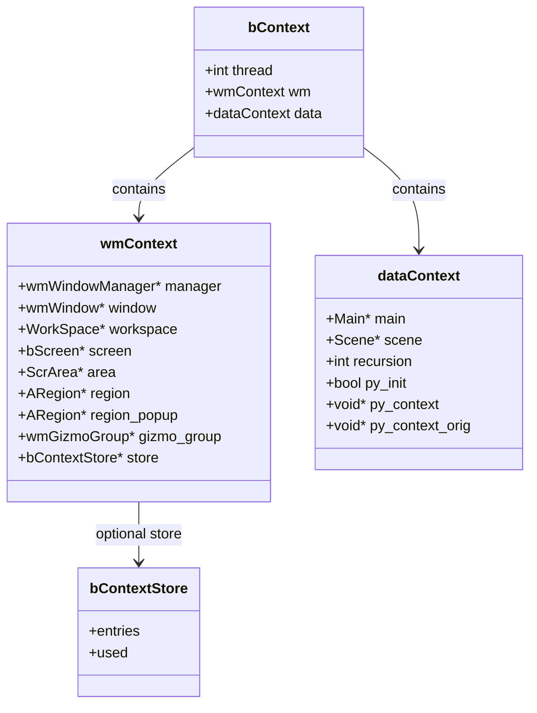
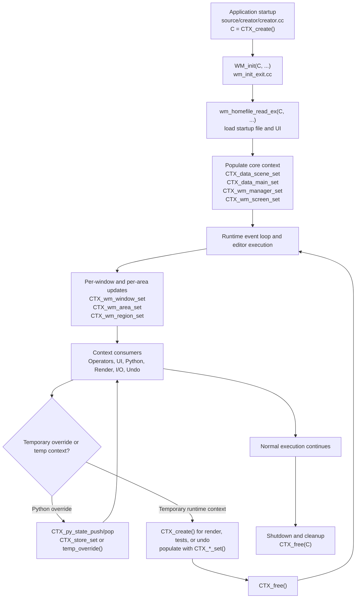

# Blender Context (`bContext`) – Source Code Review<!-- omit from toc -->

> - Explains what Blender's runtime **`bContext`** is and where it is defined.
> - Shows where it is first created and how it is populated during startup.
> - Lists the main `CTX_*` functions used to update it.
> - Highlights the key source files and common subsystems that depend on it.

## Table of Contents<!-- omit from toc -->

- [1) What Blender Context is](#1-what-blender-context-is)
  - [Main definition files](#main-definition-files)
  - [Verified source excerpts](#verified-source-excerpts)
  - [What it stores](#what-it-stores)
  - [bContext class/struct diagram](#bcontext-classstruct-diagram)
  - [How lookup works](#how-lookup-works)
- [2) Where Blender Context is first created](#2-where-blender-context-is-first-created)
- [2.1 Actual creation function](#21-actual-creation-function)
  - [Creation helper functions](#creation-helper-functions)
- [2.2 First global creation during Blender startup](#22-first-global-creation-during-blender-startup)
- [2.3 Where the global context gets initially populated](#23-where-the-global-context-gets-initially-populated)
  - [Startup initialization](#startup-initialization)
  - [Main / Scene / Window Manager assignment](#main--scene--window-manager-assignment)
  - [Window-manager fix-up after file read](#window-manager-fix-up-after-file-read)
  - [Conclusion for first global creation](#conclusion-for-first-global-creation)
- [2.4 `bContext` lifecycle flowchart](#24-bcontext-lifecycle-flowchart)
  - [Reading the lifecycle](#reading-the-lifecycle)
  - [Simple workflow](#simple-workflow)
- [3) Functions used to update Blender Context](#3-functions-used-to-update-blender-context)
  - [Core update functions](#core-update-functions)
  - [Verified setter excerpts](#verified-setter-excerpts)
  - [Common places where these update functions are called](#common-places-where-these-update-functions-are-called)
- [4) Use cases that require Blender Context (`bContext *C`)](#4-use-cases-that-require-blender-context-bcontext-c)
- [4.1 Operators and tools](#41-operators-and-tools)
  - [Representative operator files](#representative-operator-files)
- [4.2 Window-manager, event dispatch, and UI refresh](#42-window-manager-event-dispatch-and-ui-refresh)
  - [Representative UI / WM files](#representative-ui--wm-files)
- [4.3 Python API (`bpy.context`) and temporary overrides](#43-python-api-bpycontext-and-temporary-overrides)
  - [Representative Python context files](#representative-python-context-files)
- [4.4 Rendering and viewport engines](#44-rendering-and-viewport-engines)
  - [Representative rendering files](#representative-rendering-files)
- [4.5 Import / export](#45-import--export)
  - [Representative I/O files](#representative-io-files)
- [4.6 Undo / redo system](#46-undo--redo-system)
  - [Representative undo files](#representative-undo-files)
- [4.7 CLI commands and startup arguments](#47-cli-commands-and-startup-arguments)
  - [Representative CLI files](#representative-cli-files)
- [4.8 Tests and temporary contexts](#48-tests-and-temporary-contexts)
  - [Representative test files](#representative-test-files)
- [5) Short Answers](#5-short-answers)
- [6) Source-level conclusion](#6-source-level-conclusion)

---

## 1) What Blender Context is

In Blender source code, **Blender Context** is the runtime object **`bContext`**. It carries the current UI state and current data state that operators, Python, rendering, import/export, undo, and the window manager need.

### Main definition files

| Purpose                                       | File                                          |
| --------------------------------------------- | --------------------------------------------- |
| Public API / declarations                     | `source/blender/blenkernel/BKE_context.hh`    |
| Private implementation / actual struct layout | `source/blender/blenkernel/intern/context.cc` |

### Verified source excerpts

**File:** `source/blender/blenkernel/BKE_context.hh`

```cpp
struct bContext;

bContext *CTX_create();
void CTX_free(bContext *C);

wmWindowManager *CTX_wm_manager(const bContext *C);
wmWindow *CTX_wm_window(const bContext *C);
```

**File:** `source/blender/blenkernel/intern/context.cc`

```cpp
struct bContext {
  int thread;

  struct {
    wmWindowManager *manager;
    wmWindow *window;
    WorkSpace *workspace;
    bScreen *screen;
    ScrArea *area;
    ARegion *region;
  } wm;

  struct {
    Main *main;
    Scene *scene;
    bool py_init;
    void *py_context;
  } data;
};
```

> **5.1.1 update:** The struct excerpt above is a simplified/historical version. In 5.1.1 the actual struct has additional fields in both sub-structs:
>
> ```cpp
> struct bContext {
>   int thread;
>
>   /* windowmanager context */
>   struct {
>     wmWindowManager *manager;
>     wmWindow *window;
>     WorkSpace *workspace;
>     bScreen *screen;
>     ScrArea *area;
>     ARegion *region;
>     ARegion *region_popup;
>     wmGizmoGroup *gizmo_group;
>     const bContextStore *store;
>     /* Operator poll message (static string, not allocated). */
>     const char *operator_poll_msg;
>     bContextPollMsgDyn_Params operator_poll_msg_dyn_params;
>   } wm;
>
>   /* data context */
>   struct {
>     Main *main;
>     Scene *scene;
>     int recursion;
>     bool py_init;
>     void *py_context;
>     void *py_context_orig;
>     CTX_LogFlag log_flag;
>     const bool *rna_disallow_writes;
>   } data;
> };
> ```
>
> New `wm` additions: `region_popup`, `gizmo_group`, `store` (all previously present but missing from the excerpt), plus `operator_poll_msg` and `operator_poll_msg_dyn_params` for per-context poll-failure messages.
> New `data` additions: `recursion` (anti-infinite-loop depth counter), `py_context_orig` (original Python context before override), `log_flag` (`CTX_LogFlag` enum for controlling access logging and `HideMissing` suppression), `rna_disallow_writes` (optional flag pointer to disallow RNA writes).

### What it stores

From the code above and the surrounding implementation, `bContext` stores:

- **Window-manager context**: `manager`, `window`, `workspace`, `screen`, `area`, `region`, popup region, gizmo group, context store.
- **Data context**: `Main *main`, `Scene *scene`, recursion state, Python context state, logging flags.

### bContext class/struct diagram

This diagram summarizes the main structure of `bContext` and its two major internal groups: window-manager state and data state.



### How lookup works

The key resolver is `ctx_data_get()` in `source/blender/blenkernel/intern/context.cc`.

**File:** `source/blender/blenkernel/intern/context.cc`

```cpp
#ifdef WITH_PYTHON
  if (CTX_py_dict_get(C)) {
    if (BPY_context_member_get(C, member, result)) {
      return CTX_RESULT_OK;
    }
  }
#endif
  if (done != 1 && recursion < 1 && C->wm.store) {
    C->data.recursion = 1;
    if (const PointerRNA *ptr = CTX_store_ptr_lookup(C->wm.store, member, nullptr)) { ... }
    else if (std::optional<StringRefNull> str = CTX_store_string_lookup(C->wm.store, member)) { ... }
    else if (std::optional<int64_t> int_value = CTX_store_int_lookup(C->wm.store, member)) { ... }
  }
  if (done != 1 && recursion < 2 && (region = CTX_wm_region(C))) { ... }
  if (done != 1 && recursion < 3 && (area = CTX_wm_area(C))) { ... }
  if (done != 1 && recursion < 4 && (screen = CTX_wm_screen(C))) { ... }
```

> **5.1.1 update:** The store check now uses typed lookup helpers (`CTX_store_ptr_lookup`, `CTX_store_string_lookup`, `CTX_store_int_lookup`) to resolve `PointerRNA`, `StringRef`, or `int64_t` values stored in the context. The resolution order is unchanged. Non-main-thread calls return `CTX_RESULT_MEMBER_NOT_FOUND` immediately (guard added after the Python block).

This shows that Blender resolves context values in this order:

1. Python override (`bpy.context.temp_override(...)`)
2. Stored context overrides (`C->wm.store`)
3. Region callback
4. Area callback
5. Screen callback

---

## 2) Where Blender Context is first created

## 2.1 Actual creation function

The allocator for the context object is `CTX_create()`.

**File:** `source/blender/blenkernel/intern/context.cc`

```cpp
bContext *CTX_create()
{
  bContext *C = MEM_new_zeroed<bContext>(__func__);
  return C;
}
```

### Creation helper functions

| Function       | File                                          | Role                          |
| -------------- | --------------------------------------------- | ----------------------------- |
| `CTX_create()` | `source/blender/blenkernel/intern/context.cc` | Allocate a zeroed `bContext`  |
| `CTX_copy()`   | `source/blender/blenkernel/intern/context.cc` | Duplicate an existing context |
| `CTX_free()`   | `source/blender/blenkernel/intern/context.cc` | Free a context                |

## 2.2 First global creation during Blender startup

The first global runtime context is created in `main()` startup flow.

**File:** `source/creator/creator.cc`

```cpp
C = CTX_create();

app_init_data_early_exit.C = C;
```

So the **first global `bContext` instance** is created in:

- **File:** `source/creator/creator.cc`
- **Function:** Blender application startup (`main` initialization flow)
- **Creation call used:** `CTX_create()`

## 2.3 Where the global context gets initially populated

Creating the object is only the first step. The global context is then populated during window-manager and blend-file startup.

### Startup initialization

**File:** `source/blender/windowmanager/intern/wm_init_exit.cc`

```cpp
void WM_init(bContext *C, int argc, const char **argv)
{
  ...
  wm_homefile_read_ex(C, &read_homefile_params, nullptr, &params_file_read_post);
  ...
  CTX_py_init_set(C, true);
}
```

### Main / Scene / Window Manager assignment

**File:** `source/blender/blenkernel/intern/blendfile.cc`

```cpp
CTX_data_scene_set(C, curscene);
...
CTX_data_main_set(C, bmain);
...
CTX_wm_manager_set(C, static_cast<wmWindowManager *>(bmain->wm.first));
CTX_wm_screen_set(C, bfd->curscreen);
CTX_wm_area_set(C, nullptr);
CTX_wm_region_set(C, nullptr);
```

### Window-manager fix-up after file read

**File:** `source/blender/windowmanager/intern/wm.cc`

```cpp
if (wm == nullptr) {
  wm = static_cast<wmWindowManager *>(bmain->wm.first);
  CTX_wm_manager_set(C, wm);
}
```

### Conclusion for first global creation

The verified creation chain is:

1. `source/creator/creator.cc` → `C = CTX_create();`
2. `source/blender/windowmanager/intern/wm_init_exit.cc` → `WM_init(C, ...)`
3. `source/blender/windowmanager/intern/wm_init_exit.cc` → `wm_homefile_read_ex(C, ...)`
4. `source/blender/blenkernel/intern/blendfile.cc` → `CTX_data_scene_set`, `CTX_data_main_set`, `CTX_wm_manager_set`, `CTX_wm_screen_set`

## 2.4 `bContext` lifecycle flowchart

The following flowchart summarizes the lifecycle of Blender's main runtime context and the common temporary-context pattern used by rendering, tests, and undo code.



### Reading the lifecycle

- **Create once globally** at startup with `CTX_create()`.
- **Populate core state** when Blender loads the home/startup file and window-manager data.
- **Continuously update** the active window / screen / area / region during the event loop.
- **Consume the context** in operators, Python, rendering, import/export, undo, and UI code.
- **Create short-lived temporary contexts** when a subsystem needs an isolated execution context.

### Simple workflow

1. **Blender starts** in `source/creator/creator.cc` and allocates the main context with `CTX_create()`.
2. **Window-manager startup runs** through `WM_init(C, ...)` in `source/blender/windowmanager/intern/wm_init_exit.cc`.
3. **Startup/home file is read** by `wm_homefile_read_ex(C, ...)`, which prepares the initial UI and data state.
4. **Core context fields are populated** in `source/blender/blenkernel/intern/blendfile.cc` using:
   - `CTX_data_scene_set(C, curscene)`
   - `CTX_data_main_set(C, bmain)`
   - `CTX_wm_manager_set(C, ...)`
   - `CTX_wm_screen_set(C, ...)`
5. **Runtime event processing updates the active UI context** with functions like:
   - `CTX_wm_window_set(C, ...)`
   - `CTX_wm_area_set(C, ...)`
   - `CTX_wm_region_set(C, ...)`
6. **Subsystems consume the context** to know the current state, including:
   - operators
   - Python `bpy.context`
   - render engines
   - import/export code
   - undo/redo
7. **Temporary overrides or temporary contexts may be created** for isolated work, then restored or freed.
8. **On shutdown or end of temporary usage**, Blender releases the context with `CTX_free(C)`.

---

## 3) Functions used to update Blender Context

The main update/setter functions are implemented in:

- **File:** `source/blender/blenkernel/intern/context.cc`

### Core update functions

| Function                                     | File                                          | What it updates                                     |
| -------------------------------------------- | --------------------------------------------- | --------------------------------------------------- |
| `CTX_store_set()`                            | `source/blender/blenkernel/intern/context.cc` | Set temporary stored overrides                      |
| `CTX_wm_manager_set()`                       | `source/blender/blenkernel/intern/context.cc` | Set `wmWindowManager` and clear nested UI state     |
| `CTX_wm_window_set()`                        | `source/blender/blenkernel/intern/context.cc` | Set active window and sync `scene/workspace/screen` |
| `CTX_wm_screen_set()`                        | `source/blender/blenkernel/intern/context.cc` | Set active screen                                   |
| `CTX_wm_area_set()`                          | `source/blender/blenkernel/intern/context.cc` | Set active area                                     |
| `CTX_wm_region_set()`                        | `source/blender/blenkernel/intern/context.cc` | Set active region                                   |
| `CTX_wm_region_popup_set()`                  | `source/blender/blenkernel/intern/context.cc` | Set popup region                                    |
| `CTX_wm_gizmo_group_set()`                   | `source/blender/blenkernel/intern/context.cc` | Set active gizmo group                              |
| `CTX_data_main_set()`                        | `source/blender/blenkernel/intern/context.cc` | Set `Main *`                                        |
| `CTX_data_scene_set()`                       | `source/blender/blenkernel/intern/context.cc` | Set `Scene *`                                       |
| `CTX_py_init_set()`                          | `source/blender/blenkernel/intern/context.cc` | Mark Python as initialized                          |
| `CTX_py_state_push()` / `CTX_py_state_pop()` | `source/blender/blenkernel/intern/context.cc` | Push/pop Python context override state              |

### Verified setter excerpts

**File:** `source/blender/blenkernel/intern/context.cc`

```cpp
void CTX_wm_manager_set(bContext *C, wmWindowManager *wm)
{
  C->wm.manager = wm;
  C->wm.window = nullptr;
  C->wm.screen = nullptr;
  C->wm.area = nullptr;
  C->wm.region = nullptr;
}
```

**File:** `source/blender/blenkernel/intern/context.cc`

```cpp
void CTX_wm_window_set(bContext *C, wmWindow *win)
{
  C->wm.window = win;
  if (win) {
    C->data.scene = win->scene;
  }
  C->wm.workspace = (win) ? BKE_workspace_active_get(win->workspace_hook) : nullptr;
  C->wm.screen = (win) ? BKE_workspace_active_screen_get(win->workspace_hook) : nullptr;
  C->wm.area = nullptr;
  C->wm.region = nullptr;
}
```

**File:** `source/blender/blenkernel/intern/context.cc`

```cpp
void CTX_data_main_set(bContext *C, Main *bmain)
{
  C->data.main = bmain;
  BKE_sound_refresh_callback_bmain(bmain);
}

void CTX_data_scene_set(bContext *C, Scene *scene)
{
  C->data.scene = scene;
}
```

### Common places where these update functions are called

| File                                                     | Example usage                                               |
| -------------------------------------------------------- | ----------------------------------------------------------- |
| `source/blender/windowmanager/intern/wm_event_system.cc` | `CTX_wm_window_set(C, &win);`, `CTX_wm_area_set(C, &area);` |
| `source/blender/windowmanager/intern/wm_window.cc`       | Switch window context during window operations              |
| `source/blender/windowmanager/intern/wm_files.cc`        | Set/clear current window during file read/write             |
| `source/blender/blenkernel/intern/blendfile.cc`          | Set `scene`, `main`, `window manager` after reading data    |
| `source/blender/python/intern/bpy_rna_context.cc`        | Override / restore `window`, `screen`, `area`, `region`     |
| `source/blender/editors/render/render_update.cc`         | Build temporary render context with `CTX_*_set()`           |

---

## 4) Use cases that require Blender Context (`bContext *C`)

There are many concrete call sites in Blender, but they fall into clear source-level categories.

## 4.1 Operators and tools

This is the most important use case. Blender operator callbacks are defined to receive `bContext *C`.

**File:** `source/blender/windowmanager/WM_types.hh`

```cpp
wmOperatorStatus (*exec)(bContext *C, wmOperator *op);
bool (*check)(bContext *C, wmOperator *op);
wmOperatorStatus (*invoke)(bContext *C, wmOperator *op, const wmEvent *event);
void (*cancel)(bContext *C, wmOperator *op);
wmOperatorStatus (*modal)(bContext *C, wmOperator *op, const wmEvent *event);
bool (*poll)(bContext *C);
void (*ui)(bContext *C, wmOperator *op);
```

### Representative operator files

- `source/blender/editors/animation/anim_ops.cc`
  - `change_frame_poll(bContext *C)`
  - `change_frame_exec(bContext *C, wmOperator *op)`
- `source/blender/editors/screen/workspace_edit.cc`
  - `workspace_context_poll(bContext *C)`
  - `workspace_append_activate_exec(bContext *C, wmOperator *op)`
- `source/blender/editors/curve/editfont.cc`
  - `font_open_exec(bContext *C, wmOperator *op)`
  - `insert_text_exec(bContext *C, wmOperator *op)`

✅ **Meaning:** if code needs to know the active scene, object, editor, or region when an operator runs, it must receive `bContext *C`.

## 4.2 Window-manager, event dispatch, and UI refresh

The window manager updates the context continuously while processing events and refreshing editors.

**File:** `source/blender/windowmanager/intern/wm_event_system.cc`

```cpp
for (wmWindow &win : wm->windows) {
  CTX_wm_window_set(C, &win);
  for (ScrArea &area : screen->areabase) {
    if (area.do_refresh) {
      CTX_wm_area_set(C, &area);
      ED_area_do_refresh(C, &area);
    }
  }
}
```

### Representative UI / WM files

- `source/blender/windowmanager/intern/wm_event_system.cc`
- `source/blender/windowmanager/intern/wm_window.cc`
- `source/blender/windowmanager/intern/wm_toolsystem.cc`
- `source/blender/windowmanager/intern/wm_tooltip.cc`
- `source/blender/windowmanager/gizmo/intern/wm_gizmo_map.cc`

✅ **Meaning:** UI code needs `bContext` to know the current window, area, region, workspace, view layer, and scene.

## 4.3 Python API (`bpy.context`) and temporary overrides

Blender exposes `bContext` to Python through `bpy.context`, including temporary overrides.

**File:** `source/blender/python/intern/bpy_rna_context.cc`

```cpp
self->ctx_init.win = CTX_wm_window(C);
self->ctx_init.screen = self->ctx_init.win ? WM_window_get_active_screen(self->ctx_init.win) :
                                             CTX_wm_screen(C);
self->ctx_init.area = CTX_wm_area(C);
self->ctx_init.region = CTX_wm_region(C);
```

**File:** `source/blender/python/intern/bpy_rna_context.cc`

```cpp
if (self->ctx_temp.win_is_set) {
  CTX_wm_window_set(C, self->ctx_temp.win);
}
if (self->ctx_temp.area_is_set) {
  CTX_wm_area_set(C, self->ctx_temp.area);
}
if (self->ctx_temp.region_is_set) {
  CTX_wm_region_set(C, self->ctx_temp.region);
}
```

### Representative Python context files

- `source/blender/python/intern/bpy_rna_context.cc`
- `source/blender/python/intern/bpy_capi_utils.hh`
- `source/blender/python/intern/bpy.cc`

✅ **Meaning:** Python scripts, add-ons, and `bpy.context.temp_override(...)` all depend on `bContext`.

## 4.4 Rendering and viewport engines

Render engines and viewport engines receive `const bContext *context` in their callbacks.

**File:** `source/blender/render/RE_engine.h`

```cpp
void (*draw)(struct RenderEngine *engine,
             const struct bContext *context,
             struct Depsgraph *depsgraph);

void (*view_update)(struct RenderEngine *engine,
                    const struct bContext *context,
                    struct Depsgraph *depsgraph);
```

**File:** `source/blender/editors/render/render_update.cc`

```cpp
bContext *C = CTX_create();
CTX_data_main_set(C, bmain);
CTX_data_scene_set(C, scene);
CTX_wm_manager_set(C, static_cast<wmWindowManager *>(bmain->wm.first));
CTX_wm_window_set(C, window);
...
engine->type->view_update(engine, C, CTX_data_depsgraph_pointer(C));
```

### Representative rendering files

- `source/blender/render/RE_engine.h`
- `source/blender/editors/render/render_update.cc`
- `source/blender/render/hydra/viewport_engine.cc`

✅ **Meaning:** render callbacks need context to know which scene, window, and viewport state they should render from.

## 4.5 Import / export

Importers and exporters commonly require `bContext *C` so they can access the active `Scene`, `Main`, `ViewLayer`, and evaluated dependency graph.

**File:** `source/blender/io/wavefront_obj/IO_wavefront_obj.hh`

```cpp
void OBJ_import(bContext *C, const OBJImportParams *import_params);
void OBJ_export(bContext *C, const OBJExportParams *export_params);
```

**File:** `source/blender/io/wavefront_obj/exporter/obj_exporter.cc`

```cpp
Scene *scene = CTX_data_scene(C);
Main *bmain = CTX_data_main(C);
ViewLayer *view_layer = CTX_data_view_layer(C);
```

### Representative I/O files

- `source/blender/io/wavefront_obj/IO_wavefront_obj.hh`
- `source/blender/io/wavefront_obj/IO_wavefront_obj.cc`
- `source/blender/io/fbx/IO_fbx.cc` → `FBX_import(bContext *C, ...)`
- `source/blender/io/alembic/intern/alembic_capi.cc` → `ABC_import(bContext *C, ...)`

✅ **Meaning:** file I/O code needs `bContext` to know what data to import into or export from.

## 4.6 Undo / redo system

Undo APIs also receive `bContext *C`.

**File:** `source/blender/blenkernel/BKE_undo_system.hh`

```cpp
bool (*poll)(bContext *C);
void (*step_encode_init)(bContext *C, UndoStep *us);
bool (*step_encode)(bContext *C, Main *bmain, UndoStep *us);
void (*step_decode)(bContext *C, Main *bmain, UndoStep *us, eUndoStepDir dir, bool is_final);
```

**File:** `source/blender/blenkernel/intern/undo_system.cc`

```cpp
bContext *C_temp = CTX_create();
CTX_data_main_set(C_temp, bmain);
eUndoPushReturn ret = BKE_undosys_step_push_with_type(
    ustack, C_temp, name, BKE_UNDOSYS_TYPE_MEMFILE);
CTX_free(C_temp);
```

### Representative undo files

- `source/blender/blenkernel/BKE_undo_system.hh`
- `source/blender/blenkernel/intern/undo_system.cc`
- `source/blender/editors/curve/editfont_undo.cc` → `font_undosys_poll(bContext *C)`

✅ **Meaning:** undo code uses context to know the current editing mode and data to save/restore.

## 4.7 CLI commands and startup arguments

Blender CLI commands also use `bContext *C`.

**File:** `source/blender/blenkernel/BKE_blender_cli_command.hh`

```cpp
virtual int exec(struct bContext *C, int argc, const char **argv) = 0;
```

### Representative CLI files

- `source/blender/blenkernel/BKE_blender_cli_command.hh`
- `source/creator/creator_args.cc` (uses `CTX_data_scene(C)`, `CTX_wm_manager(C)`, `CTX_wm_window_set(C)`, `CTX_data_scene_set(C)`)

✅ **Meaning:** background mode and command-line execution still need a valid context object.

## 4.8 Tests and temporary contexts

Temporary test contexts are also created explicitly.

### Representative test files

- `source/blender/io/usd/tests/usd_export_test.cc`
  - `context = CTX_create();`
  - `CTX_data_main_set(context, bfile->main);`
  - `CTX_data_scene_set(context, bfile->curscene);`
- `source/blender/nodes/intern/node_iterator_tests.cc`
  - `C = CTX_create();`
- `source/blender/blenkernel/intern/lib_query_test.cc`
  - `this->C = CTX_create();`

✅ **Meaning:** unit/integration tests build minimal runtime contexts with the same API as the application.

---

## 5) Short Answers

**What is Blender Context?**

- It is Blender's runtime **`bContext`** object.
- It stores current UI state (`window`, `screen`, `area`, `region`, `workspace`) and current data state (`Main`, `Scene`, Python context).
- Main files: `source/blender/blenkernel/BKE_context.hh` and `source/blender/blenkernel/intern/context.cc`.

**Where is it first created?**

- **Creation function:** `CTX_create()` in `source/blender/blenkernel/intern/context.cc`
- **First global call:** `C = CTX_create();` in `source/creator/creator.cc`
- **Initial global population:** via `WM_init()` / `wm_homefile_read_ex()` and then `CTX_data_scene_set`, `CTX_data_main_set`, `CTX_wm_manager_set` in `source/blender/blenkernel/intern/blendfile.cc`

**Which functions update it?**

- `CTX_wm_manager_set`
- `CTX_wm_window_set`
- `CTX_wm_screen_set`
- `CTX_wm_area_set`
- `CTX_wm_region_set`
- `CTX_wm_region_popup_set`
- `CTX_wm_gizmo_group_set`
- `CTX_store_set`
- `CTX_data_main_set`
- `CTX_data_scene_set`
- `CTX_py_init_set`
- `CTX_py_state_push` / `CTX_py_state_pop`

**Where is `bContext` required?**

- Operator execution and polling
- Window-manager event dispatch and UI refresh
- Python `bpy.context` and temporary overrides
- Render / viewport callbacks
- Import/export pipelines
- Undo/redo
- CLI/background commands
- Automated tests and temporary runtime contexts

---

## 6) Source-level conclusion

Most important source files to open next

1. `source/blender/blenkernel/BKE_context.hh`
2. `source/blender/blenkernel/intern/context.cc`
3. `source/creator/creator.cc`
4. `source/blender/windowmanager/intern/wm_init_exit.cc`
5. `source/blender/blenkernel/intern/blendfile.cc`
6. `source/blender/windowmanager/WM_types.hh`
7. `source/blender/windowmanager/intern/wm_event_system.cc`
8. `source/blender/python/intern/bpy_rna_context.cc`
