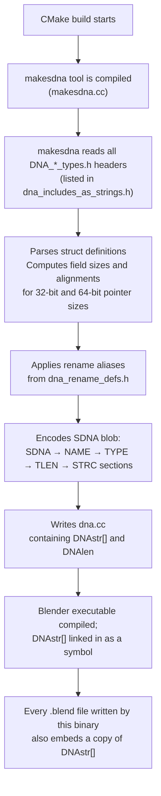
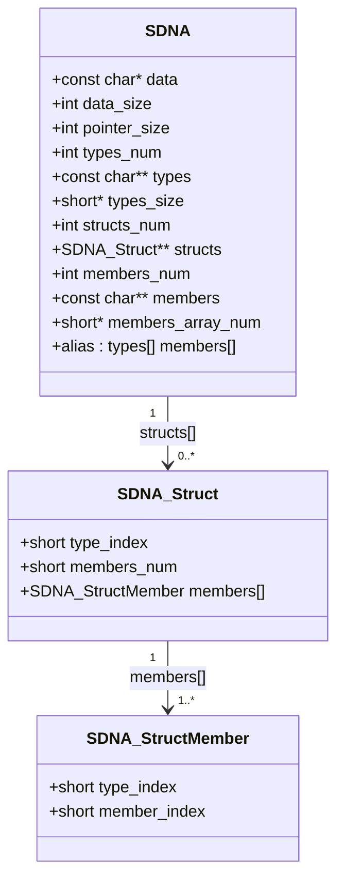
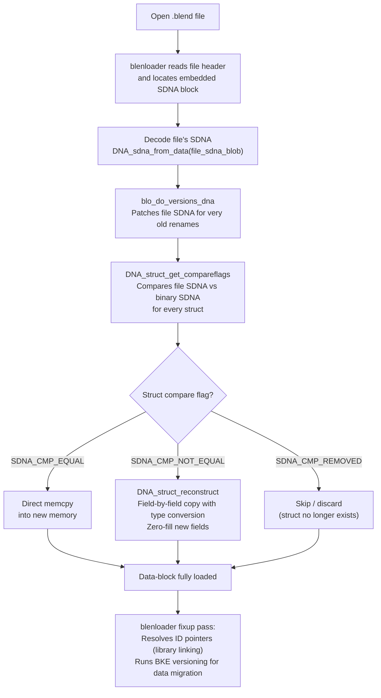
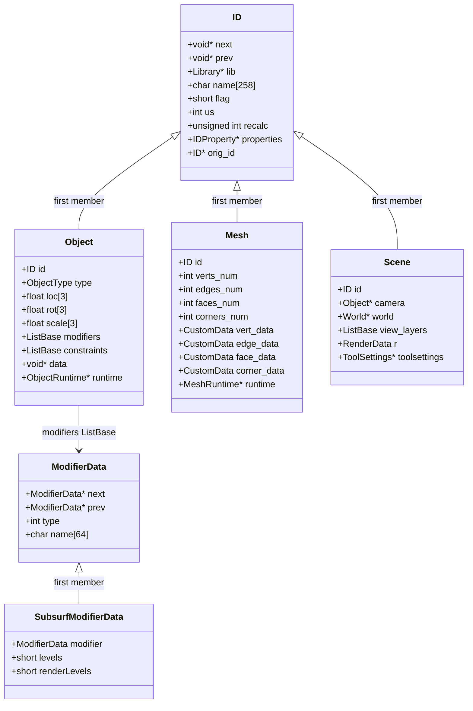

# Blender DNA – Data Definition Layer<!-- omit from toc -->

> - Explains Blender's DNA (Data Definition Layer): the system that defines every struct written to a `.blend` file.
> - Shows how `makesdna` scans the `DNA_*_types.h` headers at build time and produces the `SDNA` binary that is embedded in every executable and every `.blend` file.
> - Traces how the runtime `SDNA` struct enables forward- and backward-compatible file loading by comparing the file's embedded SDNA to the running binary's SDNA.
> - Highlights the key design constraints (alignment, no defines for array lengths, no function pointers) that make DNA portable across platforms and versions.
> - Points to the key source files and explains what to look for in each one.

## Table of Contents<!-- omit from toc -->

- [1) Source-file map](#1-source-file-map)
- [2) What is DNA?](#2-what-is-dna)
- [3) Build-time: `makesdna` generates the SDNA blob](#3-build-time-makesdna-generates-the-sdna-blob)
  - [3.1 The `makesdna` tool](#31-the-makesdna-tool)
  - [3.2 The `SDNA` binary format](#32-the-sdna-binary-format)
  - [3.3 How structs are included](#33-how-structs-are-included)
  - [3.4 How `SRC_DNA_INC` is resolved at build time](#34-how-src_dna_inc-is-resolved-at-build-time)
- [4) Runtime: the `SDNA` struct](#4-runtime-the-sdna-struct)
  - [4.1 `SDNA_Struct` and `SDNA_StructMember`](#41-sdna_struct-and-sdna_structmember)
  - [4.2 Startup initialization – `DNA_sdna_current_init()`](#42-startup-initialization--dna_sdna_current_init)
- [5) The `ID` struct – the common header of all data-blocks](#5-the-id-struct--the-common-header-of-all-data-blocks)
  - [5.1 Full `ID` definition](#51-full-id-definition)
  - [5.2 Data-block naming convention](#52-data-block-naming-convention)
- [6) Design constraints for DNA structs](#6-design-constraints-for-dna-structs)
  - [6.1 Alignment rules](#61-alignment-rules)
  - [6.2 Prohibited and restricted constructs](#62-prohibited-and-restricted-constructs)
  - [6.3 Deprecation and private fields](#63-deprecation-and-private-fields)
- [7) Versioning: forward- and backward-compatible file loading](#7-versioning-forward--and-backward-compatible-file-loading)
  - [7.1 `eSDNA_StructCompare` – what can change](#71-esdna_structcompare--what-can-change)
  - [7.2 `DNA_struct_get_compareflags()`](#72-dna_struct_get_compareflags)
  - [7.3 `DNA_struct_reconstruct()`](#73-dna_struct_reconstruct)
  - [7.4 `dna_rename_defs.h` – alias-based rename tracking](#74-dna_rename_defsh--alias-based-rename-tracking)
  - [7.5 `versioning_dna.cc` – on-load DNA patching](#75-versioning_dnacc--on-load-dna-patching)
- [8) Key `DNA_*_types.h` headers and what to look for](#8-key-dna__typesh-headers-and-what-to-look-for)
- [9) `CustomData` – per-element attribute storage](#9-customdata--per-element-attribute-storage)
- [10) Diagrams](#10-diagrams)
  - [10.1 DNA build-time pipeline (flowchart)](#101-dna-build-time-pipeline-flowchart)
  - [10.2 SDNA binary layout (class diagram)](#102-sdna-binary-layout-class-diagram)
  - [10.3 `.blend` file load path with SDNA versioning (flowchart)](#103-blend-file-load-path-with-sdna-versioning-flowchart)
  - [10.4 DNA struct inheritance pattern (class diagram)](#104-dna-struct-inheritance-pattern-class-diagram)
- [11) Short answers](#11-short-answers)
- [12) Source-level conclusion](#12-source-level-conclusion)

---

## 1) Source-file map

| File                                                 | Important symbols                                                                                            | Role                                                                      |
| ---------------------------------------------------- | ------------------------------------------------------------------------------------------------------------ | ------------------------------------------------------------------------- |
| `source/blender/makesdna/DNA_documentation.h`        | *(documentation only)*                                                                                       | Canonical explanation of the DNA module and its known issues              |
| `source/blender/makesdna/DNA_defs.h`                 | `DNA_DEPRECATED`, `DNA_DEFINE_CXX_METHODS`, `MAX_NAME`                                                       | Shared macros for all DNA headers                                         |
| `source/blender/makesdna/DNA_ID.h`                   | `struct ID`, `IDProperty`, `IDOverrideLibrary`                                                               | The universal data-block header shared by all assets                      |
| `source/blender/makesdna/DNA_ID_enums.h`             | `eIDPropertyType`, `eIDPropertyFlag`                                                                         | Enumerations for `IDProperty` types and flags                             |
| `source/blender/makesdna/DNA_listBase.h`             | `struct Link`, `struct ListBase`, `struct ListBaseT<T>`                                                      | Doubly-linked list primitives used everywhere in DNA                      |
| `source/blender/makesdna/DNA_sdna_types.h`           | `struct SDNA`, `struct SDNA_Struct`, `struct SDNA_StructMember`                                              | The in-memory representation of a parsed SDNA blob                        |
| `source/blender/makesdna/DNA_genfile.h`              | `eSDNA_Type`, `eSDNA_StructCompare`, `DNA_sdna_from_data`, `DNA_sdna_current_init`, `DNA_struct_reconstruct` | Public API for decoding and comparing SDNA                                |
| `source/blender/makesdna/DNA_sdna_pointers.hh`       | `PointersInDNA`, `StructInfo`, `PointerInfo`                                                                 | Precomputed pointer-offset table for pointer-fixup during file load       |
| `source/blender/makesdna/intern/makesdna.cc`         | `main()` (build tool), struct scanner, SDNA encoder                                                          | The build-time tool that scans `DNA_*_types.h` files and emits `dna.cc`   |
| `source/blender/makesdna/intern/dna_genfile.cc`      | `DNA_sdna_from_data`, `DNA_sdna_current_init`, `DNA_struct_get_compareflags`, `DNA_struct_reconstruct`       | Runtime SDNA decoding, comparison, and struct reconstruction              |
| `source/blender/makesdna/intern/dna_rename_defs.h`   | `DNA_STRUCT_RENAME`, `DNA_STRUCT_RENAME_MEMBER`                                                              | Maps old struct/member names to current names for backward compatibility  |
| `source/blender/makesdna/intern/dna_utils.h`         | `DNA_member_array_num`, `DNA_member_id_strip`, `DNA_member_id_rename`                                        | Low-level helpers for parsing member names and array dimensions           |
| `source/blender/makesdna/DNA_customdata_types.h`     | `eCustomDataType`, `CustomDataLayer`, `CustomData`                                                           | Per-element attribute storage used by Mesh, Curves, etc.                  |
| `source/blender/blenloader/intern/versioning_dna.cc` | `blo_do_versions_dna`                                                                                        | Applies on-load SDNA patches so old struct/member names resolve correctly |

---

## 2) What is DNA?

**DNA** stands for **Data Naming and Addressing**. It is Blender's binary **Data Definition Layer** — more precisely, it is the subsystem responsible for defining, encoding, and versioning every C/C++ struct that Blender writes to a `.blend` file. It is the schema embedded in every .blend file that describes every struct layout (names, types, sizes) so the file loader can reconstruct data correctly even across versions.

The name comes from its acronym expansion: **Struct DNA** (`SDNA`). All the headers live in:

```text
source/blender/makesdna/
```

DNA solves three problems at once:

1. **Serialization schema.** It records the exact memory layout (field names, types, sizes, array dimensions) of every struct that must be written to disk, so the loader knows how to read binary data back into memory.

2. **Version compatibility.** When you open a `.blend` file from an old or new Blender version, DNA compares the *file*'s embedded SDNA with the *running binary*'s SDNA and reconstructs each struct field-by-field, zero-filling added fields and discarding removed ones.

3. **Introspection.** Python (via RNA) and various editor tools query DNA at runtime to discover the fields of structs without hard-coding offsets.

DNA deliberately does **not** know about:

- how data is rendered, evaluated, or simulated (that is BKE/DEG),
- how the UI reads or writes fields (that is RNA/`makesrna`),
- the file format framing (`BHead` blocks, compression) — that is `blenloader`.

DNA is a **purely structural description**: types, names, sizes, and relationships.

---

## 3) Build-time: `makesdna` generates the SDNA blob

### 3.1 The `makesdna` tool

`makesdna` is a small **standalone C++ program** that runs during the CMake build. Its source is:

**File:** `source/blender/makesdna/intern/makesdna.cc`

```cpp
/**
 * `makesdna` creates a `.c` file with a long string of numbers that
 * encode the Blender file format. It is fast, because it is basically
 * a binary dump. There are some details to mind when reconstructing
 * the file (endianness and byte-alignment).
 *
 * This little program scans all structs that need to be serialized,
 * and determines the names and types of all members. It calculates
 * how much memory (on disk or in RAM) is needed to store that struct,
 * and the offsets for reaching a particular one.
 */
```

At build time `makesdna`:

1. Reads every header listed in `dna_includes_as_strings.h` (auto-generated from the `SRC_DNA_INC` CMake variable in `source/blender/CMakeLists.txt`).
2. Parses all struct definitions found in those headers.
3. Computes field offsets and sizes for both 32-bit and 64-bit pointer sizes.
4. Encodes the result as a compact binary blob.
5. Writes the blob into `dna.cc` as a `const unsigned char DNAstr[]` array (with its length in `DNAlen`).

That `dna.cc` file is compiled into the Blender executable. Every running Blender therefore carries a **complete description of its own file format** inside itself.

### 3.2 The `SDNA` binary format

The binary layout written by `makesdna` and decoded by `dna_genfile.cc` follows a strict four-section structure:

**File:** `source/blender/makesdna/intern/dna_genfile.cc`

```text
SDNA (4 bytes) – magic number
NAME (4 bytes)
<nr>           – number of member names (int)
<string>       – member name 0 (e.g. "*next")
<string>       – member name 1
...
TYPE (4 bytes)
<nr>           – number of type names (int)
<string>       – type name 0 (e.g. "int")
<string>       – type name 1 (e.g. "Object")
...
TLEN (4 bytes)
<len>          – size of type 0 in bytes (short)
<len>          – size of type 1 in bytes
...
STRC (4 bytes)
<nr>           – number of struct definitions (int)
<type_nr> <member_count>  <type_nr> <name_nr> ...
```

All integers and shorts are read/written **aligned** (little-endian on disk, endianness was handled pre-5.0).

### 3.3 How structs are included

A struct is included in DNA simply by having its header file listed in the `SRC_DNA_INC` variable. There is a special convention to **exclude** a struct from DNA even though it lives in a DNA header — prefix it with two `#` lines:

```c
#
#
struct MyRuntimeOnlyStruct {
    int value;
};
```

Double-`#` structs are parsed by `makesdna` but silently dropped from the output. They are typically runtime-only data that must be declared in the same header for C++ reasons but must never appear on disk.

### 3.4 How `SRC_DNA_INC` is resolved at build time

`SRC_DNA_INC` is **not** a discovered glob — it is an explicit, hand-maintained CMake list variable.

**Defined in:** `source/blender/CMakeLists.txt` (lines 5–103)

```cmake
set(SRC_DNA_INC
  ${CMAKE_CURRENT_SOURCE_DIR}/makesdna/DNA_ID.h
  ${CMAKE_CURRENT_SOURCE_DIR}/makesdna/DNA_ID_enums.h
  ${CMAKE_CURRENT_SOURCE_DIR}/makesdna/DNA_action_types.h
  # ... ~100 more absolute paths ...
  ${CMAKE_CURRENT_SOURCE_DIR}/makesdna/DNA_xr_types.h
)
```

Each entry is an **absolute path** constructed from `${CMAKE_CURRENT_SOURCE_DIR}` (which is `source/blender/` at that point). The list covers every `DNA_*_types.h`, `DNA_*_enums.h`, and shared utility header (`DNA_defs.h`, `DNA_listBase.h`, `DNA_genfile.h`, etc.) that must be visible to `makesdna`.

Because it is defined in the parent `CMakeLists.txt` before `add_subdirectory(makesdna)` is called, CMake makes it available to the `makesdna/intern/CMakeLists.txt` child scope via normal CMake variable inheritance.

**Consumed in:** `source/blender/makesdna/intern/CMakeLists.txt` (lines 35–40)

```cmake
foreach(header ${SRC_DNA_INC})
  get_filename_component(dna_header_file ${header} NAME)       # strip to basename
  string(APPEND DNA_INCLUDE_TEXT "#include \"${header}\"\n")  # for dna_includes_all.h
  string(APPEND DNA_FILE_LIST    "\t\"${dna_header_file}\",\n") # for dna_includes_as_strings.h
endforeach()

file(GENERATE OUTPUT ${dna_header_include_file} CONTENT "${DNA_INCLUDE_TEXT}")
file(GENERATE OUTPUT ${dna_header_string_file}  CONTENT "${DNA_FILE_LIST}")
```

This `foreach` loop produces two **build-time generated** files in `${CMAKE_CURRENT_BINARY_DIR}` (i.e. inside the CMake build tree under `.../makesdna/intern/`):

| Generated file              | Content                                           | Consumer                                                                                 |
| --------------------------- | ------------------------------------------------- | ---------------------------------------------------------------------------------------- |
| `dna_includes_all.h`        | One `#include "<absolute-path>"` per DNA header   | Compiled into `makesdna` executable so all DNA types are in scope                        |
| `dna_includes_as_strings.h` | One `"<basename>",` string literal per DNA header | `#include`d by `makesdna.cc` so the tool knows which filenames to report inside the SDNA |

Adding a new DNA header therefore requires **two steps**: (1) add it to `SRC_DNA_INC` in `source/blender/CMakeLists.txt`, (2) re-run CMake — the generated files and `makesdna` will pick it up automatically on the next build.

---

## 4) Runtime: the `SDNA` struct

### 4.1 `SDNA_Struct` and `SDNA_StructMember`

When the SDNA blob is decoded at startup (or when a `.blend` file is read), it is inflated into three tightly coupled C structs:

**File:** `source/blender/makesdna/DNA_sdna_types.h`

```cpp
struct SDNA_StructMember {
  short type_index;   /* index into SDNA->types */
  short member_index; /* index into SDNA->members */
};

struct SDNA_Struct {
  short type_index;   /* index into SDNA->types — the struct's own name */
  short members_num;  /* number of members */
  SDNA_StructMember members[]; /* flexible array — one entry per field */
};

struct SDNA {
  const char *data;       /* raw encoded blob */
  int         data_size;
  bool        data_alloc;

  int         pointer_size;   /* 4 or 8 bytes */

  int         types_num;
  const char **types;         /* type name strings */
  short       *types_size;    /* sizeof each type */
  int         *types_alignment;

  int         structs_num;
  SDNA_Struct **structs;      /* one per struct definition */

  int         members_num;
  const char **members;       /* member name strings (e.g. "*next", "loc[3]") */
  short       *members_array_num; /* total element count per member */

  /* Alias mappings for renamed types/members (populated from dna_rename_defs.h) */
  struct { const char **types; const char **members; } alias;
};
```

`SDNA` is purely a **lookup table**: given a struct name, you can find its `SDNA_Struct`; given that, you can enumerate every member's type and name. Offsets are **not** stored directly — they are computed on demand from sizes and alignment rules.

### 4.2 Startup initialization – `DNA_sdna_current_init()`

During Blender startup (in `creator.cc::main()`), DNA is initialized very early:

**File:** `source/blender/makesdna/intern/dna_genfile.cc`

```cpp
/* Global singleton — read-only after init, safe to access from all threads. */
static SDNA *g_sdna = nullptr;

void DNA_sdna_current_init()
{
  /* DNAstr / DNAlen are compiled into the executable from the generated dna.cc */
  g_sdna = DNA_sdna_from_data(DNAstr, DNAlen, false, true, nullptr);
}

const SDNA *DNA_sdna_current_get()
{
  BLI_assert(g_sdna != nullptr);
  return g_sdna;
}
```

`DNA_sdna_from_data()` decodes the raw `DNAstr` blob into the `SDNA` in-memory form. The second argument `do_alias = true` means it also applies the rename table from `dna_rename_defs.h` so the alias names resolve correctly.

---

## 5) The `ID` struct – the common header of all data-blocks

Every persistent Blender data-block (Object, Mesh, Material, Scene, …) begins with an `ID` member as its **first field**. This means any data-block pointer can always be safely cast to `ID *`.

### 5.1 Full `ID` definition

**File:** `source/blender/makesdna/DNA_ID.h`

```cpp
struct ID {
  void *next = nullptr, *prev = nullptr;    /* linked list within Main */
  struct ID *newid = nullptr;               /* remap/copy-on-eval scratch pointer */

  struct Library *lib = nullptr;            /* non-NULL → this data is linked from another file */

  struct AssetMetaData *asset_data = nullptr; /* non-NULL → this is an asset */

  char name[/*MAX_ID_NAME*/ 258] = "";      /* type prefix + name, e.g. "OBSuzanne" */

  short flag = 0;                           /* ID_FLAG_* — persistent status bits */
  int   tag = 0;                            /* ID_TAG_* — runtime-only tags, cleared on read */
  int   us = 0;                             /* user count (reference count) */
  int   icon_id = 0;
  unsigned int recalc = 0;                  /* DEG dirty flags */
  unsigned int recalc_up_to_undo_push = 0;
  unsigned int recalc_after_undo_push = 0;
  unsigned int session_uid = 0;             /* stable runtime identifier within a session */

  IDHash deep_hash;                         /* content hash (for packed linked data-blocks) */

  IDProperty *properties = nullptr;         /* user-defined custom properties */
  IDProperty *system_properties = nullptr;  /* system/dynamic RNA properties */

  IDOverrideLibrary *override_library = nullptr; /* library override data */

  struct ID *orig_id = nullptr;             /* original ID for copy-on-evaluation */
  void  *py_instance = nullptr;             /* Python BPy_StructRNA wrapper */

  struct LibraryWeakReference *library_weak_reference = nullptr;

  /* runtime data, never written to disk */
  struct ID_Runtime *runtime = nullptr;
};
```

### 5.2 Data-block naming convention

The `name` field uses a **two-byte type prefix** drawn from `DNA_ID_enums.h`:

| Prefix | ID type    |
| ------ | ---------- |
| `OB`   | Object     |
| `ME`   | Mesh       |
| `MA`   | Material   |
| `SC`   | Scene      |
| `CA`   | Camera     |
| `LA`   | Light      |
| `NT`   | Node Tree  |
| `AC`   | Action     |
| `AR`   | Armature   |
| `GR`   | Collection |

So an object named *Suzanne* is stored as `"OBSuzanne"`. The prefix ensures uniqueness across type namespaces while still allowing a global name lookup without knowing the type in advance.

---

## 6) Design constraints for DNA structs

Because DNA structs are binary-dumped to disk, they follow strict rules that differ from ordinary C++ code.

### 6.1 Alignment rules

**File:** `source/blender/makesdna/intern/dna_genfile.cc` (header comment)

```text
Alignment rules to avoid platform padding:
  - char   : 1-byte aligned
  - short  : 2-byte aligned
  - int    : 4-byte aligned
  - float  : 4-byte aligned
  - double : 8-byte aligned
  - long   : 8-byte aligned (treated as pointer-width)
  - int64  : 8-byte aligned
  - struct : 8-byte aligned
```

Fields must be ordered so the compiler never inserts hidden padding bytes. If a struct needs padding to satisfy the rule for the next field, explicit `char _pad[N]` members must be added. Hidden platform padding would cause the SDNA size calculation to differ from what the loader expects, corrupting files.

### 6.2 Prohibited and restricted constructs

| Construct                   | Status                                                          | Reason                                                                                         |
| --------------------------- | --------------------------------------------------------------- | ---------------------------------------------------------------------------------------------- |
| `#define` for array lengths | **Forbidden**                                                   | `makesdna` cannot evaluate preprocessor constants; only literal integer array sizes are parsed |
| `uint` / `ulong`            | `ushort` and `ulong` are OK; prefer `unsigned int` for 32-bit   | Portability                                                                                    |
| `long`                      | Use only to mean pointer-width (32 or 64 bit depending on arch) | Historical, keep consistent                                                                    |
| Function pointers           | **Handled specially** — `makesdna` has explicit code for them   | Legacy; most have been given typed prototypes                                                  |
| Templates / C++ inheritance | Only for non-serialized structs or with `#`-exclusion           | DNA is a C-level format                                                                        |
| Double-`#` prefix           | Excludes a struct from the SDNA                                 | For runtime-only structs that live in DNA headers                                              |

### 6.3 Deprecation and private fields

**File:** `source/blender/makesdna/DNA_defs.h`

```cpp
/* Mark a member as deprecated so the compiler warns if it is used: */
#define DNA_DEPRECATED [[deprecated]]

/* Allow use in versioning code only (wrap with this guard): */
#ifdef DNA_DEPRECATED_ALLOW
#  define DNA_DEPRECATED  /* no warning */
#else
#  define DNA_DEPRECATED [[deprecated]]
#endif
```

Old fields that have been superseded are kept in the struct (to preserve the on-disk layout and allow versioning code to read them) but tagged `DNA_DEPRECATED`. Versioning code compiles with `#define DNA_DEPRECATED_ALLOW` to suppress the warning.

The `DNA_DEFINE_CXX_METHODS(ClassName)` macro adds deleted copy/move constructors and a `ShallowDataConstRef` copy helper, making it explicit that DNA structs must be shallow-copied (`memcpy`) rather than via C++ value semantics.

---

## 7) Versioning: forward- and backward-compatible file loading

The most powerful feature of DNA is that **both the `.blend` file and the running Blender binary carry a full SDNA description**. When `blenloader` reads a file, it decodes both SDNAs and compares them.

### 7.1 `eSDNA_StructCompare` – what can change

**File:** `source/blender/makesdna/DNA_genfile.h`

```cpp
enum eSDNA_StructCompare {
  SDNA_CMP_REMOVED   = 0, /* Struct no longer exists in current binary. */
  SDNA_CMP_EQUAL     = 1, /* Identical layout — direct memcpy is safe. */
  SDNA_CMP_NOT_EQUAL = 2, /* Different — must be reconstructed field-by-field. */
  SDNA_CMP_UNKNOWN   = 3, /* Temporary state during comparison. */
};
```

**Allowed changes** (handled automatically by DNA versioning):

- Type change of a field (e.g. `char` → `float`, divided by 255 automatically).
- Fields added, removed, or reordered.
- Array size changes.
- Pointer type changes where the name is preserved.
- Pointer size change (32 ↔ 64 bit).

**Not yet handled:**

- Converting a plain array `vec[3]` to a struct `float3 vec` with the same semantic.

### 7.2 `DNA_struct_get_compareflags()`

**File:** `source/blender/makesdna/DNA_genfile.h`

```cpp
/* Returns an array of eSDNA_StructCompare flags, one per struct in oldsdna. */
const char *DNA_struct_get_compareflags(const SDNA *oldsdna, const SDNA *newsdna);
```

This walks every struct in the *file's* SDNA, finds the matching struct in the *binary's* SDNA by name, and assigns `SDNA_CMP_EQUAL`, `SDNA_CMP_NOT_EQUAL`, or `SDNA_CMP_REMOVED`. For `EQUAL` structs the loader uses a plain `memcpy`; for `NOT_EQUAL` it calls `DNA_struct_reconstruct`.

### 7.3 `DNA_struct_reconstruct()`

**File:** `source/blender/makesdna/DNA_genfile.h`

```cpp
void *DNA_struct_reconstruct(
    const DNA_ReconstructInfo *reconstruct_info,
    int old_struct_index,
    int blocks,
    const void *old_blocks,
    const char *alloc_name);
```

For each field in the *current* struct, it searches for a matching field (same name) in the *old* struct and copies the value, performing type conversion if needed. Fields present in current but absent in old are zero-initialized. This is the core of Blender's version-transparent file loading.

### 7.4 `dna_rename_defs.h` – alias-based rename tracking

When a struct or member is renamed in source code, the old on-disk name must still be recognized. The rename table lives in:

**File:** `source/blender/makesdna/intern/dna_rename_defs.h`

```cpp
/* Map on-disk name → current source name */
DNA_STRUCT_RENAME(Lamp, Light)
DNA_STRUCT_RENAME(Sequence, Strip)
DNA_STRUCT_RENAME(SpaceButs, SpaceProperties)

DNA_STRUCT_RENAME_MEMBER(BPoint, alfa, tilt)
DNA_STRUCT_RENAME_MEMBER(Bone, curveInX, curve_in_x)
DNA_STRUCT_RENAME_MEMBER(Camera, clipend, clip_end)
```

The right-hand side is the current name; the left-hand side is what old `.blend` files contain on disk. `makesdna` uses this table to generate the `alias` arrays inside the SDNA blob. When `DNA_sdna_from_data(..., do_alias=true, ...)` is called, it builds a second set of type/member name arrays that map from alias (old) names to current names.

Before editing this file, the comment instructs you to hash `dna.cc`:

```text
sha256sum $BUILD_DIR/source/blender/makesdna/intern/dna.cc
```

And compare before/after to confirm that the rename round-trips correctly and leaves the on-disk format unchanged.

### 7.5 `versioning_dna.cc` – on-load DNA patching

For more complex renames (especially those needed only for old `.blend` files), the loader applies patches via:

**File:** `source/blender/blenloader/intern/versioning_dna.cc`

```cpp
void blo_do_versions_dna(SDNA *sdna, const int versionfile, const int subversionfile)
{
  if (!DNA_VERSION_ATLEAST(280, 2)) {
    DNA_sdna_patch_struct_by_name(sdna, "SceneLayer", "ViewLayer");
    DNA_sdna_patch_struct_member_by_name(sdna, "Scene", "render_layers", "view_layers");
    /* ... */
  }

  if (!DNA_VERSION_ATLEAST(500, 51)) {
    /* Geometry Nodes closure structs renamed before release */
    DNA_sdna_patch_struct_by_name(sdna, "NodeGeometryClosureInput", "NodeClosureInput");
    /* ... */
  }
}
```

This patches the *file*'s SDNA in memory before the comparison/reconstruction phase runs. The effect is that old struct/member names in the file are silently remapped to current names, so the normal `DNA_struct_get_compareflags` + `DNA_struct_reconstruct` path handles the rest.

---

## 8) Key `DNA_*_types.h` headers and what to look for

There are over 90 `DNA_*_types.h` headers. The table below covers the most important ones and identifies what to read in each.

| Header                      | What to look for                                                                                                                                                                                                           |
| --------------------------- | -------------------------------------------------------------------------------------------------------------------------------------------------------------------------------------------------------------------------- |
| `DNA_ID.h`                  | The `ID` header struct in full. All `IDProperty` variants (`IDPropertyUIData*`, `IDPropertyUIDataInt`, …). `IDOverrideLibrary`. The `DNA_DEFINE_CXX_METHODS` macro usage on data-block structs.                            |
| `DNA_listBase.h`            | `ListBase`, `Link`, `LinkData`. The typed `ListBaseT<T>` template wrapper. This is the doubly-linked list used for all of `Main`'s data-block lists.                                                                       |
| `DNA_object_types.h`        | `struct Object` — the scene-graph node. Note how `ID id;` is the first member. The `ObjectType` enum. `bDeformGroup`. Forward declarations for `ObjectRuntime` (not serialized).                                           |
| `DNA_mesh_types.h`          | `struct Mesh`. The `ME_*` flag enums. Note that vertex positions, edges, and faces are stored as named attributes (not as plain arrays in the struct itself since 3.x). `MeshRuntime` is declared extern (not serialized). |
| `DNA_scene_types.h`         | `struct Scene`. Render settings, view layers, tool settings, timeline. This is one of the largest DNA files and shows how complex persistent state is organized.                                                           |
| `DNA_modifier_types.h`      | `struct ModifierData` (the linked-list base for all modifiers). Concrete modifier structs like `SubsurfModifierData`, `ArmatureModifierData`, etc. All begin with `ModifierData modifier;`.                                |
| `DNA_node_types.h`          | `struct bNodeTree`, `struct bNode`, `struct bNodeSocket`. The full Node Editor data model that underlies Geometry Nodes, Shader Editor, Compositor, etc.                                                                   |
| `DNA_customdata_types.h`    | `eCustomDataType` enum (53 layer types). `CustomDataLayer`. `CustomData` (holds an array of layers, used inside `Mesh` for per-vert/edge/face/corner data).                                                                |
| `DNA_action_types.h`        | `struct bAction`, `struct bActionGroup`, `struct FCurve`. The animation data-block.                                                                                                                                        |
| `DNA_armature_types.h`      | `struct bArmature`, `struct Bone`. Shows how a tree of bones is stored in DNA (each `Bone` has `childbase` / `parent`).                                                                                                    |
| `DNA_userdef_types.h`       | `struct UserDef` — the user preferences struct. Note that this is *not* an `ID`; it is stored in a separate `userpref.blend` and loaded into `U`.                                                                          |
| `DNA_windowmanager_types.h` | `struct wmWindowManager`, `struct wmWindow`, `struct wmKeyMap`. The Window Manager persistent state (key maps, windows, workspaces).                                                                                       |
| `DNA_defs.h`                | `DNA_DEPRECATED`, `DNA_DEFINE_CXX_METHODS`, `MAX_NAME`. Read this before writing any DNA struct.                                                                                                                           |

---

## 9) `CustomData` – per-element attribute storage

One of the most widely used DNA patterns is `CustomData`, which provides **generic per-element attribute storage** for meshes, curves, and other geometry:

**File:** `source/blender/makesdna/DNA_customdata_types.h`

```cpp
enum eCustomDataType {
  CD_MDEFORMVERT = 2,   /* vertex groups */
  CD_PROP_FLOAT  = 10,  /* generic float attribute */
  CD_PROP_INT32  = 11,  /* generic int attribute */
  CD_PROP_STRING = 12,
  CD_PROP_BYTE_COLOR = 17, /* vertex / face colors */
  CD_TANGENT     = 18,
  CD_PROP_FLOAT4X4 = 20,
  CD_PROP_INT8   = 45,
  CD_PROP_BOOL   = 50,
  CD_PROP_QUATERNION = 52,
  /* ... 53 types total */
};
```

A `CustomData` block stores an array of `CustomDataLayer` descriptors, each of which carries a type code, a name, a data pointer (to a contiguous array of elements), and an implicit-sharing token. This design allows mesh data to carry an open-ended set of named attributes without requiring new DNA struct fields for each one.

Blender's Attribute API (`BKE_attribute.hh`) builds on top of `CustomData` to provide the named-attribute access used by Geometry Nodes and the evaluated mesh.

---

## 10) Diagrams

### 10.1 DNA build-time pipeline (flowchart)



### 10.2 SDNA binary layout (class diagram)



### 10.3 `.blend` file load path with SDNA versioning (flowchart)



### 10.4 DNA struct inheritance pattern (class diagram)



---

## 11) Short answers

**Q: Why does every `.blend` file contain a full copy of the SDNA?**  
So any version of Blender can open any `.blend` file. The loader compares the file's embedded SDNA to the running binary's SDNA and reconstructs each struct accordingly, without needing an external schema file.

**Q: Why can't DNA headers use `#define` for array sizes?**  
`makesdna` is a simple parser that does not evaluate preprocessor directives. Array sizes must be literal integer constants so `makesdna` can compute the exact byte size of each field.

**Q: What happens when a field is added to a struct?**  
The old `.blend` file's SDNA will not have it. `DNA_struct_get_compareflags` marks the struct as `SDNA_CMP_NOT_EQUAL`, and `DNA_struct_reconstruct` zero-initializes the new field. BKE versioning code (in `versioning_XXX.cc`) then migrates the data to a sensible default if zero is not appropriate.

**Q: What is the relationship between DNA and RNA?**  
DNA defines the *binary layout* (on-disk and in-memory struct fields). RNA (`source/blender/makesrna/`) builds a higher-level *reflection layer* on top of DNA, adding labels, tooltips, value ranges, Python binding, and undo support. RNA reads and writes through DNA fields but does not own them.

**Q: What is `CustomData` and why is it not a plain array in `Mesh`?**  
`CustomData` is an open-ended attribute-storage system. Storing attributes as named typed layers in `CustomData` (rather than as fixed struct fields) allows any number of UV maps, vertex-color layers, or custom float attributes without adding new DNA fields — and new layer types can be added without breaking old files.

**Q: What does `DNA_DEFINE_CXX_METHODS` do?**  
It deletes the copy constructor and copy-assignment operator to prevent accidental C++ value-copy semantics on DNA structs (which must be shallow-copied via `memcpy` / `ShallowDataConstRef`). It also provides a `ShallowDataConstRef`-based constructor for explicitly requested shallow copies.

---

## 12) Source-level conclusion

DNA is the **invisible foundation** that makes the `.blend` file format both compact and version-resilient:

- The **`makesdna` build tool** scans `DNA_*_types.h` headers and encodes the complete struct layout into an `SDNA` binary blob embedded in every Blender executable.
- Every `.blend` file carries its own copy of the SDNA that was current when it was written.
- At load time, **`DNA_struct_get_compareflags` + `DNA_struct_reconstruct`** compare the two SDNAs and transparently convert data field-by-field, zero-filling new fields and discarding removed ones.
- **`dna_rename_defs.h`** and **`versioning_dna.cc`** handle struct and member renames so the comparison and reconstruction logic always works with current names.
- The **`ID` struct** is the universal data-block header that enables generic library management, user counting, and Python introspection for all asset types.
- **`CustomData`** provides open-ended per-element attribute storage that allows geometry data to carry arbitrary named attributes without growing the DNA struct.

**Recommended reading order:**

1. `DNA_documentation.h` — read the module overview and known issues first.
2. `DNA_defs.h` — understand the macros before reading any other DNA header.
3. `DNA_listBase.h` — understand `ListBase` / `Link`, which appear in almost every struct.
4. `DNA_ID.h` — study the `ID` header in full; every data-block starts here.
5. `intern/makesdna.cc` — scan the header comment and the `SDNA` binary format description.
6. `intern/dna_genfile.cc` — read the top-of-file SDNA binary format documentation, then `DNA_sdna_current_init`, `DNA_struct_get_compareflags`, and `DNA_struct_reconstruct`.
7. `intern/dna_rename_defs.h` — browse a few rename entries to see the pattern.
8. `source/blender/blenloader/intern/versioning_dna.cc` — see how on-load DNA patches work.
9. `DNA_object_types.h` and `DNA_mesh_types.h` — read two concrete data-block structs.
