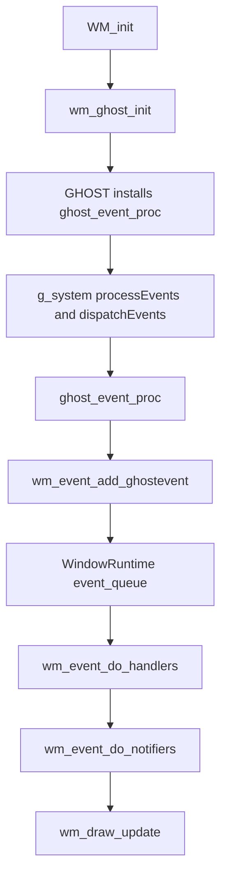
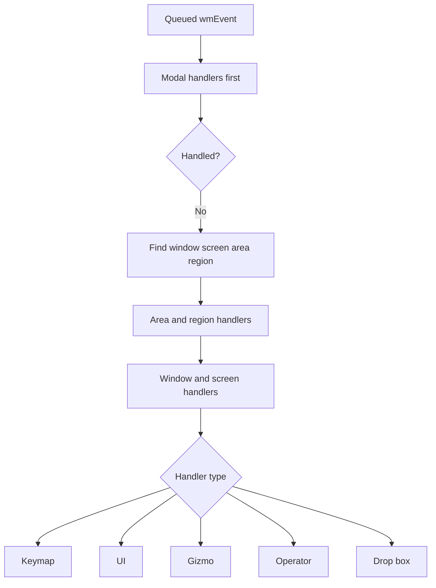

# Blender Events – Source Code Review<!-- omit from toc -->

> - Explains Blender's `wmEvent` system from startup initialization to queue construction and dispatch.
> - Distinguishes **raw event types** (mouse, keyboard, timers, NDOF, drag-drop, XR, IME) from **handler routes** (UI, keymap, gizmo, operator, drop-box).
> - Shows how OS/GHOST events become `wmEvent` objects, how they are stored in each window's event queue, and how they are processed in `WM_main()`.
> - Highlights queue optimizations, timer integration, click/drag synthesis, and the hand-off into notifiers and redraw.

## Table of Contents<!-- omit from toc -->

- [1) Event-system source-file map](#1-event-system-source-file-map)
- [2) What a Blender event is](#2-what-a-blender-event-is)
  - [2.1 Core `wmEvent` structure](#21-core-wmevent-structure)
  - [2.2 Event value semantics: press, release, click, drag](#22-event-value-semantics-press-release-click-drag)
  - [2.3 Where the queue lives](#23-where-the-queue-lives)
- [3) Types of events in Blender](#3-types-of-events-in-blender)
  - [3.1 Input-device events](#31-input-device-events)
  - [3.2 Timer and internal WM events](#32-timer-and-internal-wm-events)
  - [3.3 Special events with custom payloads](#33-special-events-with-custom-payloads)
  - [3.4 UI is a handler route, not a raw event type](#34-ui-is-a-handler-route-not-a-raw-event-type)
- [4) How the event subsystem is initialized](#4-how-the-event-subsystem-is-initialized)
  - [4.1 `WM_init()` starts the platform event layer](#41-wm_init-starts-the-platform-event-layer)
  - [4.2 Windows allocate runtime event state](#42-windows-allocate-runtime-event-state)
- [5) How the event queue is constructed](#5-how-the-event-queue-is-constructed)
  - [5.1 Per-window queue insertion](#51-per-window-queue-insertion)
  - [5.2 Conversion from GHOST events into Blender events](#52-conversion-from-ghost-events-into-blender-events)
  - [5.3 Motion compression and queue optimizations](#53-motion-compression-and-queue-optimizations)
  - [5.4 Click, double-click, and press-drag synthesis](#54-click-double-click-and-press-drag-synthesis)
  - [5.5 Timers as event producers](#55-timers-as-event-producers)
- [6) How Blender processes events](#6-how-blender-processes-events)
  - [6.1 `wm_window_events_process()` collects OS and timer work](#61-wm_window_events_process-collects-os-and-timer-work)
  - [6.2 `WM_main()` runs the event-processing loop](#62-wm_main-runs-the-event-processing-loop)
  - [6.3 `wm_event_do_handlers()` walks the hierarchy](#63-wm_event_do_handlers-walks-the-hierarchy)
  - [6.4 Handler-type dispatch](#64-handler-type-dispatch)
  - [6.5 After handlers: notifiers and redraw](#65-after-handlers-notifiers-and-redraw)
- [7) Mermaid diagrams](#7-mermaid-diagrams)
  - [7.1 Full event lifecycle](#71-full-event-lifecycle)
  - [7.2 Dispatch hierarchy inside the handler pass](#72-dispatch-hierarchy-inside-the-handler-pass)
- [8) Short Answers](#8-short-answers)
- [9) Source-level conclusion](#9-source-level-conclusion)

---

## 1) Event-system source-file map

| File                                                     | Important symbols                                                                                 | Role in Blender events                                 |
| -------------------------------------------------------- | ------------------------------------------------------------------------------------------------- | ------------------------------------------------------ |
| `source/blender/windowmanager/wm_event_types.hh`         | `enum wmEventType`, `TIMER`, `MOUSEMOVE`, `NDOF_MOTION`, `EVT_*`                                  | Defines Blender event codes                            |
| `source/blender/windowmanager/WM_types.hh`               | `wmEvent`, `wmTimer`, `KM_PRESS`, `KM_CLICK`, `KM_PRESS_DRAG`                                     | Core event and timer data structures                   |
| `source/blender/blenkernel/BKE_wm_runtime.hh`            | `struct WindowRuntime`                                                                            | Holds the per-window event queue and event-state cache |
| `source/blender/windowmanager/wm_event_system.hh`        | `wm_event_do_handlers`, `wm_event_add_ghostevent`, `eWM_EventHandlerType`                         | Internal event-dispatch API                            |
| `source/blender/windowmanager/intern/wm_event_system.cc` | `wm_event_add_intern`, `wm_event_add_ghostevent`, `wm_handlers_do_intern`, `wm_event_do_handlers` | Queue construction and handler dispatch                |
| `source/blender/windowmanager/intern/wm_window.cc`       | `wm_ghost_init`, `ghost_event_proc`, `wm_window_events_process`, `WM_event_timer_add`             | OS event ingestion and timer processing                |
| `source/blender/windowmanager/intern/wm.cc`              | `WM_main`                                                                                         | Main runtime loop that drives event handling           |
| `source/blender/windowmanager/intern/wm_init_exit.cc`    | `WM_init`                                                                                         | Event-system bootstrap during Blender startup          |

---

## 2) What a Blender event is

### 2.1 Core `wmEvent` structure

The main runtime object for events is `wmEvent`.

**File:** `source/blender/windowmanager/WM_types.hh`

```cpp
struct wmEvent {
  wmEvent *next, *prev;

  wmEventType type;
  short val;
  int xy[2];
  int mval[2];
  char utf8_buf[6];

  wmEventModifierFlag modifier;
  int8_t direction;
  wmEventType keymodifier;
  wmTabletData tablet;
  eWM_EventFlag flag;

  short custom;
  short customdata_free;
  void *customdata;

  wmEventType prev_type;
  short prev_val;
  int prev_xy[2];

  wmEventType prev_press_type;
  int prev_press_xy[2];
  wmEventModifierFlag prev_press_modifier;
  wmEventType prev_press_keymodifier;
};
```

This shows that a Blender event stores more than just a key or mouse code:

- the **event type** (`type`),
- the **value/state** (`val`),
- cursor positions (`xy`, `mval`),
- modifier keys,
- optional payload (`customdata`),
- and previous-press state used for click/drag logic.

### 2.2 Event value semantics: press, release, click, drag

The `val` field is not arbitrary. It uses fixed semantics:

**File:** `source/blender/windowmanager/WM_types.hh`

```cpp
enum {
  KM_ANY = -1,
  KM_NOTHING = 0,
  KM_PRESS = 1,
  KM_RELEASE = 2,
  KM_CLICK = 3,
  KM_DBL_CLICK = 4,
  KM_PRESS_DRAG = 5,
};
```

So Blender can treat a single physical button as:

- a simple press,
- a release,
- a click,
- a double-click,
- or a drag-start event.

These are important because some of them are **synthesized by WM**, not received directly from the OS.

### 2.3 Where the queue lives

Events are stored per window, not globally in `bContext`.

**File:** `source/blender/blenkernel/BKE_wm_runtime.hh`

```cpp
struct WindowRuntime {
  /** All events #wmEvent (ghost level events were handled). */
  ListBaseT<wmEvent> event_queue = {nullptr, nullptr};
  ...
  wmEvent *event_last_handled = nullptr;
  ...
}
```

And the internal API makes this explicit:

**File:** `source/blender/windowmanager/wm_event_system.hh`

```cpp
/**
 * Windows store their own event queues #wmWindow.event_queue (no #bContext here).
 */
void wm_event_add_ghostevent(...);
```

So the event queue is a **per-window runtime queue**, owned by `WindowRuntime`.

---

## 3) Types of events in Blender

### 3.1 Input-device events

The raw event codes are declared in `source/blender/windowmanager/wm_event_types.hh`.

Representative input events include:

```cpp
LEFTMOUSE = 0x0001,
MIDDLEMOUSE = 0x0002,
RIGHTMOUSE = 0x0003,
MOUSEMOVE = 0x0004,
MOUSEPAN = 0x000e,
MOUSEZOOM = 0x000f,
MOUSEROTATE = 0x0010,
INBETWEEN_MOUSEMOVE = 0x0011,
```

And then a large keyboard range follows:

```cpp
EVT_AKEY = 0x0061,
EVT_BKEY = 0x0062,
...
EVT_ESCKEY = 0x00da,
EVT_TABKEY = 0x00db,
EVT_RETKEY = 0x00dc,
```

So the event system covers:

- mouse buttons and cursor movement,
- wheel and trackpad gestures,
- tablet/stylus input,
- normal keyboard keys and modifiers.

### 3.2 Timer and internal WM events

Blender also defines internal/system events in the same enum.

**File:** `source/blender/windowmanager/wm_event_types.hh`

```cpp
WINDEACTIVATE = 0x0104,
TIMER = 0x0110,
TIMER0 = 0x0111,
TIMER1 = 0x0112,
TIMER2 = 0x0113,
TIMERJOBS = 0x0114,
TIMERAUTOSAVE = 0x0115,
TIMERREPORT = 0x0116,
TIMERREGION = 0x0117,
TIMERNOTIFIER = 0x0118,
```

This is a key point: Blender's event system is not just about user input. It also transports:

- auto-save timing,
- job-system timing,
- UI/report timers,
- region animation timers,
- and general internal scheduled actions.

### 3.3 Special events with custom payloads

Some event types carry extra data through `wmEvent.customdata`.

**File:** `source/blender/windowmanager/WM_types.hh`

```cpp
/* The #wmEvent::type implies the following #wmEvent::custodata.
 * - #EVT_ACTIONZONE_AREA / #EVT_ACTIONZONE_FULLSCREEN: Uses #sActionzoneData.
 * - #EVT_DROP: uses #ListBaseT<wmDrag> (also #wmEvent::custom == #EVT_DATA_DRAGDROP).
 *   Typically set to #wmWindowManager::drags.
 * - #EVT_FILESELECT: uses #wmOperator.
 * - #EVT_XR_ACTION: uses #wmXrActionData (also #wmEvent::custom == #EVT_DATA_XR).
 * - #NDOF_MOTION: uses #wmNDOFMotionData (also #wmEvent::custom == #EVT_DATA_NDOF_MOTION).
 * - #TIMER: uses #wmTimer (also #wmEvent::custom == #EVT_DATA_TIMER).
 */
```

> **5.1.1 update:** Added `EVT_ACTIONZONE_AREA / EVT_ACTIONZONE_FULLSCREEN` (uses `sActionzoneData`). The `EVT_DROP` entry now notes that `custom == EVT_DATA_DRAGDROP` and that `customdata` is typically `wmWindowManager::drags`. Other entries similarly note their `EVT_DATA_*` tag.

So Blender events can carry richer payloads for:

- action-zone detection,
- drag-and-drop,
- file-browser/operator callbacks,
- XR actions,
- 3D mouse motion,
- timer callbacks.

### 3.4 UI is a handler route, not a raw event type

The user's wording mentions **UI events**, and Blender does support that concept - but in the source it is represented primarily as a **handler type**, not a dedicated raw `wmEventType` enum block.

**File:** `source/blender/windowmanager/wm_event_system.hh`

```cpp
enum eWM_EventHandlerType {
  WM_HANDLER_TYPE_GIZMO = 1,
  WM_HANDLER_TYPE_UI,
  WM_HANDLER_TYPE_OP,
  WM_HANDLER_TYPE_DROPBOX,
  WM_HANDLER_TYPE_KEYMAP,
};
```

So in Blender there are two layers to keep separate:

| Layer               | Examples                                                                                      |
| ------------------- | --------------------------------------------------------------------------------------------- |
| **Raw event types** | `MOUSEMOVE`, `EVT_AKEY`, `TIMERJOBS`, `NDOF_MOTION`, `EVT_DROP`                               |
| **Handler routes**  | `WM_HANDLER_TYPE_UI`, `WM_HANDLER_TYPE_KEYMAP`, `WM_HANDLER_TYPE_OP`, `WM_HANDLER_TYPE_GIZMO` |

That distinction is central to understanding Blender's event processing architecture.

---

## 4) How the event subsystem is initialized

### 4.1 `WM_init()` starts the platform event layer

Event processing is bootstrapped during `WM_init()`.

**File:** `source/blender/windowmanager/intern/wm_init_exit.cc`

```cpp
void WM_init(bContext *C, int argc, const char **argv)
{
  if (!G.background) {
    wm_ghost_init(C); /* NOTE: it assigns C to ghost! */
    wm_init_cursor_data();
    BKE_sound_jack_sync_callback_set(sound_jack_sync_callback);
  }
  ...
}
```

The critical first step here is `wm_ghost_init(C)`.

Inside that function Blender installs the GHOST event consumer:

**File:** `source/blender/windowmanager/intern/wm_window.cc`

```cpp
GHOST_CallbackEventConsumer *ghost_event_consumer = new GHOST_CallbackEventConsumer(
    ghost_event_proc, C);
...
g_system->addEventConsumer(ghost_event_consumer);
```

So the event-system bootstrap path is:

1. `WM_init()` runs,
2. `wm_ghost_init(C)` creates the platform event system,
3. GHOST is configured to call `ghost_event_proc(...)` whenever window/input events arrive.

### 4.2 Windows allocate runtime event state

Each window also needs a persistent event-state cache.

**File:** `source/blender/windowmanager/intern/wm_window.cc`

```cpp
static void wm_window_ensure_eventstate(wmWindow *win)
{
  if (win->runtime->eventstate) {
    return;
  }

  win->runtime->eventstate = MEM_new<wmEvent>("window event state");
  wm_window_update_eventstate(win);
}
```

This `eventstate` object is important because Blender uses it to remember:

- current cursor position,
- current modifier state,
- previous press state,
- and the last press/release needed for click and drag synthesis.

---

## 5) How the event queue is constructed

### 5.1 Per-window queue insertion

At the lowest level, a new event is inserted with `wm_event_add_intern()`.

**File:** `source/blender/windowmanager/intern/wm_event_system.cc`

```cpp
static wmEvent *wm_event_add_intern(wmWindow *win, const wmEvent *event_to_add)
{
  wmEvent *event = MEM_new<wmEvent>(__func__);

  *event = *event_to_add;

  BLI_addtail(&win->runtime->event_queue, event);
  return event;
}
```

This is the fundamental queue-construction operation: **copy the event, then append it to the current window's queue**.

### 5.2 Conversion from GHOST events into Blender events

When OS/platform events arrive, GHOST calls `ghost_event_proc(...)`, which routes them into `wm_event_add_ghostevent(...)`.

**File:** `source/blender/windowmanager/intern/wm_window.cc`

```cpp
static bool ghost_event_proc(const GHOST_IEvent *ghost_event, GHOST_TUserDataPtr C_void_ptr)
{
  ...
  wmWindow *win = static_cast<wmWindow *>(ghost_window->getUserData());
  ...
  wm_event_add_ghostevent(wm, win, type, data, event_time_ms);
}
```

Then `wm_event_add_ghostevent()` maps the platform event into a normalized `wmEvent`.

**File:** `source/blender/windowmanager/intern/wm_event_system.cc`

```cpp
void wm_event_add_ghostevent(wmWindowManager *wm,
                             wmWindow *win,
                             const int type,
                             const void *customdata,
                             const uint64_t event_time_ms)
{
  wmEvent event, *event_state = win->runtime->eventstate;
  ...
  switch (type) {
    case GHOST_kEventCursorMove:
    case GHOST_kEventButtonDown:
    case GHOST_kEventButtonUp:
    case GHOST_kEventKeyDown:
    case GHOST_kEventKeyUp:
    case GHOST_kEventWheel:
    ...
  }
}
```

This is the **translation layer** between OS-native event objects and Blender's own event model.

### 5.3 Motion compression and queue optimizations

Blender intentionally compresses some high-frequency motion events.

**File:** `source/blender/windowmanager/intern/wm_event_system.cc`

```cpp
static wmEvent *wm_event_add_mousemove(wmWindow *win, const wmEvent *event)
{
  wmEvent *event_last = static_cast<wmEvent *>(win->runtime->event_queue.last);

  if (event_last && event_last->type == MOUSEMOVE) {
    event_last->type = INBETWEEN_MOUSEMOVE;
    event_last->flag = eWM_EventFlag(0);
  }

  wmEvent *event_new = wm_event_add_intern(win, event);
  ...
}
```

So successive `MOUSEMOVE` events can be downgraded to `INBETWEEN_MOUSEMOVE` to reduce overhead while still preserving enough information for tools that need it.

There is a similar optimization for trackpad gesture accumulation in `wm_event_add_trackpad()`.

Also, repeated key presses can be dropped if they would clog the queue. The internal helper `wm_event_is_ignorable_key_press()` exists specifically to avoid queue buildup from repeat-key events.

### 5.4 Click, double-click, and press-drag synthesis

A major part of Blender's queue logic is synthesizing higher-level interactions from raw press/release events.

**File:** `source/blender/windowmanager/intern/wm_event_system.cc`

```cpp
if (check_double_click &&
    wm_event_is_double_click(event, event_time_ms, *event_state_prev_press_time_ms_p))
{
  event->val = KM_DBL_CLICK;
}
else if (event->val == KM_PRESS) {
  if ((event->flag & WM_EVENT_IS_REPEAT) == 0) {
    wm_event_prev_click_set(event_time_ms, event_state, event_state_prev_press_time_ms_p);
  }
}
```

So Blender does not only store raw button transitions. It derives:

- `KM_CLICK`,
- `KM_DBL_CLICK`,
- `KM_PRESS_DRAG`,
- and drag direction/state using `prev_press_xy` and the drag threshold.

This is why `wmEvent` stores both **previous** and **previous-press** state.

### 5.5 Timers as event producers

Timers are first-class event sources in Blender.

**File:** `source/blender/windowmanager/intern/wm_window.cc`

```cpp
wmTimer *WM_event_timer_add(wmWindowManager *wm,
                            wmWindow *win,
                            const wmEventType event_type,
                            const double time_step)
{
  BLI_assert(ISTIMER(event_type));

  wmTimer *wt = MEM_new_zeroed<wmTimer>("window timer");
  BLI_assert(time_step >= 0.0f);

  wt->event_type = event_type;
  wt->time_last = BLI_time_now_seconds();
  wt->time_next = wt->time_last + time_step;
  wt->time_start = wt->time_last;
  wt->time_step = time_step;
  wt->win = win;

  BLI_addtail(&wm->runtime->timers, wt);
  return wt;
}
```

> **5.1.1 update:** The function now asserts `ISTIMER(event_type)`, allocates via `MEM_new_zeroed`, and initializes `time_last`, `time_next`, and `time_start` from `BLI_time_now_seconds()`. The previous simplified excerpt omitted these timing-state fields.

And the timer-processing path turns them into work or events:

```cpp
if (wt.event_type == TIMERJOBS) {
  wm_jobs_timer(wm, &wt);
}
else if (wt.event_type == TIMERAUTOSAVE) {
  wm_autosave_timer(bmain, wm, &wt);
}
else if (wt.event_type == TIMERNOTIFIER) {
  WM_main_add_notifier(POINTER_AS_UINT(wt.customdata), nullptr);
}
else if (wmWindow *win = wt.win) {
  wmEvent event;
  wm_event_init_from_window(win, &event);

  event.type = wt.event_type;
  event.val = KM_NOTHING;          /* 5.1.1: explicitly set val */
  event.keymodifier = EVENT_NONE;  /* 5.1.1: explicitly cleared */
  event.flag = eWM_EventFlag(0);   /* 5.1.1: explicitly cleared */
  event.custom = EVT_DATA_TIMER;
  event.customdata = &wt;
  WM_event_add(win, &event);
}
```

> **5.1.1 update:** Timer-derived events now explicitly set `val = KM_NOTHING`, `keymodifier = EVENT_NONE`, and `flag = eWM_EventFlag(0)` before queuing.

So timer events are not an afterthought - they are deeply integrated into the same event infrastructure.

---

## 6) How Blender processes events

### 6.1 `wm_window_events_process()` collects OS and timer work

This is the top-level OS-event polling function.

**File:** `source/blender/windowmanager/intern/wm_window.cc`

```cpp
void wm_window_events_process(const bContext *C)
{
  BLI_assert(BLI_thread_is_main());
  GPU_render_begin();

  bool has_event = g_system->processEvents(false); /* `false` is no wait. */

  if (has_event) {
    g_system->dispatchEvents();
  }

  /* When there is no event, sleep 5 milliseconds not to use too much CPU when idle. */
  const int sleep_us_default = 5000;
  int sleep_us = has_event ? 0 : sleep_us_default;
  has_event |= wm_window_timers_process(C, &sleep_us);
#ifdef WITH_XR_OPENXR
  /* XR events don't use the regular window queues. */
  has_event |= wm_xr_events_handle(CTX_wm_manager(C));
#endif
  GPU_render_end();

  if ((has_event == false) && (sleep_us != 0) && !(G.f & G_FLAG_EVENT_SIMULATE)) {
    BLI_time_sleep_precise_us(sleep_us);
  }
}
```

> **5.1.1 update:** The function now opens with `BLI_assert(BLI_thread_is_main())` and `GPU_render_begin()`, the sleep duration variable is named `sleep_us_default`, XR events are processed via `wm_xr_events_handle()` inside `#ifdef WITH_XR_OPENXR`, and the sleep itself is deferred to after `GPU_render_end()` with an additional `G_FLAG_EVENT_SIMULATE` guard.

This function:

1. polls GHOST for OS/window/input events,
2. dispatches those events back into Blender via `ghost_event_proc`,
3. processes timer events,
4. sleeps briefly when idle to avoid spinning the CPU.

### 6.2 `WM_main()` runs the event-processing loop

Once startup is complete, `WM_main()` drives the continuous runtime loop.

**File:** `source/blender/windowmanager/intern/wm.cc`

```cpp
void WM_main(bContext *C)
{
  wm_event_do_refresh_wm_and_depsgraph(C);

  while (true) {
    wm_window_events_process(C);
    wm_event_do_handlers(C);
    wm_event_do_notifiers(C);
    wm_draw_update(C);
  }
}
```

This is the most important high-level summary of Blender interactive execution:

- **collect events**,
- **handle events**,
- **handle notifier side-effects**,
- **draw**.

### 6.3 `wm_event_do_handlers()` walks the hierarchy

The central handler function consumes each queued event and routes it through the UI hierarchy.

**File:** `source/blender/windowmanager/intern/wm_event_system.cc`

```cpp
while ((event = static_cast<wmEvent *>(win.runtime->event_queue.first))) {
  ...
  CTX_wm_window_set(C, &win);
  ...
  action |= wm_handlers_do(C, event, &win.runtime->modalhandlers);
  ...
  action |= wm_event_do_handlers_area_regions(C, event, area);
  ...
  action |= wm_handlers_do(C, event, &win.runtime->handlers);
  ...
  BLI_remlink(&win.runtime->event_queue, event);
  wm_event_free_last_handled(&win, event);
}
```

Important observations from this logic:

- events are processed **window by window**,
- modal handlers run first,
- then region/area-level routing happens,
- then general window/screen handlers run,
- finally the event is removed from the queue.

### 6.4 Handler-type dispatch

Inside the handler pass, Blender dispatches by handler type.

**File:** `source/blender/windowmanager/intern/wm_event_system.cc`

```cpp
if (handler_base->type == WM_HANDLER_TYPE_KEYMAP) {
  ...
}
else if (handler_base->type == WM_HANDLER_TYPE_UI) {
  ...
}
else if (handler_base->type == WM_HANDLER_TYPE_DROPBOX) {
  ...
}
else if (handler_base->type == WM_HANDLER_TYPE_GIZMO) {
  ...
}
else if (handler_base->type == WM_HANDLER_TYPE_OP) {
  ...
}
```

So an event is not "handled by UI" in a vague sense. It is routed to one of several explicit handler families:

- keymaps,
- UI widgets/popups,
- gizmos,
- modal or file-select operators,
- drag-and-drop drop-boxes.

### 6.5 After handlers: notifiers and redraw

Event handling itself is not the end of the pipeline. After handlers run, Blender processes notifiers and redraw.

**File:** `source/blender/windowmanager/intern/wm.cc`

```cpp
wm_event_do_handlers(C);
wm_event_do_notifiers(C);
wm_draw_update(C);
```

So the full behavior of "an event happened" is usually:

1. input arrives,
2. handlers or operators react,
3. notifiers describe what changed,
4. redraw makes the result visible.

---

## 7) Mermaid diagrams

### 7.1 Full event lifecycle



### 7.2 Dispatch hierarchy inside the handler pass



These diagrams match the source flow in `wm_window.cc`, `wm_event_system.cc`, and `wm.cc`.

---

## 8) Short Answers

**What are Blender events?**  
They are `wmEvent` objects representing both **user input** and **internal WM activity** such as timers, file-select callbacks, drag-drop payloads, NDOF motion, XR actions, and window-state changes.

**Where are they initialized?**  
The event subsystem is bootstrapped during `WM_init()` through `wm_ghost_init(C)`, which installs `ghost_event_proc(...)` as the platform event callback.

**Where is the queue built?**  
Each window owns a `WindowRuntime::event_queue`. Raw OS/GHOST input is normalized by `wm_event_add_ghostevent()` and appended through `wm_event_add_intern()`.

**How are events processed?**  
`WM_main()` repeatedly calls:

1. `wm_window_events_process(C)` to gather OS and timer activity,
2. `wm_event_do_handlers(C)` to route queued events through modal, UI, keymap, gizmo, operator, and drop-box handlers,
3. `wm_event_do_notifiers(C)` and `wm_draw_update(C)` to refresh the interface.

**What about UI and timer events?**  

- **Timer events** are real raw `wmEventType` values such as `TIMERJOBS`, `TIMERAUTOSAVE`, and `TIMERREPORT`.
- **UI** is primarily a **handler-dispatch category** (`WM_HANDLER_TYPE_UI`), not a separate raw event enum block.

## 9) Source-level conclusion

Best source files to open next:

1. `source/blender/windowmanager/intern/wm_event_system.cc`
2. `source/blender/windowmanager/intern/wm_window.cc`
3. `source/blender/windowmanager/WM_types.hh`
4. `source/blender/windowmanager/wm_event_types.hh`
5. `source/blender/blenkernel/BKE_wm_runtime.hh`
