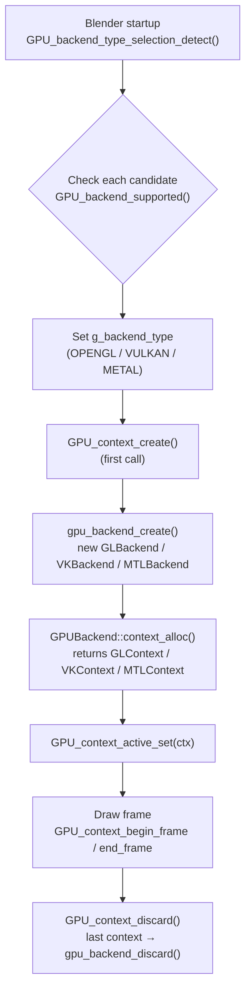
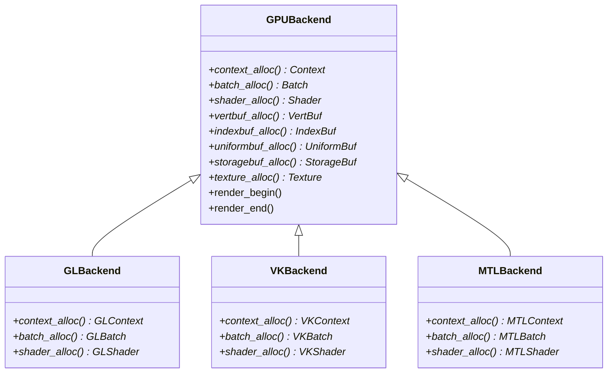
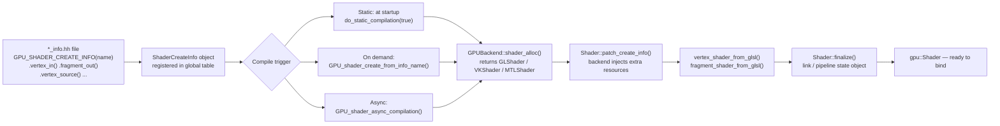
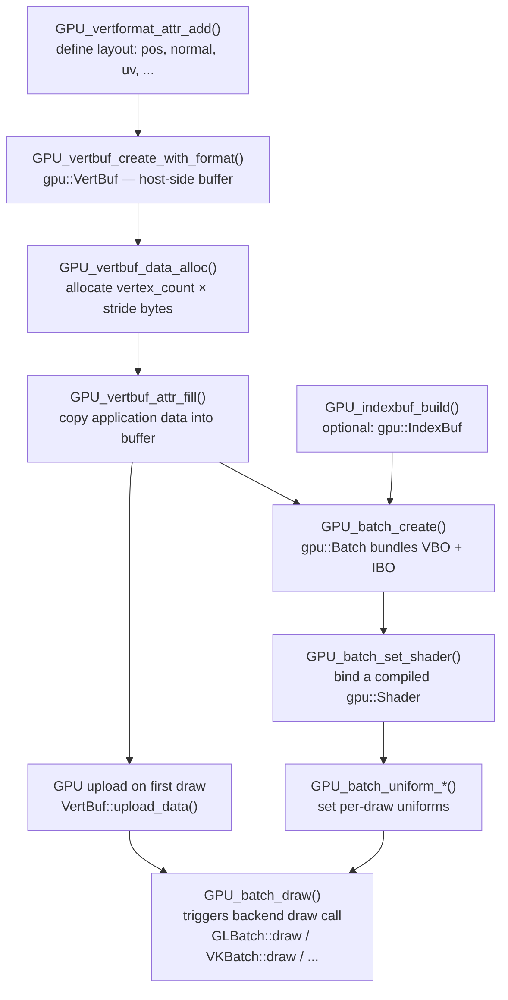
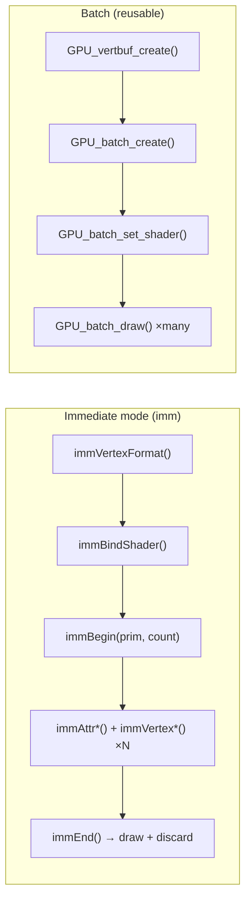

# Blender GPU Abstraction Layer – Source Code Review<!-- omit from toc -->

> - Documents the GPU abstraction layer in `source/blender/gpu/`.
> - Explains backend selection and context creation for OpenGL, Vulkan, and Metal.
> - Shows how the `GPUBackend` abstract factory allocates all GPU objects at runtime.
> - Covers the shader system: `ShaderCreateInfo` descriptors, compilation paths, and async compilation.
> - Documents GPU batching: vertex buffers, index buffers, immediate mode, and procedural batches.
> - Supported with real source excerpts and Mermaid diagrams for each major concept.

## Table of Contents<!-- omit from toc -->

- [1) Overview and design philosophy](#1-overview-and-design-philosophy)
- [2) Source-file map](#2-source-file-map)
- [3) Backend selection and context creation](#3-backend-selection-and-context-creation)
  - [3.1 GPUBackendType enum](#31-gpubackendtype-enum)
  - [3.2 Backend detection at startup](#32-backend-detection-at-startup)
  - [3.3 GPUBackend — the abstract factory](#33-gpubackend--the-abstract-factory)
  - [3.4 Context creation](#34-context-creation)
  - [3.5 gpu::Context — per-context state](#35-gpucontext--per-context-state)
- [4) GPU shaders](#4-gpu-shaders)
  - [4.1 ShaderCreateInfo — declarative descriptor](#41-shadercreateinfo--declarative-descriptor)
  - [4.2 Shader class hierarchy](#42-shader-class-hierarchy)
  - [4.3 Shader compilation paths](#43-shader-compilation-paths)
  - [4.4 Uniforms, push constants, and resources](#44-uniforms-push-constants-and-resources)
  - [4.5 Async compilation](#45-async-compilation)
- [5) GPU batching](#5-gpu-batching)
  - [5.1 Vertex format and VertBuf](#51-vertex-format-and-vertbuf)
  - [5.2 IndexBuf](#52-indexbuf)
  - [5.3 Batch — the drawable unit](#53-batch--the-drawable-unit)
  - [5.4 Immediate mode (imm)](#54-immediate-mode-imm)
  - [5.5 Procedural batches](#55-procedural-batches)
  - [5.6 Uniform and storage buffers](#56-uniform-and-storage-buffers)
- [6) State management](#6-state-management)
- [7) Mermaid diagrams](#7-mermaid-diagrams)
  - [7.1 Backend selection and context lifecycle](#71-backend-selection-and-context-lifecycle)
  - [7.2 GPUBackend abstract factory](#72-gpubackend-abstract-factory)
  - [7.3 Shader compilation pipeline](#73-shader-compilation-pipeline)
  - [7.4 Batch data flow](#74-batch-data-flow)
  - [7.5 Immediate mode vs. batch](#75-immediate-mode-vs-batch)
- [8) Code examples](#8-code-examples)
  - [Example A — Draw a colored triangle with a batch](#example-a--draw-a-colored-triangle-with-a-batch)
  - [Example B — Draw procedurally with vertex\_id in shader (no VBO)](#example-b--draw-procedurally-with-vertex_id-in-shader-no-vbo)
  - [Example C — Immediate mode UI line](#example-c--immediate-mode-ui-line)
  - [Example D — Async shader compilation](#example-d--async-shader-compilation)
- [9) Short answers](#9-short-answers)
- [10) Source-level conclusion](#10-source-level-conclusion)

---

## 1) Overview and design philosophy

Blender's GPU module (`source/blender/gpu/`) provides a **renderer-agnostic abstraction** over
three native graphics APIs:

| API         | Platform                           | Backend class  | Build flag            |
| ----------- | ---------------------------------- | -------------- | --------------------- |
| OpenGL 4.3+ | Windows, Linux, macOS (deprecated) | `GLBackend`    | `WITH_OPENGL_BACKEND` |
| Metal 2.0+  | macOS 10.14+                       | `MTLBackend`   | `WITH_METAL_BACKEND`  |
| Vulkan 1.2+ | Windows, Linux                     | `VKBackend`    | `WITH_VULKAN_BACKEND` |
| Dummy/None  | Headless testing                   | `DummyBackend` | always                |

The philosophy is **single-author code** — draw code written once in terms of `gpu::Batch`,
`gpu::Shader`, `gpu::VertBuf`, etc. compiles and runs on all three backends without modification.

The public API lives in the top-level `.hh` headers (`GPU_batch.hh`, `GPU_shader.hh`, …).
Backend-specific implementations live in `opengl/`, `metal/`, and `vulkan/` subdirectories.
Shared logic is in `intern/`.

---

## 2) Source-file map

| File                                                  | Important symbols                                             | Role                                            |
| ----------------------------------------------------- | ------------------------------------------------------------- | ----------------------------------------------- |
| `source/blender/gpu/GPU_platform_backend_enum.h`      | `GPUBackendType`                                              | Backend type enum (OPENGL, METAL, VULKAN, NONE) |
| `source/blender/gpu/GPU_context.hh`                   | `GPU_context_create()`, `GPU_context_discard()`               | Public context API                              |
| `source/blender/gpu/intern/gpu_backend.hh`            | `GPUBackend`                                                  | Abstract factory base class                     |
| `source/blender/gpu/intern/gpu_context.cc`            | `GPU_backend_type_selection_detect()`, `gpu_backend_create()` | Backend selection and context creation          |
| `source/blender/gpu/intern/gpu_context_private.hh`    | `gpu::Context`                                                | Per-context state (shader, fb, matrix, imm)     |
| `source/blender/gpu/GPU_shader.hh`                    | `GPU_shader_create_from_info_name()`, `GPU_shader_free()`     | Public shader API                               |
| `source/blender/gpu/intern/gpu_shader.cc`             | `GPU_shader_create_from_info()`                               | Shader base-class implementation                |
| `source/blender/gpu/intern/gpu_shader_private.hh`     | `gpu::Shader`                                                 | Shader virtual interface                        |
| `source/blender/gpu/intern/gpu_shader_create_info.hh` | `ShaderCreateInfo`, `GPU_SHADER_CREATE_INFO()`                | Declarative shader descriptor macros            |
| `source/blender/gpu/GPU_batch.hh`                     | `GPU_batch_create()`, `GPU_batch_draw()`                      | Public batch API                                |
| `source/blender/gpu/intern/gpu_batch.cc`              | `gpu::Batch` creation / clear / copy                          | Batch base-class implementation                 |
| `source/blender/gpu/GPU_vertex_buffer.hh`             | `GPU_vertbuf_create_with_format()`, `gpu::VertBuf`            | Vertex buffer API                               |
| `source/blender/gpu/GPU_vertex_format.hh`             | `GPUVertFormat`, `VertAttrType`                               | Vertex attribute layout                         |
| `source/blender/gpu/GPU_index_buffer.hh`              | `GPUIndexBufBuilder`, `gpu::IndexBuf`                         | Index buffer API                                |
| `source/blender/gpu/GPU_immediate.hh`                 | `immBegin()`, `immEnd()`, `immAttr*()`, `immVertex*()`        | Immediate-mode draw API                         |
| `source/blender/gpu/intern/gpu_immediate.cc`          | `Immediate`                                                   | Immediate mode backend                          |
| `source/blender/gpu/GPU_primitive.hh`                 | `GPUPrimType`                                                 | Primitive topology enum                         |
| `source/blender/gpu/GPU_uniform_buffer.hh`            | `GPU_uniformbuf_create_ex()`                                  | Uniform buffer objects                          |
| `source/blender/gpu/GPU_storage_buffer.hh`            | `GPU_storagebuf_create_ex()`                                  | SSBO API                                        |
| `source/blender/gpu/GPU_framebuffer.hh`               | `GPU_framebuffer_create()`                                    | Framebuffer object API                          |
| `source/blender/gpu/GPU_state.hh`                     | `GPU_depth_test()`, `GPU_blend()`, `GPU_face_culling()`       | Pipeline state management                       |
| `source/blender/gpu/opengl/gl_backend.hh`             | `GLBackend : GPUBackend`                                      | OpenGL concrete factory                         |
| `source/blender/gpu/opengl/gl_context.hh`             | `GLContext : gpu::Context`                                    | OpenGL context                                  |
| `source/blender/gpu/opengl/gl_shader.hh`              | `GLShader : gpu::Shader`                                      | OpenGL shader                                   |
| `source/blender/gpu/vulkan/vk_backend.hh`             | `VKBackend : GPUBackend`                                      | Vulkan concrete factory (in development)        |
| `source/blender/gpu/metal/mtl_backend.hh`             | `MTLBackend : GPUBackend`                                     | Metal concrete factory (macOS)                  |

---

## 3) Backend selection and context creation

### 3.1 GPUBackendType enum

**File:** `source/blender/gpu/GPU_platform_backend_enum.h`

Kept as a C header for interoperability with C code that queries the active backend:

```cpp
enum GPUBackendType {
  GPU_BACKEND_NONE   = 0,
  GPU_BACKEND_OPENGL = 1 << 0,
  GPU_BACKEND_METAL  = 1 << 1,
  GPU_BACKEND_VULKAN = 1 << 3,
  GPU_BACKEND_ANY    = 0xFFFFFFFFu
};
```

The user preference (`Preferences → System → Graphics`) maps to these via
`eUserPref_GPUBackendType`, which keeps the same numeric values.

### 3.2 Backend detection at startup

**File:** `source/blender/gpu/intern/gpu_context.cc`

`GPU_backend_type_selection_detect()` picks the best available backend automatically, with a
compile-time priority. The override path lets `--gpu-backend` on the command line take
precedence over the automatic selection:

```cpp
// intern/gpu_context.cc  (simplified)

static GPUBackendType g_backend_type = GPU_BACKEND_OPENGL;
static std::optional<GPUBackendType> g_backend_type_override = std::nullopt;
static GPUBackend *g_backend = nullptr;

bool GPU_backend_type_selection_detect()
{
  VectorSet<GPUBackendType> backends_to_check;
  if (g_backend_type_override.has_value()) {
    backends_to_check.add(*g_backend_type_override);
  }
#if defined(WITH_OPENGL_BACKEND)
  backends_to_check.add(GPU_BACKEND_OPENGL);
#elif defined(WITH_METAL_BACKEND)
  backends_to_check.add(GPU_BACKEND_METAL);
#endif
#if defined(WITH_VULKAN_BACKEND)
  backends_to_check.add(GPU_BACKEND_VULKAN);
#endif

  for (const GPUBackendType backend_type : backends_to_check) {
    GPU_backend_type_selection_set(backend_type);
    if (GPU_backend_supported()) {
      return true;
    }
    G.f |= G_FLAG_GPU_BACKEND_FALLBACK;
  }

  GPU_backend_type_selection_set(GPU_BACKEND_NONE);
  return false;
}
```

The `GPU_backend_supported()` call queries the actual API (e.g. `VKBackend::is_supported()`,
`MTLBackend::metal_is_supported()`) before committing.

> **5.1.1 note:** `--gpu-backend` and `--gpu-compilation-subprocesses` were moved into `ARG_PASS_ENVIRONMENT` so they apply before `WM_init()` triggers GPU initialization. The subprocess shader compilation path exits `main()` immediately when the first argument is `--compilation-subprocess`.

### 3.3 GPUBackend — the abstract factory

**File:** `source/blender/gpu/intern/gpu_backend.hh`

Every API backend subclasses `GPUBackend` and overrides every allocator. The singleton is
accessed through `GPUBackend::get()`:

```cpp
// intern/gpu_backend.hh (condensed)
class GPUBackend {
 protected:
  ShaderCompiler *compiler_;

 public:
  virtual void init_resources() = 0;
  virtual void delete_resources() = 0;

  static GPUBackend *get();   // returns g_backend singleton

  virtual Context    *context_alloc(GHOST_IWindow *, GHOST_IContext *) = 0;
  virtual Batch      *batch_alloc() = 0;
  virtual Fence      *fence_alloc() = 0;
  virtual FrameBuffer*framebuffer_alloc(const char *name) = 0;
  virtual IndexBuf   *indexbuf_alloc() = 0;
  virtual Shader     *shader_alloc(const char *name) = 0;
  virtual Texture    *texture_alloc(const char *name) = 0;
  virtual UniformBuf *uniformbuf_alloc(size_t, const char *) = 0;
  virtual StorageBuf *storagebuf_alloc(size_t, GPUUsageType, const char *) = 0;
  virtual VertBuf    *vertbuf_alloc() = 0;

  virtual void render_begin() = 0;
  virtual void render_end() = 0;
  virtual void render_step(bool force_resource_release = false) = 0;
};
```

The OpenGL implementation simply `new`s the concrete types:

**File:** `source/blender/gpu/opengl/gl_backend.hh`

```cpp
class GLBackend : public GPUBackend {
 public:
  Context *context_alloc(GHOST_IWindow *ghost_window,
                         GHOST_IContext * /*ghost_context*/) override
  {
    return new GLContext(ghost_window, shared_orphan_list_);
  }

  Batch *batch_alloc() override { return new GLBatch(); }
  Shader *shader_alloc(const char *name) override { return new GLShader(name); }
  VertBuf *vertbuf_alloc() override { return new GLVertBuf(); }
  // ... (one override per object type)
};
```

`gpu_backend_create()` (called lazily from `GPU_context_create`) instantiates exactly one
backend singleton:

```cpp
static void gpu_backend_create()
{
  switch (g_backend_type) {
    case GPU_BACKEND_OPENGL:  g_backend = MEM_new<GLBackend>(__func__);  break;
    case GPU_BACKEND_VULKAN:  g_backend = MEM_new<VKBackend>(__func__);  break;
    case GPU_BACKEND_METAL:   g_backend = MEM_new<MTLBackend>(__func__); break;
    case GPU_BACKEND_NONE:    g_backend = MEM_new<DummyBackend>(__func__); break;
  }
}
```

### 3.4 Context creation

**File:** `source/blender/gpu/intern/gpu_context.cc`

A GPU context wraps the native API context (GL context, Vulkan device + queue, Metal device).
The first `GPU_context_create` call triggers the backend singleton to be created:

```cpp
GPUContext *GPU_context_create(GHOST_IWindow *ghost_window,
                               GHOST_IContext *ghost_context)
{
  {
    std::scoped_lock lock(backend_users_mutex);
    if (num_backend_users == 0) {
      gpu_backend_create();   // first context triggers backend init
    }
    num_backend_users++;
  }

  // Delegate to the backend-specific allocator
  Context *ctx = GPUBackend::get()->context_alloc(ghost_window, ghost_context);
  GPU_context_active_set(wrap(ctx));
  return wrap(ctx);
}
```

`GPU_context_discard` mirrors the above: after deleting the context, if `num_backend_users`
drops to zero `gpu_backend_discard()` tears down the singleton.

Contexts are **not** shareable across threads by default (the `thread_` member records
ownership). Legacy GPUs that cannot share objects have a `GPU_context_main_lock/unlock` path.

### 3.5 gpu::Context — per-context state

**File:** `source/blender/gpu/intern/gpu_context_private.hh`

The `gpu::Context` base class holds all per-context live objects:

```cpp
class Context {
 public:
  Shader      *shader = nullptr;    // currently bound shader
  FrameBuffer *active_fb = nullptr;
  GPUMatrixState *matrix_state = nullptr;
  StateManager   *state_manager = nullptr;
  Immediate      *imm = nullptr;    // immediate-mode buffer

  FrameBuffer *back_left   = nullptr;   // window framebuffers
  FrameBuffer *front_left  = nullptr;
  FrameBuffer *back_right  = nullptr;   // stereo only
  FrameBuffer *front_right = nullptr;

  TexturePool *texture_pool = nullptr;  // recycled temp textures

  // Procedural draw cache (reused geometry-shader-less batches)
  VertBuf *dummy_vbo = nullptr;
  Batch *procedural_points_batch    = nullptr;
  Batch *procedural_lines_batch     = nullptr;
  Batch *procedural_triangles_batch = nullptr;
  Batch *procedural_triangle_strips_batch = nullptr;
};
```

---

## 4) GPU shaders

### 4.1 ShaderCreateInfo — declarative descriptor

**File:** `source/blender/gpu/intern/gpu_shader_create_info.hh`

Instead of raw GLSL strings, Blender defines shaders via **ShaderCreateInfo** descriptors
declared with `GPU_SHADER_CREATE_INFO()` macros in `*_info.hh` files spread across the
codebase. The macro system is the shared language between C++ build-time description and GLSL
source code.

```cpp
// Example from source/blender/draw/engines/overlay/shaders/infos/overlay_grid_info.hh
GPU_SHADER_CREATE_INFO(overlay_grid)
    .vertex_in(0, Type::VEC3_t, "pos")
    .push_constant(Type::MAT4_t, "ViewProjectionMatrix")
    .push_constant(Type::VEC4_t, "plane")
    .push_constant(Type::VEC3_t, "eye")
    .fragment_out(0, Type::VEC4_t, "fragColor")
    .vertex_source("overlay_grid_vert.glsl")
    .fragment_source("overlay_grid_frag.glsl")
    .do_static_compilation(true)
GPU_SHADER_CREATE_END()
```

The macros expand to calls on `ShaderCreateInfo` (a builder-style class):

```cpp
// Key macros from gpu_shader_create_info.hh (abbreviated)
#define VERTEX_IN(slot, type, name)  .vertex_in(slot, Type::type##_t, #name)
#define FRAGMENT_OUT(slot, type, name) .fragment_out(slot, Type::type##_t, #name)
#define PUSH_CONSTANT(type, name)    .push_constant(Type::type##_t, #name)
#define UNIFORM_BUF(slot, typename, name) .uniform_buf(slot, #typename, #name)
#define STORAGE_BUF(slot, qual, typename, name) \
    .storage_buf(slot, Qualifier::qual, STRINGIFY(typename), #name)
#define SAMPLER(slot, type, name)    .sampler(slot, ImageType::type, #name)
```

At startup, every `do_static_compilation(true)` shader create-info is pre-compiled via
`gpu_shader_info_baked.cc`.

### 4.2 Shader class hierarchy

```text
gpu::Shader              (intern/gpu_shader_private.hh)
  ├── GLShader           (opengl/gl_shader.hh)
  ├── VKShader           (vulkan/vk_shader.hh)
  └── MTLShader          (metal/mtl_shader.hh)
```

**File:** `source/blender/gpu/intern/gpu_shader_private.hh`

The base class carries the `ShaderInterface` (uniform/attribute locations) and the
`SpecializationConstants` state:

```cpp
class Shader {
 public:
  ShaderInterface *interface = nullptr;
  uint16_t fragment_output_bits = 0;
  std::unique_ptr<const shader::SpecializationConstants> constants;

  // Implemented by each backend
  virtual void vertex_shader_from_glsl(
      const ShaderCreateInfo &info, MutableSpan<StringRefNull> sources) = 0;
  virtual void fragment_shader_from_glsl(
      const ShaderCreateInfo &info, MutableSpan<StringRefNull> sources) = 0;
  virtual void compute_shader_from_glsl(
      const ShaderCreateInfo &info, MutableSpan<StringRefNull> sources) = 0;
  virtual bool finalize(const ShaderCreateInfo *info = nullptr) = 0;
  virtual void bind() = 0;
  virtual void unbind() = 0;
};
```

### 4.3 Shader compilation paths

There are three ways to obtain a compiled shader:

**1 — Named static shader (pre-registered):**

```cpp
// Compiled at startup from a registered ShaderCreateInfo
gpu::Shader *sh = GPU_shader_create_from_info_name("overlay_grid");
```

**2 — From a ShaderCreateInfo pointer (custom info at runtime):**

```cpp
const GPUShaderCreateInfo *info = GPU_shader_create_info_get("overlay_grid");
gpu::Shader *sh = GPU_shader_create_from_info(info);
```

**3 — From a ShaderCreateInfo with Python/external source (preprocessed):**

```cpp
gpu::Shader *sh = GPU_shader_create_from_info_python(info);
```

**File:** `source/blender/gpu/intern/gpu_shader.cc`

The creation function calls through the backend factory and delegates compilation:

```cpp
Shader *GPU_shader_create_from_info(const GPUShaderCreateInfo *_info)
{
  const ShaderCreateInfo &info = *reinterpret_cast<const ShaderCreateInfo *>(_info);
  Shader *shader = GPUBackend::get()->shader_alloc(info.name_.c_str());
  // Patch, then compile all stages
  const ShaderCreateInfo &final_info = shader->patch_create_info(info);
  shader->init(final_info, false);
  // ... build sources, call backend vertex/fragment/compute methods
  if (!shader->finalize(&final_info)) {
    delete shader;
    return nullptr;
  }
  return shader;
}
```

### 4.4 Uniforms, push constants, and resources

| Mechanism                     | ShaderCreateInfo macro                  | GLSL keyword             | Notes                     |
| ----------------------------- | --------------------------------------- | ------------------------ | ------------------------- |
| Scalar/vector pushed per draw | `PUSH_CONSTANT(type, name)`             | Uniform or push-constant | Fast path on Vulkan/Metal |
| Uniform buffer (UBO)          | `UNIFORM_BUF(slot, Type, name)`         | `layout(std140) uniform` | Shared between draws      |
| Storage buffer (SSBO)         | `STORAGE_BUF(slot, qual, Type, name)`   | `layout(std430) buffer`  | Read/write from GPU       |
| Texture sampler               | `SAMPLER(slot, ImageType, name)`        | `uniform sampler2D`      |                           |
| Image (R/W texture)           | `IMAGE(slot, format, qual, type, name)` | `layout(…) image2D`      |                           |

Setting a uniform at draw time:

```cpp
GPU_shader_uniform_1i(shader, "my_int_uniform", 42);
GPU_shader_uniform_4f(shader, "my_color", r, g, b, a);
GPU_shader_uniform_mat4(shader, "ModelViewProjectionMatrix", matrix);
```

Or via the `immUniform*` family when using immediate mode:

```cpp
immUniform1i("my_int", 42);
immUniformColor4f(r, g, b, a);
```

### 4.5 Async compilation

Blender compiles shaders in background threads to avoid per-frame stalls. The
`ShaderCompiler` singleton owned by `GPUBackend::compiler_` manages the worker pool.
OpenGL uses `GLShaderCompiler` (or `GLSubprocessShaderCompiler` on some drivers where
subprocess compilation avoids driver issues):

```cpp
// Request async compilation
AsyncCompilationHandle handle =
    GPU_shader_async_compilation(info, CompilationPriority::High);

// Later — poll without blocking
if (GPU_shader_async_compilation_is_ready(handle)) {
  gpu::Shader *sh = GPU_shader_async_compilation_finalize(handle);
  // handle is invalidated after finalize
}

// Or block until done
gpu::Shader *sh = GPU_shader_async_compilation_finalize(handle);
```

---

## 5) GPU batching

A **Batch** is Blender's fundamental drawable entity. It bundles one or more `VertBuf` (vertex
data), an optional `IndexBuf` (index data), and a bound shader. One batch corresponds to one
GPU draw call.

### 5.1 Vertex format and VertBuf

**File:** `source/blender/gpu/GPU_vertex_format.hh`, `source/blender/gpu/GPU_vertex_buffer.hh`

**Step 1 — Describe the vertex layout:**

```cpp
GPUVertFormat format = {};
uint pos_id = GPU_vertformat_attr_add(
    &format, "pos",   gpu::VertAttrType::SFLOAT_32_32_32);  // vec3 float
uint col_id = GPU_vertformat_attr_add(
    &format, "color", gpu::VertAttrType::UNORM_8_8_8_8);    // uchar4 normalized
```

`VertAttrType` is a typed enum mapping to underlying data formats (SNORM, UNORM, SINT, UINT,
SFLOAT in 8/16/32-bit widths). This replaces the old `GPUVertCompType` / `fetch_mode` pair.

**Step 2 — Allocate the buffer:**

```cpp
gpu::VertBuf *vbo = GPU_vertbuf_create_with_format(format);
GPU_vertbuf_data_alloc(*vbo, vertex_count);     // finalises/packs the format
```

Usage hints control where the buffer lives:

| `GPUUsageType`          | Meaning                                |
| ----------------------- | -------------------------------------- |
| `GPU_USAGE_STATIC`      | Upload once, draw many times (default) |
| `GPU_USAGE_DYNAMIC`     | Updated frequently, kept in VRAM       |
| `GPU_USAGE_STREAM`      | Updated every frame                    |
| `GPU_USAGE_DEVICE_ONLY` | No host-side copy (GPU-generated data) |

**Step 3 — Fill the buffer:**

```cpp
// Fill a whole attribute at once from an array
GPU_vertbuf_attr_fill(vbo, pos_id, positions_array);
GPU_vertbuf_attr_fill(vbo, col_id, colors_array);

// Or per-vertex
GPU_vertbuf_attr_set(vbo, pos_id, vertex_index, &pos_value);
```

The `gpu::VertBuf` base class:

```cpp
class VertBuf {
 public:
  GPUVertFormat format = {};
  uint vertex_len   = 0;
  uint vertex_alloc = 0;
  GPUVertBufStatus flag = GPU_VERTBUF_INVALID;

 protected:
  uchar *data_ = nullptr;          // nullptr when data is in VRAM
  GPUUsageType usage_ = GPU_USAGE_STATIC;
};
```

### 5.2 IndexBuf

**File:** `source/blender/gpu/GPU_index_buffer.hh`

An `IndexBuf` holds a list of vertex indices (`uint16_t` or `uint32_t`) that describe which
vertices form each primitive. Using an index buffer eliminates duplicate vertex data.

```cpp
gpu::IndexBuf *ibo = GPU_indexbuf_calloc();

// Build indices via the helper
GPUIndexBufBuilder builder;
GPU_indexbuf_init(&builder, GPU_PRIM_TRIS, tri_count, vertex_count);
for (int i = 0; i < tri_count; i++) {
  GPU_indexbuf_add_tri_verts(&builder, v0, v1, v2);
}
GPU_indexbuf_build_in_place(&builder, ibo);
```

`IndexBuf` supports sub-ranges: you can point multiple batches at different parts of a single
large index buffer using `init_subrange()`, avoiding copies.

The restart index (`0xFFFFFFFF`) marks invisible elements in point primitives (useful for
hiding individual points without rebuilding the buffer).

### 5.3 Batch — the drawable unit

**File:** `source/blender/gpu/GPU_batch.hh`

```cpp
// GPU_batch.hh (base class, simplified)
class Batch {
 public:
  gpu::VertBuf *verts[GPU_BATCH_VBO_MAX_LEN];  // up to 16 vertex buffers
  gpu::IndexBuf *elem;                          // optional index buffer
  int32_t procedural_vertices;                  // -1 if using real VBOs
  GPUBatchFlag flag;
  GPUPrimType  prim_type;
  gpu::Shader *shader;                          // DEPRECATED binding slot

  virtual void draw(int v_first, int v_count,
                    int i_first, int i_count) = 0;
  virtual void draw_indirect(StorageBuf *indirect_buf, intptr_t offset) = 0;
  virtual void multi_draw_indirect(StorageBuf *indirect_buf, int count,
                                   intptr_t offset, intptr_t stride) = 0;
};
```

**Creating and drawing a batch:**

```cpp
// Combine VBO and IBO into a batch (no ownership)
gpu::Batch *batch = GPU_batch_create(GPU_PRIM_TRIS, vbo, ibo);

// Bind a shader, set uniforms, draw
GPU_batch_set_shader(batch, shader);
GPU_batch_uniform_4f(batch, "color", 1.0f, 0.5f, 0.0f, 1.0f);
GPU_batch_draw(batch);

// Or with explicit range
GPU_batch_draw_range(batch, v_first, v_count);

// Or instance drawing
GPU_batch_draw_instance_range(batch, i_first, i_count);

// Free
GPU_batch_discard(batch);
```

**Ownership flags:**  
When you pass `GPU_BATCH_OWNS_VBO` or `GPU_BATCH_OWNS_INDEX`, `GPU_batch_discard` will also
free the associated buffer:

```cpp
gpu::Batch *batch = GPU_batch_create_ex(
    GPU_PRIM_TRIS, vbo, ibo,
    GPU_BATCH_OWNS_VBO | GPU_BATCH_OWNS_INDEX);
// GPU_batch_discard(batch) now also frees vbo and ibo
```

**Multiple VBOs:**  
A single batch can mix up to 16 vertex buffers (e.g. positions in one, normals in another):

```cpp
GPU_batch_vertbuf_add_ex(batch, normals_vbo, /*owns=*/false);
GPU_batch_vertbuf_add_ex(batch, uv_vbo,      /*owns=*/false);
```

### 5.4 Immediate mode (imm)

**File:** `source/blender/gpu/GPU_immediate.hh`

Immediate mode is the analogue of old-style `glBegin`/`glEnd` — it is simple, draws directly
on the next `immEnd()` call, and does **not** build a reusable batch. Ideal for small,
one-shot shapes (UI widgets, overlays, debug lines):

```cpp
// Typical immediate draw (e.g. drawing a colored quad)
GPUVertFormat *format = immVertexFormat();
uint pos = GPU_vertformat_attr_add(format, "pos",   gpu::VertAttrType::SFLOAT_32_32);
uint col = GPU_vertformat_attr_add(format, "color", gpu::VertAttrType::SFLOAT_32_32_32_32);

immBindShader(GPU_shader_get_builtin_shader(GPU_SHADER_3D_FLAT_COLOR));
immBegin(GPU_PRIM_TRIS, 6);
  immAttr4f(col, 1.0f, 0.0f, 0.0f, 1.0f);
  immVertex2f(pos, x,       y);
  immVertex2f(pos, x + w,   y);
  immVertex2f(pos, x + w,   y + h);

  immVertex2f(pos, x,       y);
  immVertex2f(pos, x + w,   y + h);
  immVertex2f(pos, x,       y + h);
immEnd();
immUnbindProgram();
```

`immBeginBatch()` / `immBeginBatchAtMost()` let you capture the geometry into a reusable
`gpu::Batch` instead of drawing immediately:

```cpp
gpu::Batch *cached = immBeginBatch(GPU_PRIM_TRIS, max_verts);
/* ... same immAttr / immVertex calls ... */
immEnd();  // finalises the batch without drawing

// Later, draw as many times as needed
GPU_batch_draw(cached);
```

### 5.5 Procedural batches

When the vertex data is **generated entirely inside the vertex shader** (driven by
`gl_VertexID` / `vertex_id()`), no real VBO is needed. Blender pre-creates four cached
procedural batches per context:

```cpp
// Context caches these on demand
Batch *procedural_points_batch    = nullptr;  // GPU_PRIM_POINTS
Batch *procedural_lines_batch     = nullptr;  // GPU_PRIM_LINES
Batch *procedural_triangles_batch = nullptr;  // GPU_PRIM_TRIS
Batch *procedural_triangle_strips_batch = nullptr; // GPU_PRIM_TRI_STRIP
```

They are backed by a single one-vertex **dummy VBO**:

```cpp
VertBuf *Context::dummy_vbo_get()
{
  if (!dummy_vbo) {
    GPUVertFormat format = {};
    GPU_vertformat_attr_add(&format, "dummy", gpu::VertAttrType::SFLOAT_32);
    dummy_vbo = GPU_vertbuf_create_with_format(format);
    GPU_vertbuf_data_alloc(*dummy_vbo, 1);
  }
  return dummy_vbo;
}
```

Alternatively, `GPU_batch_create_procedural(prim_type, vertex_count)` lets you specify an
explicit vertex count directly:

```cpp
gpu::Batch *b = GPU_batch_create_procedural(GPU_PRIM_TRIS, 3 * quad_count);
// b->procedural_vertices == 3 * quad_count; no real VBO.
GPU_batch_draw(b);
```

### 5.6 Uniform and storage buffers

**File:** `source/blender/gpu/GPU_uniform_buffer.hh`, `source/blender/gpu/GPU_storage_buffer.hh`

**UBO (UniformBuf)** — small, read-only data block for a draw call:

```cpp
gpu::UniformBuf *ubo = GPU_uniformbuf_create_ex(sizeof(MyData), &data, "MyData");
GPU_uniformbuf_bind(ubo, BINDING_SLOT);
// In ShaderCreateInfo:  UNIFORM_BUF(BINDING_SLOT, MyData, my_data)
```

**SSBO (StorageBuf)** — large, read/write data accessible from both CPU and GPU shaders:

```cpp
gpu::StorageBuf *ssbo = GPU_storagebuf_create_ex(
    sizeof(uint) * count, nullptr, GPU_USAGE_DEVICE_ONLY, "my_ssbo");
GPU_storagebuf_bind(ssbo, BINDING_SLOT);
// In ShaderCreateInfo:  STORAGE_BUF(BINDING_SLOT, READ_WRITE, uint, my_data[])
```

SSBOs power many modern Blender features: indirect draw commands (`draw_indirect`), geometry
expansion, compute-shader output fed back into vertex shaders, etc.

---

## 6) State management

**File:** `source/blender/gpu/GPU_state.hh`

GPU pipeline state (depth test, blending, face culling, stencil, …) is managed by the
`StateManager` member of `gpu::Context`. State is **lazily applied**: the `StateManager` diffs
the current state against the last flushed state and emits only the necessary API calls.

```cpp
GPU_depth_test(GPU_DEPTH_LESS_EQUAL);   // enable depth test
GPU_blend(GPU_BLEND_ALPHA);            // standard alpha blend
GPU_face_culling(GPU_CULL_BACK);
GPU_depth_mask(false);                  // depth write off
GPU_stencil_test(GPU_STENCIL_NONE);

// Reset to defaults
GPU_depth_test(GPU_DEPTH_NONE);
GPU_blend(GPU_BLEND_NONE);
GPU_face_culling(GPU_CULL_NONE);
GPU_depth_mask(true);
```

---

## 7) Mermaid diagrams

### 7.1 Backend selection and context lifecycle



### 7.2 GPUBackend abstract factory



### 7.3 Shader compilation pipeline



### 7.4 Batch data flow



### 7.5 Immediate mode vs. batch



---

## 8) Code examples

### Example A — Draw a colored triangle with a batch

```cpp
// 1. Vertex format
GPUVertFormat format = {};
uint pos_id = GPU_vertformat_attr_add(
    &format, "pos", gpu::VertAttrType::SFLOAT_32_32);
uint col_id = GPU_vertformat_attr_add(
    &format, "color", gpu::VertAttrType::SFLOAT_32_32_32_32);

// 2. Vertex buffer — 3 vertices
gpu::VertBuf *vbo = GPU_vertbuf_create_with_format(format);
GPU_vertbuf_data_alloc(*vbo, 3);

float2 positions[3] = {{0.0f, 0.5f}, {-0.5f, -0.5f}, {0.5f, -0.5f}};
float4 colors[3]    = {{1,0,0,1},   {0,1,0,1},       {0,0,1,1}};
GPU_vertbuf_attr_fill(vbo, pos_id, positions);
GPU_vertbuf_attr_fill(vbo, col_id, colors);

// 3. Create batch (owns the VBO → freed with batch)
gpu::Batch *batch = GPU_batch_create_ex(
    GPU_PRIM_TRIS, vbo, nullptr, GPU_BATCH_OWNS_VBO);

// 4. Draw
gpu::Shader *shader = GPU_shader_get_builtin_shader(GPU_SHADER_3D_SMOOTH_COLOR);
GPU_batch_set_shader(batch, shader);
GPU_batch_draw(batch);

// 5. Cleanup
GPU_batch_discard(batch);   // also frees vbo
```

---

### Example B — Draw procedurally with vertex_id in shader (no VBO)

```cpp
// ShaderCreateInfo (in *_info.hh):
// GPU_SHADER_CREATE_INFO(my_procedural_quad)
//   .push_constant(MAT4_t, "ModelViewProjectionMatrix")
//   .fragment_out(0, VEC4_t, "fragColor")
//   .vertex_source("my_quad_vert.glsl")
//   .fragment_source("my_quad_frag.glsl")
// GPU_SHADER_CREATE_END()

// my_quad_vert.glsl:
// void main() {
//   vec2 uv = vec2(float(gl_VertexID & 1), float((gl_VertexID >> 1) & 1));
//   gl_Position = ModelViewProjectionMatrix * vec4(uv * 2.0 - 1.0, 0.0, 1.0);
// }

gpu::Shader *sh = GPU_shader_create_from_info_name("my_procedural_quad");
gpu::Batch *b   = GPU_batch_create_procedural(GPU_PRIM_TRI_STRIP, 4);

GPU_batch_set_shader(b, sh);
GPU_batch_uniform_mat4(b, "ModelViewProjectionMatrix", &mvp[0][0]);
GPU_batch_draw(b);

GPU_batch_discard(b);
GPU_shader_free(sh);
```

---

### Example C — Immediate mode UI line

```cpp
// Draw a 2-D line between two points (used by UI/overlay code)
GPUVertFormat *format = immVertexFormat();
uint pos = GPU_vertformat_attr_add(format, "pos", gpu::VertAttrType::SFLOAT_32_32);

immBindShader(GPU_shader_get_builtin_shader(GPU_SHADER_2D_UNIFORM_COLOR));
immUniformColor4f(0.8f, 0.8f, 0.8f, 1.0f);

immBegin(GPU_PRIM_LINES, 2);
  immVertex2f(pos, x1, y1);
  immVertex2f(pos, x2, y2);
immEnd();

immUnbindProgram();
```

---

### Example D — Async shader compilation

```cpp
const GPUShaderCreateInfo *info = GPU_shader_create_info_get("my_heavy_shader");
AsyncCompilationHandle handle = GPU_shader_async_compilation(
    info, CompilationPriority::Low);

// ... do other work while shader compiles in a worker thread ...

// Check without blocking
if (!GPU_shader_async_compilation_is_ready(handle)) {
  // Use a fallback shader for this frame
  use_fallback_shader();
  return;
}

// Retrieve (blocks if not yet done, but is_ready ensures it won't block here)
gpu::Shader *sh = GPU_shader_async_compilation_finalize(handle);
if (sh) {
  // Use the real shader from now on
  cache_shader(sh);
}
```

---

---

## 9) Short answers

**What is the GPU module's core design contract?**

All draw code is written once against the abstract API (`gpu::Batch`, `gpu::Shader`,
`gpu::VertBuf`, …) and must compile and run on all three live backends — OpenGL, Vulkan,
and Metal — without any backend-specific `#ifdef` in callers.

**How does Blender choose which graphics API to use?**

`GPU_backend_type_selection_detect()` builds a priority-ordered list of candidates from
compile-time flags (`WITH_OPENGL_BACKEND`, `WITH_VULKAN_BACKEND`, `WITH_METAL_BACKEND`) and
an optional command-line override (`--gpu-backend`). It calls `GPU_backend_supported()` for
each candidate in order, commits to the first one that passes, and sets `G_FLAG_GPU_BACKEND_FALLBACK`
if the first choice was skipped.

**When is the backend singleton created?**

Lazily — `gpu_backend_create()` is called the first time `GPU_context_create()` is called,
guarded by `backend_users_mutex`. It is torn down when the last context is discarded and
`num_backend_users` reaches zero.

**How is a shader defined without raw GLSL strings in C++?**

Via a `ShaderCreateInfo` descriptor declared with the `GPU_SHADER_CREATE_INFO()` macro family
in a `*_info.hh` file. The descriptor names the vertex/fragment/compute GLSL source files and
declares all vertex inputs, fragment outputs, push constants, UBOs, SSBOs, and samplers.
This is then registered in a global table and compiled on demand or at startup.

**When should immediate mode be used vs. a Batch?**

Use **immediate mode** for one-shot small geometry (UI widgets, debug overlays, single lines)
that is regenerated every frame. Use a **Batch** for geometry that is stable across frames,
drawn more than once per frame, or drawn thousands of times (mesh, overlays with heavy reuse).
`immBeginBatch()` bridges the two: it fills a batch using the imm API and then draws it
repeatedly.

**What is a procedural batch?**

A batch whose vertex data is generated entirely in the vertex shader using `gl_VertexID`. It
holds only a dummy one-vertex VBO on the CPU side. The primitive count is stored in
`Batch::procedural_vertices` and passed to the draw call. This avoids allocating any real
vertex data for full-screen quads, procedural geometry, and similar patterns.

---

## 10) Source-level conclusion

If you want to understand the GPU abstraction layer from the source tree, read these files in
order:

1. `source/blender/gpu/GPU_platform_backend_enum.h`
2. `source/blender/gpu/intern/gpu_context.cc`
3. `source/blender/gpu/intern/gpu_backend.hh`
4. `source/blender/gpu/intern/gpu_context_private.hh`
5. `source/blender/gpu/opengl/gl_backend.hh`
6. `source/blender/gpu/intern/gpu_shader_create_info.hh`
7. `source/blender/gpu/intern/gpu_shader.cc`
8. `source/blender/gpu/GPU_batch.hh`
9. `source/blender/gpu/intern/gpu_batch.cc`
10. `source/blender/gpu/GPU_immediate.hh`
11. `source/blender/gpu/GPU_state.hh`
12. `source/blender/gpu/GPU_vertex_format.hh`
