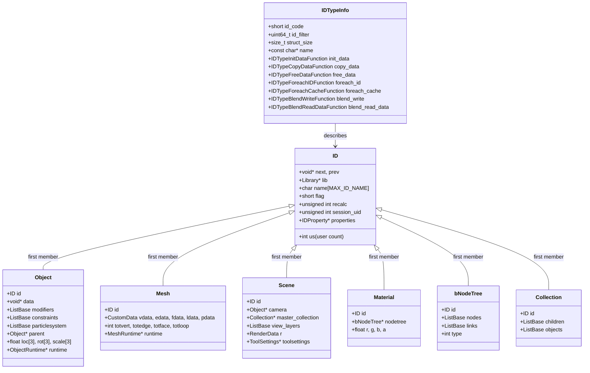
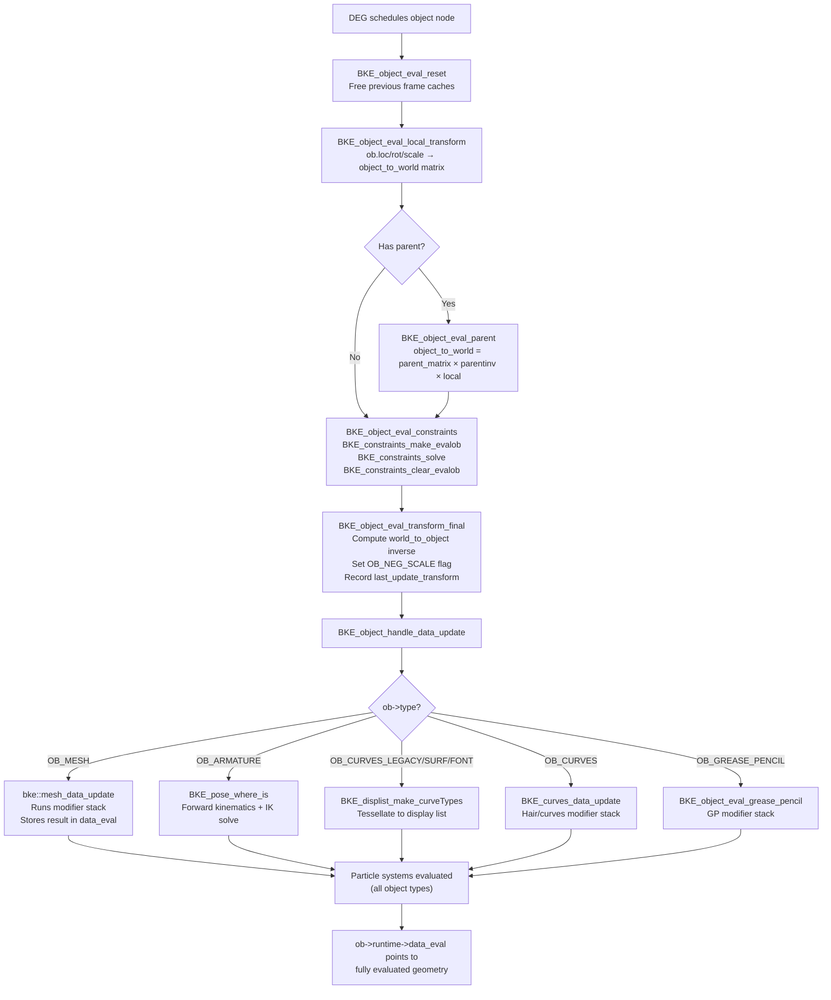
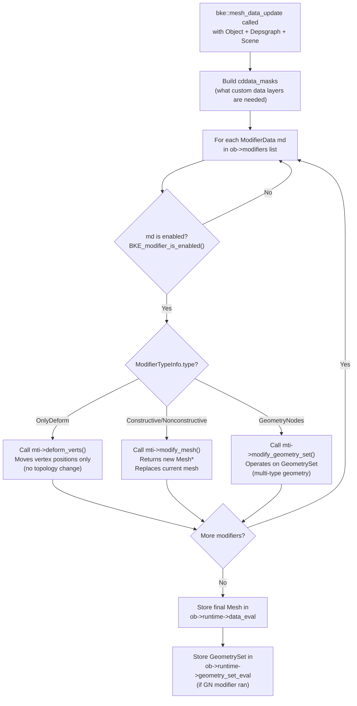
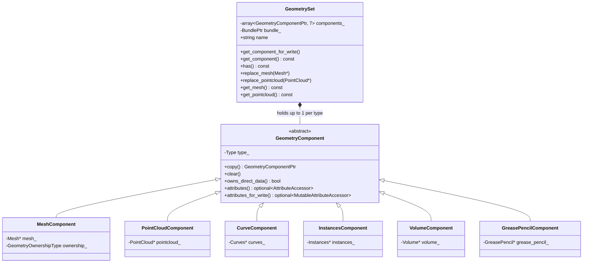

# Blender Kernel (BKE) – Core Logic from Source<!-- omit from toc -->

> - Introduces the Blender Kernel (`blenkernel`) as Blender's central data and logic library.
> - Explains the ID system: the universal data-block abstraction that all asset types share.
> - Traces how `Main` owns every live data-block and how `IDTypeInfo` provides a virtual-function table for each type.
> - Shows the Object evaluation pipeline driven by the Depsgraph: local transform → parent → constraints → data update → modifier stack.
> - Documents the key runtime structures: `ObjectRuntime`, `MeshRuntime`, `GeometrySet`, `ModifierTypeInfo`.
> - This document is high-level and introductory; each section points to the source for a focused deep-dive.

## Table of Contents<!-- omit from toc -->

- [1) Source-file map](#1-source-file-map)
- [2) What is the Blender Kernel?](#2-what-is-the-blender-kernel)
- [3) The ID system – universal data-block abstraction](#3-the-id-system--universal-data-block-abstraction)
  - [3.1 The `ID` base struct](#31-the-id-base-struct)
  - [3.2 `IDTypeInfo` – the data-block vtable](#32-idtypeinfo--the-data-block-vtable)
  - [3.3 Registered ID types](#33-registered-id-types)
- [4) `Main` – the scene database](#4-main--the-scene-database)
  - [4.1 `Main` struct overview](#41-main-struct-overview)
  - [4.2 `G` and `G_MAIN`](#42-g-and-g_main)
  - [4.3 `MainIDRelations` – the ID dependency graph](#43-mainidrelations--the-id-dependency-graph)
- [5) Objects and their evaluation pipeline](#5-objects-and-their-evaluation-pipeline)
  - [5.1 `Object` and `ObjectRuntime`](#51-object-and-objectruntime)
  - [5.2 Object evaluation in the Depsgraph](#52-object-evaluation-in-the-depsgraph)
  - [5.3 Constraint solving](#53-constraint-solving)
- [6) Mesh data and runtime caches](#6-mesh-data-and-runtime-caches)
  - [6.1 Mesh storage layout](#61-mesh-storage-layout)
  - [6.2 `MeshRuntime` – the lazy-computed cache layer](#62-meshruntime--the-lazy-computed-cache-layer)
  - [6.3 Mesh evaluation functions](#63-mesh-evaluation-functions)
- [7) The modifier stack](#7-the-modifier-stack)
  - [7.1 `ModifierTypeInfo` – the modifier vtable](#71-modifiertypeinfo--the-modifier-vtable)
  - [7.2 Modifier type categories](#72-modifier-type-categories)
  - [7.3 Modifier evaluation context](#73-modifier-evaluation-context)
- [8) `GeometrySet` – the modern geometry container](#8-geometryset--the-modern-geometry-container)
  - [8.1 `GeometryComponent` types](#81-geometrycomponent-types)
  - [8.2 Ownership and implicit sharing](#82-ownership-and-implicit-sharing)
- [9) The global callback system](#9-the-global-callback-system)
- [10) Library management (lib\_id, lib\_query, lib\_remap)](#10-library-management-lib_id-lib_query-lib_remap)
- [11) Diagrams](#11-diagrams)
  - [11.1 ID type hierarchy (class diagram)](#111-id-type-hierarchy-class-diagram)
  - [11.2 Object evaluation pipeline (flowchart)](#112-object-evaluation-pipeline-flowchart)
  - [11.3 Modifier stack execution (flowchart)](#113-modifier-stack-execution-flowchart)
  - [11.4 GeometrySet composition (class diagram)](#114-geometryset-composition-class-diagram)
- [12) Short answers](#12-short-answers)
- [13) Source-level conclusion](#13-source-level-conclusion)

---

## 1) Source-file map

| File                                                | Important symbols                                                                                                           | Role                                        |
| --------------------------------------------------- | --------------------------------------------------------------------------------------------------------------------------- | ------------------------------------------- |
| `source/blender/blenkernel/BKE_global.hh`           | `struct Global`, `G`, `U`                                                                                                   | Runtime-global root; holds `G_MAIN`         |
| `source/blender/blenkernel/BKE_main.hh`             | `struct Main`, `MainIDRelations`                                                                                            | Scene database (all data-blocks)            |
| `source/blender/blenkernel/BKE_idtype.hh`           | `IDTypeInfo`, `IDTypeInitDataFunction`, …                                                                                   | Data-block vtable descriptor                |
| `source/blender/blenkernel/intern/idtype.cc`        | `id_type_init()`, `BKE_idtype_init()`                                                                                       | Registers all 40+ ID types                  |
| `source/blender/blenkernel/intern/blender.cc`       | `BKE_blender_globals_init()`, `BKE_blender_free()`                                                                          | Global `G`/`U` setup and teardown           |
| `source/blender/blenkernel/BKE_object.hh`           | `BKE_object_eval_*`, `BKE_object_handle_data_update`                                                                        | Object queries and update entry points      |
| `source/blender/blenkernel/BKE_object_types.hh`     | `struct ObjectRuntime`                                                                                                      | Evaluated object state (transforms, caches) |
| `source/blender/blenkernel/intern/object_update.cc` | `BKE_object_eval_local_transform`, `BKE_object_eval_parent`, `BKE_object_eval_constraints`, `BKE_object_handle_data_update` | Full object evaluation pipeline             |
| `source/blender/blenkernel/BKE_mesh.hh`             | `Mesh`, mesh attribute APIs                                                                                                 | Mesh data storage and accessors             |
| `source/blender/blenkernel/BKE_mesh_types.hh`       | `MeshRuntime`, `MeshNormalDomain`, `LooseEdgeCache`                                                                         | Mesh runtime lazy-cache structs             |
| `source/blender/blenkernel/intern/mesh_evaluate.cc` | `face_center_calc`, normal functions                                                                                        | Low-level mesh geometry evaluation          |
| `source/blender/blenkernel/BKE_modifier.hh`         | `ModifierTypeInfo`, `ModifierEvalContext`, `ModifierTypeType`                                                               | Modifier vtable and evaluation context      |
| `source/blender/blenkernel/intern/modifier.cc`      | `BKE_modifier_*` functions                                                                                                  | Modifier stack management                   |
| `source/blender/blenkernel/BKE_geometry_set.hh`     | `GeometrySet`, `GeometryComponent`                                                                                          | Modern geometry container used by nodes     |
| `source/blender/blenkernel/BKE_constraint.h`        | `BKE_constraints_solve`, `BKE_constraints_make_evalob`                                                                      | Constraint evaluation                       |
| `source/blender/blenkernel/BKE_callbacks.hh`        | `eCbEvent`, `BKE_callback_global_init`                                                                                      | Python-accessible app-level event hooks     |
| `source/blender/blenkernel/BKE_lib_id.hh`           | `BKE_id_new`, `BKE_id_copy`, `BKE_id_free`                                                                                  | Universal data-block creation/copy/free     |
| `source/blender/blenkernel/BKE_lib_query.hh`        | `BKE_library_foreach_ID_link`                                                                                               | Walk all ID pointers of a data-block        |
| `source/blender/blenkernel/BKE_lib_remap.hh`        | `BKE_libblock_remap`                                                                                                        | Remap ID pointers across data-blocks        |

---

## 2) What is the Blender Kernel?

The **Blender Kernel** (`blenkernel`, abbreviated `BKE`) is the largest and most central library in the Blender source tree. It lives at:

```
source/blender/blenkernel/
```

It is the layer that **owns all scene data** and **implements all core logic** that is independent of the user interface, rendering, or physics. Concretely it:

- defines and manages every data-block type (Mesh, Object, Scene, Material, Node Tree, …),
- provides the universal `ID` abstraction that all assets share,
- implements the object evaluation pipeline: local transform → parent → constraints → modifier stack → geometry,
- hosts lazy-computed runtime caches for meshes, objects, and other geometry,
- supplies the global `Main` database that is the root of every open `.blend` file,
- manages data-block copying, referencing, remapping, and library linking,
- publishes a callback system (`BKE_callbacks`) that Python and C++ can both hook into.

BKE deliberately does **not** know about:

- how data is drawn (that is `draw/`, `DRW`),
- how events or operators work (that is `windowmanager/`),
- how rendering works (that is `render/`),
- the dependency graph algorithm (that is `depsgraph/DEG`).

BKE *is* the layer that the Depsgraph calls back into to actually evaluate data. The Depsgraph schedules work; BKE does the work.

---

## 3) The ID system – universal data-block abstraction

### 3.1 The `ID` base struct

Every piece of user-visible data in Blender — a Mesh, an Object, a Material, a Scene — is a **data-block**. All data-blocks share a common `ID` header, defined in:

**File:** `source/blender/makesdna/DNA_ID.h`

```c
typedef struct ID {
  void *next, *prev;          /* linked list within Main */
  struct ID *newid;           /* remapping and copy-on-evaluation scratch */
  struct Library *lib;        /* non-NULL if this data is linked from an external file */
  AssetMetaData *asset_data;  /* non-NULL if this data-block is an asset */
  char name[MAX_ID_NAME];     /* type-prefixed name, e.g. "OBSuzanne" */
  short flag;                 /* LIB_TAG_* flags */
  short tag;                  /* runtime tags */
  int us;                     /* user count (reference count) */
  int icon_id;
  unsigned int recalc;        /* DEG dirty flags */
  unsigned int recalc_up_to_undo_push;
  unsigned int recalc_after_undo_push;
  unsigned int session_uid;   /* unique runtime identifier, stable within a session */
  IDProperty *properties;     /* arbitrary key-value metadata */
  IDOverrideLibrary *override_library;
  struct ID *orig_id;         /* original (non-evaluated) ID for copy-on-evaluation */
  void *py_instance;          /* Python object wrapper */
  void *_pad1;
} ID;
```

Every concrete data-block struct (e.g. `Object`, `Mesh`, `Scene`) begins with `ID id;` as its first member. This means a pointer to any data-block can always be safely cast to `ID *`, and vice-versa.

### 3.2 `IDTypeInfo` – the data-block vtable

Because all data-block types share a common C API, BKE uses a table of function pointers to dispatch type-specific operations. This table is `IDTypeInfo`, defined in:

**File:** `source/blender/blenkernel/BKE_idtype.hh`

```cpp
struct IDTypeInfo {
  /* Identification */
  short       id_code;              /* e.g. ID_OB, ID_ME */
  uint64_t    id_filter;            /* FILTER_ID_OB etc. */
  uint64_t    dependencies_id_types;/* which other ID types this type can reference */
  int         main_listbase_index;  /* position in Main's array of ListBase */
  size_t      struct_size;          /* sizeof(Object), sizeof(Mesh) etc. */
  const char *name;                 /* "Object" */
  const char *name_plural;          /* "Objects" */
  const char *translation_context;
  uint32_t    flags;                /* IDTYPE_FLAGS_* */
  AssetTypeInfo *asset_type_info;

  /* Lifecycle callbacks */
  IDTypeInitDataFunction   init_data;    /* zero/default initialise a new block */
  IDTypeCopyDataFunction   copy_data;    /* deep copy src -> dst */
  IDTypeFreeDataFunction   free_data;    /* free owned sub-data (not the ID itself) */
  IDTypeMakeLocalFunction  make_local;   /* turn a linked block into a local one */

  /* Traversal callbacks */
  IDTypeForeachIDFunction      foreach_id;     /* walk all ID pointers */
  IDTypeForeachCacheFunction   foreach_cache;  /* walk all runtime cache pointers */
  IDTypeForeachPathFunction    foreach_path;   /* walk all embedded file paths */
  IDTypeForeachColorFunction   foreach_working_space_color;

  /* Embedded-ID owner resolution */
  IDTypeEmbeddedOwnerPointerGetFunction owner_pointer_get;

  /* .blend file I/O */
  IDTypeBlendWriteFunction            blend_write;
  IDTypeBlendReadDataFunction         blend_read_data;
  IDTypeBlendReadAfterLiblinkFunction blend_read_after_liblink;
  IDTypeBlendReadUndoPreserve         blend_read_undo_preserve;
  IDTypeLibOverrideApplyPost          lib_override_apply_post;
};
```

This is functionally equivalent to a C++ virtual function table but stored in a global static array. Every operation that must differ per ID type (copy, free, walk ID pointers, serialize) is dispatched through this table.

### 3.3 Registered ID types

All types are registered at startup by `BKE_idtype_init()` → `id_type_init()`:

**File:** `source/blender/blenkernel/intern/idtype.cc`

```cpp
INIT_TYPE(ID_SCE);   /* Scene         */
INIT_TYPE(ID_LI);    /* Library       */
INIT_TYPE(ID_OB);    /* Object        */
INIT_TYPE(ID_ME);    /* Mesh          */
INIT_TYPE(ID_MA);    /* Material      */
INIT_TYPE(ID_TE);    /* Texture       */
INIT_TYPE(ID_IM);    /* Image         */
INIT_TYPE(ID_LA);    /* Light         */
INIT_TYPE(ID_CA);    /* Camera        */
INIT_TYPE(ID_WO);    /* World         */
INIT_TYPE(ID_AC);    /* Action        */
INIT_TYPE(ID_NT);    /* Node Tree     */
INIT_TYPE(ID_BR);    /* Brush         */
INIT_TYPE(ID_GR);    /* Collection    */
INIT_TYPE(ID_AR);    /* Armature      */
INIT_TYPE(ID_PA);    /* Particle Settings */
INIT_TYPE(ID_CV);    /* Curves (Hair) */
INIT_TYPE(ID_PT);    /* Point Cloud   */
INIT_TYPE(ID_VO);    /* Volume        */
INIT_TYPE(ID_GP);    /* Grease Pencil */
/* ... 40+ types total */
```

---

## 4) `Main` – the scene database

### 4.1 `Main` struct overview

`Main` is the root of **all data for a single open `.blend` file**. It contains a `ListBase` (doubly linked list) for every registered ID type.

**File:** `source/blender/blenkernel/BKE_main.hh`

```cpp
struct Main : NonCopyable, NonMovable {
  char filepath[FILE_MAX];    /* absolute path to the .blend file */
  short versionfile;
  short subversionfile;
  bool  recovered;
  bool  is_global_main;       /* true only for G_MAIN */
  bool  is_locked_for_linking;
  bool  is_read_invalid;

  /* ID list storage — one ListBase per registered ID type, indexed by
   * IDTypeInfo.main_listbase_index. Accessed via BKE_main_lists_get(). */
  ListBase scenes;
  ListBase libraries;
  ListBase objects;
  ListBase meshes;
  ListBase curves;
  ListBase metaballs;
  ListBase materials;
  ListBase textures;
  ListBase images;
  ListBase lattices;
  ListBase lights;
  ListBase cameras;
  /* ... one field per ID type, ~40 total */

  BlendThumbnail *blen_thumb;      /* preview thumbnail written to the file */
  MainIDRelations *relations;      /* optional cached ID↔ID dependency map */
  MainColorspace colorspace;       /* scene-linear color space info */

  /* Undo-related state */
  bool is_memfile_undo_written;
  bool is_memfile_undo_flush_needed;
};
```

The key invariant is: **every data-block that exists in Blender is on exactly one list inside some `Main`**. Temporary Mains (used during library linking or undo) have `is_global_main == false`.

### 4.2 `G` and `G_MAIN`

The global `G` of type `struct Global` (defined in `BKE_global.hh` and allocated in `blender.cc`) holds two `Main*` pointers:

```cpp
struct Global {
  Main *main;       /* G_MAIN: current active blend file */
  Main *pr_main;    /* preview main, shared across shader/asset previews */
  ...
};
```

`G_MAIN` is the macro `(G.main)`. All code that needs to traverse the full database typically receives a `Main *bmain` parameter rather than accessing `G.main` directly, so the functions also work on temporary Mains.

### 4.3 `MainIDRelations` – the ID dependency graph

When code needs to know which IDs reference which other IDs (e.g. to find users or to remap pointers), BKE lazily builds `MainIDRelations`:

**File:** `source/blender/blenkernel/BKE_main.hh`

```cpp
struct MainIDRelations {
  /* Map: ID* → MainIDRelationsEntry (contains both from_ids and to_ids lists) */
  Map<const ID *, MainIDRelationsEntry *> *relations_from_pointers;
  short flag;  /* MAINIDRELATIONS_INCLUDE_UI etc. */
  BLI_mempool *entry_items_pool;
};
```

Each entry records all IDs that **use** the given ID (`from_ids`) and all IDs **used by** the given ID (`to_ids`). Building the map is driven by calling `IDTypeInfo::foreach_id` on every data-block.

---

## 5) Objects and their evaluation pipeline

### 5.1 `Object` and `ObjectRuntime`

`Object` (DNA type `ID_OB`) is the scene-graph node. It holds a reference to its data (`Object::data`, e.g. a `Mesh*`) and carries the transform stack, constraints, modifier list, and particle systems. The **evaluated** state lives separately in `ObjectRuntime`, which is **never written to disk**:

**File:** `source/blender/blenkernel/BKE_object_types.hh`

```cpp
struct ObjectRuntime {
  float4x4 object_to_world;     /* final world transform (all parents + constraints applied) */
  float4x4 world_to_object;     /* inverse of object_to_world, kept in sync */

  ID   *data_orig;              /* pointer to the original (pre-evaluation) data block */
  ID   *data_eval;              /* fully modified/evaluated data (all modifiers applied) */
  GeometrySet *geometry_set_eval; /* when evaluation yields multiple geometry types */

  Mesh *mesh_deform_eval;       /* deform-only modifier result (for editing) */
  Mesh *editmesh_eval_cage;     /* edit-mode cage mesh */

  std::optional<Bounds<float3>> bounds_eval; /* cached world-space bounding box */

  uint64_t last_update_transform; /* DEG update counter when transform was last computed */
  uint64_t last_update_geometry;  /* DEG update counter when geometry was last computed */
  uint64_t last_update_shading;   /* DEG update counter when shading was last computed */

  SculptSession *sculpt_session;  /* sculpt/paint runtime state */
  CurveCache     *curve_cache;    /* curve-specific evaluation cache */
};
```

The key design: the original `Object` is never mutated by evaluation; the Depsgraph creates a **copy-on-evaluation** shadow object and all results go into that shadow's `runtime`.

### 5.2 Object evaluation in the Depsgraph

Object evaluation is split into discrete callbacks that the Depsgraph calls in topological order. All are in:

**File:** `source/blender/blenkernel/intern/object_update.cc`

**Step 1 – Reset:**

```cpp
void BKE_object_eval_reset(Object *ob_eval)
{
  BKE_object_free_derived_caches(ob_eval);
}
```

Frees the previous frame's caches so stale data never lingers.

**Step 2 – Local transform:**

```cpp
void BKE_object_eval_local_transform(Depsgraph *depsgraph, Object *ob)
{
  /* Converts ob->loc, ob->rot, ob->scale into ob->runtime->object_to_world */
  BKE_object_to_mat4(ob, ob->runtime->object_to_world.ptr());
}
```

**Step 3 – Parent:**

```cpp
void BKE_object_eval_parent(Depsgraph *depsgraph, Object *ob)
{
  float totmat[4][4];
  BKE_object_get_parent_matrix(ob, ob->parent, totmat);
  mul_m4_m4m4(tmat, totmat, ob->parentinv);
  mul_m4_m4m4(ob->runtime->object_to_world.ptr(), tmat, locmat);
}
```

Multiplies the parent's world matrix by the parent-inverse to get the effective world transform of this object.

**Step 4 – Constraints:**

```cpp
void BKE_object_eval_constraints(Depsgraph *depsgraph, Scene *scene, Object *ob)
{
  float ctime = BKE_scene_ctime_get(scene);
  bConstraintOb *cob = BKE_constraints_make_evalob(
      depsgraph, scene, ob, nullptr, CONSTRAINT_OBTYPE_OBJECT);
  BKE_constraints_solve(depsgraph, &ob->constraints, cob, ctime);
  BKE_constraints_clear_evalob(cob);
}
```

**Step 5 – Final transform:**

```cpp
void BKE_object_eval_transform_final(Depsgraph *depsgraph, Object *ob)
{
  invert_m4_m4_safe(ob->runtime->world_to_object.ptr(), ob->object_to_world().ptr());
  /* Set OB_NEG_SCALE flag if determinant is negative */
  ob->runtime->last_update_transform = DEG_get_update_count(depsgraph);
}
```

**Step 6 – Data update (geometry + modifier stack):**

```cpp
void BKE_object_handle_data_update(Depsgraph *depsgraph, Scene *scene, Object *ob)
{
  switch (ob->type) {
    case OB_MESH:    bke::mesh_data_update(*depsgraph, *scene, *ob, cddata_masks); break;
    case OB_ARMATURE: BKE_pose_where_is(depsgraph, scene, ob); break;
    case OB_MBALL:   BKE_mball_data_update(depsgraph, scene, ob); break;
    case OB_CURVES_LEGACY:
    case OB_SURF:
    case OB_FONT:    BKE_displist_make_curveTypes(depsgraph, scene, ob, for_render); break;
    case OB_LATTICE: BKE_lattice_modifiers_calc(depsgraph, scene, ob); break;
    case OB_CURVES:  BKE_curves_data_update(depsgraph, scene, ob); break;
    case OB_POINTCLOUD: BKE_pointcloud_data_update(depsgraph, scene, ob); break;
    case OB_VOLUME:  BKE_volume_data_update(depsgraph, scene, ob); break;
    case OB_GREASE_PENCIL: BKE_object_eval_grease_pencil(depsgraph, scene, ob); break;
  }
  /* Particle systems are evaluated last, for all object types. */
}
```

This is where the modifier stack runs for mesh objects (inside `bke::mesh_data_update`).

### 5.3 Constraint solving

Constraint evaluation uses an intermediate object `bConstraintOb` that wraps the target matrix:

- `BKE_constraints_make_evalob` allocates a `bConstraintOb` and copies the current transform.
- `BKE_constraints_solve` iterates `ob->constraints`, calls each constraint's `evaluate` callback, and accumulates the result.
- `BKE_constraints_clear_evalob` writes the final solved matrix back to the object.

---

## 6) Mesh data and runtime caches

### 6.1 Mesh storage layout

`Mesh` stores geometry as **SoA (Structure of Arrays)** using the **Attribute API** (`BKE_attribute.hh`). The canonical accessors are:

```cpp
/* Vertex positions */
Span<float3>     Mesh::vert_positions() const;
MutableSpan<float3> Mesh::vert_positions_for_write();

/* Edge endpoints */
Span<int2>       Mesh::edges() const;

/* Face → corner offsets (CSR format) */
OffsetIndices<int> Mesh::faces() const;
Span<int>          Mesh::face_offsets() const;

/* Corner → vertex index */
Span<int>        Mesh::corner_verts() const;
/* Corner → edge index */
Span<int>        Mesh::corner_edges() const;
```

All other per-vertex, per-edge, per-face, and per-corner attributes (UVs, vertex colors, normals, custom layers) are stored in `CustomData` blocks and accessed uniformly through the attribute system.

### 6.2 `MeshRuntime` – the lazy-computed cache layer

**File:** `source/blender/blenkernel/BKE_mesh_types.hh`

```cpp
struct MeshRuntime {
  Mesh *mesh_eval;               /* evaluated mesh cached here to share across object instances */
  Mutex eval_mutex;              /* protects mesh_eval during concurrent access */

  std::shared_ptr<BMEditMesh> edit_mesh; /* BMesh for edit-mode (shared, not owned for eval) */

  SharedCache<Bounds<float3>> bounds_cache;         /* lazily computed AABB */
  TrianglesCache corner_tris_cache;                  /* lazily triangulated faces */
  SharedCache<Array<int>> corner_tri_faces_cache;   /* tri → original face index */

  /* BVH trees (9 variants for different element/hidden combinations) */
  SharedCache<std::unique_ptr<BVHTree, BVHTreeDeleter>> bvh_cache_verts;
  SharedCache<std::unique_ptr<BVHTree, BVHTreeDeleter>> bvh_cache_faces;
  /* ... */

  SharedCache<VectorSet<int>> used_material_indices;
  draw::MeshBatchCache *batch_cache;   /* GPU draw data, owned by the Draw module */

  LooseEdgeCache loose_edges_cache;    /* cached loose-edge map */
  LooseVertCache loose_verts_cache;    /* cached loose-vert map */

  /* Normal caches, per domain */
  NormalsCache vert_normals_cache;
  NormalsCache face_normals_cache;
  /* ... */
};
```

Every cache is tagged dirty when the underlying data changes, and rebuilt lazily on the next access. The `SharedCache<T>` wrapper handles thread-safety and copy-on-write sharing between mesh instances.

### 6.3 Mesh evaluation functions

**File:** `source/blender/blenkernel/intern/mesh_evaluate.cc`

```cpp
/* Low-level geometry primitives */
float3 face_center_calc(Span<float3> vert_positions, Span<int> face_verts);
float  face_area_calc(Span<float3> vert_positions, Span<int> face_verts);
float3 face_normal_calc(Span<float3> vert_positions, Span<int> face_verts);

/* Normal computation entry points (called through BKE_mesh_normals_ensure) */
void   Mesh::vert_normals();   /* vertex normals, mixed from face normals */
void   Mesh::face_normals();   /* per-face normals from cross product */
void   Mesh::corner_normals(); /* split normals respecting sharp edges */
```

The mesh normal API automatically picks the correct `MeshNormalDomain` (`Face`, `Point`, or `Corner`) depending on whether the mesh has sharp edges or custom normals.

---

## 7) The modifier stack

### 7.1 `ModifierTypeInfo` – the modifier vtable

Each modifier type is described by a `ModifierTypeInfo` struct, analogous to `IDTypeInfo` but for modifiers:

**File:** `source/blender/blenkernel/BKE_modifier.hh`

```cpp
struct ModifierTypeInfo {
  char idname[64];   /* unique panel ID prefix */
  char name[64];     /* user-visible name */
  char struct_name[64]; /* DNA struct name for serialization */

  ModifierTypeType type;  /* OnlyDeform | Constructive | Nonconstructive | … */
  ModifierTypeFlag flags; /* AcceptsMesh | AcceptsCVs | SupportsEditmode | … */

  /* Core evaluation callbacks */
  void (*init_data)(ModifierData *md);
  void (*free_data)(ModifierData *md);
  void (*copy_data)(const ModifierData *md, ModifierData *target, int flag);
  bool (*is_disabled)(const Scene *scene, ModifierData *md, bool useRenderParams);
  bool (*depends_on_time)(Scene *scene, ModifierData *md);

  /** Deformation-only path: moves vertex positions without changing topology. */
  void (*deform_verts)(ModifierTypeInfo *mti,
                       const ModifierEvalContext *ctx,
                       Mesh *mesh,
                       float (*vertexCos)[3],
                       int numVerts);

  /** Full geometry path: returns a new or modified Mesh. */
  Mesh *(*modify_mesh)(ModifierTypeInfo *mti,
                       const ModifierEvalContext *ctx,
                       Mesh *mesh);

  /** Geometry Nodes path: operates on a GeometrySet. */
  void (*modify_geometry_set)(ModifierTypeInfo *mti,
                              const ModifierEvalContext *ctx,
                              bke::GeometrySet *geometry_set);

  /* Depsgraph integration */
  void (*update_depsgraph)(ModifierTypeInfo *mti, const ModifierUpdateDepsgraphContext *ctx);
  void (*foreach_ID_link)(ModifierTypeInfo *mti, Object *ob, IDWalkFunc walk, void *user_data);
};
```

### 7.2 Modifier type categories

```cpp
enum class ModifierTypeType {
  None,            /* No-op (placeholder) */
  OnlyDeform,      /* Moves verts, preserves topology; e.g. Armature, Lattice, Cast */
  Constructive,    /* Adds geometry; e.g. Array, Bevel, Solidify */
  Nonconstructive, /* Can add or remove geometry; e.g. Boolean, Decimate */
  DeformOrConstruct, /* Either path (Particle System) */
  NonGeometrical,  /* Changes custom data only; e.g. UVProject, VertexWeightEdit */
};
```

### 7.3 Modifier evaluation context

Every modifier call receives a `ModifierEvalContext` so it can access the Depsgraph, the owning object, and control render vs. viewport quality:

```cpp
struct ModifierEvalContext {
  Depsgraph      *depsgraph;
  Object         *object;
  ModifierApplyFlag flag;  /* MOD_APPLY_RENDER | MOD_APPLY_USECACHE | … */
};
```

The modifier evaluation loop (inside `bke::mesh_data_update`) iterates `Object::modifiers`, checks `is_disabled`, chooses `deform_verts` vs. `modify_mesh` vs. `modify_geometry_set`, and builds `ob->runtime->data_eval` step by step.

---

## 8) `GeometrySet` – the modern geometry container

### 8.1 `GeometryComponent` types

`GeometrySet` is a heterogeneous container introduced for Geometry Nodes (but also used for evaluated object output). It holds at most one `GeometryComponent` of each of the seven component types:

**File:** `source/blender/blenkernel/BKE_geometry_set.hh`

```cpp
enum class GeometryComponent::Type {
  Mesh       = 0,   /* MeshComponent        wraps Mesh*         */
  PointCloud = 1,   /* PointCloudComponent  wraps PointCloud*   */
  Instance   = 2,   /* InstancesComponent   wraps Instances     */
  Volume     = 3,   /* VolumeComponent      wraps Volume*       */
  Curve      = 4,   /* CurveComponent       wraps Curves*       */
  Edit       = 5,   /* EditDataComponent    edit-mode hints     */
  GreasePencil=6,   /* GreasePencilComponent wraps GreasePencil**/
};
```

Each component implements the **Attribute API** — a unified way to read and write named attributes at any domain (vertex, edge, face, face-corner, spline, instance):

```cpp
class GeometryComponent {
 public:
  virtual std::optional<AttributeAccessor>        attributes() const;
  virtual std::optional<MutableAttributeAccessor> attributes_for_write();
  virtual GeometryComponentPtr copy() const = 0;
  virtual void clear() = 0;
  virtual bool owns_direct_data() const = 0;
  virtual void ensure_owns_direct_data() = 0;
};
```

### 8.2 Ownership and implicit sharing

`GeometrySet` uses **implicit sharing** (`ImplicitSharingPtr<>`) so that copying a `GeometrySet` is cheap — components are reference-counted and only deep-copied when a write is requested:

```cpp
struct GeometrySet {
  /* Indexed by GeometryComponent::Type; up to 7 slots */
  std::array<GeometryComponentPtr, GEO_COMPONENT_TYPE_ENUM_SIZE> components_;

  /* Typed convenience accessors */
  template<typename Component> Component &get_component_for_write();
  template<typename Component> const Component *get_component() const;
  template<typename Component> bool has() const;
};
```

When a Geometry Nodes modifier calls `modify_geometry_set`, it receives a `GeometrySet` by reference and can replace, add, or mutate components. The final `GeometrySet` is stored as `ob->runtime->geometry_set_eval`.

---

## 9) The global callback system

BKE provides a Python-accessible global hook system so both C++ and Python scripts can respond to application-level events.

**File:** `source/blender/blenkernel/BKE_callbacks.hh`

```cpp
enum eCbEvent {
  BKE_CB_EVT_FRAME_CHANGE_PRE,
  BKE_CB_EVT_FRAME_CHANGE_POST,
  BKE_CB_EVT_RENDER_PRE,
  BKE_CB_EVT_RENDER_POST,
  BKE_CB_EVT_RENDER_COMPLETE,
  BKE_CB_EVT_RENDER_CANCEL,
  BKE_CB_EVT_LOAD_PRE,
  BKE_CB_EVT_LOAD_POST,
  BKE_CB_EVT_SAVE_PRE,
  BKE_CB_EVT_SAVE_POST,
  BKE_CB_EVT_UNDO_PRE,
  BKE_CB_EVT_UNDO_POST,
  BKE_CB_EVT_REDO_PRE,
  BKE_CB_EVT_REDO_POST,
  BKE_CB_EVT_DEPSGRAPH_UPDATE_PRE,
  BKE_CB_EVT_DEPSGRAPH_UPDATE_POST,
  BKE_CB_EVT_OBJECT_BAKE_PRE,
  BKE_CB_EVT_OBJECT_BAKE_COMPLETE,
  BKE_CB_EVT_OBJECT_BAKE_CANCEL,
  BKE_CB_EVT_COMPOSITE_PRE,
  BKE_CB_EVT_COMPOSITE_POST,
  BKE_CB_EVT_COMPOSITE_CANCEL,
  BKE_CB_EVT_ANIMATION_PLAYBACK_PRE,
  BKE_CB_EVT_ANIMATION_PLAYBACK_POST,
  BKE_CB_EVT_EXIT_PRE,
  /* ... ~45 events total */
  BKE_CB_EVT_TOT
};
```

- `BKE_callback_global_init()` allocates the list-of-lists.
- `BKE_callback_add(callbacks, func)` registers a C function.
- `BKE_callback_exec(bmain, event)` fires all registered handlers.
- Python handlers are registered via `bpy.app.handlers.frame_change_pre.append(fn)` — the Python binding wraps these same C lists.

---

## 10) Library management (lib_id, lib_query, lib_remap)

Three headers cover the "ID lifecycle" part of BKE:

| Header             | Key functions                                                   | Purpose                                                                                                      |
| ------------------ | --------------------------------------------------------------- | ------------------------------------------------------------------------------------------------------------ |
| `BKE_lib_id.hh`    | `BKE_id_new`, `BKE_id_copy`, `BKE_id_free`, `BKE_id_make_local` | Create, copy, free, or localise any data-block by dispatching to `IDTypeInfo` callbacks                      |
| `BKE_lib_query.hh` | `BKE_library_foreach_ID_link`                                   | Walk every `ID *` pointer embedded in a data-block, using `IDTypeInfo::foreach_id`                           |
| `BKE_lib_remap.hh` | `BKE_libblock_remap`, `BKE_libblock_remap_multiple`             | Globally replace all references to one ID with another (or with `nullptr`), used by delete/unlink operations |

The `foreach_id` traversal is the cornerstone of the library system: it is used by library linking, the depsgraph relation builder, the undo system, the garbage-collector (`BKE_main_id_tag_all`), and the override system — all without each of those systems needing to know the internal layout of any specific data-block type.

---

## 11) Diagrams

### 11.1 ID type hierarchy (class diagram)



### 11.2 Object evaluation pipeline (flowchart)



### 11.3 Modifier stack execution (flowchart)



### 11.4 GeometrySet composition (class diagram)



---

## 12) Short answers

**Q: What does BKE actually "own"?**  
All scene data-blocks (every `ID *` that lives in a `Main`). It also owns the evaluation logic that transforms those data-blocks into derived/evaluated results.

**Q: Where does the modifier stack run?**  
Inside `bke::mesh_data_update()` (called from `BKE_object_handle_data_update`), which is triggered by the Depsgraph when an object is dirty and needs re-evaluation.

**Q: How does BKE know what operations a `Mesh` supports vs. what an `Object` supports?**  
Through `IDTypeInfo`. Each type registers a static `IDTypeInfo` struct that carries all type-specific callbacks. `BKE_lib_id.hh` functions dispatch through this table.

**Q: What is the difference between `data_eval` and `geometry_set_eval`?**  
`data_eval` holds the final evaluated geometry as a single ID of the expected type (e.g. `Mesh*`). `geometry_set_eval` is set when Geometry Nodes output a richer result containing multiple component types. Both may coexist; `data_eval` is always set for drawing, `geometry_set_eval` carries the full geometry node output.

**Q: What triggers a BKE evaluation?**  
The Depsgraph. Code calls `DEG_id_tag_update(id, flag)` to mark a data-block dirty, then `BKE_scene_graph_update_tagged(depsgraph, bmain)` (or the equivalent in `wm_event_do_refresh_wm_and_depsgraph`) flushes the graph and calls back into BKE evaluation functions in dependency order.

---

## 13) Source-level conclusion

The Blender Kernel is the **universal data and logic substrate** on which every other Blender subsystem builds:

- The **ID system** (`ID`, `IDTypeInfo`, `Main`) provides a uniform data-block model that handles serialization, user-counting, library linking, and memory management generically for all 40+ data types.
- The **Object evaluation pipeline** (`object_update.cc`) is a sequence of composable steps — local transform, parent, constraints, data — each callable independently by the Depsgraph.
- The **modifier stack** (`modifier.cc`, `ModifierTypeInfo`) is a polymorphic chain that transforms geometry through deform, constructive, and Geometry Nodes paths.
- The **GeometrySet + Attribute API** is the modern geometry abstraction used by Geometry Nodes and the evaluated output of all objects.
- The **callback system** bridges C++ application events to Python scripts.
- The **library system** (`lib_id`, `lib_query`, `lib_remap`) provides the plumbing for any code that needs to traverse, duplicate, or remap the web of `ID *` pointers that holds the scene together.

**Recommended deep-dive order:**

1. `DNA_ID.h` — understand the base `ID` struct in detail.
2. `BKE_idtype.hh` + `intern/idtype.cc` — understand the type system.
3. `BKE_main.hh` + `intern/main.cc` — understand the database.
4. `intern/object_update.cc` — trace a full object evaluation frame.
5. `BKE_modifier.hh` + `intern/modifier.cc` — understand the modifier vtable and stack.
6. `BKE_geometry_set.hh` + `intern/geometry_set.cc` — understand the modern geometry model.
7. `BKE_lib_id.hh` + `BKE_lib_query.hh` + `BKE_lib_remap.hh` — understand the library system.
