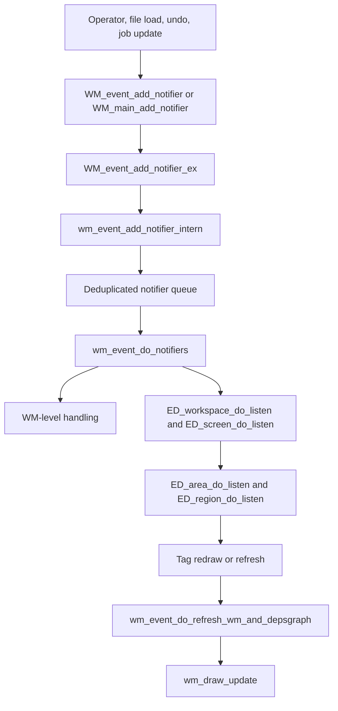

# Blender Notifiers – Source Code Review<!-- omit from toc -->

> - Explains what Blender **notifiers** are at source level and why they exist.
> - Shows how `WM_event_add_notifier()` and `WM_main_add_notifier()` queue change notifications.
> - Traces how `wm_event_do_notifiers()` fans them out to workspace, screen, area, and region listeners.
> - Gives representative source-backed examples for file-read, undo, frame-change, and job updates.

## Table of Contents<!-- omit from toc -->

- [1) Notifier source-file map](#1-notifier-source-file-map)
- [2) What a Blender notifier is](#2-what-a-blender-notifier-is)
  - [2.1 Core definition](#21-core-definition)
  - [2.2 Packed type layout](#22-packed-type-layout)
  - [2.3 Notifier vs event](#23-notifier-vs-event)
- [3) How notifiers are created and queued](#3-how-notifiers-are-created-and-queued)
  - [3.1 Public APIs used by callers](#31-public-apis-used-by-callers)
  - [3.2 Internal queueing and deduplication](#32-internal-queueing-and-deduplication)
- [4) How notifiers are processed](#4-how-notifiers-are-processed)
  - [4.1 Main-loop integration](#41-main-loop-integration)
  - [4.2 Window-manager special handling](#42-window-manager-special-handling)
  - [4.3 Dispatch to listeners in editors and UI regions](#43-dispatch-to-listeners-in-editors-and-ui-regions)
  - [4.4 Targeted updates for `NC_SPACE`](#44-targeted-updates-for-nc_space)
- [5) Representative notifier use cases from the source tree](#5-representative-notifier-use-cases-from-the-source-tree)
  - [5.1 File load and save](#51-file-load-and-save)
  - [5.2 Undo and redo](#52-undo-and-redo)
  - [5.3 Frame changes and animation](#53-frame-changes-and-animation)
  - [5.4 Background jobs and progress](#54-background-jobs-and-progress)
- [6) Mermaid diagram: notifier lifecycle](#6-mermaid-diagram-notifier-lifecycle)
- [7) Source-level conclusion](#7-source-level-conclusion)
  - [Short answer](#short-answer)

---

## 1) Notifier source-file map

| File | Important symbols | Role in the notifier system |
| --- | --- | --- |
| `source/blender/windowmanager/WM_api.hh` | `WM_event_add_notifier_ex`, `WM_event_add_notifier`, `WM_main_add_notifier` | Public API used by the rest of Blender |
| `source/blender/windowmanager/WM_types.hh` | `wmNotifier`, `NC_*`, `ND_*`, `NA_*` | Core notifier structure and type masks |
| `source/blender/windowmanager/intern/wm_event_system.cc` | `wm_event_add_notifier_intern`, `wm_event_do_notifiers` | Queueing, deduplication, and delivery |
| `source/blender/editors/screen/area.cc` | `ED_region_do_listen`, `ED_area_do_listen` | Region/area listeners that react to notifiers |
| `source/blender/editors/screen/screen_edit.cc` | `ED_screen_do_listen` | Screen-level listener reactions |
| `source/blender/windowmanager/intern/wm_files.cc` | `WM_event_add_notifier(C, NC_WM | ND_FILEREAD, ...)` | File-read / save examples |
| `source/blender/editors/undo/ed_undo.cc` | `WM_event_add_notifier(C, NC_WM | ND_UNDO, ...)` | Undo / redo notifier examples |
| `source/blender/editors/screen/screen_ops.cc` | `WM_event_add_notifier(C, NC_SCENE | ND_FRAME, scene)` | Frame-change notifier examples |
| `source/blender/windowmanager/intern/wm_jobs.cc` | `WM_event_add_notifier_ex(..., NC_WM | ND_JOB, ...)` | Job progress / completion notifications |

---

## 2) What a Blender notifier is

### 2.1 Core definition

At source level, Blender uses `wmNotifier` objects to represent **"something changed"** messages.

**File:** `source/blender/windowmanager/WM_types.hh`

```cpp
struct wmNotifier {
  wmNotifier *next, *prev;

  const wmWindow *window;

  unsigned int category, data, subtype, action;

  void *reference;
};
```

A notifier is therefore a **small change record** that can optionally be tied to:

- a specific window,
- a category (`NC_*`),
- a data subtype (`ND_*`),
- an action (`NA_*`),
- and a reference pointer to the relevant object.

### 2.2 Packed type layout

Blender documents the packing scheme directly in the same file:

```cpp
/* 4 levels
 *
 * 0xFF000000; category
 * 0x00FF0000; data
 * 0x0000FF00; data subtype (unused?)
 * 0x000000FF; action
 */
```

Representative definitions in `WM_types.hh` include:

```cpp
#define NC_WM (1 << 24)
#define NC_WINDOW (2 << 24)
#define NC_SCREEN (4 << 24)
#define NC_SCENE (5 << 24)
#define NC_SPACE (16 << 24)

#define ND_FILEREAD (1 << 16)
#define ND_FILESAVE (2 << 16)
#define ND_UNDO (6 << 16)
#define ND_JOB (5 << 16)

#define NA_EDITED 1
```

So a value such as:

```cpp
NC_SCENE | ND_FRAME
```

means: **scene-related change, specifically a frame-change notification**.

### 2.3 Notifier vs event

This distinction is important:

| Type | Purpose |
| --- | --- |
| `wmEvent` | Raw input and interaction events, such as mouse/keyboard activity |
| `wmNotifier` | Post-change notification saying some part of the UI/data should react or refresh |

So notifiers are **not the same thing as input events**. They are the WM's decoupled refresh/update messaging mechanism.

---

## 3) How notifiers are created and queued

### 3.1 Public APIs used by callers

Most code in Blender uses one of these entry points:

**File:** `source/blender/windowmanager/intern/wm_event_system.cc`

```cpp
void WM_event_add_notifier(const bContext *C, uint type, void *reference)
{
  WM_event_add_notifier_ex(CTX_wm_manager(C), CTX_wm_window(C), type, reference);
}

void WM_main_add_notifier(uint type, void *reference)
{
  Main *bmain = G_MAIN;
  wmWindowManager *wm = static_cast<wmWindowManager *>(bmain->wm.first);

  WM_event_add_notifier_ex(wm, nullptr, type, reference);
}
```

Use them like this:

- `WM_event_add_notifier(C, ...)` when the current `bContext` is available,
- `WM_main_add_notifier(...)` when code wants a more global / window-agnostic notification.

### 3.2 Internal queueing and deduplication

The actual queue insertion happens in `wm_event_add_notifier_intern()`.

**File:** `source/blender/windowmanager/intern/wm_event_system.cc`

```cpp
static void wm_event_add_notifier_intern(wmWindowManager *wm,
                                         const wmWindow *win,
                                         uint type,
                                         void *reference)
{
  wmNotifier note_test = {nullptr};

  note_test.window = win;
  note_test.category = type & NOTE_CATEGORY;
  note_test.data = type & NOTE_DATA;
  note_test.subtype = type & NOTE_SUBTYPE;
  note_test.action = type & NOTE_ACTION;
  note_test.reference = reference;

  wm->runtime->notifier_queue_set.lookup_key_or_add_cb(&note_test, [&]() {
    wmNotifier *note = MEM_new<wmNotifier>(__func__);
    *note = note_test;
    BLI_addtail(&wm->runtime->notifier_queue, note);
    return note;
  });
}
```

This shows two important design choices:

1. the packed integer type is split into `category`, `data`, `subtype`, and `action`,
2. the notifier is inserted through a **set-backed deduplicating queue**.

The hash/equality helpers explicitly note that the queue comparison ignores `window`:

```cpp
/**
 * Hash for #wmWindowManager.notifier_queue_set, ignores `window`.
 */
```

So Blender tries to avoid accumulating redundant notifier entries.

---

## 4) How notifiers are processed

### 4.1 Main-loop integration

The notifier pass runs directly in the WM main loop.

**File:** `source/blender/windowmanager/intern/wm.cc`

```cpp
while (true) {
  wm_window_events_process(C);

  wm_event_do_handlers(C);
  wm_event_do_notifiers(C);

  wm_draw_update(C);
}
```

This makes the notifier phase the bridge between:

- input/operator activity, and
- redraw/refresh propagation.

### 4.2 Window-manager special handling

The central consumer is `wm_event_do_notifiers()`.

**File:** `source/blender/windowmanager/intern/wm_event_system.cc`

```cpp
void wm_event_do_notifiers(bContext *C)
{
  GPU_render_begin();
  wm_event_timers_execute(C);
  ...
  for (wmWindow &win : wm->windows) {
    ...
    for (const wmNotifier *note = ...; note; note = note_next) {
      ...
      if (note->category == NC_WM) {
        if (ELEM(note->data, ND_FILEREAD, ND_FILESAVE)) {
          wm->file_saved = 1;
          WM_window_title_refresh(wm, &win);
        }
        else if (note->data == ND_UNDO) {
          ED_preview_restart_work(C);
        }
      }
      ...
    }
  }
}
```

So WM first handles certain global notifier categories itself, including:

- file-read / file-save state,
- undo-side preview refresh,
- workspace/screen changes,
- animation-related updates.

### 4.3 Dispatch to listeners in editors and UI regions

After the WM-level pass, the notifier is delivered through the editor hierarchy.

**File:** `source/blender/windowmanager/intern/wm_event_system.cc`

```cpp
ED_workspace_do_listen(C, note);
ED_screen_do_listen(C, note);

for (ARegion &region : screen->regionbase) {
  ...
  ED_region_do_listen(&region_params);
}

ED_screen_areas_iter (&win, screen, area) {
  ...
  ED_area_do_listen(&area_params);
  for (ARegion &region : area->regionbase) {
    ...
    ED_region_do_listen(&region_params);
  }
}
```

This is the critical architecture point: **notifiers are broadcast into workspace/screen/area/region listeners**, and those listeners decide what to redraw or refresh.

Representative generic listener behavior:

**File:** `source/blender/editors/screen/area.cc`

```cpp
void ED_region_do_listen(wmRegionListenerParams *params)
{
  ARegion *region = params->region;
  const wmNotifier *notifier = params->notifier;

  switch (notifier->category) {
    case NC_WM:
      if (notifier->data == ND_FILEREAD) {
        ED_region_tag_redraw(region);
      }
      break;
    case NC_WINDOW:
      ED_region_tag_redraw(region);
      break;
  }
  ...
}
```

And at screen level:

**File:** `source/blender/editors/screen/screen_edit.cc`

```cpp
void ED_screen_do_listen(bContext *C, const wmNotifier *note)
{
  ...
  switch (note->category) {
    case NC_WINDOW:
      screen->do_draw = true;
      break;
    case NC_SCREEN:
      if (note->action == NA_EDITED) {
        screen->do_draw = screen->do_refresh = true;
      }
      break;
  }
}
```

So the end effect of a notifier is usually one of these:

- tag redraw,
- tag refresh,
- update view state,
- or perform a narrowly scoped editor reaction.

### 4.4 Targeted updates for `NC_SPACE`

`NC_SPACE` notifications can be restricted to the owning space/reference.

**File:** `source/blender/windowmanager/WM_types.hh`

```cpp
/* When passing a space as reference data with this (e.g. `WM_event_add_notifier(..., space)`),
 * the notifier will only be sent to this space. That avoids unnecessary updates for unrelated
 * spaces. */
#define NC_SPACE (16 << 24)
```

The dispatch code respects that optimization:

**File:** `source/blender/windowmanager/intern/wm_event_system.cc`

```cpp
if ((note->category == NC_SPACE) && note->reference) {
  if (!ELEM(note->reference, area->spacedata.first, screen, scene)) {
    continue;
  }
}
```

So notifiers are not always a blind global broadcast. Blender can narrow them to a specific editor space when needed.

---

## 5) Representative notifier use cases from the source tree

### 5.1 File load and save

**File:** `source/blender/windowmanager/intern/wm_files.cc`

```cpp
WM_event_add_notifier(C, NC_WM | ND_FILEREAD, nullptr);
WM_event_add_notifier(C, NC_ASSET | ND_ASSET_LIST_READING, nullptr);
```

This is emitted after reading a `.blend` file so the UI and asset-related systems can react.

### 5.2 Undo and redo

**File:** `source/blender/editors/undo/ed_undo.cc`

```cpp
WM_event_add_notifier(C, NC_WINDOW, nullptr);
WM_event_add_notifier(C, NC_WM | ND_UNDO, nullptr);
```

After an undo/redo step, Blender notifies both general window refresh and the WM undo channel.

### 5.3 Frame changes and animation

**File:** `source/blender/editors/screen/screen_ops.cc`

```cpp
DEG_id_tag_update(&scene->id, ID_RECALC_FRAME_CHANGE);

WM_event_add_notifier(C, NC_SCENE | ND_FRAME, scene);
```

This is a common pattern for time/animation changes: tag data for depsgraph recalculation, then notify editors that the frame changed.

### 5.4 Background jobs and progress

**File:** `source/blender/windowmanager/intern/wm_jobs.cc`

```cpp
if (wm_job->note) {
  WM_event_add_notifier_ex(wm, wm_job->win, wm_job->note, nullptr);
}

if (wm_job->flag & WM_JOB_PROGRESS) {
  WM_event_add_notifier_ex(wm, wm_job->win, NC_WM | ND_JOB, nullptr);
}
```

And when the job finishes:

```cpp
if (wm_job->endnote) {
  WM_event_add_notifier_ex(wm, wm_job->win, wm_job->endnote, nullptr);
}

WM_event_add_notifier_ex(wm, wm_job->win, NC_WM | ND_JOB, nullptr);
```

So jobs use notifiers to update progress bars, status, and end-of-job refresh behavior without tightly coupling worker code to UI internals.

---

## 6) Mermaid diagram: notifier lifecycle



This matches the source structure closely:

- producers queue a notifier,
- WM processes the queue in the main loop,
- listeners react and tag redraw/refresh,
- then the draw/update pass makes the result visible.

---

## 7) Source-level conclusion

### Short answer

**What are Blender notifiers?**  
They are the Window Manager's **change-notification objects** (`wmNotifier`) used to tell Blender that something in the UI or data model changed.

**How do they work?**  
Code calls `WM_event_add_notifier()` or `WM_main_add_notifier()`, which queues a deduplicated notifier in the WM runtime. Later, `wm_event_do_notifiers()` processes that queue and dispatches it to workspace, screen, area, and region listeners.

**Why are they important?**  
They decouple **state changes** from **UI reactions**. Operators, undo, file I/O, and jobs can simply say "this changed", and the editor listeners decide what actually needs redraw or refresh.

**Best source files to open next:**

1. `source/blender/windowmanager/intern/wm_event_system.cc`
2. `source/blender/windowmanager/WM_types.hh`
3. `source/blender/editors/screen/area.cc`
4. `source/blender/editors/screen/screen_edit.cc`
5. `source/blender/windowmanager/intern/wm_files.cc`
