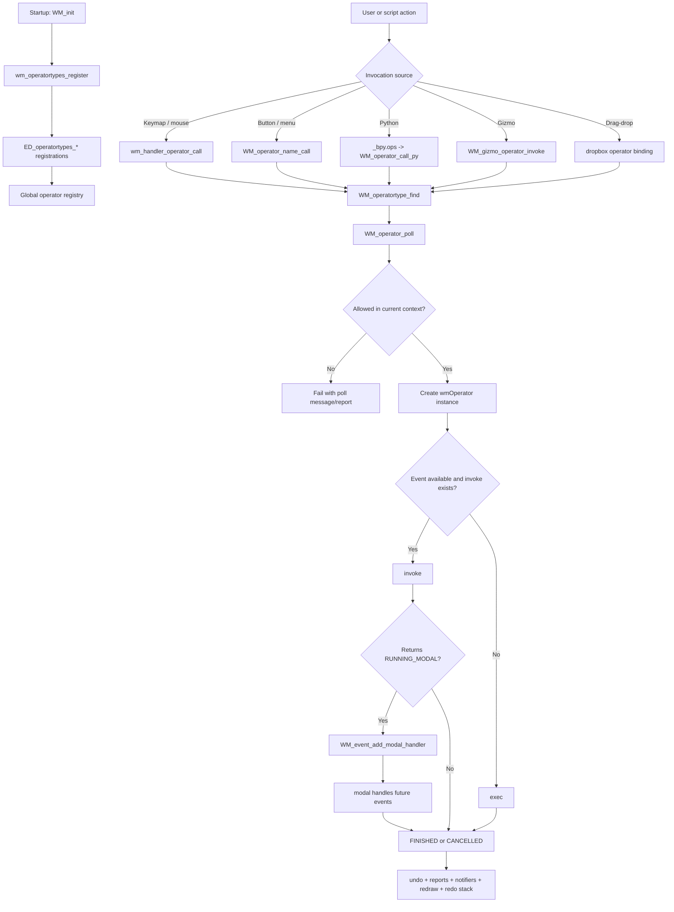
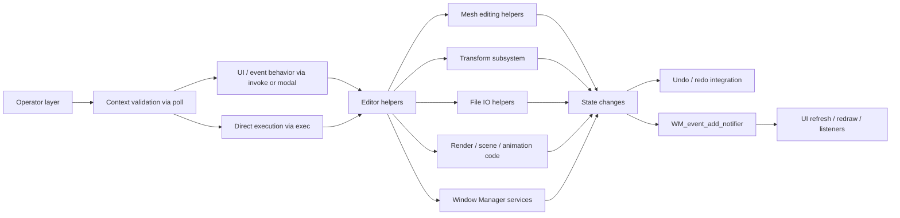

# Blender Operators – Source Code Review<!-- omit from toc -->

> - Explains what Blender's **Operator** system is at source level and why it is the main command layer for user and script actions.
> - Shows where operators are defined, registered, polled, invoked, executed, repeated, and integrated with undo and notifiers.
> - Covers the main roles operators play in Blender: UI commands, hotkeys, modal tools, file operations, Python automation, gizmos, drag-and-drop, and XR actions.
> - Includes source-backed examples and Mermaid diagrams for the operator lifecycle.

## Table of Contents<!-- omit from toc -->

- [1) Operator source-file map](#1-operator-source-file-map)
- [2) What a Blender Operator is](#2-what-a-blender-operator-is)
  - [Core definition objects](#core-definition-objects)
  - [Verified source excerpts](#verified-source-excerpts)
  - [Important idea: operators are command adapters](#important-idea-operators-are-command-adapters)
- [3) Why Blender uses operators](#3-why-blender-uses-operators)
  - [3.1 Main roles in the application](#31-main-roles-in-the-application)
  - [3.2 Major use-case families](#32-major-use-case-families)
- [4) How operators are registered during startup](#4-how-operators-are-registered-during-startup)
- [5) How Blender invokes operators to achieve tasks](#5-how-blender-invokes-operators-to-achieve-tasks)
  - [5.1 Invocation routes](#51-invocation-routes)
  - [5.2 Poll -\> invoke/exec -\> modal -\> finish](#52-poll---invokeexec---modal---finish)
  - [5.3 Undo, redo, reports, and redraw](#53-undo-redo-reports-and-redraw)
- [6) Representative source-backed use cases](#6-representative-source-backed-use-cases)
  - [6.1 Non-modal editor action: mesh select mode](#61-non-modal-editor-action-mesh-select-mode)
  - [6.2 Modal interactive tool: transform translate](#62-modal-interactive-tool-transform-translate)
  - [6.3 File and application command: open main file](#63-file-and-application-command-open-main-file)
  - [6.4 Python automation: `bpy.ops`](#64-python-automation-bpyops)
  - [6.5 Gizmos and drag-drop](#65-gizmos-and-drag-drop)
- [7) Mermaid diagrams](#7-mermaid-diagrams)
  - [7.1 Operator lifecycle in Blender](#71-operator-lifecycle-in-blender)
  - [7.2 Invocation routes and hand-off to subsystems](#72-invocation-routes-and-hand-off-to-subsystems)
- [8) Short Answers](#8-short-answers)
- [9) Source-level conclusion](#9-source-level-conclusion)

---

## 1) Operator source-file map

| File                                                      | Important symbols                                                                                   | Role in the operator system                                                            |
| --------------------------------------------------------- | --------------------------------------------------------------------------------------------------- | -------------------------------------------------------------------------------------- |
| `source/blender/windowmanager/WM_types.hh`                | `wmOperatorType`, `OPTYPE_*`, `wm::OpCallContext`                                                   | Defines operator type callbacks, flags, UI hooks, and call contexts                    |
| `source/blender/makesdna/DNA_windowmanager_types.h`       | `wmOperator`                                                                                        | Defines the runtime operator instance and stored properties                            |
| `source/blender/windowmanager/WM_api.hh`                  | `WM_operator_name_call`, `WM_operator_poll`, `WM_event_add_modal_handler`, `WM_operatortype_append` | Public API used to register and invoke operators                                       |
| `source/blender/windowmanager/intern/wm_operator_type.cc` | `WM_operatortype_find()`, `WM_operatortype_append()`                                                | Operator registry and lookup table                                                     |
| `source/blender/windowmanager/intern/wm_event_system.cc`  | `WM_operator_poll()`, `wm_operator_invoke()`, `wm_handler_operator_call()`                          | Polling, invocation, modal routing, and event-to-operator dispatch                     |
| `source/blender/windowmanager/intern/wm_operators.cc`     | `wm_operatortypes_register()`                                                                       | Registers core Window Manager operators such as search, menus, splash, open/save, quit |
| `source/blender/windowmanager/intern/wm_init_exit.cc`     | `WM_init()`                                                                                         | Startup path that initializes the operator system                                      |
| `source/blender/editors/space_api/spacetypes.cc`          | `ED_operatortypes_*()`                                                                              | Registers operator families for mesh, animation, render, paint, scene, IO, etc.        |
| `source/blender/python/intern/bpy_operator.cc`            | `_bpy.ops`, `pyop_call()`                                                                           | Python bridge for `bpy.ops.*`                                                          |
| `source/blender/windowmanager/gizmo/intern/wm_gizmo.cc`   | `WM_gizmo_operator_invoke()`                                                                        | Lets gizmos launch operators                                                           |
| `source/blender/windowmanager/intern/wm_dragdrop.cc`      | `WM_dropbox_add()`                                                                                  | Lets drag-and-drop targets resolve and run operators                                   |

---

## 2) What a Blender Operator is

At source level, a **Blender Operator** is Blender's main **command/action abstraction**.

It represents a user-facing or script-facing action such as:

- opening a file,
- selecting mesh elements,
- moving or rotating objects,
- invoking a menu or panel,
- running a modal tool,
- executing a Python-exposed action through `bpy.ops`.

In other words, operators are the **application command layer** that sits between:

1. **UI / keymaps / events / Python**, and
2. **the lower-level editor, kernel, render, or file-handling functions** that do the real work.

### Core definition objects

There are two important structures:

- **`wmOperatorType`** = the **static type definition** of an operator.
  - stores the operator name, id, description, flags, RNA properties, and callbacks such as `poll`, `invoke`, `exec`, and `modal`.
- **`wmOperator`** = the **runtime instance** of a currently running or stored operator.
  - stores the current property values, runtime data, reports, macro children, and a pointer to its type.

### Verified source excerpts

**File:** `source/blender/windowmanager/WM_types.hh`

```cpp
struct wmOperatorType {
  const char *name = nullptr;
  const char *idname = nullptr;
  const char *description = nullptr;

  wmOperatorStatus (*exec)(bContext *C, wmOperator *op) = nullptr;
  bool (*check)(bContext *C, wmOperator *op) = nullptr;
  wmOperatorStatus (*invoke)(bContext *C, wmOperator *op, const wmEvent *event) = nullptr;
  void (*cancel)(bContext *C, wmOperator *op) = nullptr;
  wmOperatorStatus (*modal)(bContext *C, wmOperator *op, const wmEvent *event) = nullptr;
  bool (*poll)(bContext *C) = nullptr;
  bool (*poll_property)(const bContext *C, wmOperator *op, const PropertyRNA *prop) = nullptr;
  void (*ui)(bContext *C, wmOperator *op) = nullptr;

  StructRNA *srna = nullptr;
  IDProperty *last_properties = nullptr;
  PropertyRNA *prop = nullptr;
  ListBaseT<wmOperatorTypeMacro> macro = {};
  wmKeyMap *modalkeymap = nullptr;
};
```

> **5.1.1 update:** The struct above is a simplified excerpt. In 5.1.1 `wmOperatorType` has additional members:
>
> ```cpp
> struct wmOperatorType {
>   struct TypeData { virtual ~TypeData() = default; };  // base for subclassed type-data
>
>   const char *name = nullptr;
>   const char *idname = nullptr;
>   const char *translation_context = nullptr;   // NEW: for i18n lookup
>   const char *description = nullptr;
>   const char *undo_group = nullptr;             // NEW: groups operators for undo
>
>   wmOperatorStatus (*exec)(...) = nullptr;
>   bool (*check)(...) = nullptr;
>   wmOperatorStatus (*invoke)(...) = nullptr;
>   void (*cancel)(...) = nullptr;
>   wmOperatorStatus (*modal)(...) = nullptr;
>   bool (*poll)(bContext *C) = nullptr;
>   bool (*poll_property)(...) = nullptr;
>   void (*ui)(bContext *C, wmOperator *op) = nullptr;
>   bool (*ui_poll)(wmOperatorType *ot, PointerRNA *ptr) = nullptr;   // NEW: gate for redo panel
>   std::string (*get_name)(wmOperatorType *ot, PointerRNA *ptr) = nullptr;       // NEW
>   std::string (*get_description)(bContext *C, wmOperatorType *ot, PointerRNA *ptr) = nullptr; // NEW
>   bool (*depends_on_cursor)(bContext &C, wmOperatorType &ot, PointerRNA *ptr) = nullptr;      // NEW
>
>   StructRNA *srna = nullptr;
>   IDProperty *last_properties = nullptr;
>   PropertyRNA *prop = nullptr;
>   ListBaseT<wmOperatorTypeMacro> macro = {};
>   wmKeyMap *modalkeymap = nullptr;
>   bool (*pyop_poll)(bContext *C, wmOperatorType *ot) = nullptr;   // Python-specific poll
>   std::unique_ptr<TypeData> custom_data;   // NEW: arbitrary type-specific static data
>   ExtensionRNA rna_ext = {};
>   int cursor_pending = 0;    // cursor shown while waiting for click (DEPENDS_ON_CURSOR)
>   short flag = 0;
> };
> ```

**File:** `source/blender/makesdna/DNA_windowmanager_types.h`

```cpp
struct wmOperator {
  char idname[64] = "";
  IDProperty *properties = nullptr;

  struct wmOperatorType *type = nullptr;
  void *customdata = nullptr;
  void *py_instance = nullptr;

  struct PointerRNA *ptr = nullptr;
  struct ReportList *reports = nullptr;

  ListBaseT<wmOperator> macro = {nullptr, nullptr};
  struct wmOperator *opm = nullptr;
};
```

> **5.1.1 update:** The struct has additional fields in 5.1.1:
>
> ```cpp
> struct wmOperator {
>   struct wmOperator *next = nullptr, *prev = nullptr;  // NEW: linked-list pointers
>
>   char idname[64] = "";
>   IDProperty *properties = nullptr;
>
>   struct wmOperatorType *type = nullptr;
>   void *customdata = nullptr;
>   void *py_instance = nullptr;
>
>   struct PointerRNA *ptr = nullptr;
>   struct ReportList *reports = nullptr;
>
>   ListBaseT<wmOperator> macro = {nullptr, nullptr};
>   struct wmOperator *opm = nullptr;
>   ui::Layout *layout = nullptr;   // NEW: runtime layout pointer for drawing
>   short flag = 0;
>   char _pad[6] = {};
> };
> ```

This shows the essential split:

- **type definition** (`wmOperatorType`), and
- **live execution object** (`wmOperator`).

### Important idea: operators are command adapters

A key architectural point from the source is this:

> Operators usually **do not contain all the low-level implementation themselves**. They often act as **high-level command adapters** that validate context, gather properties, manage UI/modal behavior, and then call deeper editor/kernel/file functions.

Representative examples:

| Operator                 | High-level role            | Lower-level helpers it uses                                                                       |
| ------------------------ | -------------------------- | ------------------------------------------------------------------------------------------------- |
| `MESH_OT_select_mode`    | Change mesh selection mode | `EDBM_selectmode_toggle_multi()` in `editmesh_select.cc`                                          |
| `TRANSFORM_OT_translate` | Interactive Move tool      | `initTransform()`, `transformEvent()`, `transformApply()`, `transformEnd()` in `transform_ops.cc` |
| `WM_OT_open_mainfile`    | Open a `.blend` file       | `wm_file_read_opwrap()` in `wm_files.cc`                                                          |

So, an operator is best understood as **Blender's standardized way to request a task**, not necessarily the lowest-level algorithm itself.

---

## 3) Why Blender uses operators

Blender uses operators because they provide one uniform system for:

- context checking,
- event-driven or scripted invocation,
- property handling through RNA,
- modal interaction,
- undo/redo integration,
- user-facing descriptions and UI,
- reuse across buttons, menus, shortcuts, gizmos, and Python.

### 3.1 Main roles in the application

| Role                                    | How Blender implements it                                                                       | Source evidence                                          |
| --------------------------------------- | ----------------------------------------------------------------------------------------------- | -------------------------------------------------------- |
| **Command abstraction**                 | Each action is packaged as a `wmOperatorType` with named callbacks                              | `WM_types.hh`                                            |
| **Context gatekeeping**                 | `poll()` and `WM_operator_poll()` decide whether the operator can run in the current `bContext` | `wm_event_system.cc`                                     |
| **Immediate and interactive execution** | `exec()` handles one-shot actions; `invoke()` + `modal()` handle interactive tools              | `WM_types.hh`, `transform_ops.cc`                        |
| **Property-driven UI**                  | RNA properties on `ot->srna` expose settings to buttons, popups, redo panels, and Python        | `wm_operator_type.cc`, `wm_files.cc`, `transform_ops.cc` |
| **Undo / redo / repeat-last**           | `OPTYPE_REGISTER`, `OPTYPE_UNDO`, `WM_operator_repeat()`, `WM_operator_redo_popup()`            | `WM_types.hh`, `wm_operators.cc`, `wm_event_system.cc`   |
| **Automation API**                      | `bpy.ops` routes to the same operator system used by the UI                                     | `bpy_operator.cc`                                        |
| **Tool/event integration**              | keymaps, modal handlers, gizmos, and drag-drop all resolve to operators                         | `wm_event_system.cc`, `wm_gizmo.cc`, `wm_dragdrop.cc`    |

### 3.2 Major use-case families

The source shows that operators are used across **nearly the whole application**, not just one editor.

**File:** `source/blender/editors/space_api/spacetypes.cc`

```cpp
ED_operatortypes_userpref();
ED_operatortypes_workspace();
ED_operatortypes_scene();
ED_operatortypes_screen();
ED_operatortypes_anim();
ED_operatortypes_animchannels();
ED_operatortypes_mesh();
ED_operatortypes_paint();
ED_operatortypes_physics();
ED_operatortypes_curve();
ED_operatortypes_render();
ED_operatortypes_mask();
ED_operatortypes_io();
```

> **5.1.1 update:** The listing above is incomplete. In 5.1.1 the full call sequence (abbreviated) is:
>
> ```cpp
> ED_operatortypes_userpref();
> ED_operatortypes_workspace();
> ED_operatortypes_scene();
> ED_operatortypes_screen();
> ED_operatortypes_anim();
> ED_operatortypes_animchannels();
> asset::operatortypes_asset();            // NEW namespace-qualified call
> ED_operatortypes_gpencil_legacy();
> ED_operatortypes_grease_pencil();
> object::operatortypes_object();          // NEW namespace-qualified call
> ED_operatortypes_lattice();
> ED_operatortypes_mesh();
> geometry::operatortypes_geometry();      // NEW
> sculpt_paint::operatortypes_sculpt();    // NEW namespace-qualified call
> ED_operatortypes_sculpt_curves();        // NEW
> ED_operatortypes_uvedit();
> ED_operatortypes_paint();
> ED_operatortypes_physics();
> ED_operatortypes_curve();
> curves::operatortypes_curves();          // NEW
> pointcloud::operatortypes_pointcloud();  // NEW
> ED_operatortypes_armature();
> ED_operatortypes_marker();
> ED_operatortypes_metaball();
> ED_operatortypes_sound();
> ED_operatortypes_render();
> ED_operatortypes_mask();
> ED_operatortypes_io();
> ED_operatortypes_edutils();              // NEW
> ui::ED_operatortypes_view2d();           // NEW namespace-qualified call
> ui::operatortypes_ui();                  // NEW namespace-qualified call
> ```

From that registration pattern, the major operator use-case families are:

| Use-case family                            | What operators do in practice                                       | Representative registrations / files                                                                                   |
| ------------------------------------------ | ------------------------------------------------------------------- | ---------------------------------------------------------------------------------------------------------------------- |
| **Application / window management**        | open, save, quit, splash, search, call menus/panels, window actions | `wm_operatortypes_register()` in `wm_operators.cc`                                                                     |
| **Screen / workspace control**             | layout changes, workspace switching, screen tools                   | `ED_operatortypes_screen()`, `ED_operatortypes_workspace()`                                                            |
| **Object & modeling tools**                | object actions, mesh edit commands, curve/armature/lattice tools    | `object::operatortypes_object()`, `ED_operatortypes_mesh()`, `ED_operatortypes_curve()`, `ED_operatortypes_armature()` |
| **Transform and interactive manipulation** | move, rotate, scale, grab, tweak, modal transforms                  | `transform_ops.cc`, gizmo operators                                                                                    |
| **Animation / timeline / markers**         | keyframes, channels, markers, playback-related commands             | `ED_operatortypes_anim()`, `ED_operatortypes_animchannels()`, `ED_operatortypes_marker()`                              |
| **Paint / sculpt / Grease Pencil**         | strokes, brush actions, sculpt tools, mode changes                  | `ED_operatortypes_paint()`, `sculpt_paint::operatortypes_sculpt()`, `ED_operatortypes_grease_pencil()`                 |
| **Render / scene / physics**               | render commands, scene setup, baking and physics tools              | `ED_operatortypes_render()`, `ED_operatortypes_scene()`, `ED_operatortypes_physics()`                                  |
| **File / IO / assets**                     | import, export, append, link, main-file operations                  | `wm_files.cc`, `ED_operatortypes_io()`, `asset::operatortypes_asset()`                                                 |
| **Python automation**                      | script-driven task execution through `bpy.ops.*`                    | `bpy_operator.cc`                                                                                                      |
| **Gizmos / drag-drop / XR**                | interactive viewport widgets, drop targets, XR navigation           | `wm_gizmo.cc`, `wm_dragdrop.cc`, `wm_xr_operators.cc`                                                                  |

So the short answer is:

**Operators are used for almost every end-user or script-triggered task in Blender.**

---

## 4) How operators are registered during startup

Blender initializes operator types very early as part of the Window Manager startup.

**File:** `source/blender/windowmanager/intern/wm_init_exit.cc`

```cpp
void WM_init(bContext *C, int argc, const char **argv)
{
  ...
  wm_operatortypes_register();
  ...
  ED_spacetypes_init();
  ...
}
```

That means startup first registers the core Window Manager operator types and then proceeds into editor/space initialization, where many more editor-specific operator families are registered.

The core WM registrations are explicit.

**File:** `source/blender/windowmanager/intern/wm_operators.cc`

```cpp
void wm_operatortypes_register()
{
  WM_operatortype_append(WM_OT_window_close);
  WM_operatortype_append(WM_OT_read_homefile);
  WM_operatortype_append(WM_OT_quit_blender);
  WM_operatortype_append(WM_OT_open_mainfile);
  WM_operatortype_append(WM_OT_save_mainfile);
  WM_operatortype_append(WM_OT_search_menu);
  WM_operatortype_append(WM_OT_call_menu);
  WM_operatortype_append(WM_OT_call_panel);
  ...
  WM_operatortype_append(GIZMOGROUP_OT_gizmo_select);
  WM_operatortype_append(GIZMOGROUP_OT_gizmo_tweak);
}
```

> **5.1.1 update:** The excerpt above is abbreviated; 5.1.1 registers many more operators. The full function includes (in order): `WM_OT_window_close`, `WM_OT_window_new`, `WM_OT_window_new_main`, `WM_OT_read_history`, `WM_OT_read_homefile`, `WM_OT_read_factory_settings`, `WM_OT_save_homefile`, `WM_OT_save_userpref`, `WM_OT_read_userpref`, `WM_OT_read_factory_userpref`, `WM_OT_window_fullscreen_toggle`, `WM_OT_quit_blender`, `WM_OT_open_mainfile`, `WM_OT_revert_mainfile`, `WM_OT_link`, `WM_OT_append`, `WM_OT_id_linked_relocate`, `WM_OT_lib_relocate`, `WM_OT_lib_reload`, `WM_OT_recover_last_session`, `WM_OT_recover_auto_save`, `WM_OT_save_as_mainfile`, `WM_OT_save_mainfile`, `WM_OT_clear_recent_files`, `WM_OT_redraw_timer`, `WM_OT_memory_statistics`, `WM_OT_debug_menu`, `WM_OT_operator_defaults`, `WM_OT_splash`, `WM_OT_splash_about`, `WM_OT_search_menu`, `WM_OT_search_operator`, `WM_OT_search_single_menu`, `WM_OT_call_menu`, `WM_OT_call_menu_pie`, `WM_OT_call_panel`, `WM_OT_call_asset_shelf_popover`, `WM_OT_radial_control`, `WM_OT_stereo3d_set`, `WM_OT_console_toggle` (WIN32 only), `WM_OT_previews_ensure`, `WM_OT_previews_clear`, `WM_OT_doc_view_manual_ui_context`, `WM_OT_set_working_color_space`, `wm_xr_operatortypes_register()` (XR), and finally `GIZMOGROUP_OT_gizmo_select` / `GIZMOGROUP_OT_gizmo_tweak`.

The registration mechanism itself is in `wm_operator_type.cc`.

**File:** `source/blender/windowmanager/intern/wm_operator_type.cc`

```cpp
void WM_operatortype_append(void (*opfunc)(wmOperatorType *))
{
  wmOperatorType *ot = wm_operatortype_append__begin();
  opfunc(ot);
  wm_operatortype_append__end(ot);
}
```

And lookup is done by name using:

- `WM_operatortype_find()`
- `WM_operatortypes_registered_get()`

So Blender starts by building a global registry of all available operator types.

---

## 5) How Blender invokes operators to achieve tasks

### 5.1 Invocation routes

Blender can reach an operator through several front doors:

1. **Hotkeys / mouse / keymaps**
   - event handling in `wm_event_system.cc` resolves a keymap item and calls `wm_handler_operator_call()`.
2. **Buttons / menus / panels**
   - UI code ultimately calls `WM_operator_name_call()` / `WM_operator_name_call_ptr()`.
3. **Python scripts**
   - `bpy.ops.*` routes through `_bpy.ops` in `bpy_operator.cc` and then into `WM_operator_call_py()`.
4. **Gizmos**
   - `WM_gizmo_operator_invoke()` launches an operator from a viewport gizmo.
5. **Drag-and-drop**
   - `WM_dropbox_add()` binds a drop target to a specific operator type.

Representative source-backed examples:

**Python bridge** — `source/blender/python/intern/bpy_operator.cc`

```cpp
/* This file defines `_bpy.ops` ... */
...
retval = WM_operator_call_py(C, ot, context, &ptr, reports, is_undo);
```

**Gizmo bridge** — `source/blender/windowmanager/gizmo/intern/wm_gizmo.cc`

```cpp
return WM_operator_name_call_ptr(
    C, gzop->type, wm::OpCallContext::InvokeDefault, &gzop->ptr, event);
```

**Drag-drop bridge** — `source/blender/windowmanager/intern/wm_dragdrop.cc`

```cpp
wmOperatorType *ot = WM_operatortype_find(idname, true);
drop->ot = ot;
WM_operator_properties_alloc(&(drop->ptr), &(drop->properties), idname);
```

### 5.2 Poll -> invoke/exec -> modal -> finish

At runtime the call chain works like this:

1. **Find the operator type** by idname.
2. **Check context** using `poll()` through `WM_operator_poll()`.
3. **Create a runtime `wmOperator` instance** and initialize its properties.
4. **Run**:
   - `invoke()` if the action is interactive and there is an input event,
   - otherwise `exec()` for a direct non-interactive action.
5. If the operator is modal, install it as a modal handler and keep sending it future events through `modal()`.
6. When it finishes or is cancelled, handle reports, undo, redo registration, and redraw/notifier updates.

The key runtime dispatcher is `wm_operator_call_internal()` in `wm_event_system.cc`.

**File:** `source/blender/windowmanager/intern/wm_event_system.cc`

```cpp
static wmOperatorStatus wm_operator_call_internal(...)
{
  ...
  return wm_operator_invoke(C, ot, event, properties, reports, poll_only, true);
}
```

And the actual decision between `invoke()` and `exec()` happens in `wm_operator_invoke()`.

**File:** `source/blender/windowmanager/intern/wm_event_system.cc`

```cpp
if (op->type->invoke && event) {
  retval = op->type->invoke(C, op, &event_temp);
}
else if (op->type->exec) {
  retval = op->type->exec(C, op);
}
```

The context check is equally explicit:

**File:** `source/blender/windowmanager/intern/wm_event_system.cc`

```cpp
bool WM_operator_poll(bContext *C, wmOperatorType *ot)
{
  if (ot->pyop_poll) {
    return ot->pyop_poll(C, ot);
  }
  if (ot->poll) {
    return ot->poll(C);
  }
  return true;
}
```

> **5.1.1 update:** In 5.1.1 the function first iterates macro sub-operators before reaching `pyop_poll`/`poll`:
>
> ```cpp
> bool WM_operator_poll(bContext *C, wmOperatorType *ot)
> {
>   for (wmOperatorTypeMacro &otmacro : ot->macro) {
>     wmOperatorType *ot_macro = WM_operatortype_find(otmacro.idname, false);
>     if (!WM_operator_poll(C, ot_macro)) {
>       return false;
>     }
>   }
>   /* Python needs operator type, so we added exception for it. */
>   if (ot->pyop_poll) {
>     return ot->pyop_poll(C, ot);
>   }
>   if (ot->poll) {
>     return ot->poll(C);
>   }
>   return true;
> }
> ```
>
> This means a macro operator fails poll as soon as any of its sub-operator types fails poll.

So Blender uses operators as **context-sensitive commands** rather than blindly calling tools.

### 5.3 Undo, redo, reports, and redraw

Operators are tightly connected to Blender's user-facing state updates.

The operator flags make that clear.

**File:** `source/blender/windowmanager/WM_types.hh`

```cpp
OPTYPE_REGISTER = (1 << 0),
OPTYPE_UNDO = (1 << 1),
OPTYPE_BLOCKING = (1 << 2),
OPTYPE_MACRO = (1 << 3),
...
OPTYPE_DEPENDS_ON_CURSOR = (1 << 11),
```

> **5.1.1 addition:** Two new flags exist in 5.1.1:
>
> ```cpp
> OPTYPE_MODAL_PRIORITY = (1 << 12),  // Handle events before modal operators without this flag
> OPTYPE_NODE_TOOL     = (1 << 13),  // Operator registered from a local/asset node group
> ```

These flags give operators important application roles:

- **`OPTYPE_REGISTER`** -> keep the operator in the stack for **redo/repeat-last**.
- **`OPTYPE_UNDO`** -> push undo information when it finishes.
- **`OPTYPE_BLOCKING`** -> take over input while interactive.
- **`OPTYPE_MACRO`** -> group multiple operators into one higher-level action.
- **`OPTYPE_DEPENDS_ON_CURSOR`** -> indicate that cursor placement matters for invocation.

This is one reason Blender can expose the same action consistently in menus, hotkeys, tools, and Python.

---

## 6) Representative source-backed use cases

### 6.1 Non-modal editor action: mesh select mode

A simple editor action can use both `invoke()` and `exec()` without becoming modal.

**File:** `source/blender/editors/mesh/editmesh_select.cc`

```cpp
void MESH_OT_select_mode(wmOperatorType *ot)
{
  ot->name = "Select Mode";
  ot->idname = "MESH_OT_select_mode";
  ot->description = "Change selection mode";

  ot->invoke = edbm_select_mode_invoke;
  ot->exec = edbm_select_mode_exec;
  ot->poll = ED_operator_editmesh;
  ot->get_description = edbm_select_mode_get_description;

  ot->flag = OPTYPE_REGISTER | OPTYPE_UNDO;
}
```

How Blender uses it here:

- `poll = ED_operator_editmesh` ensures the action only runs in a valid mesh-edit context.
- `invoke()` reads modifier keys such as Shift/Ctrl from the input event.
- `exec()` performs the final change by calling `EDBM_selectmode_toggle_multi()`.

So the operator acts as a **context-aware UI command wrapper** around the real mesh-edit helper.

### 6.2 Modal interactive tool: transform translate

Operators are also the mechanism for **interactive tools that stay alive across many events**.

**File:** `source/blender/editors/transform/transform_ops.cc`

```cpp
static void TRANSFORM_OT_translate(wmOperatorType *ot)
{
  ot->name = "Move";
  ot->description = "Move selected items";
  ot->idname = OP_TRANSLATION;
  ot->flag = OPTYPE_REGISTER | OPTYPE_UNDO | OPTYPE_BLOCKING;

  ot->invoke = transform_invoke;
  ot->exec = transform_exec;
  ot->modal = transform_modal;
  ot->cancel = transform_cancel;
  ot->poll = ED_operator_active_screen_and_scene;
}
```

The modal hand-off is explicit in the same file:

```cpp
static wmOperatorStatus transform_invoke(bContext *C, wmOperator *op, const wmEvent *event)
{
  ...
  WM_event_add_modal_handler(C, op);
  ...
  return OPERATOR_RUNNING_MODAL;
}
```

This shows that Blender uses operators for tools like:

- Move / Rotate / Scale,
- knife-like interactive tools,
- fly/walk navigation,
- circle select and other gesture-based tools,
- XR navigation tools.

The operator manages the session, while the deeper transform subsystem does the heavy lifting through functions such as `initTransform()`, `transformEvent()`, `transformApply()`, and `transformEnd()`.

### 6.3 File and application command: open main file

Operators are also used for major application-level commands such as file loading.

**File:** `source/blender/windowmanager/intern/wm_files.cc`

```cpp
void WM_OT_open_mainfile(wmOperatorType *ot)
{
  ot->name = "Open";
  ot->idname = "WM_OT_open_mainfile";
  ot->description = "Open a Blender file";

  ot->invoke = wm_open_mainfile_invoke;
  ot->exec = wm_open_mainfile_exec;
  ot->check = wm_open_mainfile_check;
  ot->ui = wm_open_mainfile_ui;

  WM_operator_properties_filesel(...);
}
```

This example shows several important operator roles at once:

- **application command** (`Open`),
- **custom UI** (`ui` callback),
- **property validation** (`check` callback),
- **file selector integration** (`WM_operator_properties_filesel(...)`).

The actual load then delegates to lower-level file code such as `wm_file_read_opwrap()`.

### 6.4 Python automation: `bpy.ops`

Blender uses the same operator system as the backbone of Python automation.

**File:** `source/blender/python/intern/bpy.cc`

```cpp
PyModule_AddObject(mod, "ops", BPY_operator_module());
```

**File:** `source/blender/python/intern/bpy_operator.cc`

```cpp
/* This file defines `_bpy.ops` ... */
...
ret = WM_operator_poll_context(C, ot, context) ? Py_True : Py_False;
...
retval = WM_operator_call_py(C, ot, context, &ptr, reports, is_undo);
```

So when a script runs something like:

```python
bpy.ops.transform.translate(...)
bpy.ops.wm.open_mainfile(...)
```

it is still using the same Window Manager operator pipeline as the interactive UI.

### 6.5 Gizmos and drag-drop

Operators are also Blender's standard endpoint for interactive viewport widgets and drag-and-drop actions.

**Gizmo invocation** — `source/blender/windowmanager/gizmo/intern/wm_gizmo.cc`

```cpp
return WM_operator_name_call_ptr(
    C, gzop->type, wm::OpCallContext::InvokeDefault, &gzop->ptr, event);
```

**Drop target binding** — `source/blender/windowmanager/intern/wm_dragdrop.cc`

```cpp
wmOperatorType *ot = WM_operatortype_find(idname, true);
drop->ot = ot;
```

This means Blender does not need separate one-off action systems for every input path. Instead, many routes converge on the operator layer.

---

## 7) Mermaid diagrams

### 7.1 Operator lifecycle in Blender



### 7.2 Invocation routes and hand-off to subsystems



---

## 8) Short Answers

**What is a Blender Operator?**

A Blender Operator is the **standard command object** for actions in Blender. It wraps a task in a consistent interface built around `poll`, `invoke`, `exec`, `modal`, RNA properties, and UI metadata.

**What is it used for?**

It is used for **almost every user-triggered or script-triggered action**, including:

- modeling commands,
- transform tools,
- file open/save,
- menus and popups,
- animation commands,
- paint/sculpt actions,
- render and scene actions,
- Python automation with `bpy.ops`,
- gizmo and drag-drop interactions.

**What roles does it play in Blender?**

The operator system acts as:

1. a **command layer**,
2. a **context validator**,
3. a **UI/property container**,
4. an **interactive modal controller**,
5. an **undo/redo integration point**,
6. and a **bridge between UI, events, and deeper subsystems**.

**How does Blender use operators to achieve tasks?**

Blender typically:

1. looks up an operator by idname,
2. checks `poll()` against the current `bContext`,
3. allocates a runtime `wmOperator`,
4. runs `invoke()` or `exec()`,
5. optionally installs modal handling for interactive tools,
6. then pushes undo / reports / notifiers when the action completes.

---

## 9) Source-level conclusion

From the Blender source, operators are best understood as the **public action and tool layer of the application**.

They are **not just buttons** and **not only modeling tools**. They are the common mechanism Blender uses to connect:

- UI buttons,
- menus,
- hotkeys,
- modal tools,
- gizmos,
- drag-and-drop,
- XR input,
- and `bpy.ops` Python calls

into one consistent execution path.

If you want to study Blender operators deeply, the best source-reading path is:

1. `source/blender/windowmanager/WM_types.hh`
2. `source/blender/makesdna/DNA_windowmanager_types.h`
3. `source/blender/windowmanager/intern/wm_operator_type.cc`
4. `source/blender/windowmanager/intern/wm_event_system.cc`
5. `source/blender/windowmanager/intern/wm_operators.cc`
6. `source/blender/editors/space_api/spacetypes.cc`
7. representative operator files such as:
   - `source/blender/editors/mesh/editmesh_select.cc`
   - `source/blender/editors/transform/transform_ops.cc`
   - `source/blender/windowmanager/intern/wm_files.cc`
   - `source/blender/python/intern/bpy_operator.cc`

That reading path shows the full picture: **definition -> registration -> invocation -> modal handling -> undo / redraw / Python integration**.
