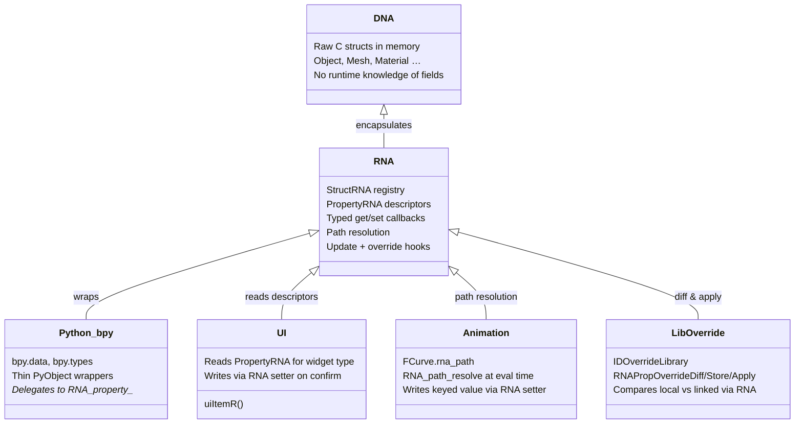
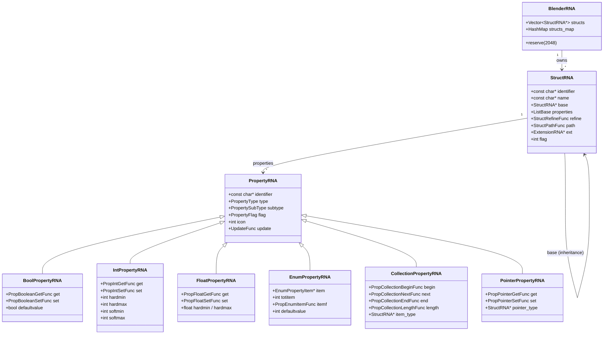
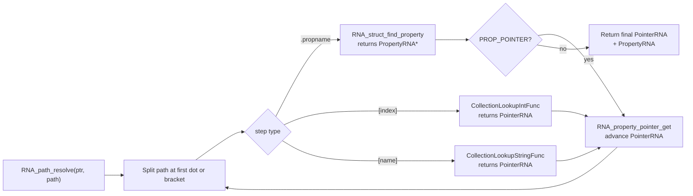
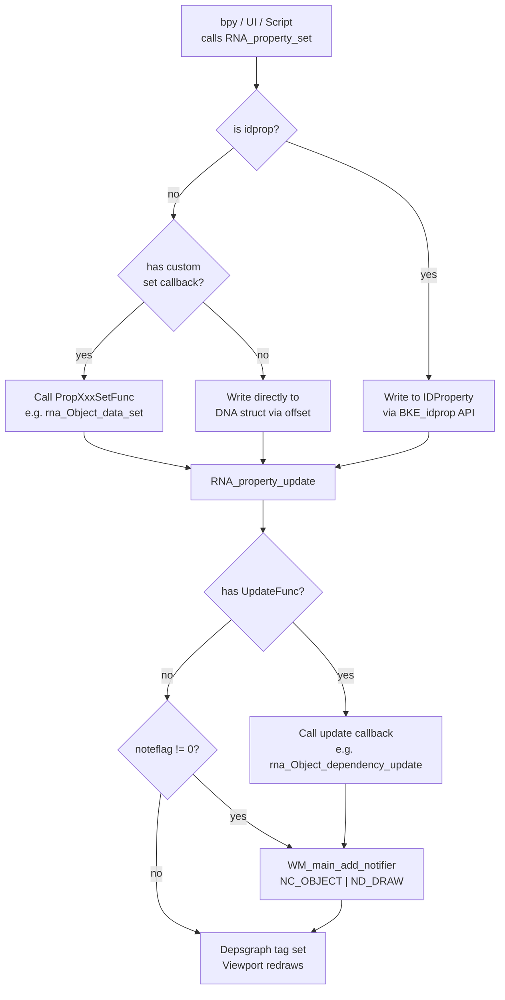

# Blender RNA – Reflection & API Layer – Source Code Review<!-- omit from toc -->

> - RNA (**R**untime **N**ode **A**PI – historically) is the reflection and introspection layer built on top of DNA.
> - It exposes every Blender data type as a self-describing set of *structs* and *properties* that can be queried, read, and written uniformly.
> - RNA is the engine behind `bpy` (Python API), UI property widgets, animation F-Curve data-paths, library overrides, and operator undo/redo.
> - The global registry `BlenderRNA` (`brna`) holds all registered `StructRNA` descriptors.
> - A `PointerRNA` is a safe, typed reference to any piece of Blender data; a `PropertyRNA` is its descriptor.
> - Property definitions live in `source/blender/makesrna/intern/rna_*.cc`; the `makesrna` build-time tool generates a C header output from those definitions during preprocessing.

## Table of Contents<!-- omit from toc -->

- [1) RNA source-file map](#1-rna-source-file-map)
- [2) What is RNA?](#2-what-is-rna)
  - [Diagram 1: RNA–DNA–Python layering](#diagram-1-rnadnapython-layering)
- [3) The BlenderRNA registry and StructRNA](#3-the-blenderrna-registry-and-structrna)
  - [3.1 BlenderRNA (brna)](#31-blenderrna-brna)
  - [3.2 The preprocessing pass vs. the runtime pass](#32-the-preprocessing-pass-vs-the-runtime-pass)
  - [3.3 Registering a struct: `RNA_def_struct`](#33-registering-a-struct-rna_def_struct)
  - [3.4 Concrete registration example: Object](#34-concrete-registration-example-object)
  - [Diagram 2: BlenderRNA class hierarchy](#diagram-2-blenderrna-class-hierarchy)
- [4) PointerRNA – the safe reference](#4-pointerrna--the-safe-reference)
  - [4.1 Creating a PointerRNA](#41-creating-a-pointerrna)
  - [4.2 Why owner\_id matters](#42-why-owner_id-matters)
- [5) PropertyRNA – property descriptors](#5-propertyrna--property-descriptors)
  - [5.1 The seven property types](#51-the-seven-property-types)
  - [5.2 PropertySubType](#52-propertysubtype)
  - [5.3 PropertyFlag](#53-propertyflag)
  - [5.4 Per-type callback vtable](#54-per-type-callback-vtable)
  - [5.5 PropertyRNAOrID – unifying static and dynamic props](#55-propertyrnaorid--unifying-static-and-dynamic-props)
- [6) RNA paths](#6-rna-paths)
  - [Diagram 3: RNA path resolution flowchart](#diagram-3-rna-path-resolution-flowchart)
- [7) The property update system](#7-the-property-update-system)
  - [Diagram 4: Property read/write flowchart](#diagram-4-property-readwrite-flowchart)
- [8) Library overrides](#8-library-overrides)
- [9) Python binding](#9-python-binding)
- [10) Short Answers](#10-short-answers)
- [11) Source-level conclusion](#11-source-level-conclusion)
  - [Recommended reading order](#recommended-reading-order)

---

## 1) RNA source-file map

| File                                                   | Important symbols                                                                                                    | Role                                                    |
| ------------------------------------------------------ | -------------------------------------------------------------------------------------------------------------------- | ------------------------------------------------------- |
| `source/blender/makesrna/RNA_types.hh`                 | `PointerRNA`, `PropertyType`, `PropertySubType`, `PropertyFlag`, `PropertyUnit`                                      | Core public type declarations                           |
| `source/blender/makesrna/RNA_define.hh`                | `BlenderRNA`, `RNA_create`, `RNA_free`, `RNA_def_struct`, `RNA_def_property`, `RNA_define_lib_overridable`           | Public definition API used during preprocessing         |
| `source/blender/makesrna/RNA_access.hh`                | `RNA_id_pointer_create`, `RNA_pointer_create_discrete`, `RNA_struct_find`, `RNA_property_*`                          | Public runtime access and traversal API                 |
| `source/blender/makesrna/RNA_path.hh`                  | `RNAPath`, `RNA_path_resolve`, `RNA_path_append`                                                                     | Path string encoding and resolution                     |
| `source/blender/makesrna/RNA_enum_types.hh`            | `rna_enum_object_mode_items`, many enum arrays                                                                       | Shared enum item tables used across rna_*.cc files      |
| `source/blender/makesrna/intern/rna_internal_types.hh` | All callback `using` aliases, `PropertyRNAOrID`, `RNAPropertyOverrideDiffContext`, `RNAPropOverrideDiff/Store/Apply` | Internal struct and callback typedefs                   |
| `source/blender/makesrna/intern/rna_internal.hh`       | `BlenderDefRNA`, `ContainerDefRNA`, `PropertyDefRNA`, `StructDefRNA`, `RNA_MAGIC`                                    | Internal preprocessing state and definition metadata    |
| `source/blender/makesrna/intern/makesrna.cc`           | `main()` of the build-time tool                                                                                      | Generates `rna_*.c` output during CMake preprocessing   |
| `source/blender/makesrna/intern/rna_define.cc`         | `RNA_create`, `RNA_def_struct_ptr`, `RNA_def_property`, `RNA_def_property_update`                                    | Runtime implementation of the definition API            |
| `source/blender/makesrna/intern/rna_access.cc`         | `RNA_property_boolean_get`, `RNA_property_update`, many getters/setters                                              | Runtime property read/write and notifier dispatch       |
| `source/blender/makesrna/intern/rna_rna.cc`            | `rna_enum_property_type_items`, RNA self-description registration                                                    | RNA describing its own types (introspection)            |
| `source/blender/makesrna/intern/rna_ID.cc`             | Registration of the base `ID` struct                                                                                 | Defines RNA for all ID-derived types                    |
| `source/blender/makesrna/intern/rna_object.cc`         | `RNA_def_struct(brna, "Object", "ID")`, enum tables                                                                  | Concrete example of how a subsystem registers its types |
| `source/blender/makesrna/intern/rna_wm.cc`             | Operator, KeyMap, Window RNA definitions                                                                             | WM types exposed to Python and UI                       |
| `source/blender/makesrna/intern/rna_scene.cc`          | Scene, RenderSettings, ToolSettings RNA                                                                              | Scene-level data registration                           |

---

## 2) What is RNA?

The module documentation captures the intent concisely from Doxygen documentation header:

**File:** `source/blender/makesrna/RNA_documentation.hh`

```text
 * The RNA module defines and provides the access API to the data, thus
 * encapsulating DNA.

This is a contract statement:

 - "defines … the access API" — RNA is not passive; it actively declares what operations are available on data (get, set, iterate, resolve paths…).
 - "provides … the access API" — it also implements or exposes those operations at runtime.
 - "encapsulating DNA" — DNA is the implementation detail. RNA is the abstraction boundary. Consumers of RNA should never need to know about DNA struct offsets, SDNA blobs, or alignment rules.

In software design terms, RNA is the façade pattern over DNA.
```

In practice, RNA is a *reflection layer* that wraps every `DNA_*_types.h` C struct and makes it introspectable at runtime. Think of it as a schema registry: every type in Blender's data model is registered with a human-readable identifier, a UI label, a set of named properties, and per-property metadata (type, range, flags, callbacks).

RNA enables four major consumer systems:

| Consumer                | What RNA provides                                                                       |
| ----------------------- | --------------------------------------------------------------------------------------- |
| **Python API (`bpy`)**  | Every `StructRNA` becomes a Python type; every `PropertyRNA` becomes a Python attribute |
| **UI system**           | Panels use `uiItemR()` which draws a widget directly from a `PropertyRNA` descriptor    |
| **Animation / Drivers** | F-Curves address data via RNA path strings (e.g. `"location[0]"`)                       |
| **Library overrides**   | RNA compares and patches linked data using `RNAPropOverrideDiff/Store/Apply` callbacks  |

### Diagram 1: RNA–DNA–Python layering



---

## 3) The BlenderRNA registry and StructRNA

### 3.1 BlenderRNA (brna)

`BlenderRNA` is the global registry that holds every registered struct descriptor. It is created once at startup via `RNA_create()` and freed at shutdown via `RNA_free()`.

**File:** `source/blender/makesrna/intern/rna_define.cc`

```c
BlenderRNA *RNA_create()
{
  BlenderRNA *brna = MEM_new<BlenderRNA>(__func__);
  ...
  brna->structs_map.reserve(2048);
  DefRNA.preprocess = true;

  /* We need both alias and static (on-disk) DNA names. */
  const bool do_alias = true;
  DefRNA.sdna = DNA_sdna_from_data(DNAstr, DNAlen, false, do_alias, &error_message);
  ...
  return brna;
}
```

`DefRNA` is a module-global `BlenderDefRNA` that accumulates `StructDefRNA` and `PropertyDefRNA` metadata during the preprocessing pass. After preprocessing, `DefRNA.preprocess` is `false` and only runtime registration is allowed.

### 3.2 The preprocessing pass vs. the runtime pass

The RNA system has two operational modes:

- **Preprocessing** (compile-time tool `makesrna`): The `makesrna` binary runs during the CMake build. It calls `RNA_create()` → iterates `PROCESS_ITEMS[]`, calling each subsystem's `RNA_def_*()` entry point (e.g. `RNA_def_object`, `RNA_def_scene`, `RNA_def_ID`) → writes out a generated C source file. The `#ifdef RNA_RUNTIME` guards in `rna_define.cc` ensure that the expensive DNA verification path (`rna_find_sdna_member`) is only executed during this build step.
- **Runtime** (inside a running Blender): `RNA_init()` is called from `WM_init()`. At this point all `StructRNA` definitions already exist (compiled into the binary), so `RNA_init()` only builds the `structs_map` hash for fast lookup.

### 3.3 Registering a struct: `RNA_def_struct`

**File:** `source/blender/makesrna/intern/rna_define.cc`

```c
StructRNA *RNA_def_struct(BlenderRNA *brna, const char *identifier, const char *from)
{
  /* only use RNA_def_struct() while pre-processing, otherwise use RNA_def_struct_ptr() */
  BLI_assert(DefRNA.preprocess);
  ...
  srnafrom = brna->structs_map.lookup_default(from, nullptr);
  return RNA_def_struct_ptr(brna, identifier, srnafrom);
}
```

`RNA_def_struct_ptr` allocates a `StructRNA`, copies inherited fields from `srnafrom` (the base type), sets the `identifier`, creates two built-in properties (`rna_properties`, `rna_type`), and calls `rna_brna_structs_add()` to insert it into `brna->structs` and `brna->structs_map`.

### 3.4 Concrete registration example: Object

**File:** `source/blender/makesrna/intern/rna_object.cc`

```c
srna = RNA_def_struct(brna, "Object", "ID");
RNA_def_struct_ui_text(srna, "Object", "Object data-block defining an object in a scene");
RNA_def_struct_clear_flag(srna, STRUCT_ID_REFCOUNT);
RNA_def_struct_ui_icon(srna, ICON_OBJECT_DATA);

RNA_define_lib_overridable(true);

prop = RNA_def_property(srna, "data", PROP_POINTER, PROP_NONE);
RNA_def_property_struct_type(prop, "ID");
RNA_def_property_pointer_funcs(
    prop, "rna_Object_data_get", "rna_Object_data_set", "rna_Object_data_typef", nullptr);
RNA_def_property_flag(prop, PROP_EDITABLE | PROP_NEVER_UNLINK);
RNA_def_property_ui_text(prop, "Data", "Object data");
RNA_def_property_update(prop, 0, "rna_Object_data_update");

prop = RNA_def_property(srna, "parent", PROP_POINTER, PROP_NONE);
RNA_def_property_flag(prop, PROP_EDITABLE | PROP_ID_SELF_CHECK);
RNA_def_property_override_funcs(prop, nullptr, nullptr, "rna_Object_parent_override_apply");
RNA_def_property_ui_text(prop, "Parent", "Parent object");
RNA_def_property_update(prop, NC_OBJECT | ND_DRAW, "rna_Object_dependency_update");
```

The pattern is always the same: declare struct → configure flags/UI → declare each property with its DNA binding, get/set callbacks, flags, and update notifier.

### Diagram 2: BlenderRNA class hierarchy



---

## 4) PointerRNA – the safe reference

`PointerRNA` is the fundamental "cursor" into the RNA data graph. Wherever you need to refer to any piece of Blender data through the RNA layer, you construct a `PointerRNA`.

**File:** `source/blender/makesrna/RNA_types.hh`

```c
struct PointerRNA {
  ID *owner_id;        // the ID that owns this data (may equal data for top-level IDs)
  StructRNA *type;     // the registered StructRNA descriptor for this pointer
  void *data;          // raw C pointer to the actual DNA struct
  // ancestors[] — chain of parent PointerRNAs for path resolution
};
```

### 4.1 Creating a PointerRNA

**File:** `source/blender/makesrna/RNA_access.hh`

```c
// Create a pointer to a top-level ID (Object, Scene, Material…)
void RNA_id_pointer_create(ID *id, PointerRNA *r_ptr);

// Create a pointer to an arbitrary sub-struct
void RNA_pointer_create_discrete(ID *id, StructRNA *type, void *data, PointerRNA *r_ptr);

// Null-check
bool RNA_pointer_is_null(const PointerRNA *ptr);
```

`RNA_main_pointer_create(Main *main, PointerRNA *r_ptr)` creates a special root pointer representing the entire `Main` database.

### 4.2 Why owner_id matters

Every `PointerRNA` carries `owner_id` so that:

- The animation system can look up `AnimData` on the owning ID.
- Library override code can identify which linked file the data belongs to.
- Path resolution knows when to stop traversing and switch ID context.

---

## 5) PropertyRNA – property descriptors

### 5.1 The seven property types

**File:** `source/blender/makesrna/RNA_types.hh`

```c
typedef enum PropertyType {
  PROP_BOOLEAN   = 0,
  PROP_INT       = 1,
  PROP_FLOAT     = 2,
  PROP_STRING    = 3,
  PROP_ENUM      = 4,
  PROP_POINTER   = 5,
  PROP_COLLECTION= 6,
} PropertyType;
```

Each type has a corresponding concrete descriptor struct (`BoolPropertyRNA`, `IntPropertyRNA`, `FloatPropertyRNA`, `StringPropertyRNA`, `EnumPropertyRNA`, `PointerPropertyRNA`, `CollectionPropertyRNA`) that extends the base `PropertyRNA` with type-specific callbacks and defaults.

**File:** `source/blender/makesrna/intern/rna_define.cc`

```c
static size_t rna_property_type_sizeof(PropertyType type)
{
  switch (type) {
    case PROP_BOOLEAN:    return sizeof(BoolPropertyRNA);
    case PROP_INT:        return sizeof(IntPropertyRNA);
    case PROP_FLOAT:      return sizeof(FloatPropertyRNA);
    case PROP_STRING:     return sizeof(StringPropertyRNA);
    case PROP_ENUM:       return sizeof(EnumPropertyRNA);
    case PROP_POINTER:    return sizeof(PointerPropertyRNA);
    case PROP_COLLECTION: return sizeof(CollectionPropertyRNA);
    default:              return 0;
  }
}
```

### 5.2 PropertySubType

`PropertySubType` qualifies the semantic meaning of a value. Selected values:

| SubType constant                  | Meaning                                |
| --------------------------------- | -------------------------------------- |
| `PROP_FILEPATH`                   | File path string                       |
| `PROP_DIRPATH`                    | Directory path string                  |
| `PROP_ANGLE`                      | Float in radians, displayed as degrees |
| `PROP_DISTANCE`                   | Float as scene-unit distance           |
| `PROP_FACTOR`                     | Float clamped `[0.0, 1.0]`             |
| `PROP_COLOR` / `PROP_COLOR_GAMMA` | Float array as color                   |
| `PROP_TRANSLATION`                | Float3 position vector                 |
| `PROP_DIRECTION`                  | Float3 direction vector                |
| `PROP_UNSIGNED`                   | Non-negative integer                   |
| `PROP_PERCENTAGE`                 | Integer 0–100                          |
| `PROP_PIXEL`                      | Integer screen-space distance          |
| `PROP_BYTESTRING`                 | Raw byte string                        |
| `PROP_PASSWORD`                   | String shown as `****`                 |

### 5.3 PropertyFlag

Key flags that control property behavior:

| Flag                   | Effect                                     |
| ---------------------- | ------------------------------------------ |
| `PROP_EDITABLE`        | Property can be set by users/scripts       |
| `PROP_ANIMATABLE`      | Property can have F-Curves                 |
| `PROP_HIDDEN`          | Not shown in the UI or Python              |
| `PROP_NEVER_NULL`      | Pointer/string may not be null             |
| `PROP_ENUM_FLAG`       | Enum stores a bitfield, not a single value |
| `PROP_ID_REFCOUNT`     | Pointer contributes to ID reference count  |
| `PROP_TEXTEDIT_UPDATE` | Trigger update on every keystroke          |

### 5.4 Per-type callback vtable

Every concrete property descriptor holds typed function pointers for `get`, `set`, `range` (for numerics), and `length/begin/next/end` (for collections). The extended `Ex` variants receive the `PropertyRNA *` pointer itself, useful for dynamic properties.

**File:** `source/blender/makesrna/intern/rna_internal_types.hh`

```c
// Simple scalar get/set (most common)
using PropBooleanGetFunc = bool (*)(PointerRNA *ptr);
using PropBooleanSetFunc = void (*)(PointerRNA *ptr, bool value);

// "Ex" variant receives the PropertyRNA too — used for IDProperty-backed props
using PropBooleanGetFuncEx = bool (*)(PointerRNA *ptr, PropertyRNA *prop);
using PropBooleanSetFuncEx = void (*)(PointerRNA *ptr, PropertyRNA *prop, bool value);

// Float range — provides hard and soft limits
using PropFloatRangeFuncEx = void (*)(PointerRNA *ptr, PropertyRNA *prop,
    float *min, float *max, float *softmin, float *softmax);

// Dynamic enum items
using PropEnumItemFunc = const EnumPropertyItem *(*)(
    bContext *C, PointerRNA *ptr, PropertyRNA *prop, bool *r_free);

// Collection iteration
using PropCollectionBeginFunc = void (*)(CollectionPropertyIterator *iter, PointerRNA *ptr);
using PropCollectionNextFunc  = void (*)(CollectionPropertyIterator *iter);
using PropCollectionEndFunc   = void (*)(CollectionPropertyIterator *iter);
using PropCollectionLengthFunc= int  (*)(PointerRNA *ptr);
```

### 5.5 PropertyRNAOrID – unifying static and dynamic props

**File:** `source/blender/makesrna/intern/rna_internal_types.hh`

```c
struct PropertyRNAOrID {
  PointerRNA *ptr;
  PropertyRNA *rawprop;   // the original PropertyRNA passed in
  PropertyRNA *rnaprop;   // the real RNA descriptor (never NULL)
  IDProperty  *idprop;    // the IDProperty backing it (NULL for static RNA)
  const char  *identifier;
  bool is_idprop;           // pure IDProperty (not declared in RNA)
  bool is_rna_storage_idprop; // Python-defined runtime RNA stored in IDProperty
  bool is_set;
  bool is_array;
  uint array_len;
};
```

This struct is the foundation of the library-override diff/apply path: it handles all three cases (static RNA, Python-defined runtime RNA, and pure IDProperty) uniformly.

---

## 6) RNA paths

RNA paths are dot-separated strings that address any property in the data graph. They are the same syntax used in F-Curve `data_path` fields and driver expressions.

**File:** `source/blender/makesrna/RNA_path.hh`

```c
struct RNAPath {
  std::string path;        // e.g. "nodes[\"Mix\"].inputs[0].default_value"
  std::optional<std::string> key;   // string key if last step was a dict lookup
  std::optional<int> index;         // integer index if last step was array access
};

// Resolve a path from a starting PointerRNA
bool RNA_path_resolve(const PointerRNA *ptr,
                      const char *path,
                      PointerRNA *r_ptr,
                      PropertyRNA **r_prop);

// Build a path incrementally
void RNA_path_append(std::string &path,
                     const PointerRNA *ptr,
                     PropertyRNA *prop,
                     int intkey,
                     const char *strkey);
```

A typical absolute path looks like:

```text
scenes[0].objects["Cube"].data.vertices[7].co
```

The animation system stores the portion after the ID in each `FCurve::rna_path`. On evaluation, `RNA_path_resolve()` walks the graph starting from the ID's `PointerRNA`, following each `.` step through `PROP_POINTER` properties and `[...]` steps through `PROP_COLLECTION` lookups.

### Diagram 3: RNA path resolution flowchart



---

## 7) The property update system

When a script or UI widget writes a property via `RNA_property_*_set()`, the update path is:

1. The setter callback writes the value to the DNA struct.
2. `RNA_property_update()` is called (in `rna_access.cc`).
3. This invokes the property's registered `UpdateFunc` or `ContextUpdateFunc`.
4. The update function typically calls `WM_main_add_notifier(NC_OBJECT | ND_DRAW, id)` or similar.
5. The notifier fires the depsgraph tag, which eventually triggers a viewport redraw or re-evaluation.

**File:** `source/blender/makesrna/intern/rna_internal_types.hh`

```c
// Simple update — no bContext needed
using UpdateFunc = void (*)(Main *bmain, Scene *scene, PointerRNA *ptr);

// Context-aware update — can read active object, region, etc.
using ContextUpdateFunc = void (*)(bContext *C, PointerRNA *ptr);
```

Property update functions are registered in the definition pass:

**File:** `source/blender/makesrna/intern/rna_object.cc`

```c
RNA_def_property_update(prop, NC_OBJECT | ND_DRAW, "rna_Object_dependency_update");
```

The first argument is a notifier bitmask (used even when no update function is named). The second is an optional C function name that `makesrna` encodes as a function pointer.

### Diagram 4: Property read/write flowchart



---

## 8) Library overrides

Library overrides allow local modifications to linked (library) data. RNA provides the mechanism for comparing, storing delta values, and applying those deltas.

The three-callback model:

**File:** `source/blender/makesrna/intern/rna_internal_types.hh`

```c
// 1. Compare two values; optionally record a new override operation
using RNAPropOverrideDiff = void (*)(Main *bmain,
                                     RNAPropertyOverrideDiffContext &rnadiff_ctx);

// 2. Store the delta needed to go from reference → local
using RNAPropOverrideStore = bool (*)(Main *bmain,
    PointerRNA *ptr_local, PointerRNA *ptr_reference, PointerRNA *ptr_storage,
    PropertyRNA *prop_local, PropertyRNA *prop_reference, PropertyRNA *prop_storage,
    int len_local, int len_reference, int len_storage,
    IDOverrideLibraryPropertyOperation *opop);

// 3. Apply stored delta from src to dst
using RNAPropOverrideApply = bool (*)(Main *bmain,
                                      RNAPropertyOverrideApplyContext &rnaapply_ctx);
```

`RNAPropertyOverrideDiffContext` bundles the two `PropertyRNAOrID` values being compared, the comparison mode, and the output `IDOverrideLibrary *` where new override operations are recorded.

Properties are opted into library override tracking during definition:

**File:** `source/blender/makesrna/intern/rna_object.cc`

```c
RNA_define_lib_overridable(true);
// ... all property definitions inside this block become overridable

prop = RNA_def_property(srna, "parent", PROP_POINTER, PROP_NONE);
RNA_def_property_override_funcs(prop, nullptr, nullptr, "rna_Object_parent_override_apply");
```

`RNA_define_lib_overridable(true)` sets `DefRNA.make_overridable = true`, which causes every subsequent `RNA_def_property` call to set `PROPOVERRIDE_OVERRIDABLE_LIBRARY` on the new property automatically.

---

## 9) Python binding

The `bpy` Python module is a thin adapter over RNA. When Python accesses `bpy.data.objects["Cube"].location`, the following happens:

1. `bpy.data` → a Python object wrapping a `PointerRNA` for the `Main` struct.
2. `.objects` → a `CollectionPropertyRNA` iterator; Python constructs a `bpy_prop_collection` wrapper.
3. `["Cube"]` → `PropCollectionLookupStringFunc` is called, which uses `BLI_ghash` or a linear scan to find the Object with that name.
4. `.location` → `RNA_struct_find_property()` looks up "location" in the Object `StructRNA`; returns a `FloatPropertyRNA`.
5. Python calls `RNA_property_float_get_array()` through `rna_access.cc`.

The reverse (setting) goes through `RNA_property_float_set_array()` → DNA write → `RNA_property_update()` → notifier.

Python-defined custom properties (`bpy.props.FloatProperty(...)`) become *runtime RNA properties* backed by `IDProperty` storage, covered by the `is_rna_storage_idprop` flag in `PropertyRNAOrID`.

Property identifier validation ensures no Python keyword is used as a property name:

**File:** `source/blender/makesrna/intern/rna_define.cc`

```c
static const char *kwlist[] = {
    "and", "as", "assert", "async", "await", "break", "class", "continue",
    "def", "del", "elif", "else", "except", "finally", "for", "from",
    "global", "if", "import", "in", "is", "lambda", "nonlocal", "not",
    "or", "pass", "raise", "return", "try", "while", "with", "yield", nullptr,
};
// also reserves: "keys", "values", "items", "get"
```

---

## 10) Short Answers

**Q: What is the difference between DNA and RNA?**
DNA defines the raw memory layout of Blender's data structs (used for `.blend` file I/O). RNA wraps those structs with a runtime registry of named properties, type metadata, and accessor callbacks. DNA knows nothing about field names at runtime; RNA knows everything.

**Q: Where is `BlenderRNA *G_RNA` initialized?**
`RNA_init()` is called from `WM_init()` during startup. The global pointer is populated then and lives until `RNA_exit()` at shutdown.

**Q: Can properties exist that have no DNA backing?**
Yes. Python addon properties created with `bpy.props.*` are *runtime RNA properties* (`PROP_INTERN_RUNTIME` flag set, `is_rna_storage_idprop = true`). Their values are stored in the ID's `IDProperty` chain, not in a DNA field.

**Q: How does the UI know what widget to draw for a property?**
`uiItemR()` calls `RNA_property_type()` and `RNA_property_subtype()` on the `PropertyRNA`. The type determines the widget class (slider, toggle, color picker, file browser…) and the subtype provides further hints (e.g., `PROP_COLOR_GAMMA` → color picker with gamma correction).

**Q: How are enum items that depend on context handled?**
`EnumPropertyRNA::itemf` (`PropEnumItemFunc`) is a callback that receives `bContext *C` and returns a dynamically allocated `EnumPropertyItem *` array (caller must free when `*r_free` is set). This is used for context-sensitive dropdowns like the list of visible objects.

**Q: What does `RNA_define_lib_overridable(true)` do?**
It sets `DefRNA.make_overridable = true`. Every `RNA_def_property()` call while this flag is active automatically sets `PROPOVERRIDE_OVERRIDABLE_LIBRARY` on the new property, marking it as eligible for library override operations. The flag is typically set/cleared around a block of related property definitions.

**Q: How is a PointerRNA null-checked safely?**
`RNA_pointer_is_null(const PointerRNA *ptr)` returns `true` when `ptr->data == nullptr`. This is preferred over directly checking `ptr->data` because future versions may add additional null-state semantics.

---

## 11) Source-level conclusion

RNA is the connective tissue of Blender's data layer. It sits above DNA (which owns the raw memory) and below every high-level consumer (Python, UI, animation, overrides). Understanding RNA means understanding how every property widget, every `bpy` attribute access, and every F-Curve data path ultimately resolves to a read or write on a DNA struct field.

### Recommended reading order

1. **`RNA_documentation.hh`** — the one-paragraph module summary; sets the mental model.
2. **`RNA_types.hh`** — `PointerRNA`, `PropertyType`, `PropertySubType`, `PropertyFlag`; the vocabulary of the whole system.
3. **`RNA_define.hh`** — public definition API; see what `makesrna`/`RNA_def_*` entry-point functions are available.
4. **`rna_internal_types.hh`** — all callback `using` aliases and `PropertyRNAOrID`; understand the vtable model.
5. **`rna_define.cc` → `RNA_create` and `RNA_def_struct_ptr`** — how the registry is built; how `DefRNA` global state works.
6. **`rna_define.cc` → `RNA_def_property`** — how a single property descriptor is allocated and wired up.
7. **`rna_object.cc` → `RNA_def_struct(brna, "Object", "ID")`** — a concrete, well-commented registration example; traces back to real DNA fields.
8. **`RNA_access.hh` + `rna_access.cc`** — how callers read/write properties and how updates are dispatched.
9. **`RNA_path.hh`** — path syntax and `RNA_path_resolve`; connects RNA to animation and drivers.
10. **`rna_internal.hh` → `PropertyDefRNA`** — understand how `dnastructname`/`dnaname`/`dnaoffset` link a property to its DNA field during preprocessing.
