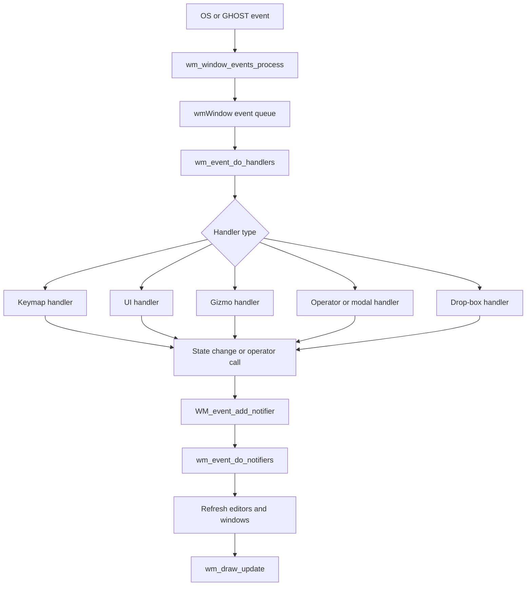

# Blender Window Manager (WM) – Source Code Review<!-- omit from toc -->

> - Explains what Blender's **Window Manager (WM)** subsystem is and where it lives in the source tree.
> - Shows how `WM_init()`, `WM_check()`, `WM_main()`, and `WM_exit()` fit together.
> - Deep dives into how the event-handler pipeline dispatches input to keymaps, UI, gizmos, and modal operators.
> - Highlights other services provided by WM, such as notifiers, the message bus, operator calls, jobs, cursor control, and clipboard access.

## Table of Contents<!-- omit from toc -->

- [1) Window Manager source-file map](#1-window-manager-source-file-map)
- [2) What Blender Window Manager is](#2-what-blender-window-manager-is)
- [3) Lifecycle of the Window Manager](#3-lifecycle-of-the-window-manager)
  - [3.1 Public lifecycle API](#31-public-lifecycle-api)
  - [3.2 `WM_init()` bootstraps the subsystem](#32-wm_init-bootstraps-the-subsystem)
  - [3.3 `WM_check()` makes runtime-only state valid](#33-wm_check-makes-runtime-only-state-valid)
  - [3.4 `WM_main()` is the central runtime loop](#34-wm_main-is-the-central-runtime-loop)
  - [3.5 `WM_exit()` shuts the subsystem down](#35-wm_exit-shuts-the-subsystem-down)
- [4) How the event handler system works](#4-how-the-event-handler-system-works)
  - [4.1 High-level event flow](#41-high-level-event-flow)
  - [4.2 The handler types defined by WM](#42-the-handler-types-defined-by-wm)
    - [What each handler type is used for](#what-each-handler-type-is-used-for)
  - [4.3 Core dispatch in `wm_handlers_do_intern()`](#43-core-dispatch-in-wm_handlers_do_intern)
  - [4.4 Modal operators are installed as WM handlers](#44-modal-operators-are-installed-as-wm-handlers)
  - [4.5 Notifiers decouple changes from refresh](#45-notifiers-decouple-changes-from-refresh)
- [5) Other important functions and services provided by WM](#5-other-important-functions-and-services-provided-by-wm)
  - [5.1 Operator calling helpers](#51-operator-calling-helpers)
  - [5.2 UI and keymap handler registration](#52-ui-and-keymap-handler-registration)
  - [5.3 Background jobs](#53-background-jobs)
  - [5.4 Cursor and input helpers](#54-cursor-and-input-helpers)
  - [5.5 Clipboard helpers](#55-clipboard-helpers)
  - [5.6 Message bus (observer / publish-subscribe service)](#56-message-bus-observer--publish-subscribe-service)
    - [Startup and runtime ownership](#startup-and-runtime-ownership)
    - [API shape: publish / subscribe](#api-shape-publish--subscribe)
    - [How dispatch happens](#how-dispatch-happens)
    - [Where it runs in the WM loop](#where-it-runs-in-the-wm-loop)
- [6) Mermaid diagram: event pipeline](#6-mermaid-diagram-event-pipeline)
- [7) Short Answers](#7-short-answers)
- [8) Source-level conclusion](#8-source-level-conclusion)

---

## 1) Window Manager source-file map

| File | Important symbols | Role in WM |
| --- | --- | --- |
| `source/blender/windowmanager/WM_api.hh` | `WM_init`, `WM_check`, `WM_main`, `WM_exit`, `WM_event_add_notifier`, `WM_operator_name_call` | Public C/C++ API of the Window Manager |
| `source/blender/windowmanager/WM_types.hh` | `wm::OpCallContext`, operator flags | Shared WM-facing types for operator execution |
| `source/blender/windowmanager/wm_event_system.hh` | `wmEventHandler`, `eWM_EventHandlerType`, `wm_event_do_handlers()` | Internal event-handler definitions |
| `source/blender/windowmanager/intern/wm.cc` | `WM_check`, `WM_main` | Runtime setup checks and the main event loop |
| `source/blender/windowmanager/intern/wm_init_exit.cc` | `WM_init`, `WM_exit_ex`, `WM_exit` | Startup and shutdown of WM |
| `source/blender/windowmanager/intern/wm_event_system.cc` | `wm_handlers_do_intern`, `wm_event_do_handlers`, `WM_event_add_modal_handler`, `WM_event_add_notifier` | Core event dispatch, modal handlers, notifier queue |
| `source/blender/windowmanager/intern/wm_window.cc` | `wm_window_events_process` | Pulls platform/GHOST events into Blender windows |
| `source/blender/windowmanager/intern/wm_jobs.cc` | `WM_jobs_get`, `WM_jobs_start`, `WM_jobs_kill_all` | Job system for async/background tasks |
| `source/blender/makesdna/DNA_windowmanager_types.h` | `wmWindowManager`, `wmWindow` | Saved/runtime WM data structures |

---

## 2) What Blender Window Manager is

At source level, Blender's Window Manager is the subsystem that **owns windows, routes input events, runs operators, queues UI/data-change notifications, and drives redraw/update flow**.

It is not just a thin OS window wrapper. It sits between:

1. platform input / `GHOST`,
2. Blender screens/areas/regions,
3. operators and tools,
4. redraw/refresh infrastructure.

The saved/runtime WM objects are defined in `source/blender/makesdna/DNA_windowmanager_types.h`.

A representative excerpt is:

```c
typedef struct wmWindowManager {
  ID id;
  ListBase windows;
  short init_flag;
  short op_undo_depth;
  struct wmWindowManagerRuntimeHandle *runtime;
} wmWindowManager;
```

This tells us that WM is the top-level owner of the current Blender windows and its runtime-only state.

---

## 3) Lifecycle of the Window Manager

### 3.1 Public lifecycle API

**File:** `source/blender/windowmanager/WM_api.hh`

```cpp
void WM_init(bContext *C, int argc, const char **argv);
void WM_exit_ex(bContext *C, bool do_python_exit, bool do_user_exit_actions);
void WM_exit(bContext *C, int exit_code);
void WM_main(bContext *C) ATTR_NORETURN;
void WM_check(bContext *C);
```

These five functions define the main WM lifecycle:

- `WM_init()` → startup/bootstrap
- `WM_check()` → make runtime state valid after file loading / recovery / startup transitions
- `WM_main()` → GUI runtime event loop
- `WM_exit()` / `WM_exit_ex()` → shutdown and cleanup

### 3.2 `WM_init()` bootstraps the subsystem

**File:** `source/blender/windowmanager/intern/wm_init_exit.cc`

```cpp
void WM_init(bContext *C, int argc, const char **argv)
{
  if (!G.background) {
    wm_ghost_init(C); /* NOTE: it assigns C to ghost! */
    wm_init_cursor_data();
    BKE_sound_jack_sync_callback_set(sound_jack_sync_callback);
  }

  BKE_addon_pref_type_init();
  BKE_keyconfig_pref_type_init();

  wm_operatortypes_register();

  WM_paneltype_init();
  WM_menutype_init();
  WM_uilisttype_init();
  wm_gizmotype_init();
  wm_gizmogrouptype_init();
  ...
  WM_msgbus_types_init();
  ...
  wm_homefile_read_ex(C, &read_homefile_params, nullptr, &params_file_read_post);
  ...
#ifdef WITH_PYTHON
  BPY_python_start(C, argc, argv);
  BPY_python_reset(C);
#endif
}
```

From this code, `WM_init()` is responsible for much more than opening a window:

- initializing the platform windowing bridge (`wm_ghost_init()`),
- setting cursor support,
- registering operator, panel, menu, UI-list, and gizmo types,
- initializing editor-space types,
- setting up the WM message bus,
- reading the startup/home file,
- and starting Python integration when enabled.

So `WM_init()` is the **startup constructor** for Blender's interactive runtime.

### 3.3 `WM_check()` makes runtime-only state valid

**File:** `source/blender/windowmanager/intern/wm.cc`

```cpp
/* Run before loading the keyconfig. */
if (wm->runtime->message_bus == nullptr) {
  wm->runtime->message_bus = WM_msgbus_create();
}

if (!G.background) {
  if ((wm->init_flag & WM_INIT_FLAG_WINDOW) == 0) {
    WM_keyconfig_init(C);
    WM_file_autosave_init(wm);
  }

  wm_window_ghostwindows_ensure(wm);
}

if ((wm->init_flag & WM_INIT_FLAG_WINDOW) == 0) {
  ED_screens_init(C, bmain, wm);
  wm->init_flag |= WM_INIT_FLAG_WINDOW;
}
```

`WM_check()` is a **runtime repair / ensure-valid** step. It is especially important after startup and after reading `.blend` files, because some WM state is runtime-only and must be rebuilt or reattached.

Main roles here:

- ensure the message bus exists,
- initialize key-config and auto-save support,
- ensure the native/GHOST windows exist,
- initialize screen runtime state.

### 3.4 `WM_main()` is the central runtime loop

**File:** `source/blender/windowmanager/intern/wm.cc`

```cpp
void WM_main(bContext *C)
{
  wmWindowManager *wm = CTX_wm_manager(C);

  if (wm == nullptr) {
    return;
  }

  wm_event_do_refresh_wm_and_depsgraph(C);

  while (true) {
    wm_window_events_process(C);

    wm_event_do_handlers(C);
    wm_event_do_notifiers(C);

    wm_draw_update(C);
  }
}
```

This is the core of Blender's interactive execution model.

Every iteration does four high-level things:

1. **Collect window/system events** via `wm_window_events_process(C)`.
2. **Dispatch them** through handlers with `wm_event_do_handlers(C)`.
3. **Process queued change notifications** with `wm_event_do_notifiers(C)`.
4. **Redraw what changed** using `wm_draw_update(C)`.

That is the main reason WM is central to Blender's UI runtime.

### 3.5 `WM_exit()` shuts the subsystem down

Shutdown lives in `source/blender/windowmanager/intern/wm_init_exit.cc` via `WM_exit_ex()` and `WM_exit()`.

At a high level, this code path is responsible for cleaning up:

- jobs and timers,
- windows and UI runtime state,
- Python exit hooks when requested,
- user-exit actions and final process termination.

So the WM lifecycle is clearly:

`WM_init()` → `WM_check()` → `WM_main()` → `WM_exit()`.

---

## 4) How the event handler system works

### 4.1 High-level event flow

The internal header gives the intent very directly.

**File:** `source/blender/windowmanager/wm_event_system.hh`

```cpp
/**
 * Goes over entire hierarchy: events -> window -> screen -> area -> region.
 */
void wm_event_do_handlers(bContext *C);
```

This means Blender WM does not treat input as a single flat callback stream. Instead, it routes events through the current UI hierarchy:

1. event queue,
2. active window,
3. active screen,
4. matching area,
5. matching region,
6. then the right handler type.

`wm_window_events_process(const bContext *C)` in `source/blender/windowmanager/intern/wm_window.cc` is the stage that feeds platform events into Blender's per-window event queue.

### 4.2 The handler types defined by WM

**File:** `source/blender/windowmanager/wm_event_system.hh`

```cpp
enum eWM_EventHandlerType {
  WM_HANDLER_TYPE_GIZMO,
  WM_HANDLER_TYPE_UI,
  WM_HANDLER_TYPE_OP,
  WM_HANDLER_TYPE_DROPBOX,
  WM_HANDLER_TYPE_KEYMAP,
};
```

And the common base handler is:

```cpp
struct wmEventHandler {
  wmEventHandler *next;
  wmEventHandler *prev;
  eWM_EventHandlerType type;
  int8_t flag;
  wmEventHandlerPollFn poll;
};
```

So WM models event processing through a **polymorphic handler list**. Each node says what kind of handler it is, whether it is blocking, and whether it should run in the current context.

#### What each handler type is used for

| Handler type | Purpose |
| --- | --- |
| `WM_HANDLER_TYPE_KEYMAP` | Match input against keymaps and launch mapped operators |
| `WM_HANDLER_TYPE_UI` | Route events into UI widgets, menus, popups, buttons |
| `WM_HANDLER_TYPE_OP` | Run modal/file-select/operator handlers |
| `WM_HANDLER_TYPE_DROPBOX` | Handle drag-and-drop targets |
| `WM_HANDLER_TYPE_GIZMO` | Route events to transform/manipulator gizmos |

### 4.3 Core dispatch in `wm_handlers_do_intern()`

**File:** `source/blender/windowmanager/intern/wm_event_system.cc`

```cpp
if (handler_base->type == WM_HANDLER_TYPE_KEYMAP) {
  ...
}
else if (handler_base->type == WM_HANDLER_TYPE_UI) {
  ...
}
else if (handler_base->type == WM_HANDLER_TYPE_DROPBOX) {
  ...
}
else if (handler_base->type == WM_HANDLER_TYPE_GIZMO) {
  ...
}
else if (handler_base->type == WM_HANDLER_TYPE_OP) {
  ...
}
```

This is the **central switchboard** for event delivery.

The surrounding logic in `wm_handlers_do_intern()` shows the complete pattern:

- loop over the handler list,
- skip handlers that are tagged for free,
- run `poll()` if present,
- mark blocking handlers with `WM_HANDLER_BREAK`,
- dispatch by handler type,
- stop propagation when a handler consumes the event.

That means the WM event system behaves like a structured dispatcher with **context-aware filtering** and **early stop on consume**.

### 4.4 Modal operators are installed as WM handlers

**File:** `source/blender/windowmanager/intern/wm_event_system.cc`

```cpp
wmEventHandler_Op *WM_event_add_modal_handler(bContext *C, wmOperator *op)
{
  wmWindow *win = CTX_wm_window(C);
  ScrArea *area = CTX_wm_area(C);
  ARegion *region = CTX_wm_region(C);
  return WM_event_add_modal_handler_ex(win, area, region, op);
}
```

And the actual install step stores the area/region context into the handler:

```cpp
handler->context.area = area; /* Means frozen screen context for modal handlers! */
handler->context.region = region;
handler->context.region_type = handler->context.region ? handler->context.region->regiontype :
                                                         -1;
```

This is important:

- when an operator becomes **modal**, WM turns it into a persistent event handler,
- subsequent events are routed back to that operator,
- the operator keeps the relevant area/region context during its interactive lifetime.

This is how tools like transform, box-select, modal popups, and drag interactions continue receiving follow-up mouse/keyboard events.

### 4.5 Notifiers decouple changes from refresh

WM also provides a notification queue so code can say "something changed" without forcing an immediate redraw in-place.

**File:** `source/blender/windowmanager/intern/wm_event_system.cc`

```cpp
void WM_event_add_notifier(const bContext *C, uint type, void *reference)
{
  WM_event_add_notifier_ex(CTX_wm_manager(C), CTX_wm_window(C), type, reference);
}
```

The queueing code deduplicates notifier payloads:

```cpp
wm->runtime->notifier_queue_set.lookup_key_or_add_cb(&note_test, [&]() {
  wmNotifier *note = MEM_new<wmNotifier>(__func__);
  *note = note_test;
  BLI_addtail(&wm->runtime->notifier_queue, note);
  return note;
});
```

Then the main loop flushes those notifications in `wm_event_do_notifiers(C)`:

```cpp
void wm_event_do_notifiers(bContext *C)
{
  GPU_render_begin();
  wm_event_timers_execute(C);
  ...
  for (wmWindow &win : wm->windows) {
    ...
    for (const wmNotifier *note = ...; note; note = note_next) {
      ...
    }
  }
}
```

So the refresh path is intentionally split in two phases:

1. handlers/operators change data and queue notifiers,
2. notifier processing updates editors/screens/windows and redraw state.

That separation is a big part of why Blender's UI remains structured instead of every operator redrawing everything immediately.

Notifiers are closely related to the WM message bus discussed later in section **5.6**, but they are not identical:

| Mechanism | Main role | Granularity |
| --- | --- | --- |
| `wmNotifier` | Broad refresh/update signaling | coarse |
| `wmMsgBus` | Observer-style publish/subscribe callbacks | fine-grained |

A practical rule is: **notifiers tell Blender that some category of state changed, while the message bus lets code subscribe to specific changes.**

---

## 5) Other important functions and services provided by WM

The Window Manager is broader than event dispatch alone. `source/blender/windowmanager/WM_api.hh` exposes a large service surface.

### 5.1 Operator calling helpers

Representative APIs in `WM_api.hh` include:

```cpp
bool WM_operator_name_call_ptr(...);
bool WM_operator_name_call(...);
bool WM_operator_name_call_with_properties(...);
int WM_operator_call_py(...);
```

These helpers give Blender a **uniform path for invoking operators** from:

- keymaps,
- menus,
- buttons,
- Python (`bpy.ops`),
- internal C/C++ call sites.

The execution context is controlled by `wm::OpCallContext` in `source/blender/windowmanager/WM_types.hh`, with values such as:

```cpp
enum class OpCallContext : int8_t {
  InvokeDefault,
  InvokeRegionWin,
  InvokeArea,
  InvokeScreen,
  ExecDefault,
  ExecRegionWin,
  ExecArea,
  ExecScreen,
};
```

This is how WM decides whether an operator should be invoked with full UI context or executed more directly.

### 5.2 UI and keymap handler registration

WM also exposes functions for adding and removing handlers, such as:

- `WM_event_add_ui_handler(...)`
- `WM_event_add_modal_handler(...)`
- `WM_event_remove_modal_handler(...)`
- `WM_event_add_mousemove(...)`
- keymap-handler registration helpers in `wm_event_system.cc`

These are the APIs editors and tools use to connect themselves into the event pipeline.

### 5.3 Background jobs

The WM job system lives in `source/blender/windowmanager/intern/wm_jobs.cc`.

Representative entry points include:

- `WM_jobs_get(wmWindowManager *wm, ...)`
- `WM_jobs_start(wmWindowManager *wm, wmJob *wm_job)`
- `WM_jobs_stop_type(...)`
- `WM_jobs_kill_all(wmWindowManager *wm)`

This gives Blender a structured way to run longer tasks in the background while keeping the UI responsive.

### 5.4 Cursor and input helpers

`WM_api.hh` also exposes cursor-control functions such as:

- `WM_cursor_set(...)`
- `WM_cursor_modal_set(...)`
- `WM_cursor_modal_restore(...)`
- `WM_cursor_grab_enable(...)`
- `WM_cursor_grab_disable(...)`

These are used heavily by interactive tools, modal operators, and viewport manipulation.

### 5.5 Clipboard helpers

The same API surface includes clipboard support such as:

- `WM_clipboard_text_get(...)`
- `WM_clipboard_text_set(...)`
- `WM_clipboard_image_get(...)`

So the WM is also the integration layer for common desktop-style UX services.

### 5.6 Message bus (observer / publish-subscribe service)

This topic fits best in the **Window Manager** document because the message bus is a **WM-owned runtime service**. It is initialized by WM startup code, created on the `wm->runtime` object, and handled during the WM runtime loop.

It is **not the same thing** as either the event queue or the notifier queue:

| System | Main role |
| --- | --- |
| `event_queue` | Raw input/runtime events such as mouse, keyboard, and timer events |
| notifier queue | Broad "something changed" refresh signaling for editors and UI |
| message bus | Targeted **observer / publish-subscribe** notifications for specific data/RNA changes |

#### Startup and runtime ownership

**File:** `source/blender/windowmanager/intern/wm_init_exit.cc`

```cpp
WM_msgbus_types_init();
```

**File:** `source/blender/windowmanager/intern/wm.cc`

```cpp
if (wm->runtime->message_bus == nullptr) {
  wm->runtime->message_bus = WM_msgbus_create();
}
```

So the bus is explicitly part of WM runtime setup.

#### API shape: publish / subscribe

**File:** `source/blender/windowmanager/message_bus/wm_message_bus.hh`

```cpp
void WM_msg_publish_with_key(wmMsgBus *mbus, wmMsgSubscribeKey *msg_key);
wmMsgSubscribeKey *WM_msg_subscribe_with_key(wmMsgBus *mbus,
                                             const wmMsgSubscribeKey *msg_key_test,
                                             const wmMsgSubscribeValue *msg_val_params);
void WM_msgbus_handle(wmMsgBus *mbus, bContext *C);
```

This API shape is exactly why the message bus is best understood as an **Observer / Publish–Subscribe pattern** implementation.

#### How dispatch happens

**File:** `source/blender/windowmanager/message_bus/intern/wm_message_bus.cc`

```cpp
void WM_msgbus_handle(wmMsgBus *mbus, bContext *C)
{
  if (mbus->messages_tag_count == 0) {
    return;
  }

  for (wmMsgSubscribeKey &key : mbus->messages) {
    for (wmMsgSubscribeValueLink &msg_lnk : key.values) {
      if (msg_lnk.params.tag) {
        msg_lnk.params.notify(C, &key, &msg_lnk.params);
        msg_lnk.params.tag = false;
        mbus->messages_tag_count -= 1;
      }
    }
  }
}
```

This shows the observer-style flow clearly:

1. code **subscribes** with a key/value pair,
2. some producer **publishes** or tags a message,
3. `WM_msgbus_handle()` runs the registered `notify(...)` callbacks.

#### Where it runs in the WM loop

The message bus is handled during the notifier/update phase:

**File:** `source/blender/windowmanager/intern/wm_event_system.cc`

```cpp
for (wmWindow &win : wm->windows) {
  CTX_wm_window_set(C, &win);
  WM_msgbus_handle(wm->runtime->message_bus, C);
}
```

So while it is related to redraw/update behavior, it is still a **separate subsystem** from the raw event queue and from the classic notifier queue.

In other words, notifiers and the message bus are **complementary WM notification mechanisms**: notifiers are broader and more UI-facing, while the message bus is more precise and subscription-driven.

---

## 6) Mermaid diagram: event pipeline



This diagram matches the source-level loop in `wm.cc` and `wm_event_system.cc`:

- input is first collected,
- then dispatched by handler type,
- then converted into queued refresh work,
- then finally redrawn.

---

## 7) Short Answers

**What is Blender WM?**  
It is Blender's runtime subsystem for **windows, UI event dispatch, operator invocation, notifier processing, redraw scheduling, and several desktop interaction services**.

**How does the event handler work?**  
The main loop in `WM_main()` collects events, then `wm_event_do_handlers()` walks the UI hierarchy and dispatches each event to handler lists. `wm_handlers_do_intern()` chooses behavior by handler type: keymap, UI, gizmo, operator/modal, or drop-box.

**What other functions does WM provide?**  
Besides event dispatch, WM provides:

- startup/shutdown lifecycle control,
- operator-call helpers,
- modal/UI/keymap handler registration,
- notifier queueing and refresh processing,
- background job management,
- cursor/input control,
- clipboard integration.
  
## 8) Source-level conclusion

Best files to open next for deeper study:

1. `source/blender/windowmanager/intern/wm.cc`
2. `source/blender/windowmanager/intern/wm_event_system.cc`
3. `source/blender/windowmanager/wm_event_system.hh`
4. `source/blender/windowmanager/WM_api.hh`
5. `source/blender/windowmanager/intern/wm_window.cc`
